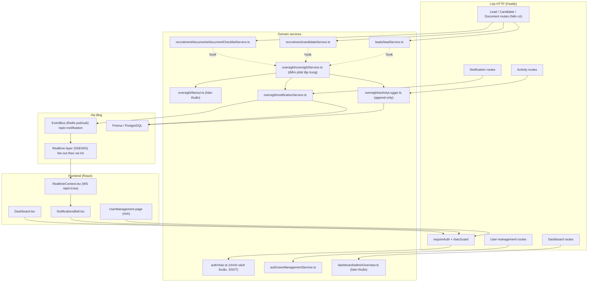
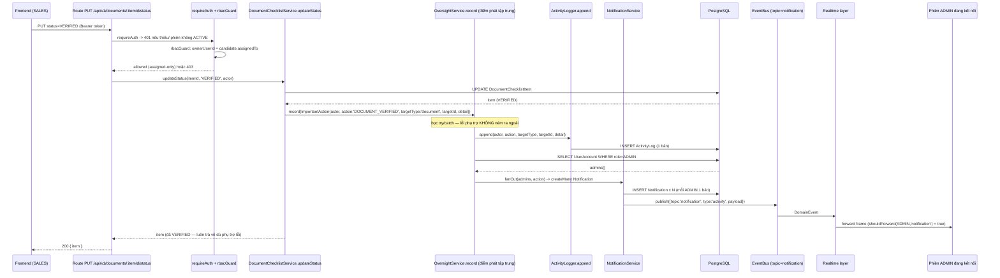

# Design Document — admin-oversight-rbac-notifications

## Overview

Gói tính năng **admin-oversight-rbac-notifications** củng cố lớp giám sát của ADMIN trên nền tảng AutoTGC (khách hàng Thanh Giang Conincon — lĩnh vực XKLĐ). Thiết kế là **bổ sung (additive)** trên kiến trúc hiện có (Fastify 4 + Prisma 5/PostgreSQL 16, Redis event bus, JWT + RBAC thuần, Vitest + fast-check, PM2 + Nginx) và **không** sửa đổi cấu trúc của các bảng/model hiện có.

Mục tiêu thiết kế giải quyết 6 nhóm năng lực được mô tả trong requirements:

1. **Mô hình dữ liệu mới**: `Notification` (thông báo bền vững gắn người nhận) và `ActivityLog` (nhật ký hoạt động append-only đa thực thể), kèm migration `0003`.
2. **Nhất quán hóa RBAC**: giữ `src/auth/rbac.ts` là *single source of truth*, bổ sung module `user_management` (ADMIN-only) và phân biệt `Company_Stats` vs `Personal_Stats`; trừu tượng hóa quy tắc assigned-only thành một helper thuần dùng chung.
3. **Quản lý tài khoản nhân viên** (`UserManagementService` + routes ADMIN-only).
4. **Admin Dashboard** mở rộng: ADMIN nhận thống kê toàn công ty + `Recent_Activity_Feed`; SALES giữ phạm vi cá nhân; endpoint hoạt động phân trang riêng.
5. **Luồng thông báo tự động**: một điểm phát tập trung (`OversightService`) cho mỗi `Important_Action` → 1 `ActivityLog` + N `Notification` (mỗi ADMIN một bản) + 1 `DomainEvent` trên topic `notification`, có cô lập lỗi.
6. **Tính nhất quán**: logic ghi nhật ký/thông báo không bị lặp lại ở từng route; append-only; assigned-only áp dụng đồng nhất.

### Nguyên tắc thiết kế (theo steering)

- **Domain logic thuần**: các quyết định (RBAC, fan-out, scoping, tính chỉ số) là hàm thuần, không phụ thuộc Fastify/Prisma — để property-test được và tái sử dụng.
- **Lớp route mỏng**: route chỉ shape request/response, gắn `requireAuth` + `rbacGuard`, gọi service.
- **Lỗi typed**: ném `AppError` từ `infra/errors.ts`; chỉ dùng tập mã trạng thái cho phép `{200,201,202,400,401,403,404,409,423,500,502}`.
- **An toàn số học**: chỉ số tỷ lệ dẫn xuất chia-cho-0 → `INSUFFICIENT_DATA`.
- **Bảo mật**: không endpoint nào không xác thực; secrets fail-fast; không log giá trị bí mật.
- **Cô lập lỗi phụ trợ**: việc ghi nhật ký/đẩy thông báo KHÔNG bao giờ làm thất bại hay rollback hành động nghiệp vụ đã thành công (giống pattern `emit()` non-blocking hiện có ở `LeadService`/`CandidateService`).

### Quyết định khảo sát từ codebase (định hình thiết kế)

- `authorize(ctx, target)` trong `auth/rbac.ts` đã là chính sách thuần; `rbacGuard(build)` trong `http/authMiddleware.ts` dựng `ResourceTarget` mỗi route (đã có pattern resolve `ownerUserId` từ `assignedTo` ở `leadTargetById`, `candidateTargetById`, `itemTargetById`).
- Event bus (`infra/events.ts`) đã có topic `notification`; realtime (`realtime/topics.ts`) fan-out theo vai trò: ADMIN nhận mọi topic, SALES chỉ `lead` + `notification` (`shouldForward`). Đẩy thông báo qua topic `notification` sẽ tự động tới mọi phiên ADMIN.
- `AuditEntry` + `AuditLog.append` chỉ phục vụ Learning Insight (gắn `insightId`), không tổng quát cho lead/candidate/document → cần `ActivityLog` mới (giữ `AuditEntry` nguyên trạng).
- Thông báo hiện tại (`buildDashboardNotifications`) chỉ là read-model phái sinh, không bền vững, không người nhận → cần model `Notification` mới.
- Các hành động quan trọng đã tồn tại: `DocumentChecklistService.updateStatus` (→ `VERIFIED`), `CandidateService.update`/`matchToJobOrder` (đổi `CandidateStage`), `LeadService.update` (chuyển `LeadStatus`). Đây là các điểm gắn hook tập trung.

---

## Architecture

### Sơ đồ ngữ cảnh (context)



### Sequence — "SALES xác minh giấy tờ → ActivityLog + Notification fan-out → realtime tới mọi ADMIN"



Điểm cốt lõi: hành động nghiệp vụ (UPDATE item) **được commit trước**; `OversightService.record` chạy sau và được bọc cô lập lỗi, nên nếu `ActivityLogger`/`NotificationService`/`EventBus` lỗi thì request vẫn trả 200 với item đã `VERIFIED` (Req 8.5, 7.5).

### Bố cục module (theo `src/<module>/`)

Tạo một thư mục mới `src/oversight/` gom logic giám sát, và một service quản lý người dùng trong `src/auth/`:

```
src/
├── auth/
│   ├── rbac.ts                      # (SỬA, additive) thêm module 'user_management',
│   │                                #   helper assigned-only thuần, action 'company_stats'
│   └── userManagementService.ts     # (MỚI) list/create SALES/lock/unlock/changeRole/resetPassword
├── oversight/
│   ├── activityLogger.ts            # (MỚI) append-only ActivityLog (chỉ append + read)
│   ├── notificationService.ts       # (MỚI) list/markRead/unreadCount + publish realtime
│   ├── fanout.ts                    # (MỚI, THUẦN) fanOutNotifications(admins, action) — target property test
│   ├── oversightService.ts          # (MỚI) record(ImportantAction): 1 log + N notif + 1 event, cô lập lỗi
│   └── types.ts                     # (MỚI) ImportantAction, ActivityAction, NotificationKind
├── dashboard/
│   └── adminOverview.ts             # (MỚI, THUẦN) chọn scope + ráp Recent_Activity_Feed, chia-0 -> INSUFFICIENT_DATA
├── routes/
│   └── index.ts                     # (SỬA, additive) buildDashboardOverview phân nhánh ADMIN/SALES + feed
├── oversight/routes.ts              # (MỚI) /notifications, /activity behind auth+rbac
└── auth/userRoutes.ts              # (MỚI) /api/v1/users* behind auth + rbac module 'user_management'
```

Việc gắn hook vào `DocumentChecklistService` / `CandidateService` / `LeadService` được thực hiện bằng cách **tiêm `OversightService` (tùy chọn) vào constructor** và gọi một dòng `oversight?.record(...)` sau khi commit thành công — không nhân bản logic.

---

## Components and Interfaces

Tất cả chữ ký dưới đây là TypeScript strict. Domain logic thuần (fanout, scoping, dashboard) tách khỏi I/O để test được.

### 1. RBAC — `src/auth/rbac.ts` (sửa additive, vẫn là SSOT)

Thêm module `user_management`, một action đọc thống kê công ty, và một helper assigned-only thuần dùng chung.

```ts
export type Action =
  | 'read' | 'create' | 'update' | 'delete' | 'status_update'
  | 'company_stats';                        // MỚI: đọc thống kê toàn công ty (ADMIN-only)

export type Module =
  | 'strategy' | 'generation' | 'publishing' | 'analytics'
  | 'feedback' | 'lead_management' | 'settings' | 'dashboard'
  | 'user_management';                      // MỚI: quản lý tài khoản (ADMIN-only)

export interface ResourceTarget {
  module: Module;
  action: Action;
  ownerUserId?: string;                     // cho tài nguyên gắn chủ sở hữu (assignedTo)
}

export interface AuthContext { userId: string; role: Role; }
export type AuthzDecision = { allowed: true } | { allowed: false; status: 403 };

/**
 * Helper THUẦN dùng chung cho mọi tài nguyên gắn chủ sở hữu (lead/candidate/
 * document/report/stats). Trả về true CHỈ KHI owner khớp caller. Khi
 * ownerUserId === undefined (ví dụ tài nguyên chưa gán / không tìm thấy) coi là
 * KHÔNG khớp đối với SALES — service vẫn re-check để bịt khe hở.
 */
export function isAssignedOwner(callerUserId: string, ownerUserId?: string): boolean;

export function authorize(ctx: AuthContext, target: ResourceTarget): AuthzDecision;
```

Chính sách (giữ nguyên hành vi hiện tại, chỉ mở rộng):

- **ADMIN** → `{ allowed: true }` cho mọi module/action (Req 4.1).
- **SALES**:
  - `lead_management`: `delete` → 403; nếu `ownerUserId` được cung cấp và khác `userId` → 403; `read|update|status_update` (owner khớp hoặc owner undefined ở route collection) → allowed (Req 3.1–3.3).
  - `dashboard`: action đọc → allowed; `company_stats` và mọi WRITE action → 403 (Req 3.6, 3.7, 3.8).
  - `user_management`: mọi action → 403 (Req 5.9).
  - module khác → 403 (Req 3.9).

> Lưu ý nhất quán (Req 10.3, 10.7): các module gắn tài nguyên-có-chủ (candidate, document, report, stats cá nhân) tiếp tục map vào `lead_management` với `ownerUserId` phân giải từ `assignedTo`, đi qua `authorize` thay vì tự định nghĩa luật. `company_stats` là action chuyên dụng để khóa thống kê toàn công ty về ADMIN.

### 2. Activity Logger — `src/oversight/activityLogger.ts` (append-only)

Theo đúng pattern `AuditLog`: chỉ phơi bày `append` + các read helper, KHÔNG có update/delete (Req 2.2, 10.6).

```ts
export interface ActivityLogView {
  id: string;
  actorUserId: string;
  action: ActivityAction;          // 'DOCUMENT_VERIFIED' | 'CANDIDATE_STAGE_CHANGED' | 'LEAD_STATUS_CHANGED'
  targetType: string;              // 'document' | 'candidate' | 'lead'
  targetId: string;
  detail: Record<string, unknown>; // lưu verbatim (Json)
  createdAt: Date;
}

export class ActivityLogger {
  constructor(private readonly prisma: PrismaClient) {}

  /** Người ghi DUY NHẤT. Server tự đóng dấu createdAt (Req 2.4). detail lưu nguyên trạng (Req 2.6). */
  append(input: {
    actorUserId: string;
    action: ActivityAction;
    targetType: string;
    targetId: string;
    detail: Record<string, unknown>;
  }): Promise<ActivityLogView>;

  /** Recent_Activity_Feed: mới nhất trước (Req 6.2, 6.5). */
  listRecent(page?: number, limit?: number): Promise<{ items: ActivityLogView[]; total: number }>;
}
```

### 3. Notification fan-out — `src/oversight/fanout.ts` (THUẦN — target của property test)

Hàm thuần tách rời I/O: nhận một danh sách `UserAccount` bất kỳ + mô tả hành động, trả về **đúng một** "draft notification" cho **mỗi** tài khoản có vai trò ADMIN (không trùng), bỏ qua SALES.

```ts
export interface UserLike { id: string; role: 'ADMIN' | 'SALES'; }

export interface NotificationDraft {
  recipientUserId: string;
  kind: NotificationKind;          // 'ACTIVITY'
  message: string;
  refType: string | null;          // = action.targetType
  refId: string | null;            // = action.targetId
}

export interface ActionDescriptor {
  actorUserId: string;
  action: ActivityAction;
  targetType: string;
  targetId: string;
  detail?: Record<string, unknown>;
}

/**
 * THUẦN: trả về đúng một NotificationDraft cho mỗi ADMIN trong `users`
 * (de-dup theo id), 0 cho SALES. Độ dài kết quả == số ADMIN distinct.
 * (Req 8.1, 8.4) — không truy cập DB, không phát event.
 */
export function fanOutNotifications(
  users: readonly UserLike[],
  action: ActionDescriptor,
): NotificationDraft[];

/** Soạn message người-đọc-được từ action (thuần). */
export function describeActivity(action: ActionDescriptor): string;
```

### 4. Notification Service — `src/oversight/notificationService.ts`

```ts
export interface NotificationView {
  id: string; recipientUserId: string; kind: string; message: string;
  refType: string | null; refId: string | null; read: boolean; createdAt: Date;
}

export class NotificationService {
  constructor(private readonly prisma: PrismaClient, private readonly eventBus?: EventBus) {}

  /** Tạo N bản ghi (createMany) từ drafts thuần + publish 1 event 'notification' (Req 8.1, 8.2). */
  createForAdmins(drafts: NotificationDraft[], eventPayload: Record<string, unknown>): Promise<number>;

  /** recipient = self, desc theo createdAt (Req 9.1). */
  list(recipientUserId: string, page?: number, limit?: number): Promise<{ items: NotificationView[]; total: number }>;

  /** Số chưa đọc của self (Req 9.4). */
  unreadCount(recipientUserId: string): Promise<number>;

  /**
   * Đánh dấu đã đọc: 404 nếu không tồn tại (Req 9.6); 403 nếu recipient != caller
   * (Req 9.3); lũy đẳng — đã đọc rồi vẫn đã đọc, không tạo bản ghi mới (Req 9.5).
   */
  markRead(notificationId: string, callerUserId: string): Promise<NotificationView>;
}
```

### 5. Oversight Service — `src/oversight/oversightService.ts` (điểm phát tập trung)

```ts
export interface ImportantAction {
  actorUserId: string;
  action: ActivityAction;
  targetType: string;          // 'document' | 'candidate' | 'lead'
  targetId: string;
  detail: Record<string, unknown>;
}

export class OversightService {
  constructor(
    private readonly prisma: PrismaClient,
    private readonly activityLogger: ActivityLogger,
    private readonly notifications: NotificationService,
  ) {}

  /**
   * Điểm phát DUY NHẤT cho mỗi Important_Action (Req 10.4, 10.5):
   *   1) append đúng 1 ActivityLog
   *   2) đọc tất cả UserAccount role=ADMIN
   *   3) fanOutNotifications(admins, action) -> tạo đúng 1 Notification / ADMIN
   *   4) publish 1 DomainEvent topic='notification'
   * TOÀN BỘ được bọc try/catch: mọi lỗi phụ trợ được nuốt (best-effort) nên
   * KHÔNG ném vào / KHÔNG rollback hành động nghiệp vụ đã thành công (Req 8.5, 7.5).
   * Gọi SAU khi nghiệp vụ đã commit.
   */
  record(action: ImportantAction): Promise<void>;
}
```

Gắn hook (không nhân bản logic) — chỉ một dòng sau commit:

- `DocumentChecklistService.updateStatus`: khi `nextStatus === 'VERIFIED'` → `oversight?.record({ action: 'DOCUMENT_VERIFIED', targetType: 'document', targetId: itemId, detail: { candidateId, type } })` (Req 7.1).
- `CandidateService.update` / `matchToJobOrder`: trong nhánh `stageChanged` (đã có) → `oversight?.record({ action: 'CANDIDATE_STAGE_CHANGED', targetType: 'candidate', targetId: id, detail: { previousStage, newStage } })` (Req 7.2).
- `LeadService.update`: khi `newStatus ∈ {QUALIFIED, CONVERTED}` và status thực sự đổi → `oversight?.record({ action: 'LEAD_STATUS_CHANGED', targetType: 'lead', targetId: id, detail: { previousStatus, newStatus } })` (Req 7.3).

`OversightService` được tiêm tùy chọn (giống `eventBus?`), nên các unit/property test hiện có không gọi nó vẫn chạy.

### 6. User Management Service — `src/auth/userManagementService.ts` (ADMIN-only)

Tái dùng `password.ts` (argon2) và hành vi lockout của `AuthService` (login khi locked → 423).

```ts
export interface ManagedUserView { id: string; username: string; email: string; role: Role; locked: boolean; }

export class UserManagementService {
  constructor(private readonly prisma: PrismaClient) {}

  list(): Promise<ManagedUserView[]>;                                  // Req 5.1
  /** 400 nếu thiếu username/email/password hợp lệ; 409 nếu username trùng (Req 5.2–5.4). */
  createSalesUser(input: { username?: string; email?: string; password?: string }): Promise<ManagedUserView>;
  lock(userId: string): Promise<ManagedUserView>;                      // Req 5.5
  /** unlock + reset failedLoginCount=0 (Req 5.6). */
  unlock(userId: string): Promise<ManagedUserView>;
  changeRole(userId: string, role: Role): Promise<ManagedUserView>;    // Req 5.7 (chỉ {ADMIN,SALES})
  /** hash bằng argon2 qua password.ts; không lưu plaintext (Req 5.8). */
  resetPassword(userId: string, newPassword: string): Promise<void>;
}
```

> Hành vi đăng nhập khi bị khóa (423) đã được `AuthService.login` xử lý sẵn (kiểm `user.locked` trước khi so khớp mật khẩu). Việc khóa qua `UserManagementService.lock` đặt `locked=true` nên login sau đó trả `LockedError` (423) — Req 5.10 thỏa mãn mà không sửa `AuthService`.

### 7. Admin overview composition — `src/dashboard/adminOverview.ts` (THUẦN)

Tách phần quyết định scope + tính chỉ số an-toàn-chia-0 thành hàm thuần để property-test (`buildDashboardOverview` trong routes chỉ đọc dữ liệu rồi gọi hàm này).

```ts
export type Scoped<T> = T | 'INSUFFICIENT_DATA';

export interface CompanyKpis {
  totalLeads: number;
  candidateFunnel: Record<string, number>;     // theo CandidateStage
  pendingApprovals: number;
  conversionRate: Scoped<number>;              // chia-0 -> INSUFFICIENT_DATA (Req 6.7)
}
export interface PersonalKpis { totalLeads: number; leadsByStatus: Record<string, number>; }

export interface ActivityFeedItem {
  actorUserId: string; action: string; targetType: string; targetId: string; createdAt: string; // Req 6.6
}

/** Tỷ lệ an toàn: mẫu số 0 -> 'INSUFFICIENT_DATA' (Req 6.7). */
export function safeRate(numerator: number, denominator: number): Scoped<number>;

/**
 * Chọn payload theo vai trò (THUẦN):
 *  - ADMIN: { scope:'company', kpis: CompanyKpis, recentActivity: ActivityFeedItem[] }
 *  - SALES: { scope:'personal', kpis: PersonalKpis }  (KHÔNG feed, KHÔNG company stats — Req 6.4)
 */
export function composeOverview(
  role: Role,
  company: { kpis: CompanyKpis; recentActivity: ActivityFeedItem[] },
  personal: { kpis: PersonalKpis },
): AdminOverviewPayload | SalesOverviewPayload;
```

### 8. Routes

- `src/oversight/routes.ts` (`registerOversightRoutes`): mount `/api/v1/notifications*` và `/api/v1/activity` sau `requireAuth` + `rbacGuard`.
- `src/auth/userRoutes.ts` (`registerUserManagementRoutes`): mount `/api/v1/users*` sau `requireAuth` + `rbacGuard({ module: 'user_management', ... })`.
- `src/routes/index.ts`: `buildDashboardOverview` phân nhánh theo vai trò qua `composeOverview` và (chỉ ADMIN) nạp `Recent_Activity_Feed` từ `ActivityLogger.listRecent`.
- `src/app.ts`: wire thêm `registerOversightRoutes`, `registerUserManagementRoutes`; khởi tạo `OversightService` từ `eventBus` rồi tiêm vào `LeadService`/`CandidateService`/`DocumentChecklistService` (qua các registrar tương ứng).

Mọi route mới mount sau `Auth_Middleware` + `RBAC_Service` — không tạo endpoint không xác thực (Req 12.5).

---

## Data Models

Hai model mới, hoàn toàn additive (không sửa model hiện có, kể cả `AuditEntry`) — Req 1.5, 2.5, 12.1.

### Prisma — thêm vào `prisma/schema.prisma`

```prisma
/// Thông báo bền vững gắn một người nhận (Req 1). Additive.
model Notification {
  id              String    @id @default(uuid())
  recipientUserId String                                   // FK -> UserAccount.id (Req 1.2)
  recipient       UserAccount @relation("UserNotifications", fields: [recipientUserId], references: [id], onDelete: Cascade)
  kind            String                                   // 'ACTIVITY' | ... (Req 1.1)
  message         String
  refType         String?                                  // loại thực thể nguồn (tùy chọn) — Req 1.6
  refId           String?                                  // id thực thể nguồn (tùy chọn) — Req 1.6
  read            Boolean   @default(false)                // mặc định chưa đọc — Req 1.3
  createdAt       DateTime  @default(now())

  @@index([recipientUserId, createdAt])                    // truy vấn theo người nhận + thời gian (Req 1.4)
  @@index([read])
}

/// Nhật ký hoạt động đa thực thể, append-only (Req 2). Additive, độc lập AuditEntry.
model ActivityLog {
  id          String   @id @default(uuid())
  actorUserId String                                       // người thực hiện (Req 2.1, 6.6)
  action      String                                       // loại hành động / eventType
  targetType  String                                       // loại thực thể đích
  targetId    String                                       // định danh thực thể đích
  detail      Json     @default("{}")                      // lưu verbatim (Req 2.6)
  createdAt   DateTime @default(now())                     // server đóng dấu (Req 2.4)

  @@index([actorUserId])                                   // Req 2.3
  @@index([targetType, targetId])                          // Req 2.3
  @@index([createdAt])                                     // Req 2.3
}
```

Bổ sung quan hệ ngược (additive, không đổi cột) trên `UserAccount`:

```prisma
model UserAccount {
  // ... các trường hiện có giữ nguyên ...
  notifications  Notification[] @relation("UserNotifications")  // additive relation field
}
```

> Quan hệ ngược chỉ là field ở tầng Prisma client, không tạo cột mới trên bảng `UserAccount` → vẫn additive ở tầng DB.

### Migration `0003_admin_oversight` (`prisma/migrations/0003_admin_oversight/migration.sql`)

Theo đúng phong cách migration `0002` (CreateTable + CreateIndex + AddForeignKey, không ALTER phá vỡ):

```sql
-- CreateTable
CREATE TABLE "Notification" (
    "id" TEXT NOT NULL,
    "recipientUserId" TEXT NOT NULL,
    "kind" TEXT NOT NULL,
    "message" TEXT NOT NULL,
    "refType" TEXT,
    "refId" TEXT,
    "read" BOOLEAN NOT NULL DEFAULT false,
    "createdAt" TIMESTAMP(3) NOT NULL DEFAULT CURRENT_TIMESTAMP,
    CONSTRAINT "Notification_pkey" PRIMARY KEY ("id")
);

-- CreateTable
CREATE TABLE "ActivityLog" (
    "id" TEXT NOT NULL,
    "actorUserId" TEXT NOT NULL,
    "action" TEXT NOT NULL,
    "targetType" TEXT NOT NULL,
    "targetId" TEXT NOT NULL,
    "detail" JSONB NOT NULL DEFAULT '{}',
    "createdAt" TIMESTAMP(3) NOT NULL DEFAULT CURRENT_TIMESTAMP,
    CONSTRAINT "ActivityLog_pkey" PRIMARY KEY ("id")
);

-- CreateIndex
CREATE INDEX "Notification_recipientUserId_createdAt_idx" ON "Notification"("recipientUserId", "createdAt");
CREATE INDEX "Notification_read_idx" ON "Notification"("read");
CREATE INDEX "ActivityLog_actorUserId_idx" ON "ActivityLog"("actorUserId");
CREATE INDEX "ActivityLog_targetType_targetId_idx" ON "ActivityLog"("targetType", "targetId");
CREATE INDEX "ActivityLog_createdAt_idx" ON "ActivityLog"("createdAt");

-- AddForeignKey
ALTER TABLE "Notification" ADD CONSTRAINT "Notification_recipientUserId_fkey"
  FOREIGN KEY ("recipientUserId") REFERENCES "UserAccount"("id") ON DELETE CASCADE ON UPDATE CASCADE;
```

### Kiểu domain — `src/oversight/types.ts`

```ts
export type ActivityAction = 'DOCUMENT_VERIFIED' | 'CANDIDATE_STAGE_CHANGED' | 'LEAD_STATUS_CHANGED';
export type NotificationKind = 'ACTIVITY';
```

---

## Correctness Properties

*A property is a characteristic or behavior that should hold true across all valid executions of a system — essentially, a formal statement about what the system should do. Properties serve as the bridge between human-readable specifications and machine-verifiable correctness guarantees.*

Phần này dẫn xuất các property từ acceptance criteria (xem prework). Mỗi property là một phát biểu **"for all / for any"** nhắm vào logic thuần (`authorize`, `fanOutNotifications`, `OversightService.record`, scoping/`safeRate`, feed mapping, `NotificationService.markRead`) và được hiện thực bằng đúng một test fast-check (≥100 vòng), tag theo định dạng `// Feature: admin-oversight-rbac-notifications, Property {n}: {text}`. I/O (Prisma, EventBus) được thay bằng fake in-memory để chạy nhanh và xác định.

### Property 1: RBAC quyết định đúng theo vai trò và phạm vi

*For any* `AuthContext` (ADMIN hoặc SALES) và *for any* `ResourceTarget` `{ module, action, ownerUserId? }`, `authorize` thỏa: (a) nếu role là ADMIN thì luôn `allowed`; (b) nếu role là SALES thì `allowed` **chỉ khi** target là `lead_management` với action ∈ {read, update, status_update} và (`ownerUserId` không xác định hoặc bằng `userId` của caller), HOẶC target là `dashboard` với action đọc; mọi trường hợp SALES còn lại (delete, owner khác caller, `company_stats`, mọi WRITE trên dashboard, module ngoài {lead_management, dashboard} kể cả `user_management`) phải `{ allowed: false, status: 403 }`.

**Validates: Requirements 3.1, 3.2, 3.3, 3.6, 3.7, 3.8, 3.9, 4.1, 5.9, 10.3**

### Property 2: Quyết định RBAC là xác định (deterministic, thuần)

*For any* `AuthContext` và `ResourceTarget`, gọi `authorize` nhiều lần liên tiếp luôn trả về cùng một `AuthzDecision`; kết quả không phụ thuộc bất kỳ trạng thái ngoài nào (không thay đổi giữa các lần gọi với cùng đầu vào).

**Validates: Requirements 10.2**

### Property 3: Fan-out tạo đúng một thông báo cho mỗi ADMIN với đủ ngữ cảnh

*For any* tập `UserAccount` bất kỳ (pha trộn ADMIN/SALES, có thể trùng id) và *for any* `ActionDescriptor`, `fanOutNotifications(users, action)` trả về một danh sách `NotificationDraft` có độ dài bằng **đúng số tài khoản ADMIN phân biệt** (mỗi `recipientUserId` ADMIN xuất hiện đúng một lần, không có draft nào cho SALES), và mỗi draft mang `refType === action.targetType`, `refId === action.targetId`, cùng `message` chứa `actorUserId` và `action` để ADMIN truy vết.

**Validates: Requirements 1.6, 8.1, 8.3, 8.4, 11.2**

### Property 4: Một Important_Action sinh đúng một ActivityLog và đúng một Notification cho mỗi ADMIN, nhất quán với hành động

*For any* `ImportantAction` và *for any* tập `UserAccount`, sau một lần `OversightService.record(action)` (với hành động nghiệp vụ đã thành công): số `ActivityLog` được thêm là **đúng 1**, với `actorUserId`, `targetType`, `targetId` bằng đúng của `action` và `detail` được lưu **nguyên trạng** (verbatim); đồng thời số `Notification` được tạo bằng **đúng số ADMIN phân biệt**, mỗi ADMIN đúng một bản. Nếu không có `record` nào được gọi (hành động không thành công) thì không có `ActivityLog`/`Notification` mới nào được thêm.

**Validates: Requirements 2.6, 7.1, 7.2, 7.3, 7.4, 7.5, 7.6, 10.4, 10.5, 11.3**

### Property 5: Cô lập lỗi của điểm phát tập trung

*For any* `ImportantAction`, lời gọi `OversightService.record(action)` luôn hoàn tất bình thường (không ném lỗi) ngay cả khi `ActivityLogger.append`, `NotificationService.createForAdmins`, hoặc `EventBus.publish` ném lỗi — tức một thất bại ở khâu ghi nhật ký/thông báo/realtime không bao giờ lan ra hay làm rollback hành động nghiệp vụ đã thành công.

**Validates: Requirements 8.5**

### Property 6: Phân tách phạm vi thống kê và an toàn chia-cho-không

*For any* tập bản ghi gắn `assignedTo` bất kỳ và *for any* `userId` caller: với role SALES, tập dữ liệu dùng để liệt kê/tính thống kê (qua scoping dùng chung) chỉ gồm các bản ghi có `assignedTo === caller.userId` và payload overview KHÔNG chứa `Recent_Activity_Feed` hay `Company_Stats`; với role ADMIN, tập dữ liệu gồm toàn bộ bản ghi và payload chứa company KPIs. Ngoài ra, *for any* tử số và mẫu số, `safeRate(num, den)` trả về `'INSUFFICIENT_DATA'` khi `den === 0` và một số hữu hạn (không NaN/Infinity) khi `den > 0`.

**Validates: Requirements 3.4, 3.5, 6.1, 6.3, 6.4, 6.7, 11.4**

### Property 7: Recent_Activity_Feed sắp xếp giảm dần và đủ trường

*For any* tập `ActivityLog` bất kỳ, `Recent_Activity_Feed`/danh sách hoạt động phân trang trả về các mục theo `createdAt` giảm dần (mới nhất trước), và mỗi mục chứa đầy đủ `actorUserId`, `action`, `targetType`, `targetId`, `createdAt`.

**Validates: Requirements 6.2, 6.5, 6.6**

### Property 8: Đánh dấu đã đọc lũy đẳng, đúng người, đếm chưa-đọc chính xác

*For any* tập `Notification` và *for any* caller: `list(self)` chỉ trả về các bản ghi có `recipientUserId === self` theo `createdAt` giảm dần; `unreadCount(self)` bằng đúng số bản ghi của self có `read === false`; `markRead` trên một bản ghi của chính caller đặt `read = true` và là **lũy đẳng** (gọi lần thứ hai giữ nguyên `read = true`, không tạo thêm bản ghi, `unreadCount` không đổi sau lần đầu); `markRead` một bản ghi có `recipientUserId` khác caller bị từ chối 403; `markRead` một id không tồn tại trả 404.

**Validates: Requirements 9.1, 9.2, 9.3, 9.4, 9.5, 9.6, 11.5**

---

## Error Handling

Toàn bộ lỗi đi qua taxonomy `AppError` của `infra/errors.ts`; global error handler trong `app.ts` chuyển thành envelope `{ error: { code, message } }` với mã trạng thái thuộc tập cho phép (Req 4.5).

| Tình huống | Lỗi/ mã | Ghi chú |
|---|---|---|
| Thiếu/sai Bearer token; phiên không `ACTIVE` | `UnauthorizedError` → 401 | `requireAuth` chạy trước `rbacGuard` (Req 4.2) |
| RBAC từ chối (SALES non-owner, module cấm, dashboard write, company_stats, user_management) | `ForbiddenError` → 403 | nghiệp vụ không chạy (Req 3.x, 4.3, 5.9) |
| Tạo user thiếu `username`/`email`/`password` hợp lệ | `ValidationError` → 400 | qua `validateRegistration`/validation chuyên dụng (Req 5.4) |
| Tạo user trùng `username` | `ConflictError` → 409 | kiểm `findUnique` trước create (Req 5.3) |
| Đăng nhập tài khoản đang `locked` | `LockedError` → 423 | `AuthService.login` hiện có (Req 5.10) |
| `markRead` notification của người khác | `ForbiddenError` → 403 | so `recipientUserId` với caller (Req 9.3) |
| `markRead`/đối tượng không tồn tại | `NotFoundError` → 404 | (Req 9.6) |
| Đổi `role` sang giá trị ngoài {ADMIN, SALES} | `ValidationError` → 400 | guard enum |
| Chỉ số tỷ lệ có mẫu số 0 | (không phải lỗi) → `INSUFFICIENT_DATA` | `safeRate` thay vì chia (Req 6.7) |
| Lỗi khi ghi `ActivityLog`/tạo `Notification`/publish event | Nuốt (best-effort) | `OversightService.record` bọc try/catch; KHÔNG ảnh hưởng nghiệp vụ (Req 7.5, 8.5) |
| Thiếu secret bắt buộc khi khởi động | `Error` fail-fast | `firstMissingSecret`; chỉ log tên biến (Req 12.4) |

Nguyên tắc cô lập lỗi: `OversightService.record` được gọi **sau** khi nghiệp vụ commit và được bọc try/catch toàn bộ; mọi exception bên trong (DB, bus) chỉ được ghi log debug, không ném ra ngoài — đảm bảo hành động đã thành công không bị rollback (giống pattern `emit()` non-blocking ở `LeadService`/`CandidateService`).

---

## Testing Strategy

Áp dụng cách tiếp cận kép: **property tests** cho logic thuần phổ quát và **unit/integration tests** cho ví dụ cụ thể, edge case, và điểm tích hợp.

### Property-based tests (fast-check, ≥100 vòng mỗi test — Req 11.6)

Tạo `test/admin-oversight.properties.test.ts`. Chọn `fast-check` (đã có trong stack). Không tự cài PBT từ đầu. Mỗi property ở phần Correctness Properties hiện thực bằng đúng một test, tag:

```
// Feature: admin-oversight-rbac-notifications, Property {n}: {nguyên văn property}
```

| Property | Hàm thuần mục tiêu | Generator chính |
|---|---|---|
| P1 RBAC theo vai trò/scope | `authorize` | role, module, action, ownerUserId, callerId |
| P2 RBAC xác định | `authorize` (gọi lặp) | như P1 |
| P3 Fan-out cardinality + nội dung | `fanOutNotifications` | mảng `UserLike` (ADMIN/SALES, id trùng), `ActionDescriptor` |
| P4 Consistency 1→1 log + N notif | `OversightService.record` (fake prisma/bus) | `ImportantAction`, tập `UserAccount` |
| P5 Failure isolation | `OversightService.record` với collaborator ném lỗi | `ImportantAction`, cờ lỗi từng collaborator |
| P6 Stats scoping + safeRate | scoping dùng chung + `composeOverview` + `safeRate` | tập record `{assignedTo}`, role, num/den |
| P7 Feed ordering + mapping | `ActivityLogger.listRecent` mapping / sort thuần | tập `ActivityLog` với `createdAt` ngẫu nhiên |
| P8 Mark-read idempotence/ownership/count | `NotificationService` (fake prisma) | tập `Notification`, caller, target id |

Lưu ý generator (edge cases): mảng users có id ADMIN trùng nhau (kiểm de-dup ở P3), tập rỗng (0 ADMIN → 0 notification), `detail` JSON lồng nhau/ký tự đặc biệt (P4 verbatim), `createdAt` trùng nhau (P7 ổn định sort), `den === 0` và số âm (P6 safeRate).

### Unit tests (ví dụ cụ thể / edge case)

- Notification: `read` mặc định `false` khi tạo (1.3); persisted notification vẫn `list` được khi không có subscriber realtime (8.6).
- ActivityLogger: append đóng dấu `createdAt` từ server (2.4); không phơi bày `update`/`delete` (2.2, 10.6).
- UserManagement: `list` đủ trường (5.1); `createSalesUser` → role SALES (5.2); trùng username → 409 (5.3); input thiếu → 400 (5.4); `lock` → locked (5.5); `unlock` → locked=false & failedLoginCount=0 (5.6); `changeRole` (5.7); `resetPassword` → stored ≠ plaintext và `verifyPassword` đúng (5.8 — vài mẫu, tránh PBT vì argon2 chậm); login khi locked → 423 (5.10).

### Integration tests (1–3 ví dụ)

- 401 trước RBAC khi thiếu token/phiên revoked (4.2).
- SALES gọi endpoint ADMIN (user_management, company stats, activity feed) → 403 và service không chạy (4.3); builder resolve `assignedTo`, SALES non-owner → 403 (4.4).
- `OversightService.record` → `eventBus.publish` được gọi đúng một lần với `topic === 'notification'` (8.2); phiên ADMIN nhận frame `notification` theo `shouldForward` hiện có (8.7).

### Smoke / review checks

- Migration `0003` chỉ CreateTable/CreateIndex/AddForeignKey, không ALTER phá vỡ bảng hiện có; `AuditEntry` không đổi (1.1, 1.2, 1.4, 1.5, 2.1, 2.3, 2.5, 12.1).
- `npm run build` xanh (12.2); review mọi route mới đều có `preHandler: [auth, rbacGuard(...)]` (12.5); RBAC chỉ quyết định trong `rbac.ts` (10.1, 10.7).

---

## Deployment

Theo quy trình `deploy/` hiện có (PM2 + Nginx), bổ sung bước migration `0003`.

1. **Migration**: thêm `Notification` + `ActivityLog` vào `schema.prisma`, tạo `prisma/migrations/0003_admin_oversight/migration.sql`. Chạy `npm run prisma:generate` rồi `npm run prisma:migrate` (hoặc `deploy/dbpush.sh` theo runbook). Migration thuần additive — không khóa/đổi bảng hiện có (Req 12.1).
2. **Build**: `npm run build` (tsc → `dist/`) phải thành công trước khi deploy (Req 12.2). Lint: `npm run lint`.
3. **Secrets**: không thêm secret mới bắt buộc; `loadConfig` tiếp tục fail-fast nếu thiếu `DATABASE_URL`/`REDIS_URL`/`JWT_SECRET`, chỉ log tên biến (Req 12.4).
4. **Process/proxy**: chạy qua PM2 (`deploy/pm2.config.js`) dưới user `autotgc` (không root, `assertNotRoot`), sau Nginx (SSL). WebSocket `/api/v1/ws` và SSE `/api/v1/stream` đã nằm trong `REALTIME_PUBLIC_PATHS` và cấu hình Nginx hiện có (`x-accel-buffering: no`) (Req 12.3).
5. **Endpoint mới sau auth + RBAC** (Req 12.5): tất cả route bên dưới mount sau `requireAuth` + `rbacGuard`. Không endpoint nào không xác thực.

### API Endpoints

| Method | Path | Module/Action (RBAC) | Vai trò | Mã trạng thái |
|---|---|---|---|---|
| GET | `/api/v1/notifications` | dashboard/read | ADMIN, SALES (self) | 200, 401 |
| GET | `/api/v1/notifications/unread-count` | dashboard/read | ADMIN, SALES (self) | 200, 401 |
| POST | `/api/v1/notifications/:id/read` | dashboard/read (owner-check trong service) | self | 200, 401, 403, 404 |
| GET | `/api/v1/activity` | dashboard/`company_stats` | ADMIN | 200, 401, 403 |
| GET | `/api/dashboard/overview` (mở rộng) | dashboard/read (+ feed nếu ADMIN) | ADMIN, SALES | 200, 401, 403 |
| GET | `/api/v1/users` | user_management/read | ADMIN | 200, 401, 403 |
| POST | `/api/v1/users` | user_management/create | ADMIN | 201, 400, 401, 403, 409 |
| POST | `/api/v1/users/:id/lock` | user_management/update | ADMIN | 200, 401, 403, 404 |
| POST | `/api/v1/users/:id/unlock` | user_management/update | ADMIN | 200, 401, 403, 404 |
| POST | `/api/v1/users/:id/role` | user_management/update | ADMIN | 200, 400, 401, 403, 404 |
| POST | `/api/v1/users/:id/reset-password` | user_management/update | ADMIN | 200, 400, 401, 403, 404 |

> Endpoint `/api/v1/activity` dùng action chuyên dụng `company_stats` (ADMIN-only) để khóa dòng hoạt động toàn công ty về ADMIN. Route mark-read map `dashboard/read` (cả hai vai trò đều có notification của riêng mình), nhưng quyền sở hữu bản ghi được kiểm trong `NotificationService.markRead` (403 nếu không phải của caller — Req 9.3).

### Frontend touchpoints (tham chiếu; thực thi ở spec FE riêng)

- `RealtimeContext.tsx` đã đẩy frame `topic === 'notification'` vào bell buffer — `OversightService` publish đúng topic này nên badge cập nhật tức thời. Có thể bổ sung `api/notifications.ts` (list/markRead/unreadCount) để đồng bộ trạng thái đã-đọc bền vững với `NotificationsBell.tsx`.
- `Dashboard.tsx` đọc `/api/dashboard/overview`: ADMIN nhận thêm `recentActivity` + company KPIs; SALES giữ nguyên phần lead-only.
- Trang quản lý người dùng mới (ADMIN-only) gọi `/api/v1/users*`, gắn vào nhóm "Hệ thống" của `Layout.tsx` với `roles: ['ADMIN']`.

---

## Requirements Traceability

| Yêu cầu | Phần tử thiết kế |
|---|---|
| 1.1–1.6 (Notification model) | Data Models: `Notification` + migration 0003; field `read @default(false)`, `refType?`/`refId?`, index `(recipientUserId, createdAt)` |
| 2.1–2.6 (ActivityLog model) | Data Models: `ActivityLog` (append-only) + indexes; `ActivityLogger` chỉ `append`/read; `detail` Json verbatim |
| 3.1–3.9 (RBAC SALES) | `auth/rbac.ts` `authorize` + `isAssignedOwner`; action `company_stats`; Property 1; scoping Property 6 |
| 4.1–4.5 (ADMIN + enforcement) | `authorize` ADMIN-allow; `requireAuth`/`rbacGuard`; builder resolve `assignedTo`; AppError allowed-set; Property 1; Integration 4.2–4.4 |
| 5.1–5.10 (User management) | `auth/userManagementService.ts` + `auth/userRoutes.ts`; reuse `password.ts` + `AuthService` lockout; module `user_management` |
| 6.1–6.7 (Admin Dashboard) | `dashboard/adminOverview.ts` (`composeOverview`, `safeRate`); `buildDashboardOverview` phân nhánh; `/api/v1/activity`; Property 6, 7 |
| 7.1–7.6 (Ghi ActivityLog) | `OversightService.record` + hook ở Document/Candidate/Lead service; `ActivityLogger.append`; Property 4 |
| 8.1–8.7 (Realtime fan-out) | `fanout.ts`, `NotificationService.createForAdmins` + publish `notification`; realtime `shouldForward`; Property 3, 4, 5; Integration 8.2, 8.7 |
| 9.1–9.6 (Truy vấn & mark-read) | `NotificationService.list/unreadCount/markRead` + `oversight/routes.ts`; Property 8 |
| 10.1–10.7 (Nhất quán) | `rbac.ts` SSOT + `isAssignedOwner`; `OversightService` điểm phát tập trung; append-only; Property 2, 4, 6 |
| 11.1–11.6 (Kiểm thử) | Testing Strategy: 8 property tests fast-check ≥100 vòng; Properties 1–8 |
| 12.1–12.5 (Migration & deploy) | Deployment: migration 0003 additive, build/lint, PM2/Nginx, fail-fast secrets, mọi endpoint sau auth+RBAC |
