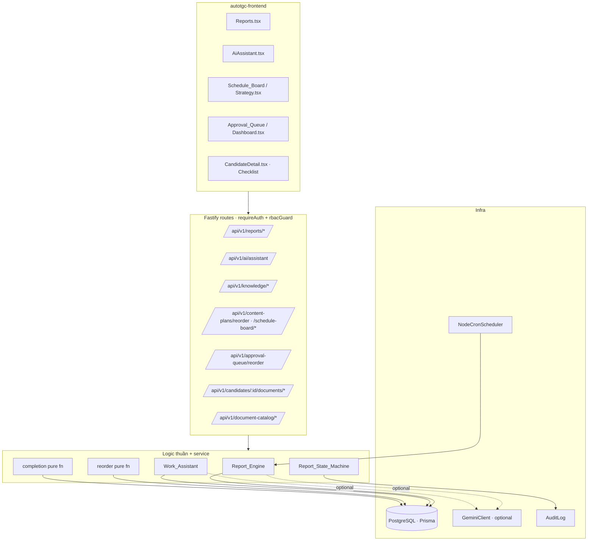
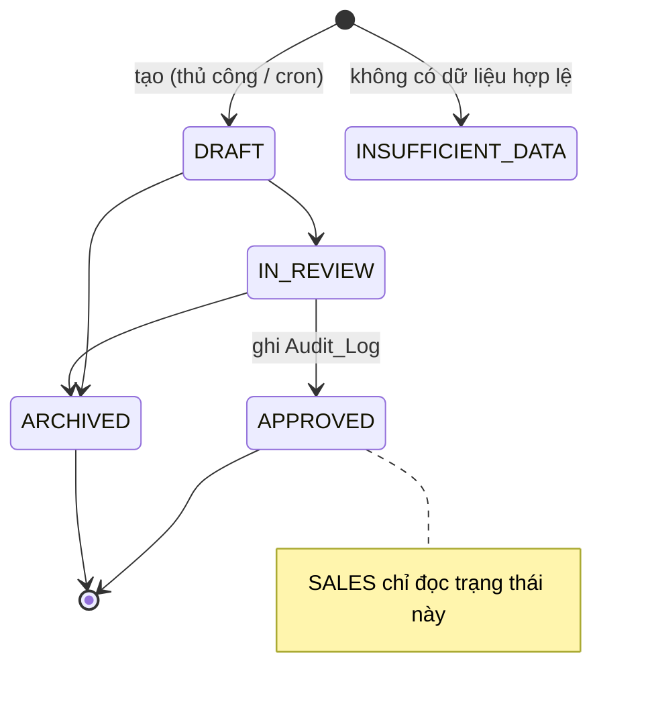

# Design Document — ai-reporting-and-ops-enhancements

## Overview

Gói nâng cấp **ai-reporting-and-ops-enhancements** bổ sung bốn nhóm năng lực vào nền tảng AutoTGC (khách hàng: Thanh Giang Conincon — XKLĐ), xây dựng **additive** trên kiến trúc hiện có (Fastify 4 + Prisma 5/PostgreSQL 16, Redis/ioredis, JWT `jose` + RBAC `ADMIN`/`SALES`, Google Gemini ngoại vi qua gateway OpenAI-compatible, Vitest + fast-check, PM2 + Nginx). Thiết kế tuân thủ nghiêm các quy tắc steering: phân lớp (domain thuần ↔ route mỏng), `AppError` có kiểu với tập mã trạng thái giới hạn, an toàn chia 0 (`INSUFFICIENT_DATA`), RBAC thuần ở `auth/rbac.ts`, fail-fast secrets.

Bốn nhóm năng lực:

1. **Pipeline báo cáo công ty TUẦN/THÁNG bằng AI** — `Report_Engine` (tổng hợp thuần + diễn giải Gemini tùy chọn, có fallback xác định), `Report_State_Machine` (`DRAFT→IN_REVIEW→APPROVED`, `DRAFT/IN_REVIEW→ARCHIVED`, bước sai → 409), `Report_Scheduler` (cron TUẦN + THÁNG cấu hình được, fail-safe), model Prisma mới `CompanyReport`, RBAC (SALES chỉ đọc `APPROVED`), endpoint export. Mô phỏng đúng mẫu `FeedbackEngine` + `insightStateMachine` + `AuditLog` hiện có.
2. **Trợ lý Công việc TGC (TGC Work Assistant)** — tái sử dụng `RecruitmentConsultantAgent` thành agent hỏi–đáp nội bộ, grounding trên `KnowledgeEntry`, có phạm vi dữ liệu nghiệp vụ theo vai trò (ADMIN tất cả, SALES assigned-only), fallback xác định khi không có Gemini (`aiGenerated:false`), kèm danh sách nguồn, trả lời tiếng Việt, 400 khi câu hỏi rỗng, endpoint quản trị Knowledge Base.
3. **UX kéo–thả** — `Schedule_Board` (đổi lịch + sắp thứ tự `ContentPlanItem.targetDate`/`orderIndex`; đổi lịch `ScheduledPost` tái dùng guard future-only/SCHEDULED-only) và `Approval_Queue` (sắp ưu tiên bằng `priorityIndex`). Hàm reorder thuần + endpoint `Reorder_Request` theo lô (bảo toàn tập hợp + lũy đẳng).
4. **Checklist giấy tờ ứng viên** — model `DocumentTypeCatalog` (bộ giấy tờ mặc định theo `Market`, ADMIN cấu hình) và `DocumentChecklistItem` per `CandidateProfile` (loại, nhãn, trạng thái nộp, cờ bắt buộc, nguồn DEFAULT/CUSTOM), cascade delete theo ứng viên, chỉ số hoàn thành có an toàn chia 0 → `INSUFFICIENT_DATA`, loại tùy biến, SALES assigned-only.

### Nguyên tắc thiết kế chủ đạo

- **Tách logic thuần khỏi I/O.** Mọi quyết định cốt lõi (lọc theo kỳ, tổng hợp, chuyển trạng thái, xếp hạng grounding, reorder, chỉ số hoàn thành) là hàm thuần, export được để property-test trực tiếp — đúng mẫu `scoring.ts`, `feedbackEngine.ts` (các helper `aggregate`/`eligibleTopics`), `calendarService.isFuture`, `candidateAnalytics.computeFunnelRates`.
- **Gemini là tùy chọn.** Mọi đường dẫn AI có nhánh fallback xác định không ném lỗi (giống `RecruitmentConsultantAgent.consult` và `FeedbackEngine`), đánh dấu `aiGenerated:false`.
- **Review Mode mặc định.** Báo cáo sinh tự động luôn ở `DRAFT`; chuyển trạng thái cần con người. Mô phỏng `InsightStatus`/`insightStateMachine`.
- **Không tạo file/endpoint không xác thực.** Mọi route mới đứng sau `requireAuth` + `rbacGuard`.

## Architecture

### Bản đồ module (theo `src/<module>/` convention)

| Năng lực | Thư mục | Thành phần mới |
|---|---|---|
| Báo cáo công ty | `src/reporting/` (mới) | `reportEngine.ts` (thuần), `reportStateMachine.ts` (thuần), `reportService.ts` (I/O + lifecycle + audit), `reportScheduler.ts` (đăng ký cron), `reportExport.ts` (thuần — serialize text), `routes.ts`, `types.ts` |
| Work Assistant | `src/recruitment/agent/` (mở rộng) | `workAssistant.ts` (thuần ranking + grounding + scoping; bọc/đổi tên từ consultant), cập nhật `agent/routes.ts` thêm `/api/v1/ai/assistant` |
| DnD reorder | `src/content/` + `src/recruitment/` | `reorder.ts` (thuần, dùng chung), `scheduleBoardService.ts` (ContentPlanItem reschedule/reorder), bổ sung route reorder; `approvalQueueService.ts` cho Approval_Queue |
| Checklist giấy tờ | `src/recruitment/documents/` (mới) | `documentCatalog.ts` (bộ mặc định theo Market, thuần), `documentChecklistService.ts` (I/O), `completion.ts` (thuần — chỉ số hoàn thành), `routes.ts`, `validation.ts` |

Tất cả được wire thêm trong `app.ts` (giống các `registerXxxRoutes`) và `reportScheduler` được gọi từ `infra/jobs.ts`.

### Sơ đồ ngữ cảnh



### Luồng tạo báo cáo định kỳ (fail-safe)

```mermaid
sequenceDiagram
  participant Cron as Report_Scheduler (node-cron)
  participant Svc as ReportService
  participant Eng as Report_Engine (pure)
  participant GM as GeminiClient (optional)
  participant DB as Prisma

  Cron->>Svc: generateForPeriod(WEEKLY|MONTHLY, period vừa kết thúc)
  Svc->>DB: load PerformanceRecord/Lead/Candidate trong [from,to)
  Svc->>Eng: aggregate(rows, period)  %% thuần, loại INSUFFICIENT_DATA, an toàn chia 0
  alt có dữ liệu hợp lệ & GEMINI_API_KEY hợp lệ
    Svc->>GM: generateContent(prompt tóm tắt)
    GM-->>Svc: text  => aiGenerated=true
  else không có key / Gemini lỗi
    Svc->>Eng: buildDeterministicSummary()  => aiGenerated=false
  end
  alt không có bản ghi hợp lệ
    Svc->>DB: create CompanyReport status=INSUFFICIENT_DATA (không khuyến nghị)
  else
    Svc->>DB: create CompanyReport status=DRAFT
  end
  Note over Cron,Svc: Lỗi trong job được NodeCronScheduler bắt + log (tên job + thời điểm); KHÔNG auto-APPROVED
```

## Components and Interfaces

### 1. Reporting (`src/reporting/`)

#### `reportEngine.ts` — logic thuần (export để test)

```ts
export type ReportType = 'WEEKLY' | 'MONTHLY';
export type ReportPeriod = { label: string; from: Date; to: Date }; // [from, to) UTC

export interface ReportInputRow {            // chiếu tối thiểu, không phụ thuộc Prisma
  kind: 'performance' | 'lead' | 'candidate';
  occurredAt: Date;                          // scoredAt | createdAt
  performanceLabel?: string;                 // chỉ với performance
  conversionRate?: number; engagementRate?: number; ctaClickRate?: number;
  leadSource?: string;                       // chỉ với lead
  candidateStage?: string;                   // chỉ với candidate
  assignedTo?: string | null;                // dùng cho SALES scoping
}

export interface ReportContent {
  executiveSummary: string;
  contentPerformance: {
    publishedCount: number;
    avgConversionRate: number | 'INSUFFICIENT_DATA';
    avgEngagementRate: number | 'INSUFFICIENT_DATA';
    avgCtaClickRate: number | 'INSUFFICIENT_DATA';
  };
  recruitmentFunnelByMarket: Array<{ market: string; stageCounts: Record<string, number> }>;
  leadsBySource: Array<{ source: string; count: number }>;
  highlights: string[];
  recommendations: string[];
}

export interface ReportScope { role: 'ADMIN' | 'SALES'; userId: string; }

/** Lọc theo kỳ [from,to): chỉ giữ row có occurredAt ∈ [from,to). (Req 1.1) */
export function filterByPeriod(rows: readonly ReportInputRow[], period: ReportPeriod): ReportInputRow[];

/** Áp scope SALES: loại bản ghi không assigned cho userId (kể cả unassigned). (Req 1.5, 1.6) */
export function applyScope(rows: readonly ReportInputRow[], scope: ReportScope): ReportInputRow[];

/** Trung bình rate, LOẠI mọi performance row nhãn INSUFFICIENT_DATA; mẫu số 0 → 'INSUFFICIENT_DATA'. (Req 1.2, 1.3) */
export function averageRate(rows: readonly ReportInputRow[], pick: (r: ReportInputRow) => number | undefined): number | 'INSUFFICIENT_DATA';

/** Tổng hợp toàn bộ nội dung báo cáo từ rows đã lọc+scope. Xác định. (Req 1.4, 2.2, 2.6) */
export function aggregateReport(rows: readonly ReportInputRow[], type: ReportType, period: ReportPeriod): ReportContent;

/** Tóm tắt điều hành xác định khi không có Gemini. (Req 2.4) */
export function buildDeterministicSummary(content: ReportContent, type: ReportType, period: ReportPeriod): string;

/** true khi không có bản ghi hợp lệ nào → trạng thái INSUFFICIENT_DATA, không khuyến nghị. (Req 2.5) */
export function isInsufficient(rows: readonly ReportInputRow[]): boolean;
```

`ReportService` (I/O) đọc Prisma, gọi `aggregateReport`, rồi tùy chọn gọi `GeminiClient.generateContent(prompt)` để thay `executiveSummary` (đặt `aiGenerated=true`); bắt mọi lỗi Gemini → quay về `buildDeterministicSummary` (`aiGenerated=false`) — đúng mẫu `RecruitmentConsultantAgent`/`FeedbackEngine`. Khi `isInsufficient` → tạo `CompanyReport` `status=INSUFFICIENT_DATA`, `recommendations=[]`.

#### `reportStateMachine.ts` — chuyển trạng thái có kiểm soát (mẫu `insightStateMachine.ts`)

```ts
export type ReportStatus = 'DRAFT' | 'IN_REVIEW' | 'APPROVED' | 'ARCHIVED' | 'INSUFFICIENT_DATA';

export const REPORT_TRANSITIONS: ReadonlyArray<readonly [ReportStatus, ReportStatus]> = [
  ['DRAFT', 'IN_REVIEW'],
  ['IN_REVIEW', 'APPROVED'],
  ['DRAFT', 'ARCHIVED'],
  ['IN_REVIEW', 'ARCHIVED'],
];

export type ReportTransitionResult = { ok: true; status: ReportStatus } | { ok: false; status: 409 };
export function reportTransition(current: ReportStatus, target: ReportStatus): ReportTransitionResult;
```

`ReportService.transition(id, target, actor)`: gọi `reportTransition`; nếu `ok:false` → `ConflictError` (409) giữ nguyên trạng thái (Req 3.3). Khi sang `APPROVED` → `AuditLog.append('REPORT_APPROVED', reportId, actor, { ... })` (Req 3.5). `INSUFFICIENT_DATA` không phải nguồn chuyển hợp lệ (chỉ là trạng thái khởi tạo khi rỗng).

#### `reportService.ts` — interface chính

```ts
class ReportService {
  generateForPeriod(type: ReportType, period: ReportPeriod, scope: ReportScope): Promise<CompanyReportView>;
  get(id: string, actor: AuthInfo): Promise<CompanyReportView>;       // SALES chỉ đọc APPROVED
  list(filter: { reportType?: ReportType; status?: ReportStatus }, actor: AuthInfo): Promise<{ items: CompanyReportView[]; total: number }>;
  updateContent(id: string, content: Partial<ReportContent>, actor: AuthInfo): Promise<CompanyReportView>; // chỉ DRAFT|IN_REVIEW (Req 3.4)
  transition(id: string, target: ReportStatus, actor: AuthInfo): Promise<CompanyReportView>;
  export(id: string, actor: AuthInfo): Promise<{ filename: string; contentType: string; body: string }>; // chỉ APPROVED (Req 5.4)
}
```

#### `reportScheduler.ts` — đăng ký cron (mẫu `infra/jobs.ts`)

Hàm `registerReportJobs(scheduler, deps)` đăng ký hai job trên `NodeCronScheduler` (đã bắt + log lỗi theo tên job + timestamp, không crash tiến trình — Req 4.3):

- `weekly-company-report` — cron `CRON_WEEKLY_REPORT` (mặc định `0 1 * * 1`, thứ Hai 01:00); tạo báo cáo WEEKLY cho tuần vừa kết thúc.
- `monthly-company-report` — cron `CRON_MONTHLY_REPORT` (mặc định `0 2 1 * *`, ngày 1 lúc 02:00); tạo báo cáo MONTHLY cho tháng vừa kết thúc.

Mỗi job gọi `ReportService.generateForPeriod(type, previousPeriod, { role:'ADMIN', userId:'background-worker' })` → tạo `DRAFT` (Req 4.2, 4.4). Việc gọi `registerReportJobs` được chèn trong `startScheduledJobs` của `infra/jobs.ts`.

### 2. Work Assistant (`src/recruitment/agent/`)

Tái sử dụng `RecruitmentConsultantAgent`: agent hiện đã có đúng hành vi cần (retrieval grounding + Gemini optional + fallback xác định + sources). Ta **giữ nguyên class hiện có để không phá vỡ** các route `/api/v1/ai/consult|suggest-job-orders|draft-outreach`, đồng thời thêm một lớp mỏng `workAssistant.ts` mô tả vai trò "trợ lý nội bộ" với **scoping dữ liệu nghiệp vụ theo vai trò**.

#### `workAssistant.ts` — logic thuần + service

```ts
export interface AssistantQuery { question: string; role: 'ADMIN' | 'SALES'; userId: string; }
export interface AssistantAnswer { answer: string; sources: KnowledgeEntry[]; aiGenerated: boolean; }

/** Lọc dữ liệu nghiệp vụ (ứng viên/lead) theo vai trò: SALES chỉ giữ bản ghi assignedTo===userId. (Req 7.2, 7.3) */
export function scopeBusinessData<T extends { assignedTo?: string | null }>(rows: readonly T[], q: { role: 'ADMIN' | 'SALES'; userId: string }): T[];

class WorkAssistant {
  // dùng lại KnowledgeService.search (ranking thuần rankRows) + GeminiClient optional
  ask(q: AssistantQuery): Promise<AssistantAnswer>;
}
```

Hành vi `ask`:
- Chuẩn hóa `question`; nếu rỗng sau trim → `ValidationError` (400) (Req 6.5) — chặn ở route trước khi gọi service.
- Truy hồi `KnowledgeEntry` active liên quan nhất qua `KnowledgeService.search` (chỉ entry `active=true`, mẫu hiện có) (Req 6.1, 8.3).
- Nếu cần dữ liệu nghiệp vụ, đọc ứng viên/lead rồi `scopeBusinessData` theo vai trò (Req 7.1–7.3).
- Có Gemini → ghép prompt grounding (mẫu `buildSystemPrompt`, không nhúng secret — Req 7.5) → `aiGenerated=true`; lỗi/không key → fallback xác định từ KB (`buildGroundedAnswer`) `aiGenerated=false` (Req 6.2, 6.3), kèm `sources` (Req 6.4), trả lời tiếng Việt (Req 6.6).

Route mới `POST /api/v1/ai/assistant` đứng sau `requireAuth` + `rbacGuard` (Req 7.4). Knowledge admin tái dùng các route hiện có `GET/POST /api/v1/knowledge`, `PUT /api/v1/knowledge/:id` (Req 8.1–8.4) — đã validate 400 khi thiếu `category/title/content` và RBAC module `generation` (SALES bị từ chối 403).

> **Naming:** Class lõi giữ tên `RecruitmentConsultantAgent` (đã được nhiều route/marketing dùng làm `ContentGenerator` seam). `WorkAssistant` là facade mới bọc agent + thêm scoping; tên sản phẩm hiển thị là "Trợ lý Công việc TGC". Tài liệu/route dùng `assistant`; không xóa class cũ để tránh blast radius.

### 3. Drag-and-drop reorder (`src/content/reorder.ts` dùng chung)

#### `reorder.ts` — hàm thuần dùng chung cho cả Schedule_Board và Approval_Queue

```ts
export interface ReorderRequest { orderedIds: string[]; } // thứ tự mong muốn sau kéo–thả

export interface Reorderable { id: string; orderIndex: number; }

/**
 * Tính orderIndex mới cho một tập mục theo orderedIds.
 * - Bảo toàn TẬP HỢP: tập id trả về === tập id đầu vào (không thêm/mất). (Req 9.3, 10.2)
 * - Gán orderIndex = vị trí trong orderedIds (0..n-1) cho id có mặt; id không nằm trong
 *   orderedIds giữ thứ tự tương đối, xếp sau.
 * - LŨY ĐẲNG: applyReorder(applyReorder(items, req), req) === applyReorder(items, req). (Req 10.4)
 */
export function applyReorder<T extends Reorderable>(items: readonly T[], req: ReorderRequest): T[];

/** Validate: orderedIds chỉ chứa id thuộc tập hiện có, không trùng. Sai → ValidationError 400. */
export function validateReorder(items: readonly { id: string }[], req: ReorderRequest): void;
```

#### `scheduleBoardService.ts` — ContentPlanItem reschedule + reorder

```ts
class ScheduleBoardService {
  /** Đổi ngày mục tiêu của 1 ContentPlanItem khi thả sang ngày mới. (Req 9.1) */
  rescheduleItem(itemId: string, targetDate: Date): Promise<ContentPlanItem>;
  /** Sắp thứ tự các ContentPlanItem trong cùng plan: ghi orderIndex theo applyReorder. (Req 9.2, 9.3) */
  reorderItems(planId: string, req: ReorderRequest): Promise<ContentPlanItem[]>;
  /** Đổi lịch ScheduledPost: tái dùng CalendarService.reschedule (SCHEDULED-only 409, future-only 400). (Req 9.4–9.6) */
  rescheduleScheduledPost(postId: string, newTime: Date): Promise<{ id: string; scheduledAt: Date }>;
}
```

`rescheduleScheduledPost` **gọi thẳng `CalendarService.reschedule`** (đã có sẵn quy tắc: non-SCHEDULED → 409, non-future → 400). Không nhân bản logic.

#### `approvalQueueService.ts` — Approval_Queue ordering

Approval_Queue hiện được tính thuần trong `dashboard/assembler.buildApprovalQueue` (DRAFT drafts ∪ PENDING_REVIEW insights, sắp theo deadline). Để hỗ trợ ưu tiên thủ công bằng kéo–thả, thêm trường `priorityIndex` trên `ContentDraft` và `LearningInsight` (mặc định 0). `approvalQueueService.reorder(req)` dùng `applyReorder` ghi `priorityIndex` cho từng mục; `buildApprovalQueue` ưu tiên `priorityIndex` tăng dần (rồi mới đến deadline) khi render lại (Req 10.1, 10.3).

RBAC: cả hai thao tác reorder thuộc module `strategy` (Schedule_Board) và `dashboard`/`feedback` (Approval_Queue) → ADMIN ghi được, SALES bị 403 (Req 9.7).

### 4. Document checklist (`src/recruitment/documents/`)

#### `documentCatalog.ts` — bộ giấy tờ mặc định theo Market (thuần)

```ts
export type DocSubmissionStatus = 'PENDING' | 'SUBMITTED' | 'VERIFIED' | 'REJECTED';
export type DocSource = 'DEFAULT' | 'CUSTOM';

export interface DocTypeDef { type: string; label: string; required: boolean; }

/** Bộ mặc định theo RecruitmentMarket; khi không có desiredMarket dùng OTHER. (Req 12.1, 12.3) */
export const DEFAULT_DOC_CATALOG: Readonly<Record<string, readonly DocTypeDef[]>>;

/** Lấy bộ mặc định cho một market (fallback OTHER). Thuần. */
export function defaultDocsForMarket(market: string | null | undefined): DocTypeDef[];
```

#### `completion.ts` — chỉ số hoàn thành (thuần, an toàn chia 0)

```ts
export interface ChecklistItemLike { required: boolean; status: DocSubmissionStatus; }

/**
 * Tỷ lệ hoàn thành = (số mục required ở VERIFIED) / (tổng mục required).
 * Tổng required = 0 → 'INSUFFICIENT_DATA' (không chia). Ngược lại ∈ [0,1]. (Req 13.4, 13.5)
 */
export function completionMetric(items: readonly ChecklistItemLike[]): number | 'INSUFFICIENT_DATA';
```

#### `documentChecklistService.ts` — I/O

```ts
class DocumentChecklistService {
  /** Khởi tạo checklist từ catalog theo desiredMarket (hoặc OTHER). (Req 12.2, 12.3) */
  initForCandidate(candidateId: string, actor: AuthInfo): Promise<DocumentChecklistItem[]>;
  list(candidateId: string, actor: AuthInfo): Promise<{ items: DocumentChecklistItem[]; completion: number | 'INSUFFICIENT_DATA' }>;
  /** Thêm mục CUSTOM; label rỗng sau trim → 400. (Req 13.1, 13.2) */
  addCustom(candidateId: string, input: { label: string; required?: boolean }, actor: AuthInfo): Promise<DocumentChecklistItem>;
  /** Cập nhật trạng thái nộp (chỉ 4 giá trị hợp lệ); SUBMITTED ghi updatedAt. (Req 11.3, 13.3) */
  updateStatus(itemId: string, status: DocSubmissionStatus, actor: AuthInfo): Promise<DocumentChecklistItem>;
}

class DocumentCatalogService {                 // ADMIN cấu hình catalog (Req 12.4, 12.5)
  get(market: string): Promise<DocTypeDef[]>;
  update(market: string, docs: DocTypeDef[]): Promise<DocTypeDef[]>; // KHÔNG ảnh hưởng checklist đã tạo
}
```

SALES scoping: mọi thao tác checklist resolve `ownerUserId` từ `candidate.assignedTo` qua `rbacGuard` (mẫu `candidateTargetById` trong `recruitment/routes.ts`) → SALES chỉ xem/sửa ứng viên được phân công, ngược lại 403 (Req 13.6).

## Data Models

Tất cả thay đổi là **additive** trong `prisma/schema.prisma`, kèm migration (Req 15.1).

### Enums mới

```prisma
enum ReportType {
  WEEKLY
  MONTHLY
}

enum ReportStatus {
  DRAFT
  IN_REVIEW
  APPROVED
  ARCHIVED
  INSUFFICIENT_DATA
}

enum DocSubmissionStatus {
  PENDING
  SUBMITTED
  VERIFIED
  REJECTED
}

enum DocSource {
  DEFAULT
  CUSTOM
}
```

### `CompanyReport` (Req 2.1, 3.1, 3.6, 5)

```prisma
model CompanyReport {
  id          String       @id @default(uuid())
  reportType  ReportType
  periodFrom  DateTime
  periodTo    DateTime
  periodLabel String                          // ví dụ "2024-W23" | "2024-06"
  status      ReportStatus @default(DRAFT)
  content     Json                            // ReportContent đã serialize
  aiGenerated Boolean      @default(false)
  scopeUserId String?                         // null = phạm vi toàn công ty (ADMIN)
  createdBy   String?                         // userId | 'background-worker'
  createdAt   DateTime     @default(now())
  updatedAt   DateTime     @updatedAt

  @@index([reportType, periodFrom])
  @@index([status])
  @@unique([reportType, periodLabel, scopeUserId])  // tránh trùng kỳ cho cùng phạm vi
}
```

### `DocumentChecklistItem` (Req 11)

```prisma
model DocumentChecklistItem {
  id          String              @id @default(uuid())
  candidateId String
  candidate   CandidateProfile    @relation(fields: [candidateId], references: [id], onDelete: Cascade) // Req 11.4
  type        String              // mã loại giấy tờ (vd: PASSPORT, HEALTH_CHECK)
  label       String              // nhãn hiển thị
  status      DocSubmissionStatus @default(PENDING)   // Req 11.3
  required    Boolean             @default(true)
  source      DocSource           @default(DEFAULT)   // Req 11.2, 13.1
  note        String?
  submittedAt DateTime?           // set khi chuyển SUBMITTED (Req 13.3)
  createdAt   DateTime            @default(now())
  updatedAt   DateTime            @updatedAt

  @@index([candidateId])
  @@index([status])
}
```

Bổ sung quan hệ ngược trên `CandidateProfile` (additive):

```prisma
model CandidateProfile {
  // ... các trường hiện có ...
  documents   DocumentChecklistItem[]
}
```

### `DocumentTypeCatalog` (Req 12)

```prisma
model DocumentTypeCatalog {
  id        String   @id @default(uuid())
  market    String   @unique           // RecruitmentMarket code: JAPAN|KOREA|GERMANY|TAIWAN|DOMESTIC|OTHER
  docs      Json     @default("[]")     // DocTypeDef[]: { type, label, required }
  updatedAt DateTime @updatedAt
  createdAt DateTime @default(now())
}
```

### Trường bổ sung cho Approval_Queue ordering (Req 10)

```prisma
model ContentDraft {
  // ... hiện có ...
  priorityIndex Int @default(0)   // thứ tự ưu tiên thủ công trong Approval_Queue
}

model LearningInsight {
  // ... hiện có ...
  priorityIndex Int @default(0)
}
```

> `ContentPlanItem.orderIndex` và `ContentPlanItem.targetDate` đã tồn tại → Schedule_Board tái dùng, không cần thêm cột.

### Bộ giấy tờ mặc định theo quốc gia (seed `DEFAULT_DOC_CATALOG`)

Giá trị khởi tạo hợp lý theo từng thị trường XKLĐ (có thể ADMIN chỉnh sau). `type` là mã ổn định, `label` tiếng Việt:

| Market | Bộ giấy tờ mặc định (required) |
|---|---|
| **JAPAN** (TOKUTEI/TTS/Engineer) | Hộ chiếu (`PASSPORT`), CCCD/CMND (`NATIONAL_ID`), Sơ yếu lý lịch (`CV_RESUME`), Bằng tốt nghiệp (`EDU_CERTIFICATE`), Giấy khám sức khỏe (`HEALTH_CHECK`), Ảnh thẻ (`ID_PHOTO`), Chứng chỉ tiếng Nhật/JFT (`JP_LANGUAGE_CERT`, optional), Lý lịch tư pháp (`CRIMINAL_RECORD`) |
| **KOREA** (EPS) | Hộ chiếu, CCCD/CMND, Chứng chỉ EPS-TOPIK (`EPS_TOPIK`), Giấy khám sức khỏe, Sơ yếu lý lịch, Ảnh thẻ, Lý lịch tư pháp |
| **GERMANY** | Hộ chiếu, CCCD/CMND, Chứng chỉ tiếng Đức B1/B2 (`DE_LANGUAGE_CERT`), Bằng/Chứng chỉ nghề (`VOCATIONAL_CERT`), Giấy khám sức khỏe, Sơ yếu lý lịch (CV chuẩn EU), Ảnh thẻ |
| **TAIWAN** | Hộ chiếu, CCCD/CMND, Giấy khám sức khỏe, Sơ yếu lý lịch, Ảnh thẻ, Lý lịch tư pháp |
| **DOMESTIC** | CCCD/CMND, Sơ yếu lý lịch, Bằng cấp/chứng chỉ liên quan (optional), Ảnh thẻ |
| **OTHER** | Hộ chiếu, CCCD/CMND, Sơ yếu lý lịch, Giấy khám sức khỏe, Ảnh thẻ |

## API Endpoints

Tất cả đứng sau `requireAuth` + `rbacGuard`; mã trạng thái thuộc tập cho phép (200, 201, 202, 400, 401, 403, 404, 409, 423, 500, 502). Prefix `/api/v1` (đồng nhất recruitment).

### Reporting

| Method | Path | RBAC (module/action) | Status | Mô tả |
|---|---|---|---|---|
| POST | `/api/v1/reports/generate` | `analytics`/`create` (ADMIN) | 201, 400, 403 | Tạo báo cáo thủ công cho `reportType` + `period` |
| GET | `/api/v1/reports` | `analytics`/`read`; SALES chỉ thấy APPROVED | 200, 403 | Danh sách lọc theo `reportType`/`status` |
| GET | `/api/v1/reports/:id` | `analytics`/`read`; SALES chỉ APPROVED | 200, 403, 404 | Xem 1 báo cáo (SALES + non-APPROVED → 403, Req 5.2/5.3) |
| PUT | `/api/v1/reports/:id` | `analytics`/`update` (ADMIN) | 200, 400, 403, 404, 409 | Sửa nội dung khi DRAFT/IN_REVIEW (Req 3.4); khác → 409 |
| POST | `/api/v1/reports/:id/transition` | `analytics`/`status_update` (ADMIN) | 200, 403, 404, 409 | `{ target }` qua `Report_State_Machine`; bước sai → 409 |
| GET | `/api/v1/reports/:id/export` | `analytics`/`read` (ADMIN) | 200, 403, 404, 409 | Chỉ APPROVED (Req 5.4); trả text/markdown tải xuống |

> RBAC cho reporting dùng module `analytics`. Vì policy hiện tại deny SALES trên `analytics`, ta đặt một guard tùy biến cho GET `/reports` và `/reports/:id`: cho phép SALES đọc **nhưng** service lọc/giới hạn chỉ `APPROVED` (Req 5.2). Cụ thể: guard đọc dùng builder trả `module:'analytics', action:'read'` cho ADMIN; với SALES, builder vẫn cho qua bằng cách map sang một quyết định read-APPROVED ở tầng service (service ném `ForbiddenError` 403 khi SALES truy cập báo cáo non-APPROVED). Điều này giữ `rbac.ts` thuần và không mở rộng quyền ghi cho SALES.

### Work Assistant + Knowledge

| Method | Path | RBAC | Status | Mô tả |
|---|---|---|---|---|
| POST | `/api/v1/ai/assistant` | auth + `rbacGuard` (mọi role đã xác thực) | 200, 400, 401, 403 | `{ question }` → `AssistantAnswer`; rỗng → 400; scoping theo vai trò |
| GET | `/api/v1/knowledge` | `generation`/`read` (ADMIN) | 200, 403 | Liệt kê entry (hiện có) |
| POST | `/api/v1/knowledge` | `generation`/`create` (ADMIN) | 201, 400, 403 | Tạo entry; thiếu field → 400 (hiện có) |
| PUT | `/api/v1/knowledge/:id` | `generation`/`update` (ADMIN) | 200, 400, 403, 404 | Sửa/`active:false` để loại khỏi grounding (hiện có) |

> Route `/api/v1/ai/assistant` cần truy cập được cho cả ADMIN và SALES (Req 6 cho "nhân viên"). Vì module `generation` deny SALES, guard cho route này dùng builder map sang module `dashboard`/`read` (SALES được phép read dashboard) HOẶC một guard role-based `requireAuth` thuần + kiểm tra vai trò hợp lệ. Chọn: `requireAuth` + một `rbacGuard` trả `{ module:'dashboard', action:'read' }` để cả ADMIN và SALES qua được, còn scoping dữ liệu nghiệp vụ do `WorkAssistant.scopeBusinessData` đảm nhiệm (Req 7.4).

### Drag-and-drop

| Method | Path | RBAC | Status | Mô tả |
|---|---|---|---|---|
| POST | `/api/v1/content-plans/:planId/reorder` | `strategy`/`update` (ADMIN; SALES 403) | 200, 400, 403, 404 | `{ orderedIds }` → ghi `orderIndex` (Req 9.2, 9.3, 9.7) |
| PUT | `/api/v1/content-plan-items/:id/reschedule` | `strategy`/`update` | 200, 400, 403, 404 | `{ targetDate }` đổi ngày mục (Req 9.1) |
| PUT | `/api/v1/strategy/calendar/:id/reschedule` | `strategy`/`update` | 200, 400, 404, 409 | **Hiện có** — đổi lịch ScheduledPost (Req 9.4–9.6) |
| POST | `/api/v1/approval-queue/reorder` | `feedback`/`update` (ADMIN; SALES 403) | 200, 400, 403 | `{ orderedIds }` → ghi `priorityIndex` (Req 10.1, 10.4) |

### Document checklist

| Method | Path | RBAC | Status | Mô tả |
|---|---|---|---|---|
| GET | `/api/v1/candidates/:id/documents` | `lead_management`/`read`, assigned-only | 200, 403, 404 | Liệt kê + `completion` |
| POST | `/api/v1/candidates/:id/documents/init` | `lead_management`/`update`, assigned-only | 201, 403, 404 | Khởi tạo từ catalog theo desiredMarket |
| POST | `/api/v1/candidates/:id/documents` | `lead_management`/`update`, assigned-only | 201, 400, 403, 404 | Thêm CUSTOM; label rỗng → 400 |
| PUT | `/api/v1/documents/:itemId/status` | `lead_management`/`update`, assigned-only | 200, 400, 403, 404 | `{ status }`; giá trị ngoài 4 enum → 400 |
| GET | `/api/v1/document-catalog/:market` | `lead_management`/`read` (ADMIN) | 200, 403 | Đọc bộ mặc định |
| PUT | `/api/v1/document-catalog/:market` | `settings`/`update` (ADMIN) | 200, 400, 403 | Cập nhật bộ mặc định (không đụng checklist cũ) |

## State Machines

### Report_State_Machine



Mọi bước ngoài tập trên → `409` (giữ nguyên trạng thái). `INSUFFICIENT_DATA` và `APPROVED`/`ARCHIVED` là trạng thái không có cạnh ra hợp lệ (terminal cho mục đích chuyển tiếp).

### Candidate document item (không phải state machine có guard chuyển tiếp)

Trạng thái nộp `PENDING|SUBMITTED|VERIFIED|REJECTED` là tập giá trị hợp lệ; cập nhật chấp nhận bất kỳ giá trị nào trong tập (không ràng buộc thứ tự chuyển), giá trị ngoài tập → 400. `completionMetric` chỉ đếm `required && VERIFIED`.

## Correctness Properties

*Một property là một đặc tính hoặc hành vi phải luôn đúng trên mọi lần thực thi hợp lệ của hệ thống — về bản chất là một phát biểu hình thức về điều phần mềm phải làm. Property là cầu nối giữa đặc tả con-người-đọc-được và bảo đảm đúng đắn máy-kiểm-chứng-được.*

Các property dưới đây được rút ra từ phần prework, đã qua bước phản tỉnh để loại trùng lặp. Mỗi property là một phát biểu lượng từ phổ quát ("với mọi") và sẽ được hiện thực bằng đúng một property-based test (fast-check, ≥100 lần chạy).

### Property 1: Lọc theo kỳ chỉ giữ bản ghi trong [from, to)

*Với mọi* tập bản ghi đầu vào và mọi `Report_Period`, `filterByPeriod` chỉ giữ đúng các bản ghi có `occurredAt` thỏa `from <= occurredAt < to` (biên trái inclusive, biên phải exclusive), và loại mọi bản ghi ngoài khoảng.

**Validates: Requirements 1.1**

### Property 2: Trung bình rate loại trừ INSUFFICIENT_DATA và an toàn chia 0

*Với mọi* tập `PerformanceRecord`, `averageRate` bằng trung bình cộng các bản ghi sau khi loại bỏ mọi bản ghi nhãn `INSUFFICIENT_DATA`; nếu sau khi loại không còn bản ghi nào (mẫu số 0) thì kết quả là `'INSUFFICIENT_DATA'` và không bao giờ là `NaN`/`Infinity`.

**Validates: Requirements 1.2, 1.3**

### Property 3: Phạm vi SALES chỉ giữ dữ liệu được phân công

*Với mọi* tập bản ghi ứng viên/lead và mọi người dùng SALES, `applyScope` chỉ giữ các bản ghi có `assignedTo === userId` và loại bỏ mọi bản ghi được phân công cho người khác hoặc chưa phân công (`assignedTo` null).

**Validates: Requirements 1.5, 1.6**

### Property 4: Tổng hợp báo cáo nhất quán và đầy đủ cấu trúc

*Với mọi* tập bản ghi đã lọc, `aggregateReport` trả về `ReportContent` luôn có đủ các phần (tóm tắt điều hành, chỉ số hiệu năng nội dung, phễu tuyển dụng theo thị trường, điểm nổi bật, khuyến nghị); tổng số lượng các bucket `leadsBySource` bằng số bản ghi lead, tổng các `stageCounts` của phễu bằng số bản ghi ứng viên, và mọi giá trị đếm đều không âm.

**Validates: Requirements 1.4, 2.2**

### Property 5: Báo cáo xác định khi không dùng Gemini

*Với mọi* tập bản ghi đầu vào và mọi `Report_Period`, khi không dùng `Gemini_Service`, việc tổng hợp và sinh tóm tắt điều hành cho cùng một đầu vào luôn cho ra cùng một `ReportContent` (gọi nhiều lần cho kết quả bằng nhau theo deep-equal), và báo cáo được đánh dấu `aiGenerated = false`.

**Validates: Requirements 2.4, 2.6**

### Property 6: Thiếu dữ liệu không sinh khuyến nghị suy đoán

*Với mọi* tập bản ghi mà sau khi lọc theo kỳ và phạm vi không còn bản ghi hợp lệ nào, `isInsufficient` trả `true` và báo cáo sinh ra có danh sách khuyến nghị rỗng (`recommendations.length === 0`) cùng trạng thái `INSUFFICIENT_DATA`.

**Validates: Requirements 2.5**

### Property 7: Report_State_Machine chỉ chấp nhận bước hợp lệ

*Với mọi* cặp `(current, target)` trạng thái báo cáo, `reportTransition` trả `{ ok: true, status: target }` khi và chỉ khi cặp đó thuộc tập `{DRAFT→IN_REVIEW, IN_REVIEW→APPROVED, DRAFT→ARCHIVED, IN_REVIEW→ARCHIVED}`; mọi cặp khác trả `{ ok: false, status: 409 }`.

**Validates: Requirements 3.2, 3.3**

### Property 8: SALES chỉ đọc được báo cáo APPROVED

*Với mọi* tập `Company_Report` ở các trạng thái bất kỳ, khi người yêu cầu là SALES thì kết quả đọc (list/get) chỉ gồm các báo cáo `APPROVED`, và mọi yêu cầu đọc một báo cáo non-APPROVED bị từ chối với mã 403.

**Validates: Requirements 5.2**

### Property 9: Xếp hạng grounding chỉ dùng entry active, ổn định và xác định

*Với mọi* tập `KnowledgeEntry` (gồm cả active lẫn inactive) và mọi câu hỏi, kết quả truy hồi của `Work_Assistant` chỉ chứa các entry `active = true`, được sắp theo điểm liên quan không tăng dần (tie-break theo title ổn định), bằng đúng danh sách `sources` trả về, và xác định cho cùng đầu vào.

**Validates: Requirements 6.1, 6.4, 8.3**

### Property 10: Trợ lý không ném lỗi khi vắng Gemini

*Với mọi* câu hỏi hợp lệ (không rỗng), khi `Gemini_Service` không được cấu hình hoặc ném lỗi, `Work_Assistant.ask` luôn trả về `Assistant_Answer` với `aiGenerated = false` (không reject, không 502).

**Validates: Requirements 6.3**

### Property 11: Phạm vi dữ liệu nghiệp vụ theo vai trò

*Với mọi* tập bản ghi ứng viên/lead, `scopeBusinessData` với vai trò ADMIN trả về toàn bộ bản ghi không lọc, còn với vai trò SALES chỉ trả về các bản ghi có `assignedTo === userId` (không bản ghi ngoài phạm vi nào lọt vào).

**Validates: Requirements 7.1, 7.2, 7.3**

### Property 12: Reorder bảo toàn tập hợp và phản ánh đúng thứ tự

*Với mọi* tập mục có thể sắp xếp và mọi `Reorder_Request` hợp lệ, `applyReorder` trả về một tập có **cùng tập id** với đầu vào (không thêm, không mất mục), và `orderIndex`/`priorityIndex` của mỗi mục có mặt trong `orderedIds` bằng đúng vị trí của nó trong `orderedIds`.

**Validates: Requirements 9.2, 9.3, 10.1, 10.2**

### Property 13: Reorder là phép toán lũy đẳng

*Với mọi* tập mục và mọi `Reorder_Request`, áp dụng `applyReorder` hai lần liên tiếp cho cùng kết quả như áp dụng một lần: `applyReorder(applyReorder(items, req), req)` bằng `applyReorder(items, req)`.

**Validates: Requirements 10.4**

### Property 14: Approval_Queue hiển thị theo thứ tự ưu tiên đã lưu

*Với mọi* tập mục Approval_Queue có `priorityIndex`, danh sách kết xuất bởi `buildApprovalQueue` được sắp theo `priorityIndex` không giảm dần (ưu tiên thủ công trước, rồi mới đến tiêu chí deadline hiện có).

**Validates: Requirements 10.3**

### Property 15: Bộ giấy tờ mặc định fallback về OTHER

*Với mọi* giá trị `desiredMarket` là null hoặc không thuộc tập `Market` hỗ trợ, `defaultDocsForMarket` trả về đúng bộ giấy tờ mặc định của thị trường `OTHER`.

**Validates: Requirements 12.3**

### Property 16: Chỉ số hoàn thành đúng công thức, an toàn chia 0, và trong [0, 1]

*Với mọi* tập `Document_Checklist_Item`, `completionMetric` bằng `(số mục required ở trạng thái VERIFIED) / (tổng số mục required)` và luôn nằm trong đoạn `[0, 1]`; nếu tổng số mục required bằng 0 thì trả về `'INSUFFICIENT_DATA'` thay vì thực hiện phép chia (không bao giờ `NaN`/`Infinity`).

**Validates: Requirements 13.4, 13.5**

## Error Handling

Tuân thủ steering: ném các lớp `AppError` có kiểu từ `infra/errors.ts`; response theo envelope `{ error: { code, message } }`; chỉ dùng tập mã trạng thái cho phép (200, 201, 202, 400, 401, 403, 404, 409, 423, 500, 502). Global error handler trong `app.ts` đã xử lý chuyển `AppError → status` và `redact` thông điệp.

| Tình huống | Lớp lỗi | Mã | Ghi chú |
|---|---|---|---|
| Câu hỏi trợ lý rỗng sau trim | `ValidationError` | 400 | Req 6.5 |
| Thiếu `category/title/content` khi tạo KnowledgeEntry | `ValidationError` | 400 | Hiện có |
| Nhãn doc tùy biến rỗng | `ValidationError` | 400 | Req 13.2 |
| Trạng thái nộp ngoài 4 enum | `ValidationError` | 400 | Req 11.3 |
| `orderedIds` chứa id lạ/trùng | `ValidationError` | 400 | `validateReorder` |
| `scheduledAt`/`targetDate` thiếu hoặc không parse được | `ValidationError` | 400 | mẫu `parseDate` |
| Thời điểm đổi lịch không ở tương lai | `ValidationError` | 400 | Req 9.6, tái dùng `CalendarService` |
| Chưa xác thực | `UnauthorizedError` | 401 | `requireAuth` |
| SALES ghi/đụng tài nguyên ngoài quyền (report write, knowledge write, reorder, ứng viên không assigned) | `ForbiddenError` | 403 | Req 5.3, 8.4, 9.7, 13.6 |
| SALES đọc báo cáo non-APPROVED | `ForbiddenError` | 403 | Req 5.2 |
| Không tìm thấy report/candidate/item | `NotFoundError` | 404 | |
| Bước chuyển trạng thái báo cáo sai | `ConflictError` | 409 | Req 3.3 |
| Sửa nội dung báo cáo khi không phải DRAFT/IN_REVIEW | `ConflictError` | 409 | Req 3.4 |
| Export báo cáo chưa APPROVED | `ConflictError` | 409 | Req 5.4 |
| Đổi lịch `ScheduledPost` không ở SCHEDULED | `ConflictError` | 409 | Req 9.5 |
| Gemini không cấu hình/lỗi | **không nổi lên** | — | Report_Engine + Work_Assistant fallback xác định, `aiGenerated=false` (Req 2.4, 6.3) |

**Fail-safe scheduler:** lỗi trong job báo cáo được `NodeCronScheduler` bắt và log kèm tên job + thời điểm thất bại; không crash tiến trình, không dừng job khác (Req 4.3). Mỗi kỳ được cô lập try/catch (mẫu `runAutoResearch`).

**Numeric safety:** `averageRate`, `completionMetric`, và các tỷ lệ phễu dùng chốt chặn mẫu số 0 → `INSUFFICIENT_DATA`, không bao giờ phát ra `NaN`/`Infinity` (Req 1.3, 13.5), mô phỏng `scoring.ts`/`candidateAnalytics.computeFunnelRates`.

**Bảo mật:** prompt grounding chỉ chứa thông tin công khai (mẫu `buildSystemPrompt` + `COMPANY_IDENTITY`); không nhúng `GEMINI_API_KEY` hay credential vào prompt/answer (Req 7.5). Khóa Gemini đọc từ `SecretLoader`, không bao giờ log giá trị.

## Testing Strategy

### Cách tiếp cận kép

- **Property tests (fast-check):** kiểm chứng các property phổ quát ở trên cho logic thuần. Thư viện: **fast-check** (đã có trong `devDependencies`), chạy với **Vitest**. KHÔNG tự cài đặt property testing từ đầu.
- **Unit tests:** kiểm tra ví dụ cụ thể, tích hợp giữa các thành phần, và edge/error case.

### Cấu hình property test

- Tối thiểu **100 lần chạy** mỗi property (`fc.assert(..., { numRuns: 100 })` trở lên) — Req 14.6.
- Mỗi property test gắn comment tham chiếu property thiết kế theo định dạng:
  `// Feature: ai-reporting-and-ops-enhancements, Property {number}: {property_text}`
- Mỗi correctness property hiện thực bằng **một** property test. File mới: `test/ai-reporting-and-ops.properties.test.ts` (mẫu `test/analytics-feedback.properties.test.ts`), dùng in-memory fake cho Prisma và stub cho Gemini, clock được inject để xác định.

### Ánh xạ property → đối tượng test (Req 14)

| Property | Hàm thuần kiểm thử | Yêu cầu test (Req 14) |
|---|---|---|
| 1, 2, 3, 4, 5, 6 | `filterByPeriod`, `averageRate`, `applyScope`, `aggregateReport`, `buildDeterministicSummary`, `isInsufficient` | 14.1 (Report_Engine) |
| 7 | `reportTransition` | 14.2 (Report_State_Machine) |
| 9, 10, 11 | `rankRows`/ranking, `WorkAssistant.ask` (stub), `scopeBusinessData` | 14.3 (Work_Assistant ranking/grounding) |
| 12, 13, 14 | `applyReorder`, `buildApprovalQueue` | 14.4 (Reorder set-preservation + idempotence) |
| 15, 16 | `defaultDocsForMarket`, `completionMetric` | 14.5 (checklist completion, chia-0, biên [0,1]) |

### Unit & edge/integration tests (bổ trợ)

- **Examples:** tạo report DRAFT (3.1), reportType WEEKLY/MONTHLY (2.1), Gemini stub → `aiGenerated=true` (2.3, 6.2), audit khi APPROVED (3.5), export APPROVED (5.4), `addCustom`→source CUSTOM (13.1), `updateStatus` SUBMITTED ghi `submittedAt` (13.3), init checklist theo market (12.2), cập nhật catalog không đổi checklist cũ (12.5), RBAC SALES→403 (5.3, 8.4, 9.7, 13.6), ADMIN full (5.1).
- **Edge cases:** câu hỏi whitespace→400 (6.5), thiếu field knowledge→400 (8.2), trạng thái nộp ngoài enum→400 (11.3), nhãn doc rỗng→400 (13.2), đổi lịch non-SCHEDULED→409 (9.5), thời điểm không tương lai→400 (9.6).
- **Integration/Smoke:** scheduler đăng ký đúng 2 job với cron env (4.1), job lỗi không crash (4.3), job tạo DRAFT không APPROVED (4.2, 4.4), cascade delete checklist (11.4), `defaultDocsForMarket` non-empty mọi market (12.1), mọi route mới có `requireAuth`+`rbacGuard` (7.4, 15.5), fallback answer tiếng Việt (6.6), prompt không chứa secret (7.5).

### Đánh giá PBT phù hợp

Tính năng có nhiều logic thuần với property phổ quát rõ ràng (lọc, tổng hợp, state machine, reorder, ranking, chỉ số dẫn xuất) → PBT phù hợp. Các phần I/O/CRUD/cron/RBAC-wiring/cascade dùng unit, integration và smoke test thay vì PBT.

## Deployment

Theo quy trình hiện có trong `deploy/` (Req 15).

1. **Migration Prisma (Req 15.1):** thêm enums (`ReportType`, `ReportStatus`, `DocSubmissionStatus`, `DocSource`), models (`CompanyReport`, `DocumentChecklistItem`, `DocumentTypeCatalog`), quan hệ `CandidateProfile.documents`, và cột `priorityIndex` trên `ContentDraft`/`LearningInsight`. Tạo migration: `npm run prisma:generate` rồi `prisma migrate dev --name ai_reporting_ops` (local) / `npm run prisma:migrate` (`prisma migrate deploy`) khi triển khai. `deploy/app-deploy.sh` đã chạy `prisma generate` + `prisma migrate deploy` (fallback `db push`).
2. **Build (Req 15.2):** `npm run build` (tsc → `dist/`) phải thành công trước khi triển khai (đã nằm trong `app-deploy.sh`).
3. **PM2 + Nginx non-root (Req 15.3):** chạy dưới user `autotgc` qua `deploy/pm2.config.js`, sau Nginx reverse proxy (`deploy/nginx-autotgc.conf`). `assertNotRoot` chặn chạy bằng root.
4. **Fail-fast secret (Req 15.4):** biến mới (`CRON_WEEKLY_REPORT`, `CRON_MONTHLY_REPORT`) là **optional** (`secrets.optional`, có mặc định) nên không thêm secret bắt buộc; `GEMINI_API_KEY` vẫn optional. Nếu sau này thêm secret bắt buộc, đưa vào `REQUIRED_SECRETS` của `config.ts` để fail-fast chỉ log tên biến.
5. **Endpoint có auth (Req 15.5):** mọi route mới đăng ký sau `requireAuth` + `rbacGuard`; không tạo endpoint không xác thực. `registerReportJobs` được gọi từ `startScheduledJobs` (`infra/jobs.ts`); các registrar route mới được wire trong `app.ts` (mẫu `registerRecruitmentRoutes`).

Biến môi trường mới (thêm vào `.env.example`, optional):

```
CRON_WEEKLY_REPORT=0 1 * * 1
CRON_MONTHLY_REPORT=0 2 1 * *
```

## Requirements Traceability

| Req | Tiêu chí | Phần tử thiết kế |
|---|---|---|
| 1.1 | Lọc theo kỳ [from,to) | `reportEngine.filterByPeriod` · Property 1 |
| 1.2, 1.3 | Loại INSUFFICIENT_DATA + chia 0 | `reportEngine.averageRate` · Property 2 |
| 1.4 | Tổng hợp đa chiều | `reportEngine.aggregateReport` · Property 4 |
| 1.5, 1.6 | SALES scope | `reportEngine.applyScope` · Property 3 |
| 2.1 | reportType WEEKLY/MONTHLY | `CompanyReport.reportType` · unit |
| 2.2 | 5 phần báo cáo | `ReportContent` · Property 4 |
| 2.3 | Gemini diễn giải + aiGenerated=true | `ReportService` + `GeminiClient` · unit |
| 2.4, 2.6 | Fallback xác định | `reportEngine.buildDeterministicSummary` · Property 5 |
| 2.5 | Insufficient không khuyến nghị | `reportEngine.isInsufficient` · Property 6 |
| 3.1 | Khởi tạo DRAFT | `ReportService.generateForPeriod` · unit |
| 3.2, 3.3 | Bước hợp lệ / 409 | `reportStateMachine.reportTransition` · Property 7 |
| 3.4 | Sửa khi DRAFT/IN_REVIEW | `ReportService.updateContent` · unit/edge |
| 3.5 | Audit khi APPROVED | `ReportService.transition` + `AuditLog` · unit |
| 3.6 | Lưu trữ theo type+period | `CompanyReport` index/unique · unit |
| 4.1 | Cron WEEKLY+MONTHLY env | `reportScheduler.registerReportJobs` · smoke |
| 4.2 | Job tạo DRAFT kỳ trước | `reportScheduler` · unit |
| 4.3 | Job lỗi fail-safe | `NodeCronScheduler` · integration |
| 4.4 | Không tự APPROVED | `reportScheduler` · unit |
| 5.1 | ADMIN full | `rbac.authorize` (analytics) · unit |
| 5.2 | SALES đọc APPROVED-only | `ReportService.get/list` guard · Property 8 |
| 5.3 | SALES write → 403 | route RBAC · unit |
| 5.4 | Export APPROVED | `reportExport` + `ReportService.export` · unit |
| 6.1, 6.4, 8.3 | Grounding active + sources | `KnowledgeService.rankRows`/`WorkAssistant` · Property 9 |
| 6.2 | Gemini → aiGenerated=true | `WorkAssistant.ask` · unit |
| 6.3 | Fallback không 502 | `WorkAssistant.ask` · Property 10 |
| 6.5 | Câu hỏi rỗng → 400 | route validation · edge |
| 6.6 | Trả lời tiếng Việt | `buildGroundedAnswer` · smoke |
| 7.1, 7.2, 7.3 | Scope theo vai trò | `WorkAssistant.scopeBusinessData` · Property 11 |
| 7.4 | Sau auth + RBAC | `agent/routes.ts` · smoke |
| 7.5 | Không lộ secret | `buildSystemPrompt` · unit |
| 8.1 | Tạo entry active | `KnowledgeService.create` · unit |
| 8.2 | Thiếu field → 400 | `agent/routes.ts` · edge |
| 8.4 | SALES write KB → 403 | RBAC `generation` · unit |
| 9.1 | Đổi targetDate | `scheduleBoardService.rescheduleItem` · unit |
| 9.2, 9.3 | orderIndex + bảo toàn tập | `reorder.applyReorder` · Property 12 |
| 9.4 | ScheduledPost reschedule | `CalendarService.reschedule` (tái dùng) · unit |
| 9.5 | Non-SCHEDULED → 409 | `CalendarService.reschedule` · edge |
| 9.6 | Không tương lai → 400 | `CalendarService.isFuture` · edge |
| 9.7 | SALES → 403 | route RBAC `strategy` · unit |
| 10.1, 10.2 | priorityIndex + bảo toàn tập | `reorder.applyReorder` · Property 12 |
| 10.3 | Render theo thứ tự lưu | `buildApprovalQueue` · Property 14 |
| 10.4 | Lũy đẳng | `reorder.applyReorder` · Property 13 |
| 11.1 | Item ↔ 1 candidate | `DocumentChecklistItem.candidateId` · schema |
| 11.2 | Thuộc tính item | `DocumentChecklistItem` · schema |
| 11.3 | Enum trạng thái nộp | `DocSubmissionStatus` + `updateStatus` · edge |
| 11.4 | Cascade delete | `onDelete: Cascade` · schema/integration |
| 12.1 | Bộ mặc định mỗi Market | `DEFAULT_DOC_CATALOG` · smoke |
| 12.2 | Init theo desiredMarket | `documentChecklistService.initForCandidate` · unit |
| 12.3 | Fallback OTHER | `documentCatalog.defaultDocsForMarket` · Property 15 |
| 12.4 | ADMIN cấu hình catalog | `DocumentCatalogService` · unit |
| 12.5 | Cập nhật không đổi checklist cũ | `DocumentCatalogService.update` · unit |
| 13.1 | Item CUSTOM | `documentChecklistService.addCustom` · unit |
| 13.2 | Nhãn rỗng → 400 | `addCustom` validation · edge |
| 13.3 | SUBMITTED + thời điểm | `updateStatus` · unit |
| 13.4, 13.5 | Chỉ số hoàn thành + chia 0 | `completion.completionMetric` · Property 16 |
| 13.6 | SALES assigned-only | `candidateTargetById` guard · unit |
| 14.1–14.6 | Property tests ≥100 runs | Testing Strategy + Properties 1–16 |
| 15.1 | Migration | Deployment §1 |
| 15.2 | Build | Deployment §2 |
| 15.3 | PM2 non-root + Nginx | Deployment §3 |
| 15.4 | Fail-fast secret | Deployment §4 + `config.ts` |
| 15.5 | Endpoint có auth | Deployment §5 + tất cả route |

## Frontend UX (bốn thay đổi)

Frontend hiện chỉ có **React 18 + react-router + @tanstack/react-query** (không có thư viện DnD). Để tránh thêm dependency nặng và giữ bundle nhỏ, dùng **HTML5 Drag and Drop API gốc** (`draggable`, `onDragStart`/`onDragOver`/`onDrop`) — đủ cho list/calendar reorder, không cần cài thêm gói. (Nếu sau này cần kéo–thả phức tạp hơn có thể cân nhắc `@dnd-kit/core`, nhưng không thuộc phạm vi gói này.)

1. **Reports (`src/pages/Reports.tsx` mới + `src/api/reports.ts`):** danh sách báo cáo theo TUẦN/THÁNG với badge trạng thái (mẫu `StageBadge`/`AiGroundingBadge`), nút chuyển trạng thái (ADMIN), nút export tải file; SALES chỉ thấy báo cáo APPROVED. Thêm route vào `App.tsx` + mục menu trong `Layout.tsx`.
2. **Schedule_Board (mở rộng `src/pages/Strategy.tsx` + `src/api/strategy.ts`):** lịch nội dung cho kéo–thả `ContentPlanItem` sang ngày khác (gọi `PUT /content-plan-items/:id/reschedule`) và sắp thứ tự trong nhóm (gọi `POST /content-plans/:planId/reorder` với `orderedIds`); đổi lịch `ScheduledPost` tái dùng `PUT /strategy/calendar/:id/reschedule`. Optimistic update qua react-query, rollback khi lỗi 400/409.
3. **Approval_Queue (mở rộng `src/pages/Dashboard.tsx`):** kéo–thả sắp ưu tiên các mục chờ duyệt, gọi `POST /approval-queue/reorder`; render lại theo `priorityIndex`.
4. **Document checklist (mở rộng `src/pages/CandidateDetail.tsx` + `src/api/recruitment.ts`):** hiển thị checklist + thanh tiến độ (chỉ số hoàn thành; hiển thị "Chưa đủ dữ liệu" khi `INSUFFICIENT_DATA`), nút khởi tạo theo thị trường, thêm loại tùy biến, đổi trạng thái nộp; trang catalog cho ADMIN cấu hình bộ mặc định.

Tất cả gọi API qua `apiClient` hiện có (tự gắn Bearer, parse envelope lỗi, refresh 401). DnD chỉ ảnh hưởng tầng trình bày; mọi ràng buộc đúng đắn (future-only, SCHEDULED-only, bảo toàn tập, lũy đẳng) được backend thực thi.
