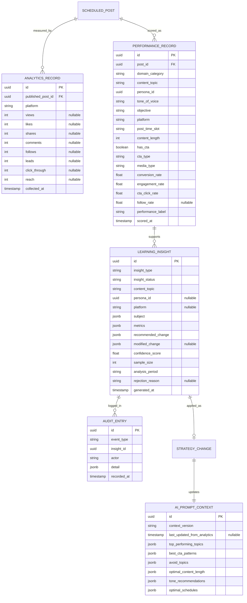
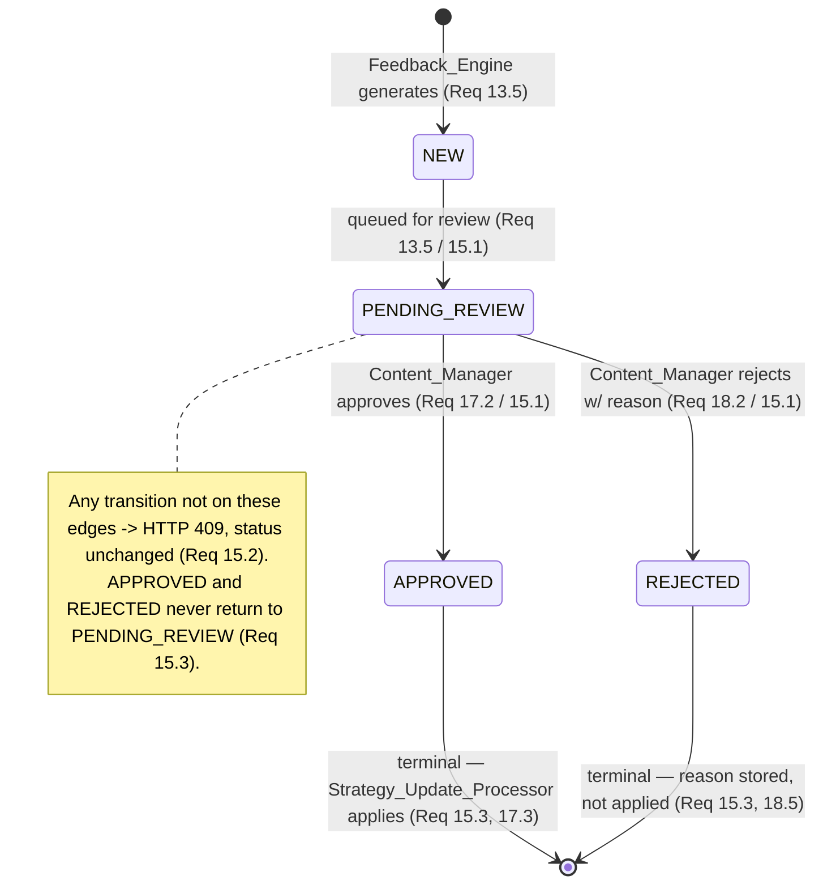
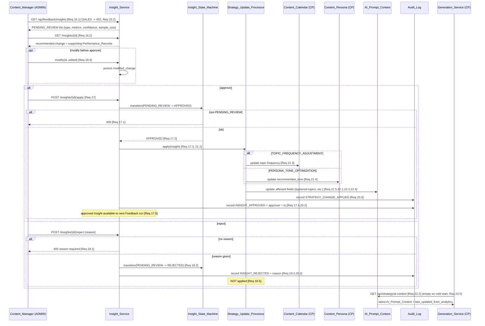

# Design Document: Analytics & Feedback Loop

## Overview

The Analytics & Feedback Loop module is the third of four Phase 1 specs of AutoTGC. It closes the content-marketing loop: it collects raw performance metrics from the platforms a post was published to, scores each post into derived rates and a performance tier, runs a weekly Google Gemini analysis to recognize patterns and emit human-reviewable learning insights, and — once a Content_Manager approves an insight — applies the change to content strategy and republishes the enriched **AI_Prompt_Context** that the Content Pipeline's `Generation_Service` consumes on the next generation. The loop is: **collect → score → analyze → insight → review → strategy update → ai-context → back into generation.**

This module adds new domain logic and HTTP routes but **reuses Foundation & Deployment wholesale** and **plugs into the Content Pipeline read/write contracts** rather than redefining either. It is the *producer* of the `AI_Prompt_Context` that Content Pipeline only *reads*.

### Relationship to Foundation & Deployment (spec 1)

| Foundation capability | How this module uses it |
|-----------------------|-------------------------|
| Authentication + RBAC middleware | Guards all `/api/analytics/*`, `/api/feedback/*`, `/api/strategy/ai-context` routes; feedback-review endpoints are ADMIN-only, SALES → 403 (Req 23.1, 23.2). |
| `PlatformAdapter` interface + `AdapterRegistry` | `Collection_Service` resolves an adapter per platform and calls `collectAnalytics()`; the GA4 adapter supplies website analytics (Req 1.3, 3.2). |
| `Token_Manager` | Pre-collection token validity check + on-demand refresh per platform (Req 1.5). |
| `Service_Account` (`background-worker`) | The scheduled collection, scoring, and weekly feedback jobs authenticate as `background-worker` (Req 1.2, 10.2, 23.3). |
| `Alert Dispatcher` | Collection-failure and weekly-analysis-failure notifications to the ADMIN Dashboard channel + email (Req 4.2, 12.4). |
| `Scheduler` (node-cron) | Fires the 6-hour Collection_Cycle and the weekly Sunday-00:00 feedback run (Req 1.1, 10.1). |
| `Secret_Store` | Gemini API key, platform/GA4 credentials (never in VCS). |
| Gemini foundation | `gemini-2.5-pro` access for Pattern_Recognition / Insight generation (Req 12.2). |
| REST conventions layer | Status-code set, pagination, central error handler (Req 15.2, 17.1, 18.1, 23). |

### Relationship to Content Pipeline (spec 2)

This module reads and writes Content Pipeline entities through their existing contracts; it never bypasses them:

| Content Pipeline entity | How this module touches it |
|-------------------------|----------------------------|
| `Scheduled_Post` (PUBLISHED) with `external_post_id` + `post_url` | Read model for collection: metrics are matched back to the internal post by `External_Post_Id` (Req 2.1). |
| `Content_Persona` (`recommended_tone`) | Written **only** by the `Strategy_Update_Processor` on an approved `PERSONA_TONE_OPTIMIZATION` insight (Req 21.4). |
| `Content_Calendar` (per-topic frequency) | Written **only** by the `Strategy_Update_Processor` on an approved `TOPIC_FREQUENCY_ADJUSTMENT` insight (Req 21.3). |
| `Content_Draft` Content_Features | Source of `domain_category`, `content_topic`, `persona_id`, `tone_of_voice`, `objective`, `cta_type`, `media_type`, `content_length` during feature extraction (Req 9.1). |
| `AI_Prompt_Context` at `/api/strategy/ai-context` | **Produced** here; the Content Pipeline `Generation_Service` consumes it (Req 22). On cold start this endpoint returns empty, never an error (Req 22.5), which is exactly the contract Content Pipeline's `Default_Context` fallback relies on. |

The shared stack is unchanged from Foundation: **Node.js 20 LTS + TypeScript, Fastify, Prisma/PostgreSQL 16, ioredis/Redis, BullMQ, node-cron, PM2, jose, fast-check.** New infrastructure introduced by this module: two **node-cron jobs** (6-hour collection, weekly feedback) and a **BullMQ scoring queue** (`score-queue`) so event-driven scoring runs decoupled from collection.

### Scope

In scope (Phase 1): scheduled 6-hour metric collection across Facebook / TikTok / Website-GA4 with `External_Post_Id` matching, platform metric-availability handling (TikTok null/excluded metrics), collection error handling (keep-last-data + notify), ≥12-month retention; derived-rate computation with divide-by-zero safety and `INSUFFICIENT_DATA` exclusion, configurable HIGH/MID performance labels, Content_Features extraction, `Performance_Record` production; weekly Gemini feedback analysis with `MIN_SAMPLE` gating and fallback, five-dimension Pattern_Recognition, five insight types with confidence/sample_size, conversion-over-engagement conflict resolution, the insight lifecycle state machine; insight review/approve/reject-with-reason/modify, Auto_Mode (off by default); the `Strategy_Update_Processor` single-source-of-truth applier; `AI_Prompt_Context` production; append-only `Audit_Log`; and RBAC on every endpoint.

Out of scope: the generation that *consumes* `AI_Prompt_Context` (Content Pipeline); platform publishing; token refresh internals (Foundation); Phase 2+ platforms; the Dashboard UI rendering itself (this module supplies its data).

## Architecture

### Closed-Loop Context — plugging into Foundation + Content Pipeline

```mermaid
graph TB
    subgraph Foundation["Foundation & Deployment (spec 1) — reused"]
        MW[Auth + RBAC Middleware]
        REG[AdapterRegistry + PlatformAdapter]
        TM[Token_Manager]
        ALERT[Alert Dispatcher]
        SVC[Service_Account<br/>background-worker]
        SCHED[Scheduler node-cron]
        SEC[Secret_Store]
        GEM[Google Gemini<br/>gemini-2.5-pro]
    end

    subgraph CPipe["Content Pipeline (spec 2)"]
        SP[(Scheduled_Post<br/>external_post_id, post_url)]
        PERSONA[(Content_Persona<br/>recommended_tone)]
        CAL[(Content_Calendar<br/>topic frequency)]
        GENSVC[Generation_Service]
    end

    subgraph AFL["Analytics & Feedback Loop (this module)"]
        direction TB
        COL[Collection_Service]
        SCO[Scoring_Engine]
        FBE[Feedback_Engine]
        ISM[Insight_State_Machine]
        ISVC[Insight_Service]
        SUP[Strategy_Update_Processor<br/>single source of truth]
        CTX[AI_Prompt_Context read model]
        AUD[Audit_Log append-only]
    end

    subgraph Data[Datastores]
        PG[(PostgreSQL 16<br/>analytics_record, performance_record,<br/>learning_insight, audit_log, ai_prompt_context)]
        RD[(Redis<br/>BullMQ score-queue)]
    end

    SCHED -->|6h cycle| COL
    SCHED -->|weekly Sun 00:00| FBE
    COL -. auth .-> SVC
    FBE -. auth .-> SVC
    COL -->|resolve adapter| REG --> EXT[Facebook / TikTok / GA4]
    COL -->|validity/refresh| TM
    COL -->|collection failure| ALERT
    COL -->|match by external_post_id| SP
    COL -->|persist Analytics_Record| PG
    COL -->|event: collected| RD --> SCO
    SCO -->|extract features| SP
    SCO -->|persist Performance_Record| PG
    FBE -->|read Performance_Records| PG
    FBE -->|Pattern_Recognition| GEM
    FBE -->|analysis failure| ALERT
    FBE -->|persist Learning_Insight| PG
    FBE --> ISM
    ISVC --> ISM
    ISVC -->|approve/reject| PG
    MW --> ISVC & CTX & COL & SCO & FBE
    ISVC -->|on APPROVED| SUP
    SUP -->|topic frequency| CAL
    SUP -->|recommended_tone| PERSONA
    SUP -->|produce/update| CTX
    SUP -->|every change| AUD
    CTX -->|GET /api/strategy/ai-context| GENSVC
    FBE & ISVC & SUP --> AUD
    COL & FBE & SUP -. Gemini/platform secrets .-> SEC
```



The closed loop is visible on the diagram: `Scheduler → Collection_Service → (score-queue) → Scoring_Engine → Feedback_Engine → Insight_Service review → Strategy_Update_Processor → AI_Prompt_Context → Generation_Service`, and the `Generation_Service`'s output is published by Content Pipeline, observed again by `Collection_Service` — closing the cycle.

### Layering

Consistent with the Foundation three-domain split:

1. **HTTP layer (Fastify routers)** — the routes in the endpoint map below, behind Foundation auth/RBAC. Stateless; JSON-schema request validation.
2. **Domain layer** — `Collection_Service`, `Scoring_Engine`, `Feedback_Engine`, `Insight_State_Machine`, `Insight_Service`, `Strategy_Update_Processor`. Pure logic (rate math, label mapping, sample gating, transition guard, conflict resolution, context assembly) is isolated from I/O so it is property-testable.
3. **Infrastructure layer** — Prisma repositories, the two node-cron jobs, the BullMQ `score-queue`, and outbound calls routed through Foundation's `AdapterRegistry` / `Token_Manager` / Gemini client.

### Endpoint map (from API_Catalog.md + Req 23.1)

| Endpoint | Method | Caller | Component | Requirements |
|----------|--------|--------|-----------|--------------|
| `/api/analytics/collect` | POST | Background_Worker | Collection_Service | 1, 2, 3, 4 |
| `/api/analytics/score` | POST | Background_Worker (event) | Scoring_Engine | 6, 7, 8, 9 |
| `/api/feedback/analyze` | POST | Background_Worker | Feedback_Engine | 10, 11, 12, 13, 14 |
| `/api/feedback/insights` | GET | Content_Manager | Insight_Service | 16, 23.2 |
| `/api/feedback/insights/{id}` | GET | Content_Manager | Insight_Service | 16.2 |
| `/api/feedback/insights/{id}/apply` | POST | Content_Manager | Insight_Service → Strategy_Update_Processor | 17, 18.4, 23.2 |
| `/api/feedback/insights/{id}/reject` | POST | Content_Manager | Insight_Service | 18.1–18.3, 23.2 |
| `/api/strategy/ai-context` | GET | Generation_Service | AI_Prompt_Context read model | 22 |

All seven are protected endpoints requiring a valid Access_Token (Req 23.1); the three feedback-review endpoints are ADMIN-only (Req 23.2); the three worker endpoints require the `background-worker` Service_Account permission set (Req 23.3, 23.4).

## Components and Interfaces

### Collection_Service (Req 1, 2, 3, 4, 5)

Scheduled metric collector. Runs on the 6-hour Collection_Cycle as `background-worker`.

```typescript
type Platform = 'facebook' | 'tiktok' | 'website';
type MetricName =
  | 'views' | 'likes' | 'shares' | 'comments'
  | 'follows' | 'leads' | 'click_through' | 'reach';

type MetricValue = number | null;   // null === Unavailable_Metric (Req 3.4)

interface RawMetrics {
  // present keys carry a number; an Unavailable_Metric is explicitly null, never 0
  views?: MetricValue; likes?: MetricValue; shares?: MetricValue;
  comments?: MetricValue; follows?: MetricValue; leads?: MetricValue;
  clickThrough?: MetricValue; reach?: MetricValue;
}

interface AnalyticsRecord {
  id: string;
  publishedPostId: string;        // internal Scheduled_Post id
  platform: Platform;
  metrics: RawMetrics;            // Unavailable_Metrics stored as null
  collectedAt: string;           // ISO 8601 (Req 1.4)
}

interface CollectionService {
  runCycle(now: Date): Promise<CollectionReport>;                       // Req 1.1–1.5
  collectForPlatform(platform: Platform, posts: PublishedPost[]): Promise<PlatformCollectionResult>; // Req 3, 4
  matchToPost(externalPostId: string): Promise<PublishedPost | null>;   // Req 2.1, 2.3
  shapeMetrics(platform: Platform, raw: unknown): RawMetrics;           // Req 3.1–3.4
}

interface PlatformCollectionResult {
  platform: Platform;
  persisted: AnalyticsRecord[];
  skipped: { externalPostId: string; reason: 'NO_MATCH' | 'MATCH_FAILED' }[]; // Req 2.3
  failed: boolean;               // platform request failed (Req 4)
}
```

Key behaviors:
- **Schedule + identity (Req 1.1, 1.2):** the Scheduler triggers `runCycle` every Collection_Cycle (default 6h); the job authenticates as `background-worker`.
- **Per-post collection (Req 1.3, 1.4):** for each Published_Post, request analytics through the `PlatformAdapter` for that post's platform; website analytics come through the GA4 adapter. Retrieve the available subset of the eight raw metrics plus a `collected_at` timestamp.
- **Token gate (Req 1.5):** before collecting from a platform, call `Token_Manager.isValid(platform)`; if invalid/expired, request `Token_Manager.refresh(platform)` before proceeding.
- **Matching (Req 2):** map returned metrics to the internal Published_Post via its `External_Post_Id`; persist an `Analytics_Record` keyed to that post + platform. If the `External_Post_Id` matches no post or matching fails, **skip** those metrics — no `Analytics_Record` is created.
- **Platform metric availability (Req 3):** `shapeMetrics` records, per platform: Facebook → views, reach, click_through, follows (+ engagement inputs); Website/GA4 → pageviews-as-views, sessions, conversions; TikTok → only views, likes, comments, shares, with **reach and follows recorded as null Unavailable_Metrics**. Any metric a platform's API does not provide is stored `null` and flagged unavailable — never coerced to 0.
- **Error handling (Req 4):** a per-platform request failure logs the platform id + failure timestamp, notifies the Content_Manager that the platform's data is not current, and **retains the most recent Analytics_Records** for that platform; collection continues for the remaining platforms (failure is isolated per platform).

### Scoring_Engine (Req 6, 7, 8, 9)

Pure rate/label computation plus feature extraction. Event-driven: each completed collection enqueues a `score-queue` job (Req 6.4).

```typescript
type PerformanceLabel =
  | 'HIGH_PERFORMER' | 'AVERAGE_PERFORMER' | 'LOW_PERFORMER' | 'INSUFFICIENT_DATA';

interface DerivedRates {
  conversionRate: number;                 // 0 when denominator 0 (Req 7.1)
  engagementRate: number;
  ctaClickRate: number;
  followRate: number | null;              // null = not applicable (TikTok, Req 6.3)
}

interface ContentFeatures {                // Req 9.1 (sourced from Content_Draft / Scheduled_Post)
  domainCategory: string;
  contentTopic: string;
  personaId: string;
  toneOfVoice: string;
  objective: 'Lead' | 'View' | 'Follow';
  platform: Platform;
  postTimeSlot: string;                   // e.g. 'morning' | 'afternoon' | 'evening'
  contentLength: number;
  hasCta: boolean;
  ctaType: string;
  mediaType: 'image' | 'video' | 'text' | 'photo_carousel';
}

interface PerformanceRecord {
  postId: string;
  features: ContentFeatures;
  rates: DerivedRates;
  performanceLabel: PerformanceLabel;
  scoredAt: string;                       // Req 9.2
}

interface ScoringConfig { highThreshold: number; midThreshold: number; } // default 5, 2 (Req 8.4)

interface ScoringEngine {
  score(record: AnalyticsRecord, features: ContentFeatures, cfg: ScoringConfig): PerformanceRecord; // Req 6–9
  computeRates(platform: Platform, m: RawMetrics): { rates: DerivedRates; insufficient: boolean };  // Req 6, 7
  labelFor(conversionRate: number, insufficient: boolean, cfg: ScoringConfig): PerformanceLabel;     // Req 8
}
```

Key behaviors:
- **Rate formulas (Req 6.1–6.3):** with `views > 0`, `conversionRate = leads/views*100` and `ctaClickRate = click_through/views*100`. Facebook/Website with `reach > 0`: `engagementRate = (likes+comments+shares)/reach*100`, `followRate = follows/reach*100`. TikTok with `views > 0`: `engagementRate = (likes+comments+shares)/views*100`, `followRate = null` (not applicable).
- **Divide-by-zero safety (Req 7.1, 7.2):** any Derived_Rate whose denominator is zero is **set to 0 with no division performed**; if `views === 0`, or the reach required by a rate is `0`, the post's Performance_Label becomes `INSUFFICIENT_DATA`.
- **Unavailable-metric exclusion (Req 3.5):** a `null` metric is excluded from any aggregate input and is never read as 0. (A rate that depends on an unavailable denominator follows the divide-by-zero rule and yields `INSUFFICIENT_DATA`.)
- **Labeling (Req 8.1–8.3, 8.5):** when not `INSUFFICIENT_DATA`, map `conversionRate`: `>= HIGH_THRESHOLD → HIGH_PERFORMER`; `>= MID_THRESHOLD and < HIGH_THRESHOLD → AVERAGE_PERFORMER`; `< MID_THRESHOLD → LOW_PERFORMER`. An `INSUFFICIENT_DATA` post is never assigned one of the three tiers. Thresholds come from config (Req 8.4).
- **Recompute on recovery (Req 7.4):** when a later collection raises views/required-reach above zero, re-run `score` and assign a tier label from the fresh Conversion_Rate.
- **Feature extraction + record (Req 9):** extract the eleven Content_Features from the post's draft/scheduled-post, combine with the rates, label, and a `scored_at` timestamp into a `Performance_Record`, and persist it.

### Feedback_Engine (Req 10, 11, 12, 13, 14)

Weekly Gemini-driven analyzer. Runs Sunday 00:00 as `background-worker`.

```typescript
type AnalysisDimension =
  | 'domain_category'
  | 'content_topic'
  | 'persona_tone'        // persona_id × tone_of_voice
  | 'platform_timeslot'   // platform × post_time_slot
  | 'cta_objective';      // cta_type × objective

type InsightType =
  | 'TOPIC_FREQUENCY_ADJUSTMENT' | 'PERSONA_TONE_OPTIMIZATION'
  | 'OPTIMAL_POSTING_SCHEDULE'   | 'LOW_PERFORMER_ALERT'
  | 'PLATFORM_CONTENT_FIT';

interface FeedbackConfig { minSample: number; highThreshold: number; midThreshold: number; } // minSample default 5 (Req 11.4)

interface FeedbackEngine {
  run(now: Date, period: AnalysisPeriod): Promise<FeedbackRunResult>;                 // Req 10
  aggregate(records: PerformanceRecord[], dim: AnalysisDimension): GroupAggregate[];   // Req 12.1, 12.3
  eligibleTopics(records: PerformanceRecord[], cfg: FeedbackConfig): string[];         // Req 11.1, 11.2
  resolveConflicts(insights: LearningInsight[]): LearningInsight[];                    // Req 14
}

type FeedbackRunResult =
  | { outcome: 'analyzed'; insights: LearningInsight[] }
  | { outcome: 'skipped'; reason: 'ALL_INSUFFICIENT_DATA' | 'BELOW_MIN_SAMPLE' }       // Req 10.4, 11.2
  | { outcome: 'failed'; reason: 'AUTH' | 'GEMINI' };                                  // Req 10.2, 12.4
```

Key behaviors:
- **Trigger + identity (Req 10.1, 10.2):** Scheduler fires once weekly (default Sunday 00:00); the run authenticates as `background-worker` and **halts immediately without Pattern_Recognition** if that auth fails.
- **Input filtering (Req 10.3, 7.3, 12.3):** analyze Performance_Records within the configured period, **excluding every `INSUFFICIENT_DATA` record**; when aggregating a Derived_Rate across a group, exclude Unavailable_Metrics and `INSUFFICIENT_DATA` rates from that aggregation.
- **Empty-analysis guard (Req 10.4):** if every record in the period is `INSUFFICIENT_DATA`, skip analysis entirely and leave the strategy unchanged.
- **Sample gating + fallback (Req 11):** generate a Learning_Insight for a content_topic only when its Performance_Record count `>= MIN_SAMPLE`; if no topic reaches `MIN_SAMPLE`, generate **no** insights and leave the strategy unchanged. Every generated insight carries the `sample_size` used. `MIN_SAMPLE` is config (default 5).
- **Pattern_Recognition (Req 12.1, 12.2):** aggregate across all five Analysis_Dimensions and call Gemini `gemini-2.5-pro`.
- **Gemini failure (Req 12.4):** on a failed Pattern_Recognition request, perform — as a single combined operation — log the failure, leave strategy unchanged, and notify the Content_Manager that the weekly analysis did not complete; if any one sub-action fails, treat the run as failed and leave strategy unchanged.
- **Insight generation (Req 13):** each insight gets exactly one Insight_Type, plus supporting metrics, a `confidence_score ∈ [0,1]`, and `sample_size`. Topic conversion `>= HIGH_THRESHOLD` with `sample_size >= MIN_SAMPLE` → `TOPIC_FREQUENCY_ADJUSTMENT` (increase). Topic conversion `< MID_THRESHOLD` with `sample_size >= MIN_SAMPLE` → `LOW_PERFORMER_ALERT` (reduce/revise). New insights are created `NEW` then moved to `PENDING_REVIEW` when queued.
- **Conflict resolution (Req 14):** when two insights recommend conflicting changes to the same content_topic, persona_id, or platform-and-time-slot, **retain the one supported by Conversion_Rate and discard/supersede the one supported only by Engagement_Rate**, recording the resolution in the Audit_Log. The rule is deterministic given the same insight set.

### Insight_State_Machine (Req 15)

The single guarded transition function for `Insight_Status`. It is the only place an insight's status changes.

```typescript
type InsightStatus = 'NEW' | 'PENDING_REVIEW' | 'APPROVED' | 'REJECTED';

const ALLOWED_TRANSITIONS: ReadonlyArray<readonly [InsightStatus, InsightStatus]> = [
  ['NEW', 'PENDING_REVIEW'],        // Req 13.5, 15.1
  ['PENDING_REVIEW', 'APPROVED'],   // Req 15.1, 17.2
  ['PENDING_REVIEW', 'REJECTED'],   // Req 15.1, 18.2
];

type TransitionResult =
  | { ok: true; status: InsightStatus }
  | { ok: false; status: 409 };     // Req 15.2

function transition(current: InsightStatus, target: InsightStatus): TransitionResult;
```

Any `(current, target)` not in `ALLOWED_TRANSITIONS` is rejected with 409, leaving the status unchanged (Req 15.2). `APPROVED` and `REJECTED` are terminal: they have no outgoing edges, so an insight can never return to `PENDING_REVIEW` (Req 15.3). This set is the single source of truth for the lifecycle diagram below.

### Insight_Service (Req 16, 17, 18, 19)

Lists pending insights and records review decisions; delegates the actual strategy mutation to the `Strategy_Update_Processor`.

```typescript
interface LearningInsightView {
  insightId: string;
  insightType: InsightType;
  supportingMetrics: Record<string, number>;
  confidenceScore: number;
  sampleSize: number;
}

interface InsightService {
  listPending(page: number, limit: number): Promise<{ items: LearningInsightView[]; total: number }>; // Req 16.1
  open(id: string): Promise<{ insight: LearningInsightView; supportingRecords: PerformanceRecord[] }>; // Req 16.2
  approve(id: string, actor: AdminIdentity): Promise<ApplyResult>;                  // Req 17
  reject(id: string, actor: AdminIdentity, reason: string): Promise<RejectResult>;  // Req 18.1–18.3
  modify(id: string, edited: RecommendedChange): Promise<void>;                     // Req 18.4
  route(insight: LearningInsight, autoMode: boolean): 'AUTO_APPLY' | 'REVIEW';       // Req 19
}

type ApplyResult =
  | { ok: true; status: 'APPROVED' }
  | { ok: false; status: 409 };          // not PENDING_REVIEW (Req 17.1)

type RejectResult =
  | { ok: true; status: 'REJECTED' }
  | { ok: false; status: 400 | 409 };    // 400 missing reason (Req 18.1); 409 not PENDING_REVIEW
```

Key behaviors:
- **List/open (Req 16.1, 16.2):** list returns `PENDING_REVIEW` insights with type, supporting metrics, confidence, and sample_size (paginated); open returns the recommended change plus the supporting Performance_Records that justify it.
- **Review_Mode default (Req 16.3):** operates in Review_Mode by default — approval is required before any insight is applied.
- **Approve (Req 17):** if the target is not `PENDING_REVIEW` → 409, no change; otherwise transition to `APPROVED` via the state machine, then the `Strategy_Update_Processor` applies the (possibly modified) recommended change, the approval + approver + timestamp are recorded in the Audit_Log, and the approved insight is made available as input context for the next Feedback_Engine run.
- **Reject (Req 18.1–18.3):** a missing/blank reason → 400, no change; with a reason, transition to `REJECTED`, store the reason, record it in the Audit_Log, and make it available as input context for the next run.
- **Modify (Req 18.4, 18.5):** a `PENDING_REVIEW` insight's recommended change can be edited and persisted before approval; on approval the **modified** change is applied through the processor. A rejected insight is never applied (Req 18.5).
- **Auto_Mode routing (Req 19):** Auto_Mode is off by default (Req 19.1). While enabled, an insight recommending a frequency adjustment ≤ 30% **or** a posting time-slot change is auto-applied by the processor without approval and recorded in the Audit_Log; any other change is routed to Review_Mode (Req 19.2, 19.3). While disabled, every insight is routed through Review_Mode (Req 19.4).

### Strategy_Update_Processor (Req 21, 22)

The **single source of truth** for strategy mutation. It is the only component permitted to change Content_Calendar topic frequency, Content_Persona `recommended_tone`, and the AI_Prompt_Context as a result of an insight (Req 21.1, 21.6).

```typescript
interface RecommendedChange {
  insightType: InsightType;
  contentTopic?: string;
  personaId?: string;
  platform?: Platform;
  timeSlot?: string;
  frequencyDeltaPct?: number;
  recommendedTone?: string;
  avgConversionRate?: number;
}

interface StrategyUpdateProcessor {
  apply(insight: LearningInsight, source: 'REVIEW' | 'AUTO'): Promise<AppliedChange>;  // Req 17.3, 19.2, 21
  produceAiContext(appliedInsights: LearningInsight[]): AiPromptContext;               // Req 22.1, 22.3, 22.4
}

interface AppliedChange {
  insightId: string;
  touched: Array<'CALENDAR' | 'PERSONA' | 'AI_CONTEXT'>;   // only Insight_Type-relevant targets (Req 21.2)
  auditEntryId: string;                                     // Req 20.3
}
```

Key behaviors:
- **Single source of truth (Req 21.1, 21.6):** no other component writes those three strategy targets in response to an insight; an insight at `APPROVED` does not mutate anything itself — it triggers the processor, which performs the write and the audit entry atomically.
- **Targeted updates (Req 21.2–21.5):** the processor touches **only** the components relevant to the insight's type — `TOPIC_FREQUENCY_ADJUSTMENT` → Content_Calendar topic frequency; `PERSONA_TONE_OPTIMIZATION` → persona `recommended_tone`; every applied insight → the affected AI_Prompt_Context fields. Unaffected components are left untouched.
- **Audit on every change (Req 20.3):** each applied change records the applied change, the source Learning_Insight, and the timestamp in the Audit_Log.

### AI_Prompt_Context production + read model (Req 22)

The `Strategy_Update_Processor` produces the read model; a thin read route serves it.

```typescript
interface AiPromptContext {
  contextVersion: string;
  lastUpdatedFromAnalytics: string | null;          // Req 22.2
  topPerformingTopics: { topic: string; avgConversionRate: number }[]; // Req 22.4
  bestCtaPatterns: { cta: string; clickRate: number }[];
  avoidTopics: { topic: string; reason: string }[];  // Req 22.3
  optimalContentLength: Partial<Record<Platform, string>>;
  toneRecommendations: Record<string, string>;       // personaId → tone
  optimalSchedules: Partial<Record<Platform, { bestSlot: string; worstSlot: string }>>;
}

const EMPTY_AI_PROMPT_CONTEXT: AiPromptContext = {     // Req 22.5 cold start
  contextVersion: '', lastUpdatedFromAnalytics: null,
  topPerformingTopics: [], bestCtaPatterns: [], avoidTopics: [],
  optimalContentLength: {}, toneRecommendations: {}, optimalSchedules: {},
};

interface AiContextReadModel {
  get(): Promise<AiPromptContext>;   // GET /api/strategy/ai-context (Req 22.2, 22.5)
}
```

Key behaviors:
- **Population (Req 22.1):** on produce/update the processor populates all six context fields.
- **Read (Req 22.2):** the endpoint returns the most recently produced context with its `last_updated_from_analytics` timestamp.
- **Derivation (Req 22.3, 22.4):** `avoid_topics` includes every content_topic for which an applied `LOW_PERFORMER_ALERT` recommended reduction/revision; `top_performing_topics` includes each content_topic of an applied HIGH_PERFORMER pattern with its average Conversion_Rate.
- **Cold start (Req 22.5):** with no applied insight yet, the endpoint returns `EMPTY_AI_PROMPT_CONTEXT` — never an error — so Content Pipeline's cold-start generation proceeds.

### Audit_Log (Req 20)

Append-only ledger of every insight generated, every approve/reject decision, and every applied strategy change.

```typescript
type AuditEventType =
  | 'INSIGHT_GENERATED'        // Req 20.1
  | 'INSIGHT_APPROVED'         // Req 20.2
  | 'INSIGHT_REJECTED'         // Req 20.2
  | 'CONFLICT_RESOLVED'        // Req 14.2
  | 'STRATEGY_CHANGE_APPLIED'; // Req 20.3

interface AuditEntry {
  id: string;
  eventType: AuditEventType;
  insightId: string;
  actor: string;               // Content_Manager id, 'AUTO_MODE', or 'background-worker'
  detail: Record<string, unknown>;  // decision/reason/applied change/source insight
  recordedAt: string;          // server timestamp
}

interface AuditLog {
  append(entry: Omit<AuditEntry, 'id' | 'recordedAt'>): Promise<AuditEntry>; // only writer; no update/delete (Req 20.4)
}
```

The repository exposes **only** `append` and reads; there is no update or delete path, and the table carries no `UPDATE`/`DELETE` grants, enforcing append-only at both the API and DB layers (Req 20.4).

### Access Control (Req 23)

Reuses Foundation's auth + RBAC middleware. The route-to-policy binding:

| Route group | Auth | Authorization |
|-------------|------|---------------|
| `/api/feedback/insights`, `/apply`, `/reject` | valid Access_Token (Req 23.1) | ADMIN only; SALES → 403 (Req 23.2) |
| `/api/analytics/collect`, `/score`, `/api/feedback/analyze` | `background-worker` Service_Account (Req 23.3) | Service_Account permission set; out-of-set → 403 (Req 23.4) |
| `/api/strategy/ai-context` | valid Access_Token (Req 23.1) | read (consumed by Generation_Service under `ai-system`) |

A denied request is rejected before any handler logic runs and mutates nothing (Req 23.2, 23.4).

## Data Models

### Entity-Relationship Overview



### Analytics_Record (Req 1, 2, 3, 5)

| Field | Type | Notes |
|-------|------|-------|
| id | UUID (PK) | |
| published_post_id | UUID (FK) | matched by External_Post_Id (Req 2.1, 2.2) |
| platform | enum('facebook','tiktok','website') | Req 1.3 |
| views … reach | int, **nullable** | each raw metric; `null` = Unavailable_Metric, never 0 (Req 3.4, 3.5) |
| collected_at | timestamptz | Req 1.4 |

Retention: an `Analytics_Record` is retained ≥ Retention_Period (default 12 months) and remains available for Pattern_Recognition while its age is at or within the boundary, **inclusive of exactly the boundary** (Req 5.1, 5.2). A nullable column per metric is what lets TikTok store reach/follows as `null`.

### Performance_Record (Req 6, 7, 8, 9) — per Data_Flow schema

Combines Content_Features + Derived_Rates + Performance_Label + `scored_at`, matching the Data_Flow §2.2 Performance Record shape (`{ post_id, platform, domain_category, content_topic, persona_id, tone_of_voice, objective, post_time_slot, conversion_rate, engagement_rate, cta_click_rate, follow_rate, performance_label, scored_at }`) extended with the remaining Content_Features (`content_length`, `has_cta`, `cta_type`, `media_type`).

| Field | Type | Notes |
|-------|------|-------|
| id | UUID (PK) | |
| post_id | UUID (FK) | |
| domain_category / content_topic | varchar | Content_Features (Req 9.1) |
| persona_id | UUID | |
| tone_of_voice / objective / platform / post_time_slot | varchar/enum | Content_Features |
| content_length | int | |
| has_cta | boolean | |
| cta_type / media_type | varchar/enum | |
| conversion_rate / engagement_rate / cta_click_rate | float | 0 when denominator 0 (Req 7.1) |
| follow_rate | float, **nullable** | `null` = not applicable on TikTok (Req 6.3) |
| performance_label | enum(PerformanceLabel) | INSUFFICIENT_DATA excludes from feedback (Req 7.2, 7.3, 8.5) |
| scored_at | timestamptz | Req 9.2 |

Retained ≥ Retention_Period alongside `Analytics_Record` (Req 5).

### Learning_Insight (Req 13, 14, 15) — per Data_Flow §4.1 schema

Mirrors the Data_Flow Learning Insight Record (`insight_id`, `insight_type`, `generated_at`, `analysis_period`, `subject{domain_category, content_topic, persona_id}`, `metrics{...}`, `suggestion{action, confidence_score, ...}`, `status`).

| Field | Type | Notes |
|-------|------|-------|
| id | UUID (PK) | `insight_id` |
| insight_type | enum(InsightType) | exactly one (Req 13.1) |
| insight_status | enum('NEW','PENDING_REVIEW','APPROVED','REJECTED') | lifecycle (Req 15) |
| subject | jsonb | `{ domain_category, content_topic, persona_id }` |
| metrics | jsonb | supporting metrics (Req 13.2) |
| recommended_change | jsonb | original suggestion |
| modified_change | jsonb, null | Content_Manager edit (Req 18.4) |
| confidence_score | float | ∈ [0,1] (Req 13.2) |
| sample_size | int | ≥ MIN_SAMPLE when generated (Req 11.1, 11.3) |
| analysis_period | varchar | window analyzed |
| rejection_reason | text, null | Req 18.2 |
| generated_at | timestamptz | Req 20.1 |

### AI_Prompt_Context (Req 22) — per Data_Flow §4.2 schema

Single current read model; matches the Data_Flow §4.2 enriched context (`context_version`, `last_updated_from_analytics`, `performance_context{ top_topics, underperforming_topics, tone_recommendations, optimal_schedules }`) plus `best_cta_patterns` and `optimal_content_length` per Req 22.1.

| Field | Type | Notes |
|-------|------|-------|
| id | UUID (PK) | one current row |
| context_version | varchar | |
| last_updated_from_analytics | timestamptz, null | null on cold start (Req 22.5) |
| top_performing_topics | jsonb | `[{topic, avgConversionRate}]` (Req 22.4) |
| best_cta_patterns | jsonb | Req 22.1 |
| avoid_topics | jsonb | `[{topic, reason}]` (Req 22.3) |
| optimal_content_length | jsonb | per Platform (Req 22.1) |
| tone_recommendations | jsonb | personaId → tone (Req 22.1) |
| optimal_schedules | jsonb | per Platform best/worst slot (Req 22.1) |

When no insight has been applied, the endpoint serves `EMPTY_AI_PROMPT_CONTEXT` rather than reading a row (Req 22.5).

### Audit_Entry (Req 20)

| Field | Type | Notes |
|-------|------|-------|
| id | UUID (PK) | |
| event_type | enum(AuditEventType) | generated / approved / rejected / conflict_resolved / change_applied |
| insight_id | UUID | source insight |
| actor | varchar | Content_Manager id, `AUTO_MODE`, or `background-worker` |
| detail | jsonb | decision, reason, applied change, source insight (Req 20.2, 20.3) |
| recorded_at | timestamptz | server time |

Append-only: no `UPDATE`/`DELETE` grant on the table; the repository exposes only `append` and reads (Req 20.4).

## Insight Lifecycle (Req 15)



## Key Sequence Flows

### 6-hour Collection + event-driven Scoring (Req 1–4, 6–9)

```mermaid
sequenceDiagram
    participant S as Scheduler (6h)
    participant COL as Collection_Service
    participant TM as Token_Manager
    participant AD as PlatformAdapter / GA4
    participant SP as Scheduled_Post (CP)
    participant DB as PostgreSQL
    participant Q as BullMQ score-queue
    participant SCO as Scoring_Engine
    participant AL as Alert Dispatcher
    S->>COL: runCycle(now) [Req 1.1] (auth background-worker) [Req 1.2]
    loop each Platform
        COL->>TM: isValid(platform)? [Req 1.5]
        alt invalid/expired
            COL->>TM: refresh(platform) [Req 1.5]
        end
        COL->>AD: collectAnalytics(posts) [Req 1.3]
        alt platform request fails
            COL->>DB: log error + platform id + timestamp [Req 4.1]
            COL->>AL: notify "data not current" [Req 4.2]
            Note over COL,DB: retain most-recent Analytics_Records; continue other platforms [Req 4.2,4.3]
        else success
            COL->>COL: shapeMetrics (TikTok reach/follows = null) [Req 3.1-3.4]
            loop each returned metric set
                COL->>SP: match by External_Post_Id [Req 2.1]
                alt no match / match fails
                    COL->>COL: skip, no Analytics_Record [Req 2.3]
                else matched
                    COL->>DB: persist Analytics_Record(metrics, collected_at) [Req 2.2,1.4]
                    COL->>Q: enqueue score job [Req 6.4]
                end
            end
        end
    end
    Q->>SCO: score(analyticsRecord, features)
    SCO->>SCO: computeRates (denominator 0 -> 0) [Req 7.1]
    alt views==0 or required reach==0
        SCO->>SCO: label = INSUFFICIENT_DATA [Req 7.2]
    else
        SCO->>SCO: label from conversion_rate vs HIGH/MID [Req 8.1-8.3]
    end
    SCO->>DB: persist Performance_Record(features, rates, label, scored_at) [Req 9.2,9.3]
```

### Weekly Feedback Analysis (Req 10–14)

```mermaid
sequenceDiagram
    participant S as Scheduler (Sun 00:00)
    participant FBE as Feedback_Engine
    participant DB as PostgreSQL
    participant GEM as Gemini gemini-2.5-pro
    participant AUD as Audit_Log
    participant AL as Alert Dispatcher
    S->>FBE: run(now, period) [Req 10.1]
    FBE->>FBE: authenticate as background-worker [Req 10.2]
    alt auth fails
        FBE-->>S: halt, no Pattern_Recognition [Req 10.2]
    else authenticated
        FBE->>DB: load Performance_Records in period, exclude INSUFFICIENT_DATA [Req 10.3,7.3]
        alt all INSUFFICIENT_DATA
            FBE-->>S: skip, strategy unchanged [Req 10.4]
        else
            FBE->>FBE: eligibleTopics (count >= MIN_SAMPLE) [Req 11.1]
            alt no topic >= MIN_SAMPLE
                FBE-->>S: no insights, strategy unchanged [Req 11.2]
            else
                FBE->>FBE: aggregate across 5 dimensions, exclude unavailable/INSUFFICIENT [Req 12.1,12.3]
                FBE->>GEM: Pattern_Recognition [Req 12.2]
                alt Gemini fails
                    FBE->>DB: log failure
                    FBE->>AL: notify "weekly analysis incomplete"
                    Note over FBE: single combined op; any sub-failure -> run failed, strategy unchanged [Req 12.4]
                else success
                    FBE->>FBE: generate insights (type, confidence, sample_size) [Req 13.1-13.4]
                    FBE->>FBE: resolveConflicts (conversion > engagement) [Req 14.1]
                    FBE->>AUD: record conflict resolutions [Req 14.2]
                    FBE->>DB: persist insights NEW -> PENDING_REVIEW [Req 13.5]
                    FBE->>AUD: record INSIGHT_GENERATED [Req 20.1]
                end
            end
        end
    end
```

### Insight Review → Strategy Update (Req 16–22)




## Correctness Properties

*A property is a characteristic or behavior that should hold true across all valid executions of a system — essentially, a formal statement about what the system should do. Properties serve as the bridge between human-readable specifications and machine-verifiable correctness guarantees.*

The pure logic in this module — rate math, divide-by-zero handling, label mapping, sample gating, the insight state machine, conflict resolution, the single-source-of-truth applier, audit append-only, context derivation, and RBAC evaluation — is amenable to property-based testing. The properties below were derived from the prework analysis; redundant acceptance criteria were consolidated so each property carries unique validation value.

### Property 1: Metrics match only their originating post

*For any* set of Published_Posts and any batch of collected metric sets, every persisted Analytics_Record references the Published_Post whose External_Post_Id equals the collected id, and no Analytics_Record is created for any collected id that matches no post or whose matching fails.

**Validates: Requirements 2.1, 2.3**

### Property 2: TikTok reach and follows are always unavailable

*For any* raw TikTok payload, the shaped metrics record reach as null and follows as null (Unavailable_Metrics), regardless of any values the raw payload contains, while available metrics remain numeric.

**Validates: Requirements 3.3**

### Property 3: Missing metrics are null, never zero

*For any* raw platform payload with an arbitrary subset of metrics absent, every absent metric is stored as null and flagged as an Unavailable_Metric, and is never coerced to 0.

**Validates: Requirements 3.4**

### Property 4: Aggregation excludes unavailable and insufficient data

*For any* group of records, aggregating a Derived_Rate excludes Unavailable_Metrics (null) and rates labeled INSUFFICIENT_DATA, equals the aggregate computed over the non-null, non-INSUFFICIENT subset, and adding a null/INSUFFICIENT member to the group leaves the aggregate unchanged.

**Validates: Requirements 3.5, 7.3, 10.3, 12.3**

### Property 5: Collection failure isolates the platform and keeps last data

*For any* multi-platform collection run in which one platform's request fails, the most recent Analytics_Records for the failed platform are unchanged after the run, and every other platform still produces its records.

**Validates: Requirements 4.2, 4.3**

### Property 6: Retention keeps records at or within the period

*For any* Analytics_Record or Performance_Record, the retention predicate keeps the record available for Pattern_Recognition exactly when its age is at or within the Retention_Period, including a record at exactly the boundary.

**Validates: Requirements 5.1, 5.2**

### Property 7: Derived rates follow their platform formulas

*For any* metrics with a positive denominator, the Scoring_Engine computes Conversion_Rate = leads/views*100 and CTA_Click_Rate = click_through/views*100; for Facebook/Website with reach > 0, Engagement_Rate = (likes+comments+shares)/reach*100 and Follow_Rate = follows/reach*100; for TikTok with views > 0, Engagement_Rate = (likes+comments+shares)/views*100 and Follow_Rate is null (not applicable).

**Validates: Requirements 6.1, 6.2, 6.3**

### Property 8: Divide-by-zero yields zero rate and INSUFFICIENT_DATA

*For any* metrics in which a Derived_Rate denominator is zero, that rate is set to exactly 0 with no division performed (never NaN or Infinity), and if views are zero or the reach required for a rate is zero, the Performance_Label is INSUFFICIENT_DATA.

**Validates: Requirements 7.1, 7.2**

### Property 9: Performance label maps conversion rate against thresholds

*For any* non-INSUFFICIENT post and any MID_THRESHOLD ≤ HIGH_THRESHOLD, the Performance_Label is HIGH_PERFORMER when Conversion_Rate ≥ HIGH_THRESHOLD, AVERAGE_PERFORMER when MID_THRESHOLD ≤ Conversion_Rate < HIGH_THRESHOLD, and LOW_PERFORMER when Conversion_Rate < MID_THRESHOLD; an INSUFFICIENT_DATA post is never assigned any of the three tiers.

**Validates: Requirements 8.1, 8.2, 8.3, 8.5**

### Property 10: Rescoring on recovery replaces INSUFFICIENT_DATA with a tier

*For any* post previously labeled INSUFFICIENT_DATA, when a later collection makes its views and required reach greater than zero, rescoring recomputes the Derived_Rates and assigns a tier Performance_Label from the Conversion_Rate.

**Validates: Requirements 7.4**

### Property 11: Performance records are complete

*For any* scored Published_Post, the produced Performance_Record contains all eleven Content_Features, the Derived_Rates, the Performance_Label, and a scored_at timestamp.

**Validates: Requirements 9.1, 9.2**

### Property 12: Empty-data analysis leaves strategy unchanged

*For any* analysis period in which every Performance_Record is labeled INSUFFICIENT_DATA, the Feedback_Engine skips analysis entirely and produces no insights and no strategy change.

**Validates: Requirements 10.4**

### Property 13: Minimum-sample gating

*For any* set of Performance_Records grouped by content_topic, the Feedback_Engine generates a Learning_Insight for a topic only when that topic's record count is greater than or equal to MIN_SAMPLE; if no topic reaches MIN_SAMPLE it generates no insights and leaves the strategy unchanged; and every generated insight carries a sample_size greater than or equal to MIN_SAMPLE.

**Validates: Requirements 11.1, 11.2, 11.3**

### Property 14: Analysis failure leaves strategy unchanged atomically

*For any* weekly run in which the Pattern_Recognition request to Gemini fails, or any single sub-action of the combined log-notify-leave-unchanged operation fails, the strategy state after the run is identical to its state before the run.

**Validates: Requirements 12.4**

### Property 15: Generated insights are well-formed

*For any* Learning_Insight produced by the Feedback_Engine, it carries exactly one Insight_Type, supporting metrics, a Confidence_Score within [0, 1], and a sample_size.

**Validates: Requirements 13.1, 13.2**

### Property 16: Conditional insight-type selection

*For any* content_topic with sample_size ≥ MIN_SAMPLE, an average Conversion_Rate ≥ HIGH_THRESHOLD produces a TOPIC_FREQUENCY_ADJUSTMENT insight recommending a frequency increase, and an average Conversion_Rate < MID_THRESHOLD produces a LOW_PERFORMER_ALERT insight recommending reduction or revision.

**Validates: Requirements 13.3, 13.4**

### Property 17: Conflict resolution is deterministic and conversion-favoring

*For any* set of Learning_Insights containing conflicts on the same content_topic, persona_id, or platform-and-time-slot, the surviving insight of each conflict is the one supported by Conversion_Rate, the engagement-only conflicting insight is discarded or superseded, and the same input set always yields the same survivors.

**Validates: Requirements 14.1**

### Property 18: Insight lifecycle transition closure

*For any* current Insight_Status and any target status, the transition succeeds only when the pair is one of NEW→PENDING_REVIEW, PENDING_REVIEW→APPROVED, or PENDING_REVIEW→REJECTED; every other pair is rejected with 409 leaving the status unchanged; and no transition leaves APPROVED or REJECTED, so a terminal insight never returns to PENDING_REVIEW.

**Validates: Requirements 13.5, 15.1, 15.2, 15.3, 17.1, 17.2**

### Property 19: Pending list is filtered and projected

*For any* set of Learning_Insights of mixed status, listing returns exactly the PENDING_REVIEW insights, each carrying its Insight_Type, supporting metrics, Confidence_Score, and sample_size.

**Validates: Requirements 16.1**

### Property 20: Reject requires a reason

*For any* reject request, when the reason is missing or blank (including whitespace-only) the request is rejected with HTTP 400 and the Insight_Status is unchanged; when a non-blank reason is provided the insight transitions to REJECTED and the reason is stored.

**Validates: Requirements 18.1, 18.2**

### Property 21: Modified insights apply the modified change

*For any* PENDING_REVIEW insight whose recommended change has been modified, approving it causes the Strategy_Update_Processor to apply the modified change rather than the original.

**Validates: Requirements 18.4**

### Property 22: Auto_Mode routing

*For any* Learning_Insight: while Auto_Mode is disabled every insight is routed through Review_Mode; while Auto_Mode is enabled, an insight recommending a posting-frequency adjustment of 30% or less or a posting time-slot change is auto-applied without approval, and any other insight is routed through Review_Mode.

**Validates: Requirements 16.3, 19.1, 19.2, 19.3, 19.4**

### Property 23: Strategy mutates only through the processor

*For any* sequence of insights, the Content_Calendar topic frequency, Content_Persona recommended_tone, and AI_Prompt_Context change only as a result of a Strategy_Update_Processor application following approval (or Auto_Mode auto-apply); an insight that is merely APPROVED, or that is REJECTED, never mutates those targets by itself.

**Validates: Requirements 17.3, 18.5, 21.1, 21.6**

### Property 24: Applied changes touch only relevant components

*For any* applied Learning_Insight, only the components relevant to its Insight_Type are modified — TOPIC_FREQUENCY_ADJUSTMENT updates Content_Calendar frequency, PERSONA_TONE_OPTIMIZATION updates the persona recommended_tone, and every applied insight updates the affected AI_Prompt_Context fields — while components unrelated to the insight's type remain unchanged.

**Validates: Requirements 21.2, 21.3, 21.4, 21.5**

### Property 25: AI_Prompt_Context production and derivation

*For any* set of applied Learning_Insights, the produced AI_Prompt_Context populates all six fields, a read returns the most recently produced context with its last_updated_from_analytics timestamp, avoid_topics contains exactly the content_topics of applied LOW_PERFORMER_ALERT insights recommending reduction or revision, and top_performing_topics contains exactly the content_topics of applied HIGH_PERFORMER insights with their average Conversion_Rate.

**Validates: Requirements 22.1, 22.2, 22.3, 22.4**

### Property 26: Cold-start context is empty, not an error

*For any* read of `/api/strategy/ai-context` when no Learning_Insight has been applied, the response is the empty AI_Prompt_Context (all collections empty, null timestamp) and never an error.

**Validates: Requirements 22.5**

### Property 27: Audit log completeness

*For any* sequence of feedback operations, the Audit_Log contains an entry for every generated insight, every conflict resolution, every approve and reject decision (with deciding identity and timestamp), and every applied strategy change (with its source insight and timestamp).

**Validates: Requirements 14.2, 17.4, 18.3, 20.1, 20.2, 20.3**

### Property 28: Audit log is append-only

*For any* sequence of operations against the Audit_Log, every previously written entry remains present and unchanged afterward, no entry is ever removed, and the log length is monotonically non-decreasing.

**Validates: Requirements 20.4**

### Property 29: RBAC denies unauthorized access without side effects

*For any* request to the protected endpoints, a request lacking a valid Access_Token is rejected; a SALES-role request to a feedback-review endpoint (`/api/feedback/insights`, `/apply`, `/reject`) is denied with HTTP 403; and a Service_Account request for an operation outside its permission set is denied with HTTP 403 — in every denial case the request is not processed and no state is modified.

**Validates: Requirements 23.1, 23.2, 23.4**

## Error Handling

Error handling reuses Foundation's central error envelope and restricted status-code set, and adds module-specific rules:

- **Collection failures (Req 4):** a platform request failure is caught per platform, logged with the platform id + failure timestamp, surfaced to the Content_Manager via the Alert Dispatcher ("data not current"), and never aborts the other platforms. The most recent Analytics_Records are retained — collection never deletes prior data on failure.
- **Token failures (Req 1.5):** an invalid/expired token triggers a `Token_Manager.refresh`; a failed refresh is treated as a platform failure for that platform (logged + notified, others continue) and follows Foundation's token-expiry alerting.
- **Divide-by-zero (Req 7):** denominator-zero never throws — the rate is set to 0 and the post is labeled INSUFFICIENT_DATA and excluded from feedback, so downstream aggregation cannot see a NaN/Infinity.
- **Unmatched metrics (Req 2.3):** metrics whose External_Post_Id matches no post are skipped silently (no record, no error) so a stray platform id cannot create an orphan record.
- **Weekly analysis failure (Req 12.4):** a Gemini failure is handled as a single combined operation (log + leave strategy unchanged + notify); if any sub-action fails the run is marked failed and the strategy is left unchanged. No partial strategy mutation is possible because all mutation goes through the processor after approval.
- **Invalid lifecycle transition (Req 15.2, 17.1):** rejected with HTTP 409, status unchanged.
- **Missing rejection reason (Req 18.1):** rejected with HTTP 400, status unchanged.
- **Authorization denials (Req 23.2, 23.4):** HTTP 403 before any handler logic; nothing is read or written.
- **Cold start (Req 22.5):** absence of applied insights is a normal state, not an error — the context read returns the empty context.

## Testing Strategy

This module is logic-heavy and well suited to a dual testing approach. Property-based testing applies to the pure domain logic; integration and example tests cover scheduler wiring, external-service calls, and persistence.

### Property-Based Testing (fast-check)

- **Library:** `fast-check` (already adopted in Foundation), tests run under the existing Vitest/Jest runner.
- **Iterations:** each property test runs a minimum of 100 generated cases.
- **Tagging:** each property test is tagged with a comment referencing its design property, in the format
  `// Feature: analytics-feedback-loop, Property {number}: {property_text}`.
- **One test per property:** each of Properties 1–29 is implemented by a single property-based test.
- **Generators:** custom arbitraries for `RawMetrics` (with random null/absent subsets and zero denominators), `PerformanceRecord` groups (varied topics, labels, platforms), `LearningInsight` sets (conflicting/non-conflicting, varied types and change magnitudes), `InsightStatus` pairs (all 16 combinations), threshold/MIN_SAMPLE configs, and record ages around the retention boundary. External dependencies (Platform_Adapter, GA4, Token_Manager, Gemini, Alert Dispatcher) are mocked so property runs are fast and deterministic and so cost does not scale with iteration count.

### Unit / Example Tests

Focused examples for behavior that does not vary meaningfully with input or that pins concrete shapes: per-platform metric mapping (Req 3.1 Facebook, 3.2 Website/GA4), the persisted Analytics_Record shape + timestamp (Req 1.4), Performance_Record persistence (Req 9.3), open-insight rendering with supporting records (Req 16.2), default threshold/MIN_SAMPLE values (Req 8.4, 11.4), the five-dimension grouping shape (Req 12.1), and approved-insight availability to the next run (Req 17.5).

### Integration / Smoke Tests

- **Smoke (single execution):** the 6-hour collection cron registration (Req 1.1) and the weekly Sunday-00:00 feedback cron registration (Req 10.1).
- **Integration (1–3 examples, mocked or sandbox services):** Background_Worker service-account authentication on collect/score/analyze (Req 1.2, 10.2, 23.3); adapter resolution per platform incl. GA4 (Req 1.3); Token_Manager validity/refresh sequence (Req 1.5); event-driven score-queue trigger after collection (Req 6.4); Gemini `gemini-2.5-pro` invocation (Req 12.2). These verify wiring rather than input-varying logic, so a small number of representative cases is sufficient.

### Requirements-to-Property Coverage Map

| Requirement | Covered by |
|-------------|------------|
| 2.1, 2.3 | Property 1 |
| 3.3 | Property 2 |
| 3.4 | Property 3 |
| 3.5, 7.3, 10.3, 12.3 | Property 4 |
| 4.2, 4.3 | Property 5 |
| 5.1, 5.2 | Property 6 |
| 6.1, 6.2, 6.3 | Property 7 |
| 7.1, 7.2 | Property 8 |
| 8.1, 8.2, 8.3, 8.5 | Property 9 |
| 7.4 | Property 10 |
| 9.1, 9.2 | Property 11 |
| 10.4 | Property 12 |
| 11.1, 11.2, 11.3 | Property 13 |
| 12.4 | Property 14 |
| 13.1, 13.2 | Property 15 |
| 13.3, 13.4 | Property 16 |
| 14.1 | Property 17 |
| 13.5, 15.1, 15.2, 15.3, 17.1, 17.2 | Property 18 |
| 16.1 | Property 19 |
| 18.1, 18.2 | Property 20 |
| 18.4 | Property 21 |
| 16.3, 19.1, 19.2, 19.3, 19.4 | Property 22 |
| 17.3, 18.5, 21.1, 21.6 | Property 23 |
| 21.2, 21.3, 21.4, 21.5 | Property 24 |
| 22.1, 22.2, 22.3, 22.4 | Property 25 |
| 22.5 | Property 26 |
| 14.2, 17.4, 18.3, 20.1, 20.2, 20.3 | Property 27 |
| 20.4 | Property 28 |
| 23.1, 23.2, 23.4 | Property 29 |
| 1.1, 10.1 | Smoke tests |
| 1.2, 1.3, 1.5, 6.4, 10.2, 12.2, 23.3 | Integration tests |
| 1.4, 2.2, 3.1, 3.2, 4.1, 8.4, 9.3, 11.4, 12.1, 16.2, 17.5 | Example/unit tests |
