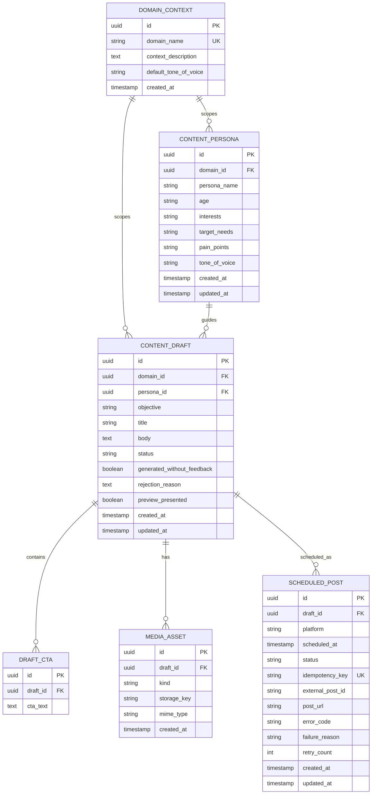
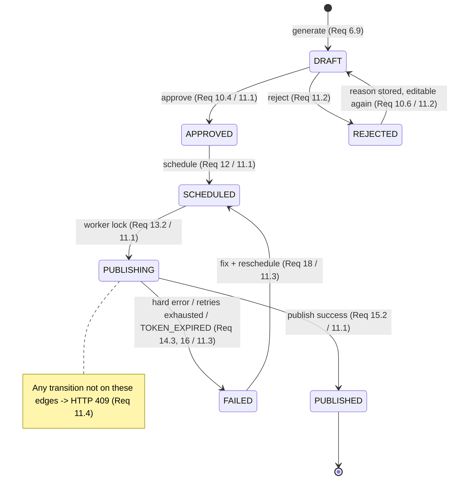
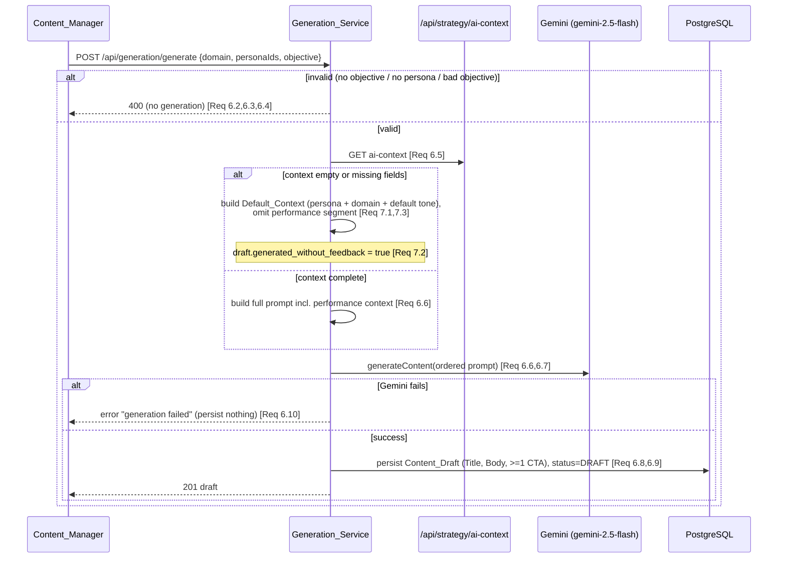
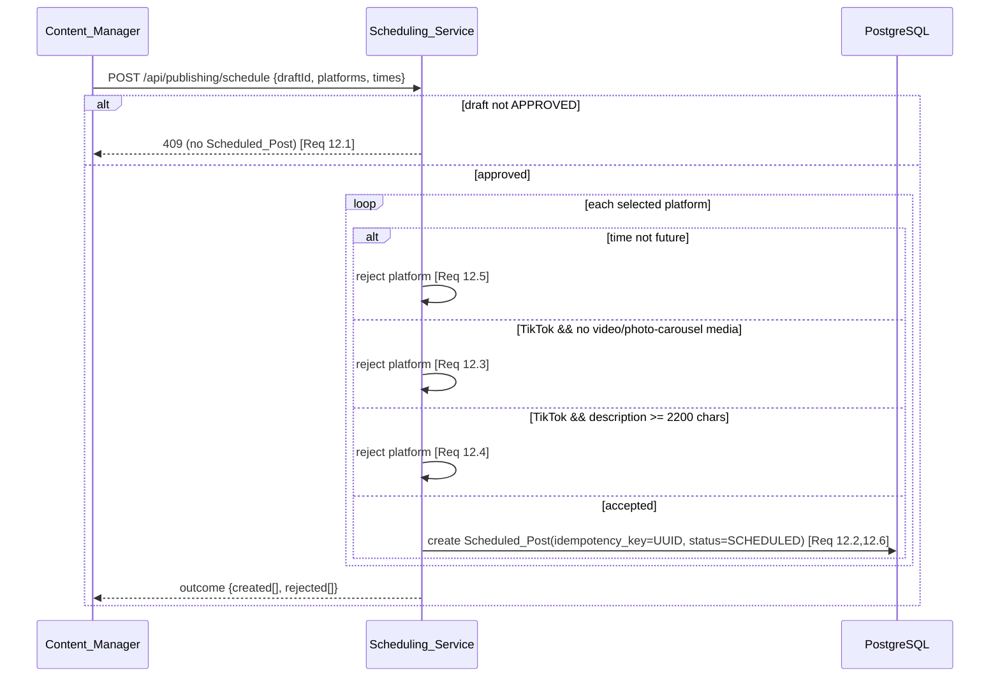

# Design Document: Content Pipeline

## Overview

The Content Pipeline module implements the full Phase 1 content lifecycle of AutoTGC: content strategy (personas + calendar), AI content generation and human review, and scheduled, automated publishing to Facebook, TikTok, and the Custom CMS Website. It is the second of four specs and is built **on top of** the Foundation & Deployment module — it consumes Foundation services rather than redefining them.

### Relationship to Foundation & Deployment

This module adds new domain logic and HTTP routes but reuses Foundation wholesale:

| Foundation capability | How Content Pipeline uses it |
|-----------------------|------------------------------|
| Authentication + RBAC middleware | Guards all `/api/strategy/*`, `/api/generation/*`, `/api/publishing/*`, `/api/media` routes; ADMIN-only, SALES → 403 (Req 19). |
| `PlatformAdapter` interface + `AdapterRegistry` | The Publishing_Worker resolves an adapter by platform and calls `publish()`; unsupported platform/op → 400 (Req 15, 13). |
| `Token_Manager` | Pre-publish token validity check + on-demand refresh (Req 14). |
| `Alert Dispatcher` | Token-expiry and publish-failure alerts to the ADMIN dashboard channel (Req 14, 16). |
| `Service_Account` (`background-worker`, `ai-system`) | The worker authenticates as `background-worker` when calling `/api/publishing/post` (Req 19.3); generation runs under `ai-system`. |
| `Secret_Store` | Gemini API key, media storage credentials, CMS/platform secrets (never in VCS). |
| REST conventions layer | Status-code set, pagination, CORS, central error handler (Req 9, 10, 12, 19). |
| Gemini foundation | `gemini-2.5-flash` access for persona recommendation and content generation (Req 3, 6, 7). |

The stack is unchanged from Foundation: **Node.js 20 LTS + TypeScript, Fastify, Prisma/PostgreSQL 16, ioredis/Redis, BullMQ, node-cron, PM2, jose, argon2id, fast-check.** New infrastructure introduced by this module: a **BullMQ publishing queue** (`publish-queue`) on the existing Redis instance, a **node-cron due-scan job**, and a **media object store** for user-supplied files.

### Scope

In scope (Phase 1): persona CRUD + AI recommendation, content calendar (views + drag-drop reschedule), text generation via Gemini with cold-start fallback, user-supplied media attach, draft management + review, the explicit content state machine, per-platform scheduling validation, the publishing worker with idempotency, retry/error classification, and failed-post recovery.

Out of scope: video production/editing (text + user-supplied media only, Req 8.1); analytics collection and the feedback loop that *produces* `AI_Prompt_Context` (this module only *reads* it); Phase 2+ platforms.

## Architecture

### Module Context — plugging into Foundation

```mermaid
graph TB
    subgraph FE[Frontend]
        CM[Content_Manager UI<br/>strategy / drafts / calendar / review]
    end

    subgraph Foundation["Foundation & Deployment (spec 1) — reused"]
        MW[Auth + RBAC Middleware]
        REG[AdapterRegistry + PlatformAdapter]
        TM[Token_Manager]
        ALERT[Alert Dispatcher]
        SVC[Service_Accounts<br/>ai-system / background-worker]
        SEC[Secret_Store]
        REST[REST conventions + error handler]
    end

    subgraph CP["Content Pipeline (this module)"]
        direction TB
        PM[Persona_Manager]
        CAL[Calendar_Manager]
        GEN[Generation_Service]
        MEDIA[Media_Service]
        DRAFT[Draft_Manager]
        REV[Review_Service]
        SM[Content_State_Machine]
        SCH[Scheduling_Service]
        WORK[Publishing_Worker<br/>node-cron scan + BullMQ]
    end

    subgraph Data[Datastores]
        PG[(PostgreSQL 16<br/>personas, drafts, scheduled_posts, media)]
        RD[(Redis<br/>BullMQ publish-queue + locks)]
        OBJ[(Media Object Store)]
    end

    subgraph Ext[External]
        GEM[Google Gemini<br/>gemini-2.5-flash]
        PLAT[Facebook / TikTok / Custom CMS]
        AICTX[/api/strategy/ai-context<br/>read model from Analytics]
    end

    CM -->|HTTPS| MW
    MW --> REST --> PM & CAL & GEN & MEDIA & DRAFT & REV & SCH
    PM --> GEM
    GEN --> GEM
    GEN --> AICTX
    REV --> SM
    SCH --> SM
    WORK --> SM
    PM & CAL & GEN & DRAFT & REV & SCH & WORK --> PG
    MEDIA --> OBJ
    MEDIA --> PG
    WORK --> RD
    WORK -->|resolve adapter| REG --> PLAT
    WORK -->|validity/refresh| TM
    WORK -->|TOKEN_EXPIRED / publish-fail| ALERT
    WORK -. authenticates as .-> SVC
    GEN -. runs as .-> SVC
    GEN & PM -. Gemini key .-> SEC
```

The module introduces no new edge/transport concerns: it lives entirely behind the Foundation HTTP layer and reuses its middleware, error envelope, and adapter/token services.

### Layering

Consistent with Foundation's three-domain split:

1. **HTTP layer (Fastify routers)** — the new routes listed in §Components, behind Foundation auth/RBAC. Stateless; JSON-schema validation for request bodies.
2. **Domain layer** — `Persona_Manager`, `Calendar_Manager`, `Generation_Service`, `Media_Service`, `Draft_Manager`, `Review_Service`, `Content_State_Machine`, `Scheduling_Service`, `Publishing_Worker`. Pure logic (validation, prompt assembly, transition guard, error classification) is isolated from I/O for testability.
3. **Infrastructure layer** — Prisma repositories, the BullMQ `publish-queue`, the node-cron due-scan job, the media object-store client, and outbound calls that go through Foundation's `AdapterRegistry` / `Token_Manager` / Gemini client.

### Endpoint map (from API_Catalog.md §3.1)

| Endpoint | Method | Component | Requirements |
|----------|--------|-----------|--------------|
| `/api/strategy/persona` | POST | Persona_Manager | 1 |
| `/api/strategy/persona/{id}` | PUT | Persona_Manager | 2 |
| `/api/strategy/persona/{id}/recommendations` | GET | Persona_Manager | 3 |
| `/api/strategy/calendar` | GET | Calendar_Manager | 4 |
| `/api/strategy/calendar/{scheduledPostId}/reschedule` | PUT | Calendar_Manager | 5 |
| `/api/strategy/ai-context` | GET (consumed) | Generation_Service | 6.5, 7 |
| `/api/generation/generate` | POST | Generation_Service | 6, 7 |
| `/api/media` | POST | Media_Service | 8 |
| `/api/generation/drafts` | GET | Draft_Manager | 9.1 |
| `/api/generation/drafts/{id}` | GET / PUT / DELETE | Draft_Manager | 9.2–9.6 |
| `/api/generation/drafts/{id}/review` | GET (preview) | Review_Service | 10.1 |
| `/api/generation/drafts/{id}/approve` | POST | Review_Service | 10.4 |
| `/api/generation/drafts/{id}/reject` | POST | Review_Service | 10.5, 10.6 |
| `/api/publishing/schedule` | POST | Scheduling_Service | 12 |
| `/api/publishing/post` | POST | Publishing_Worker | 13–17 |
| `/api/publishing/scheduled/{id}/retry` | POST | Scheduling_Service | 18 |

## Components and Interfaces

### Persona_Manager (Req 1, 2, 3)

Owns Content_Persona CRUD, validation, and AI recommendation.

```typescript
type ToneOfVoice = string; // free text, must be non-blank (Req 1.3)

interface PersonaAttributes {
  personaName: string;
  age: string;          // required (Req 1.4)
  interests: string[];
  targetNeeds: string;  // required (Req 1.4)
  painPoints: string;   // required (Req 1.4)
  toneOfVoice: ToneOfVoice;
}

interface PersonaInput extends PersonaAttributes { domainName: string; }

type ValidationResult =
  | { ok: true }
  | { ok: false; status: 400; message: string };

interface PersonaManager {
  validate(input: PersonaInput): ValidationResult;                  // Req 1.1–1.4, 2.2
  create(input: PersonaInput): Promise<ContentPersona>;             // Req 1.5
  update(id: string, attrs: Partial<PersonaInput>): Promise<ContentPersona>; // Req 2.1–2.3
  recommend(domainName: string): Promise<PersonaAttributes>;        // Req 3.1, 3.2 (no persist)
  confirmRecommendation(domainName: string, attrs: PersonaAttributes): Promise<ContentPersona>; // Req 3.3, 3.4
}
```

Key behaviors:
- **Validation gate (Req 1.2–1.4, 2.2):** reject with 400 (no persistence) when the domain name is blank, the tone-of-voice is blank, or any of age / target needs / pain points is missing. Whitespace-only counts as blank. The same gate runs for create and for edits to an existing persona.
- **Edit (Req 2.1):** if the target persona does not exist → 404, no modification, before validation.
- **AI recommendation (Req 3):** `recommend()` asks Gemini for proposed attributes and returns them **without persisting** (Req 3.2). The UI may accept/edit/reject. `confirmRecommendation()` runs the persona validation gate before persisting (Req 3.3, 3.4). Reject is a no-op (Req 3.5). A Gemini failure surfaces an error and leaves existing personas untouched (Req 3.6).

### Calendar_Manager (Req 4, 5)

```typescript
type CalendarView = 'month' | 'week' | 'day';
type StatusColor = string; // distinct per status

interface CalendarItem {
  kind: 'draft' | 'scheduled_post';
  status: ContentStatus;     // colored per Req 4.2
  platform?: Platform;       // shown for scheduled posts (Req 4.3)
  scheduledAt?: string;
}

interface CalendarManager {
  render(views: CalendarView[], now: Date): { view: CalendarView; items: CalendarItem[]; failed: CalendarView[] }[]; // Req 4.1
  colorFor(status: ContentStatus): StatusColor;     // injective over {SCHEDULED, PUBLISHED, DRAFT, FAILED} (Req 4.2)
  reschedule(scheduledPostId: string, newTime: Date, now: Date): Promise<RescheduleResult>; // Req 5
}

type RescheduleResult =
  | { ok: true; scheduledAt: string }
  | { ok: false; status: 400 | 409; message: string };
```

- **Views (Req 4.1):** month/week/day; if some views fail to load, return whichever succeeded (degrade gracefully).
- **Coloring (Req 4.2):** `colorFor` assigns a distinct color to each of SCHEDULED, PUBLISHED, DRAFT, FAILED. **Platform label (Req 4.3):** scheduled posts display Facebook/TikTok/Website.
- **Drag-drop reschedule (Req 5):** allowed only when the post status is SCHEDULED (Req 5.3) **and** the new time is strictly later than now (Req 5.1, 5.2); otherwise reject and leave the publish time unchanged. Reuses the `Content_State_Machine` future-time rule shared with `Scheduling_Service`.

### Generation_Service (Req 6, 7, 8.1)

Produces text-only Content_Drafts through Gemini.

```typescript
type Objective = 'Lead' | 'View' | 'Follow';

interface GenerateRequest {
  domainName: string;
  personaIds: string[];   // >= 1 (Req 6.1, 6.3)
  objective: Objective;   // required, enum (Req 6.2, 6.4)
  topicHint?: string;
}

interface AiPromptContext {  // read model from /api/strategy/ai-context (Req 6.5)
  topPerformingTopics: string[];
  bestCtaPatterns: string[];
  avoidTopics: string[];
  optimalLengthPerPlatform: Partial<Record<Platform, number>>;
}

interface PromptSegments {   // assembled in fixed order (Req 6.6)
  expertRole: string;
  domainContext: string;
  persona: string;
  toneOfVoice: string;
  objective: string;
  performanceContext?: string;   // omitted on cold start (Req 7.3)
  requiredCtaInstruction: string;
}

interface GenerationService {
  validate(req: GenerateRequest): ValidationResult;                 // Req 6.1–6.4
  buildPrompt(req: GenerateRequest, ctx: AiPromptContext | null): PromptSegments; // Req 6.6, 7.1, 7.3
  generate(req: GenerateRequest): Promise<ContentDraft>;            // Req 6.5–6.10, 7
}
```

- **Validation (Req 6.1–6.4):** require a domain, at least one defined persona, and an objective in {Lead, View, Follow}; otherwise 400, no generation.
- **Context load (Req 6.5):** read `AiPromptContext` from `/api/strategy/ai-context`.
- **Prompt order (Req 6.6):** `buildPrompt` emits segments strictly in the order expert role → domain context → persona → tone-of-voice → objective → performance context → required-CTA instruction (derived from `bestCtaPatterns`).
- **Model (Req 6.7):** Gemini `gemini-2.5-flash`.
- **Output (Req 6.8, 6.9):** on a Gemini response, produce a Content_Draft with Title, Body, and ≥1 CTA, persisted with status DRAFT.
- **Failure (Req 6.10):** a Gemini failure returns a "generation failed" error and persists nothing.
- **Cold start (Req 7):** if `AiPromptContext` is null/empty or missing any performance field, build from `Default_Context` (selected persona + domain context + default tone), omit the performance-context segment, still produce the required CTA, never fail for missing context, and mark the draft `generated_without_feedback`.

### Media_Service (Req 8)

```typescript
type MediaKind = 'image' | 'video' | 'photo_carousel';

interface MediaAsset {
  id: string;
  draftId: string;
  kind: MediaKind;
  storageKey: string;   // object-store key
  mimeType: string;
}

interface MediaService {
  attach(draftId: string, file: UploadedFile): Promise<MediaAsset>; // Req 8.2, 8.3
  listForDraft(draftId: string): Promise<MediaAsset[]>;
  isTikTokEligible(assets: MediaAsset[]): boolean; // video OR photo_carousel present (Req 12.3)
}
```

User-supplied images/videos are stored in the object store and a `MediaAsset` row links them to the draft. `isTikTokEligible` is the helper `Scheduling_Service` uses for the TikTok media gate.

### Draft_Manager (Req 9)

```typescript
interface DraftListItem { id: string; title: string; status: ContentStatus; }   // Req 9.1
interface DraftDetail { id: string; title: string; body: string; ctas: string[]; status: ContentStatus; }

interface DraftManager {
  list(page: number, limit: number): Promise<{ items: DraftListItem[]; total: number }>; // Req 9.1
  get(id: string): Promise<DraftDetail>;                       // Req 9.2
  edit(id: string, edits: Partial<{ title: string; body: string; ctas: string[] }>): Promise<DraftDetail>; // Req 9.3, 9.4
  requestDelete(id: string): Promise<{ confirmationRequired: true }>; // Req 9.5
  confirmDelete(id: string): Promise<void>;                    // Req 9.6
}
```

- **List/detail (Req 9.1, 9.2):** list returns Title + Status (paginated per REST conventions); detail returns Title, Body, CTA.
- **Edit guard (Req 9.3, 9.4):** edits persist only when status is DRAFT; editing a non-DRAFT draft → 409, unchanged.
- **Delete (Req 9.5, 9.6):** two-step — an explicit confirmation is required before the delete is performed.

### Review_Service (Req 10)

```typescript
interface ReviewService {
  preview(id: string): Promise<DraftDetail>;                   // Req 10.1 (marks preview presented)
  approve(id: string, ctx: ReviewContext): Promise<DraftDetail>; // Req 10.2, 10.3, 10.4
  reject(id: string, ctx: ReviewContext, reason: string): Promise<DraftDetail>; // Req 10.2, 10.3, 10.5, 10.6
}

interface ReviewContext { previewPresented: boolean; }
```

- **Preview gate (Req 10.1, 10.2):** approve/reject is rejected (no status change) unless a preview has been presented for that draft.
- **Status guard (Req 10.3):** approve/reject on a non-DRAFT draft → 409, no change.
- **Approve (Req 10.4):** DRAFT → APPROVED via the state machine.
- **Reject (Req 10.5, 10.6):** a missing/blank reason → 400, no change; with a reason, store the reason and return the draft to DRAFT (editable again). Modeled as the state-machine path DRAFT → REJECTED (reason recorded) → DRAFT.

### Content_State_Machine (Req 11)

A single explicit guarded transition function shared by Draft, Review, Scheduling, and Worker. It is the only place a `ContentStatus` is allowed to change.

```typescript
type ContentStatus =
  | 'DRAFT' | 'APPROVED' | 'SCHEDULED' | 'PUBLISHING'
  | 'PUBLISHED' | 'REJECTED' | 'FAILED';

const ALLOWED_TRANSITIONS: ReadonlyArray<readonly [ContentStatus, ContentStatus]> = [
  ['DRAFT', 'APPROVED'],      // Req 11.1
  ['APPROVED', 'SCHEDULED'],
  ['SCHEDULED', 'PUBLISHING'],
  ['PUBLISHING', 'PUBLISHED'],
  ['DRAFT', 'REJECTED'],      // Req 11.2
  ['REJECTED', 'DRAFT'],
  ['PUBLISHING', 'FAILED'],   // Req 11.3
  ['FAILED', 'SCHEDULED'],
];

type TransitionResult =
  | { ok: true; status: ContentStatus }
  | { ok: false; status: 409 };   // Req 11.4

function transition(current: ContentStatus, target: ContentStatus): TransitionResult;
```

Any `(current, target)` pair not in `ALLOWED_TRANSITIONS` is rejected with 409 and leaves the status unchanged (Req 11.4). The set is the single source of truth for the lifecycle diagram below.

### Scheduling_Service (Req 12, 18)

```typescript
interface ScheduleRequest {
  draftId: string;
  platforms: Platform[];
  scheduledAt: Record<Platform, Date>;  // per-platform publish time
}

interface ScheduleOutcome {
  created: ScheduledPost[];
  rejected: { platform: Platform; status: 400 | 409; message: string }[];
}

interface SchedulingService {
  schedule(req: ScheduleRequest, now: Date): Promise<ScheduleOutcome>;    // Req 12
  retryFailed(scheduledPostId: string, newTime: Date, now: Date): Promise<RescheduleResult>; // Req 18
}
```

- **Approved-only (Req 12.1):** if the draft is not APPROVED → 409, no Scheduled_Post.
- **Fan-out (Req 12.2):** one Scheduled_Post per (draft, platform) pair.
- **Per-platform gates (Req 12.3–12.5):** for each selected platform, evaluate independently — TikTok requires a video/photo-carousel media asset (else reject that platform), TikTok description length must be `< 2200` chars including hashtags (else reject that platform), and the publish time must be strictly future (else reject). A rejected platform creates no Scheduled_Post; other platforms still proceed.
- **Creation (Req 12.6):** each accepted Scheduled_Post gets a unique `Idempotency_Key` (UUID v4) and starts in SCHEDULED.
- **Failed recovery (Req 18):** `retryFailed` requires the post to be FAILED, the new time strictly future (Req 18.2), and the edited post to pass the Req 12.3–12.5 gates (Req 18.3); on success transitions FAILED → SCHEDULED with the new time (Req 18.1).

### Publishing_Worker (Req 13–17)

Two cooperating pieces on the existing Redis instance:

1. **Due-scan (node-cron):** periodically selects due posts and enqueues a BullMQ job per post.
2. **BullMQ worker (`publish-queue`):** processes each job — lock, token check, duplicate-prevention re-scan, publish, success/retry/fail. BullMQ provides `attempts: 4` (1 initial + 3 retries) with `backoff: { type: 'exponential' }`; the job lock plus the DB compare-and-set provide the idempotency lock.

```typescript
interface PublishingWorker {
  scanDue(now: Date): Promise<ScheduledPost[]>;        // Req 13.1
  tryLock(postId: string): Promise<boolean>;           // atomic SCHEDULED→PUBLISHING CAS (Req 13.2, 13.3)
  publish(postId: string): Promise<PublishOutcome>;    // Req 14–17
  classifyError(err: unknown): 'transient' | 'hard';   // Req 16.1, 16.3
}

type PublishOutcome =
  | { result: 'published'; externalPostId: string; url?: string } // Req 15.2, 15.3
  | { result: 'failed'; reason: 'TOKEN_EXPIRED' | string }         // Req 14.3, 16.2, 16.3
  | { result: 'retry'; attempt: number };                          // Req 16.1
```

- **Scan (Req 13.1):** select status = SCHEDULED and `scheduled_at <= now`.
- **Atomic lock (Req 13.2, 13.3):** `UPDATE scheduled_post SET status='PUBLISHING' WHERE id=? AND status='SCHEDULED'` (compare-and-set) combined with a BullMQ/Redis lock keyed by the post id. Only the winning process proceeds; a post already PUBLISHING or locked invokes no adapter operation.
- **Token check (Req 14):** call `Token_Manager.isValid(platform)` before the adapter; if invalid, request `Token_Manager.refresh(platform)`; if refresh fails, set FAILED with reason `TOKEN_EXPIRED`, raise an alert, and never call the adapter.
- **Duplicate-prevention re-scan (Req 17.1):** before publishing, if the post is PUBLISHING and an `external_post_id` already exists for its `Idempotency_Key`, set PUBLISHED using that id with no new request.
- **Publish (Req 15):** call `AdapterRegistry.get(platform).publish(req)` with the `Idempotency_Key` in the request; on success set PUBLISHED (even if storing the returned ids fails, Req 15.2) and store `external_post_id` + `post_url` when both are returned (Req 15.3).
- **Idempotent platform response (Req 17.2):** a publish carrying an `Idempotency_Key` already used for a success is treated as the original success (no additional external post).
- **Retry/classify (Req 16):** `Transient_Error` (network / 429 / 5xx) retries with exponential backoff up to 3 retries; after the 3rd, set FAILED + store error code + raise alert as one combined operation, and if any sub-action fails leave the status unchanged (Req 16.2). `Hard_Error` (4xx≠429 or policy violation) sets FAILED + store error + alert with no retry (Req 16.3).
- **Identity (Req 19.3):** the worker authenticates as the `background-worker` Service_Account when calling `/api/publishing/post`.

## Data Models

### Entity-Relationship Overview



### Domain_Context

| Field | Type | Notes |
|-------|------|-------|
| id | UUID (PK) | |
| domain_name | varchar, unique | Req 1.2 required/non-blank |
| context_description | text | input to AI generation (Req 6.6) |
| default_tone_of_voice | varchar | used by Default_Context (Req 7.1) |
| created_at | timestamptz | |

### Content_Persona (Req 1, 2)

| Field | Type | Notes |
|-------|------|-------|
| id | UUID (PK) | |
| domain_id | UUID (FK) | persona belongs to one Domain (Req 1.5) |
| persona_name | varchar | |
| age | varchar | required (Req 1.4) |
| interests | text | |
| target_needs | text | required (Req 1.4) |
| pain_points | text | required (Req 1.4) |
| tone_of_voice | varchar | required/non-blank (Req 1.3) |
| created_at / updated_at | timestamptz | |

### Content_Draft (Req 6, 7, 9, 10)

| Field | Type | Notes |
|-------|------|-------|
| id | UUID (PK) | |
| domain_id | UUID (FK) | |
| persona_id | UUID (FK) | |
| objective | enum('Lead','View','Follow') | Req 6.4 |
| title | text | Req 6.8 |
| body | text | Req 6.8 |
| status | enum(ContentStatus) | starts DRAFT (Req 6.9) |
| generated_without_feedback | boolean, default false | Req 7.2 |
| rejection_reason | text, null | Req 10.6 |
| preview_presented | boolean, default false | Req 10.1, 10.2 review gate |
| created_at / updated_at | timestamptz | |

`DRAFT_CTA` child rows hold the ≥1 CTA per draft (a `CHECK`/repository invariant enforces at least one CTA, Req 6.8).

### Media_Asset (Req 8)

| Field | Type | Notes |
|-------|------|-------|
| id | UUID (PK) | |
| draft_id | UUID (FK) | attached to one draft (Req 8.2) |
| kind | enum('image','video','photo_carousel') | Req 8.3; TikTok eligible iff video/photo_carousel (Req 12.3) |
| storage_key | varchar | object-store key (file bytes never in PostgreSQL) |
| mime_type | varchar | |
| created_at | timestamptz | |

### Scheduled_Post (Req 12, 13, 15, 16, 17)

| Field | Type | Notes |
|-------|------|-------|
| id | UUID (PK) | |
| draft_id | UUID (FK) | |
| platform | enum('facebook','tiktok','website') | Req 12.2 |
| scheduled_at | timestamptz | future at creation (Req 12.5) |
| status | enum(ContentStatus) | SCHEDULED at creation (Req 12.6) |
| idempotency_key | varchar, **unique** | per post; sent on publish (Req 12.6, 15.1, 17) |
| external_post_id | varchar, null | platform Post ID on success (Req 15.3, 17.1) |
| post_url | varchar, null | platform URL on success (Req 15.3) |
| error_code | varchar, null | Req 16.2, 16.3 |
| failure_reason | varchar, null | e.g. `TOKEN_EXPIRED` (Req 14.3) |
| retry_count | int, default 0 | transient retries used (Req 16.1) |
| created_at / updated_at | timestamptz | |

A **unique index on `(platform, idempotency_key)`** plus a partial unique index on `external_post_id` underpin duplicate-post prevention (Req 17): the DB rejects a second successful row for the same key/external id even if a worker re-runs after a lost update.

### AI_Prompt_Context (read model — not owned by this module)

Read-only DTO fetched from `/api/strategy/ai-context` (produced by the later Analytics/Feedback module). Shape: `{ topPerformingTopics: string[]; bestCtaPatterns: string[]; avoidTopics: string[]; optimalLengthPerPlatform: Record<Platform, number> }`. When empty or missing any field, `Generation_Service` falls back to `Default_Context` (Req 7).

## Content Status Lifecycle (Req 11)



## Key Sequence Flows

### AI Content Generation with cold-start branch (Req 6, 7)



### Scheduling (Req 12)



### Publishing Worker (Req 13–17)

```mermaid
sequenceDiagram
    participant CR as node-cron due-scan
    participant Q as BullMQ publish-queue
    participant W as Publishing_Worker
    participant DB as PostgreSQL
    participant TM as Token_Manager
    participant AD as PlatformAdapter
    participant AL as Alert Dispatcher
    CR->>DB: select SCHEDULED where scheduled_at <= now [Req 13.1]
    CR->>Q: enqueue job per due post
    Q->>W: process(postId)
    W->>DB: CAS UPDATE status SCHEDULED->PUBLISHING WHERE id AND status=SCHEDULED [Req 13.2]
    alt CAS lost / already PUBLISHING / locked
        W-->>Q: stop, no adapter call [Req 13.3]
    else lock acquired
        W->>DB: re-scan: external_post_id exists for idempotency_key? [Req 17.1]
        alt already published
            W->>DB: status=PUBLISHED using existing id (no new request) [Req 17.1]
        else not yet
            W->>TM: isValid(platform)? [Req 14.1]
            alt invalid
                W->>TM: refresh(platform) [Req 14.2]
                alt refresh fails
                    W->>DB: status=FAILED, reason=TOKEN_EXPIRED [Req 14.3]
                    W->>AL: alert (no adapter call) [Req 14.3]
                end
            end
            opt token ok
                W->>AD: publish(req with Idempotency_Key) [Req 15.1]
                alt success
                    W->>DB: status=PUBLISHED (+ external_post_id, url if returned) [Req 15.2,15.3]
                else transient (network/429/5xx)
                    alt retries < 3
                        W->>Q: retry exponential backoff [Req 16.1]
                    else retries exhausted
                        W->>DB: FAILED + error code (combined; unchanged if any step fails) [Req 16.2]
                        W->>AL: alert [Req 16.2]
                    end
                else hard error (4xx!=429 / policy)
                    W->>DB: FAILED + error code (no retry) [Req 16.3]
                    W->>AL: alert [Req 16.3]
                end
            end
        end
    end
```

## Gemini Prompt Assembly (Req 6.6, 7)

The prompt is concatenated from segments in a fixed order; the performance segment is the only optional one and is omitted on cold start.

```
1. [Expert role]              e.g. "You are an expert marketing copywriter for {domain}."
2. [Domain_Context]           Domain_Context.context_description
3. [Selected Content_Persona] name, age, interests, target needs, pain points
4. [Tone_Of_Voice]            persona.tone_of_voice (or Domain_Context.default_tone_of_voice on cold start)
5. [Objective]                Lead | View | Follow
6. [Performance Context]      top topics, best CTAs, avoid topics, optimal length per platform
                              — OMITTED when AI_Prompt_Context is empty/incomplete (Req 7.3)
7. [Required-CTA instruction] derived from best CTA patterns; on cold start a generic
                              "include at least one clear CTA" instruction (guarantees >=1 CTA, Req 6.8)
```

This order is implemented by `buildPrompt` and is asserted by Property 5. Segment 7 always present guarantees the ≥1-CTA output even with an empty context.

## Correctness Properties

*A property is a characteristic or behavior that should hold true across all valid executions of a system — essentially, a formal statement about what the system should do. Properties serve as the bridge between human-readable specifications and machine-verifiable correctness guarantees.*

These properties cover the input-varying logic of the module: persona/generation/scheduling validation, the content state machine, the publishing idempotency and retry logic, and the cold-start generation fallback. External calls (Gemini, Platform_Adapter, Token_Manager, object store) are mocked and time is injected so the properties are deterministic. UI rendering (calendar views, list/detail presentation), graceful view degradation, two-step delete confirmation, and pure wiring/identity criteria are validated by example, integration, or smoke tests in the Testing Strategy. The set has been de-duplicated via property reflection so each property carries unique validation value.

### Property 1: Persona validation gate

*For any* persona create or edit submission, the Persona_Manager accepts it if and only if the domain name is non-blank, the tone-of-voice is non-blank, and all three of age, target needs, and pain points are present (treating whitespace-only as blank); otherwise it rejects the submission with HTTP 400 and persists no change to any Content_Persona.

**Validates: Requirements 1.1, 1.2, 1.3, 1.4, 2.2, 3.3, 3.4**

### Property 2: Persona persistence round-trip

*For any* persona that passes the validation gate, creating it (or applying a valid edit) and then reading it back by its domain yields the same persona attributes (name, age, interests, target needs, pain points, tone-of-voice) associated with that domain.

**Validates: Requirements 1.5, 2.3**

### Property 3: AI recommendation never persists by itself

*For any* set of persona attributes proposed by Gemini, requesting a recommendation returns those attributes to the caller and leaves the set of stored Content_Personas unchanged; a Content_Persona is created only by an explicit confirmation, which re-applies the validation gate of Property 1.

**Validates: Requirements 3.2, 3.3, 3.4**

### Property 4: Reschedule validity (drag-and-drop)

*For any* Scheduled_Post and *any* requested new time, the Calendar_Manager updates the scheduled publish time if and only if the post's current status is SCHEDULED and the new time is strictly later than the current time; in every other case it rejects the change and leaves the scheduled publish time unchanged.

**Validates: Requirements 5.1, 5.2, 5.3**

### Property 5: Generation request validation

*For any* generation request, the Generation_Service proceeds to generate if and only if a domain is provided, at least one Content_Persona is selected, and the objective is one of {Lead, View, Follow}; otherwise it rejects with HTTP 400 and produces no Content_Draft.

**Validates: Requirements 6.1, 6.2, 6.3, 6.4**

### Property 6: Gemini prompt segment ordering

*For any* valid generation request and *any* AI_Prompt_Context, the prompt built by `buildPrompt` emits its segments in the strict order expert role → domain context → persona → tone-of-voice → objective → (optional performance context) → required-CTA instruction, with the required-CTA instruction always last; the performance-context segment is present if and only if the AI_Prompt_Context is complete.

**Validates: Requirements 6.6, 7.3**

### Property 7: Generation output shape

*For any* successful Gemini response, the persisted Content_Draft contains a non-empty Title, a non-empty Body, and at least one CTA, and its initial Content_Status is DRAFT.

**Validates: Requirements 6.8, 6.9, 8.1**

### Property 8: Cold-start generation fallback

*For any* AI_Prompt_Context that is empty or missing one or more performance fields, generation completes successfully using the Default_Context (selected persona + domain context + default tone), omits the performance-context segment, still yields at least one CTA, never fails because the context is unavailable, and marks the resulting Content_Draft `generated_without_feedback`; when the context is complete the draft is not so marked.

**Validates: Requirements 7.1, 7.2, 7.3**

### Property 9: Draft edit guard

*For any* Content_Draft and *any* edit to its Title, Body, or CTA, the edit is persisted if the draft's status is DRAFT and is otherwise rejected with HTTP 409 leaving the draft unchanged.

**Validates: Requirements 9.3, 9.4**

### Property 10: Review actions gated by preview and DRAFT status

*For any* Content_Draft, an approve or reject action changes the Content_Status only if a preview has been presented for that draft and the draft's status is DRAFT (a previewed DRAFT approve yields APPROVED); if no preview was presented the action is rejected with no status change, and if the status is not DRAFT the action is rejected with HTTP 409 with no status change.

**Validates: Requirements 10.1, 10.2, 10.3, 10.4**

### Property 11: Reject requires a reason and returns the draft to DRAFT

*For any* reject action on a previewed DRAFT, the action is rejected with HTTP 400 and no status change when the reason is blank or missing; when a non-blank reason is supplied, the reason is stored and the draft's Content_Status is set to DRAFT (editable again).

**Validates: Requirements 10.5, 10.6**

### Property 12: Content state-machine transition closure

*For any* pair of Content_Status values `(current, target)`, the state machine permits the transition if and only if the pair is one of DRAFT→APPROVED, APPROVED→SCHEDULED, SCHEDULED→PUBLISHING, PUBLISHING→PUBLISHED, DRAFT→REJECTED, REJECTED→DRAFT, PUBLISHING→FAILED, or FAILED→SCHEDULED; every other pair is rejected with HTTP 409 and leaves the status unchanged.

**Validates: Requirements 11.1, 11.2, 11.3, 11.4**

### Property 13: Scheduling validation per platform

*For any* schedule request, no Scheduled_Post is created for the request when the target draft's status is not APPROVED (HTTP 409); and for an approved draft, a Scheduled_Post is created for a selected platform if and only if the publish time is strictly future, and — when the platform is TikTok — the draft has an attached video or photo-carousel Media_Asset and the content description is strictly fewer than 2200 characters including hashtags; a platform failing any applicable gate yields no Scheduled_Post for that platform while other platforms are unaffected.

**Validates: Requirements 12.1, 12.3, 12.4, 12.5**

### Property 14: Scheduling fan-out and unique idempotency keys

*For any* approved draft scheduled to a set of platforms, the service produces exactly one outcome (created or rejected) per selected platform, every created Scheduled_Post starts in status SCHEDULED, and the Idempotency_Keys assigned across all created Scheduled_Posts are pairwise distinct.

**Validates: Requirements 12.2, 12.6**

### Property 15: Due-scan selection predicate

*For any* set of Scheduled_Posts and *any* reference time, the Publishing_Worker's due scan returns exactly those posts whose status is SCHEDULED and whose scheduled publish time is at or before the reference time.

**Validates: Requirements 13.1**

### Property 16: Exclusive idempotency lock before publishing

*For any* due Scheduled_Post and *any* number of concurrent worker processes attempting it, at most one process successfully performs the atomic SCHEDULED→PUBLISHING transition and acquires the lock; a process that does not win the lock, or that encounters a post already in PUBLISHING, invokes no Platform_Adapter operation for that post.

**Validates: Requirements 13.2, 13.3**

### Property 17: Token validation failure fails fast without publishing

*For any* Scheduled_Post whose Platform_Token is invalid and whose refresh fails, the Publishing_Worker sets the post's Content_Status to FAILED with reason TOKEN_EXPIRED, raises an alert to the Content_Manager, and never invokes the Platform_Adapter.

**Validates: Requirements 14.3**

### Property 18: Publish request carries the idempotency key

*For any* publish invocation the Publishing_Worker makes against a Platform_Adapter, the publish request includes the Idempotency_Key of the Scheduled_Post being published.

**Validates: Requirements 15.1**

### Property 19: Success recording

*For any* successful publish, the Publishing_Worker sets the Scheduled_Post's Content_Status to PUBLISHED even if persisting the returned identifiers fails; and when the adapter returns both an external Post identifier and a post URL, both are stored for that Scheduled_Post.

**Validates: Requirements 15.2, 15.3**

### Property 20: Retry and error classification

*For any* publish failure, a Transient_Error (network error, HTTP 429, or HTTP 5xx) is retried with exponential backoff up to a maximum of 3 retries — and once those retries are exhausted the post is set to FAILED with its error code stored and an alert raised as a single combined operation, leaving the status unchanged if any one of those sub-actions fails — whereas a Hard_Error (HTTP 4xx other than 429, or a content-policy violation) sets the post to FAILED with its error code stored and an alert raised, with no retry attempted.

**Validates: Requirements 16.1, 16.2, 16.3**

### Property 21: A draft × platform publishes at most once

*For any* sequence of worker runs over a Scheduled_Post — including re-scans after a lost database update and repeated submissions carrying an Idempotency_Key already used for a successful publish — the Platform_Adapter creates no more than one external post for that (draft, platform) pair: when an external Post identifier already exists for the post's Idempotency_Key the worker sets the status to PUBLISHED using that existing identifier without submitting a new publish request, and a re-submitted Idempotency_Key is treated as the original successful publish.

**Validates: Requirements 17.1, 17.2**

### Property 22: Failed-post recovery validity

*For any* reschedule request against a FAILED Scheduled_Post, the service transitions it to SCHEDULED with the new time if and only if the new time is strictly future and the edited post satisfies the scheduling gates of Requirement 12 criteria 3 through 5; otherwise it rejects the request and leaves the Content_Status unchanged.

**Validates: Requirements 18.1, 18.2, 18.3**

### Property 23: Calendar status colors are distinct

*For any* two distinct Content_Status values among {SCHEDULED, PUBLISHED, DRAFT, FAILED}, the Calendar_Manager assigns them different colors (the color mapping is injective over these four statuses).

**Validates: Requirements 4.2**

## Error Handling

The module reuses Foundation's centralized error envelope and status-code set; it introduces no new transport-level error machinery.

### Error Taxonomy (module-specific triggers)

| Error class | HTTP status | Trigger |
|-------------|-------------|---------|
| `ValidationError` | 400 | Blank domain/tone, missing persona fields (Req 1.2–1.4); missing/invalid objective or persona on generate (Req 6.2–6.4); reject without reason (Req 10.5); invalid/past schedule or reschedule time (Req 5.2, 12.5, 18.2); TikTok media/length violations (Req 12.3, 12.4) |
| `UnauthorizedError` | 401 | Missing/invalid Access_Token on a protected endpoint (Req 19.1, via Foundation) |
| `ForbiddenError` | 403 | SALES role on a Content Pipeline endpoint (Req 19.2, via Foundation) |
| `NotFoundError` | 404 | Edit/operation on a non-existent persona or draft (Req 2.1) |
| `ConflictError` | 409 | Edit of a non-DRAFT draft (Req 9.4); approve/reject of a non-DRAFT draft (Req 10.3); schedule of a non-APPROVED draft (Req 12.1); any disallowed state transition (Req 11.4) |
| `InternalError` | 500 | Gemini failure surfaced to caller with no persistence (Req 6.10, 3.6) |

### Handling Principles

- **Reject before mutate.** Every validation/guard failure (persona, generation, review, scheduling, transition) returns its status code with no persistence — asserted by Properties 1, 5, 9, 10, 11, 12, 13, 22.
- **Generation never fails on empty context.** Missing/partial `AI_Prompt_Context` degrades to `Default_Context` rather than erroring (Req 7.3, Property 8); only a Gemini call failure produces an error (Req 6.10).
- **Publishing fails fast on dead tokens.** An unrecoverable token is FAILED + alerted with no adapter call (Req 14.3, Property 17), avoiding blind retries.
- **Transient vs hard separation.** Only network/429/5xx are retried (≤3, exponential backoff); 4xx≠429 and policy violations fail immediately (Req 16, Property 20).
- **Atomic terminal failure.** Setting FAILED + storing the error code + raising the alert is one combined operation; partial failure leaves the status unchanged so the post is re-tried by a later scan rather than being stranded (Req 16.2).
- **Idempotency over duplicates.** A lost DB update after a successful external post is reconciled on the next scan via the external id / idempotency key, never by re-posting (Req 17, Property 21).

## Testing Strategy

### Dual Approach

- **Property-based tests** verify the 23 universal properties above across many generated inputs (validation gates, prompt ordering, cold-start, the state machine, scheduling, idempotency, retry classification).
- **Unit / example tests** cover concrete behaviors and failure paths that are not universal (AI recommendation request/discard/failure, media upload/attach, list/detail rendering, two-step delete, token-check ordering).
- **Integration / smoke tests** cover wiring that does not vary with input (route protection, worker identity, BullMQ/cron registration, calendar view rendering).

### Property-Based Testing

- **Library:** `fast-check` (TypeScript) with the Foundation test runner (Vitest/Jest). Do **not** hand-roll PBT.
- **Iterations:** each property test runs a **minimum of 100 generated cases**.
- **Tagging:** each property test carries a comment
  `// Feature: content-pipeline, Property {number}: {property_text}`
  and maps 1:1 to a property above.
- **Determinism / cost control:** Gemini, the Platform_Adapter, the Token_Manager, the Alert Dispatcher, and the media object store are **mocked**; an injected clock controls "now" for all time-validity and due-scan properties; PostgreSQL/Redis are exercised via in-memory repository fakes for property tests and real instances for integration tests.
- **Generators of note:** persona inputs with blank/whitespace and missing-field variants (P1); objective strings inside/outside the enum and persona-id arrays incl. empty (P5); prompt inputs with complete vs partial `AI_Prompt_Context` (P6, P8); arbitrary `(current, target)` status pairs over the 7-status space (P12); platform sets with TikTok media present/absent and descriptions around the 2200-char boundary (P13, P14); `(status, scheduled_at, now)` triples for due scan (P15); concurrent-attempt counts for the lock (P16); transient/hard error generators incl. 429 vs other-4xx vs 5xx vs network (P20); worker re-run sequences with injected lost-update / pre-existing external id (P21).

### Example / Edge-Case Unit Tests

- Edit a non-existent persona → 404 (Req 2.1); reject a recommendation → store unchanged (Req 3.5); Gemini recommendation failure → error, personas unchanged (Req 3.6).
- Gemini generation failure → error, no draft persisted (Req 6.10); model id passed is `gemini-2.5-flash` (Req 6.7).
- Media upload of image and of video → stored + attached to draft (Req 8.2, 8.3).
- Draft list returns Title + Status (Req 9.1); draft detail returns Title/Body/CTA (Req 9.2); delete requires confirmation then deletes (Req 9.5, 9.6).
- Token-check ordering: `isValid` is consulted and refresh requested before any adapter call (Req 14.1, 14.2).

### Integration Tests (1–3 representative cases each)

- Due-scan cron enqueues a BullMQ job per due post and the worker drives a real SCHEDULED→PUBLISHING→PUBLISHED run against a mocked adapter (Req 13–15).
- End-to-end TikTok scheduling rejects a text-only draft and accepts one with an attached video (Req 12.3).
- The unique `(platform, idempotency_key)` index rejects a duplicate successful row, backing the idempotency guarantee at the DB layer (Req 17).
- A SALES-authenticated request to a Content Pipeline endpoint is denied 403; a missing token is denied 401 (Req 19.1, 19.2).

### Smoke / Configuration Checks (single execution)

- Routes under `/api/strategy/*`, `/api/generation/*`, `/api/publishing/*`, `/api/media` are registered behind Foundation auth/RBAC as ADMIN-only (Req 19.1, 19.2).
- The Publishing_Worker authenticates as the `background-worker` Service_Account when calling `/api/publishing/post` (Req 19.3); the Generation_Service runs under `ai-system`.
- The calendar renders month/week/day views and returns the available subset when a view fails to load (Req 4.1); scheduled items show their platform label (Req 4.3).
- The `publish-queue` is configured with `attempts: 4` and exponential backoff (Req 16.1).

### Requirements Coverage Summary

| Requirement | Primary validation |
|-------------|--------------------|
| R1 Define persona | Properties 1, 2 |
| R2 Edit persona | Properties 1, 2; example (404) |
| R3 AI recommendation | Property 3; examples (reject, Gemini failure) |
| R4 View calendar | Property 23; smoke (views, platform label) |
| R5 Drag-drop reschedule | Property 4 |
| R6 Generate content | Properties 5, 6, 7; example (Gemini failure); smoke (model id) |
| R7 Cold-start fallback | Properties 6, 8 |
| R8 Attach media | Property 7 (text-only output); examples (upload image/video) |
| R9 Manage drafts | Property 9; examples (list/detail/delete) |
| R10 Approve/reject | Properties 10, 11 |
| R11 State lifecycle | Property 12 |
| R12 Scheduling flow | Properties 13, 14 |
| R13 Scan + lock | Properties 15, 16 |
| R14 Token validation | Property 17; examples (ordering, refresh request) |
| R15 Publish + success recording | Properties 18, 19 |
| R16 Retry + classification | Property 20 |
| R17 Duplicate prevention | Property 21; integration (DB unique index) |
| R18 Failed recovery | Property 22 |
| R19 Access control | Integration (403/401); smoke (route protection, worker identity) |
