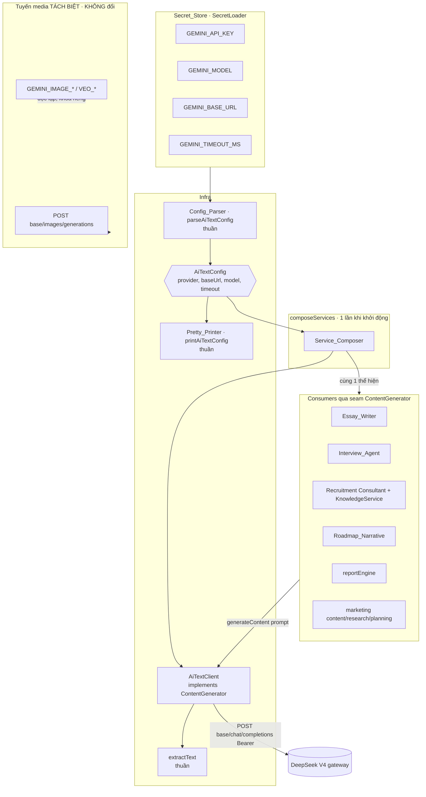
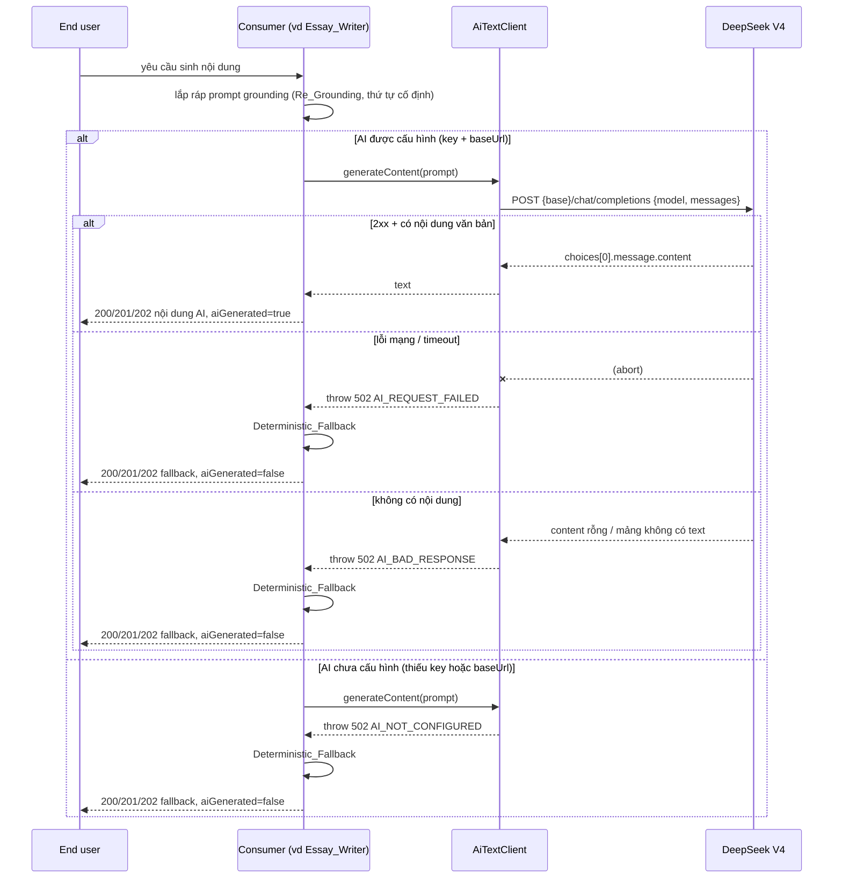

# Design Document — deepseek-v4-model-migration

## Overview

Tài liệu này thiết kế việc **chuyển nhà cung cấp sinh văn bản của AutoTGC sang DeepSeek V4** và **tái grounding** tri thức sẵn có cho model mới, theo các yêu cầu đã duyệt trong `requirements.md`.

Nguyên tắc nền tảng: **migration là thay đổi cấu hình sau seam, KHÔNG phải viết lại consumer.** Toàn bộ tích hợp AI sinh văn bản đã được tập trung trong một lớp client duy nhất `GeminiClient` (`src/infra/gemini.ts`) trỏ tới một cổng (gateway) **tương thích OpenAI ChatCompletions** (`Authorization: Bearer <key>`, `POST {baseUrl}/chat/completions`, thân `{model, messages:[...]}`, đọc `choices[0].message.content`). Vì DeepSeek V4 cũng tương thích OpenAI ChatCompletions, cấu trúc request hiện tại dùng được **chỉ với thay đổi base URL + model + key**. Mọi consumer AI phụ thuộc vào giao diện seam thuần `ContentGenerator { generateContent(prompt): Promise<string> }` (`src/strategy/personaService.ts`) mà `GeminiClient` thỏa mãn về cấu trúc, và việc lắp ráp diễn ra một lần ở `composeServices` (`src/infra/services.ts`).

Do đó thiết kế chọn cách tiếp cận **provider-neutral, ít xáo trộn nhất**:

1. **Giữ nguyên seam `ContentGenerator`** → KHÔNG điểm gọi consumer nào thay đổi (R1.4, R8.3).
2. **Tái cấu hình client qua env** (base URL + model + key + timeout trỏ tới DeepSeek) là con đường chính.
3. **Trích xuất logic cấu hình thuần** thành `Config_Parser` + `Pretty_Printer` (module mới `src/infra/aiTextConfig.ts`) để chuẩn hóa, kiểm chứng round-trip và che giấu bí mật, đồng thời đặt tên trung lập (`AiTextConfig`) cho lớp cấu hình — không ràng buộc vào một nhà cung cấp cụ thể.
4. **Đổi tên lớp client** `GeminiClient` → `AiTextClient` (giữ alias tương thích) để phản ánh tính trung lập nhà cung cấp, nhưng **không** đổi chữ ký phương thức.

Việc "huấn luyện lại model theo tri thức sẵn có" được hiện thực là **Re_Grounding** (lắp ráp đúng Knowledge_Base/persona/brand/analytics vào prompt theo thứ tự cố định) — **KHÔNG** fine-tuning trọng số (R5.7, ngoài phạm vi). Sinh **media** (ảnh/video) là tuyến tách biệt và **không bị ảnh hưởng** (R4). Mẫu **AI-OPTIONAL** (fallback xác định, `aiGenerated=false`, không ném 502 cho người dùng cuối) được **bảo toàn nguyên vẹn** (R3).

### Quyết định thiết kế chủ đạo và lý do

| Quyết định | Lựa chọn | Lý do |
|---|---|---|
| Cách migrate | Tái cấu hình client qua env + giữ seam | Request shape OpenAI-compatible đã chạy; thay đổi nhỏ nhất, không sửa consumer (R1.4, R8.3) |
| Provider-neutral | Đổi tên `GeminiClient`→`AiTextClient` (alias giữ lại) + `AiTextConfig` 4 thuộc tính | Phản ánh đúng "provider là cấu hình", tránh ngộ nhận khóa `GEMINI_*` chỉ dành cho Google |
| Khóa env | **Giữ nguyên** `GEMINI_API_KEY/MODEL/BASE_URL/TIMEOUT_MS` | Tránh thay đổi vận hành rủi ro; chỉ đổi **giá trị** trỏ sang DeepSeek; tài liệu `.env.example` giải thích rõ (R8) |
| Model mặc định | `deepseek-v4-flash` | Theo R2.2 |
| Logic thuần | `Config_Parser`, `Pretty_Printer`, `extractText` tách rời, export được | Để property-test trực tiếp với fast-check ≥100 ca (R7.1) |
| Re_Grounding | Thứ tự lắp ráp prompt cố định, degrade khi thiếu KnowledgeEntry | Đảm bảo xác định + tương đương tri thức bất kể nhà cung cấp (R5) |

## Architecture

### Bản đồ thay đổi (additive, sau seam)

| Phạm vi | Tệp | Thay đổi |
|---|---|---|
| Cấu hình AI text (thuần) | `src/infra/aiTextConfig.ts` (mới) | `parseAiTextConfig` (Config_Parser), `printAiTextConfig` (Pretty_Printer), hằng số mặc định |
| Client sinh văn bản | `src/infra/gemini.ts` → `src/infra/aiTextClient.ts` | Đổi tên `GeminiClient`→`AiTextClient` (giữ `export { AiTextClient as GeminiClient }`); tách `extractText` thành hàm thuần export được; nhận `AiTextConfig` |
| Lắp ráp dịch vụ | `src/infra/services.ts` | `composeServices` gọi `parseAiTextConfig(secrets)` rồi dựng `AiTextClient`; mặc định model `deepseek-v4-flash` |
| Tuyến media | `src/marketing/assets/providers/*`, `MediaService` | **KHÔNG đổi** — chỉ tài liệu khẳng định độc lập (R4) |
| Cấu hình mẫu | `autotgc-backend/.env.example` | Cập nhật mô tả khóa DeepSeek, không chứa giá trị bí mật (R2.9) |
| Runbook | `autotgc-backend/deploy/DEPLOY-RUNBOOK-deepseek-v4-migration.md` (mới) | Khóa cần đặt, bước xác minh, rollback (R8) |
| Consumer AI | `essays/`, `interviewprep/`, `recruitment/agent/`, `roadmap/`, `reporting/`, `marketing/` | **KHÔNG đổi điểm gọi**; chỉ bổ sung runtime guard cờ `aiGenerated` nếu cần (R3.3/3.4) |

### Sơ đồ thành phần



### Luồng AI-OPTIONAL (sequence) — bảo toàn sau migration



Điểm mấu chốt: lỗi 502 là **nội bộ** giữa `AiTextClient` và consumer; consumer **luôn** bắt và trả fallback, nên người dùng cuối không bao giờ thấy 502 vì lý do thiếu AI (R3.1, R3.8).

## Components and Interfaces

### 1. `AiTextConfig` + `Config_Parser` + `Pretty_Printer` (module mới `src/infra/aiTextConfig.ts`, thuần)

`Config_Parser` đọc cấu hình từ `Secret_Store` và tạo `AiTextConfig` chuẩn hóa gồm **đúng bốn thuộc tính** `{provider, baseUrl, model, timeout}`. `Pretty_Printer` in `AiTextConfig` ra biểu diễn văn bản **không chứa bí mật**, với round-trip parse→print→parse.

```typescript
/** Cấu hình AI sinh văn bản đã chuẩn hóa — ĐÚNG bốn thuộc tính (R6.1). */
export interface AiTextConfig {
  /** Nhãn nhà cung cấp trung lập, vd 'deepseek'. KHÔNG phải bí mật. */
  readonly provider: string;
  /** Base `/v1` của gateway, chuỗi không rỗng. KHÔNG phải bí mật. */
  readonly baseUrl: string;
  /** DeepSeek_Model_Id, chuỗi không rỗng. KHÔNG phải bí mật. */
  readonly model: string;
  /** Timeout (ms), số dương hữu hạn đã chuẩn hóa, >= ngưỡng tối thiểu. */
  readonly timeout: number;
}

/** Lỗi cấu hình chỉ rõ khóa nào sai — KHÔNG kèm giá trị bí mật (R6.5). */
export interface ConfigParseError {
  readonly ok: false;
  /** Tên khóa không hợp lệ, vd 'baseUrl' | 'model'. */
  readonly invalidKey: 'baseUrl' | 'model';
  readonly message: string;
}
export interface ConfigParseOk {
  readonly ok: true;
  readonly config: AiTextConfig;
}
export type ConfigParseResult = ConfigParseOk | ConfigParseError;

export const AI_TEXT_DEFAULT_MODEL = 'deepseek-v4-flash';   // R2.2
export const AI_TEXT_DEFAULT_TIMEOUT_MS = 20_000;           // R2.3, R6.4
export const AI_TEXT_MIN_TIMEOUT_MS = 100;                  // R2.3

/** Đầu vào thô (đã đọc từ SecretLoader, có thể undefined/rỗng). */
export interface RawAiTextConfig {
  provider?: string;
  baseUrl?: string;
  model?: string;
  /** Chuỗi thô từ env hoặc số; parser tự chuẩn hóa. */
  timeout?: string | number;
  /** apiKey KHÔNG thuộc AiTextConfig — chỉ dùng để gọi, không in/log (R6.2, R2.7). */
}

/**
 * Config_Parser (thuần). Chuẩn hóa timeout; mặc định model; từ chối baseUrl/model
 * rỗng. KHÔNG nhận/giữ apiKey trong AiTextConfig. (R2.1–2.3, R6.1, R6.4, R6.5)
 */
export function parseAiTextConfig(raw: RawAiTextConfig): ConfigParseResult;

/** Đọc trực tiếp từ SecretLoader (tiện ích cho composeServices). */
export function parseAiTextConfigFromSecrets(secrets: SecretLoader): ConfigParseResult;

/**
 * Pretty_Printer (thuần). In AiTextConfig thành text chuẩn hóa, ổn định, KHÔNG
 * chứa giá trị bí mật. Định dạng khóa=giá trị mỗi dòng để round-trip. (R6.2, R6.3)
 */
export function printAiTextConfig(config: AiTextConfig): string;

/** Đọc lại text do printAiTextConfig tạo → AiTextConfig (đối xứng round-trip). */
export function parsePrintedAiTextConfig(text: string): AiTextConfig;
```

Quy tắc chuẩn hóa timeout (dùng chung parser + client): `timeout` hợp lệ ⇔ là số hữu hạn, `> 0`, và `>= AI_TEXT_MIN_TIMEOUT_MS (100)`; ngược lại thay bằng `AI_TEXT_DEFAULT_TIMEOUT_MS (20000)` (R2.3, R6.4).

### 2. `AiTextClient` (đổi tên từ `GeminiClient`, `src/infra/aiTextClient.ts`)

Giữ nguyên giao diện `ContentGenerator` (R1.4). Tách `extractText` thành **hàm thuần export được** để property-test (R7.1). Giữ alias `GeminiClient` để các import hiện có không gãy.

```typescript
/** Hàm thuần bóc tách nội dung trợ lý từ OpenAI ChatCompletions shape.
 *  - content là chuỗi → trả nguyên chuỗi (R7.2)
 *  - content là mảng {type,text} → ghép các text theo thứ tự, bỏ phần không có
 *    text kiểu chuỗi, KHÔNG chèn ký tự phân tách (R1.3, R7.7)
 *  - rỗng / không có text / kết quả rỗng → undefined (R7.8 → caller ném AI_BAD_RESPONSE)
 */
export function extractText(body: unknown): string | undefined;

export class AiTextClient implements ContentGenerator {
  constructor(
    private readonly apiKey: string | undefined,
    private readonly config: AiTextConfig,      // provider, baseUrl, model, timeout
    httpClient?: HttpClient,                      // tiêm để test
  );

  /** R1.1, R1.2, R2.4/2.5, R3.6, R3.7, R7.2/7.7/7.8 */
  async generateContent(prompt: string): Promise<string>;
}

/** Alias tương thích ngược cho các import cũ. */
export { AiTextClient as GeminiClient };
```

Hành vi `generateContent`:

1. Nếu **thiếu apiKey** hoặc **thiếu baseUrl** → ném `AppError(502, 'AI_NOT_CONFIGURED')`, KHÔNG gọi mạng (R2.4, R2.5). (baseUrl rỗng đã bị `Config_Parser` chặn ở khởi động; guard runtime là phòng thủ tầng hai.)
2. Khi cả key + baseUrl có mặt → gọi `POST {baseUrl}/chat/completions` với `{model, messages:[{role:'user', content: prompt}]}`, header `Authorization: Bearer <key>`, `timeoutMs = config.timeout` (R1.1, R2.8).
3. Lỗi mạng/timeout (catch) hoặc `!res.ok` → `AppError(502, 'AI_REQUEST_FAILED')` (R3.6).
4. `extractText(res.body)` → nếu `undefined` → `AppError(502, 'AI_BAD_RESPONSE')` (R7.8); ngược lại trả chuỗi (R1.2, R7.2, R7.7).

### 3. `Service_Composer` (`composeServices`, `src/infra/services.ts`)

```typescript
const parsed = parseAiTextConfigFromSecrets(secrets);
if (!parsed.ok) {
  // R8.4: lắp ráp thất bại do cấu hình không hợp lệ → fail-fast toàn tiến trình
  throw new Error(`AI text config invalid: key "${parsed.invalidKey}" ${parsed.message}`);
}
const aiTextClient = new AiTextClient(secrets.optional('GEMINI_API_KEY'), parsed.config);
// cùng 1 thể hiện chia sẻ cho HTTP layer + scheduled jobs (R1.5)
```

`Config_Parser` áp mặc định model `deepseek-v4-flash` khi `GEMINI_MODEL` vắng (R2.2). Media render provider giữ nguyên `createMediaRenderProvider(secrets)` — đọc khóa riêng `GEMINI_IMAGE_*`/`VEO_*` (R4).

### 4. Consumers (seam `ContentGenerator`, KHÔNG đổi điểm gọi)

Tất cả consumer giữ nguyên cấu trúc Gemini-optional hiện tại (đã xác minh trong m��): bắt mọi lỗi từ `generateContent` và trả Deterministic_Fallback với `aiGenerated=false`.

| Consumer | Tệp | Fallback xác định |
|---|---|---|
| Essay_Writer | `essays/essayWriter.ts` | `buildStructuredDraft` |
| Interview_Agent | `interviewprep/interviewAgent.ts` | `questionBankFor` / `buildGroundedFeedback` |
| Recruitment Consultant | `recruitment/agent/consultantAgent.ts` | `buildGroundedAnswer` / `buildOutreachFallback` |
| Roadmap_Narrative | `roadmap/roadmapNarrative.ts` | `buildDeterministicNarrative` |
| reportEngine | `reporting/reportEngine.ts` + service | tổng hợp thuần |
| Marketing | `marketing/content|research|planning/*` | mẫu nội dung xác định |

**Runtime guard cờ `aiGenerated` (R3.3, R3.4):** bổ sung một helper thuần dùng chung để chuẩn hóa kết quả AI-optional, đảm bảo nếu một đầu ra đến từ nhánh fallback mà cờ lại là `true` thì **đặt lại** `false`:

```typescript
/** Bất biến AI-OPTIONAL: fallback ⇒ aiGenerated=false (R3.3, R3.4). */
export function enforceAiGeneratedFlag<T extends { aiGenerated: boolean }>(
  result: T,
  source: 'AI' | 'FALLBACK',
): T {
  if (source === 'FALLBACK' && result.aiGenerated) {
    return { ...result, aiGenerated: false };
  }
  return result;
}
```

### 5. Re_Grounding (lắp ráp prompt xác định)

Thứ tự lắp ráp prompt **cố định** cho mọi consumer grounding (R5.1, R5.2):

```
1. Knowledge_Base (KnowledgeEntry đang active, đã rank bởi KnowledgeService.search)
2. Persona (nếu có)
3. Brand knowledge (marketing/brandKnowledge.ts)
4. Analytics context (nếu có)
```

Các builder hiện có (`buildSystemPrompt`, `buildQuestionPrompt`, `buildEssayPrompt`, `buildNarrativePrompt`) đã phát segment theo thứ tự cố định và thuần → đáp ứng tính xác định. Re_Grounding **không phụ thuộc nhà cung cấp**: cùng đầu vào ⇒ cùng prompt ⇒ truyền cùng tập tri thức nền cho DeepSeek như đã truyền cho nhà cung cấp trước (R5.2).

Degrade nhẹ nhàng (R5.8): nếu `KnowledgeService.search` trả mảng rỗng hoặc lỗi truy hồi, builder vẫn lắp ráp từ phần ngữ cảnh còn lại (đúng như `buildSystemPrompt` đã in `[RetrievedKnowledge] Không tìm thấy...`) và tiếp tục theo AI-OPTIONAL thay vì lỗi cho người dùng cuối.

Review_Mode (R5.3–R5.5): mọi đầu ra AI vẫn đi qua state machine duyệt hiện có (`reportStateMachine`, `essayStateMachine`, oversight) — KHÔNG đầu ra nào (kể cả xác nhận đơn giản, kể cả tình huống khẩn cấp) bỏ qua phê duyệt của con người. Migration không thay đổi các state machine này.

## Data Models

Migration này **không thêm bảng/cột Prisma**. Các "data model" ở đây là cấu trúc trong bộ nhớ.

### `AiTextConfig` (chuẩn hóa, đúng 4 thuộc tính)

```typescript
interface AiTextConfig {
  provider: string;   // vd 'deepseek'
  baseUrl: string;    // gateway /v1 base, không rỗng
  model: string;      // 'deepseek-v4-flash' (mặc định) | 'deepseek-v4-pro' | id hợp lệ khác
  timeout: number;    // ms, đã chuẩn hóa: hữu hạn, >0, >=100; ngược lại 20000
}
```

### Khóa cấu hình (Secret_Store) — giữ tên, đổi giá trị

| Khóa | Bắt buộc để gọi AI? | Mặc định | Ghi chú |
|---|---|---|---|
| `GEMINI_API_KEY` | Có (thiếu ⇒ AI_NOT_CONFIGURED) | — | Bí mật; không in/log giá trị (R2.6, R2.7) |
| `GEMINI_BASE_URL` | Có (thiếu ⇒ AI_NOT_CONFIGURED) | — | Base `/v1` của gateway DeepSeek (R2.5, R6.5) |
| `GEMINI_MODEL` | Không | `deepseek-v4-flash` | R2.2 |
| `GEMINI_TIMEOUT_MS` | Không | `20000` | Chuẩn hóa theo R2.3 |

Khóa media (`GEMINI_IMAGE_*`, `VEO_*`) **không** được `Config_Parser` của AI text đọc (R4.1).

### Response shape của AI_Text_Provider (đầu vào `extractText`)

```typescript
// content dạng chuỗi (R7.2)
{ choices: [{ message: { content: "..." } }] }
// content dạng mảng phần (R1.3, R7.7)
{ choices: [{ message: { content: [{ type: 'text', text: 'a' }, { type:'x' }, { text:'b' }] } }] }
// → extractText ghép "ab" (bỏ phần không có text chuỗi, không chèn phân tách)
```

### Kết quả consumer AI-optional (bất biến cờ)

```typescript
interface AiOptionalResult {
  // các trường nội dung (content/text/questions/...) — non-empty từ fallback xác định
  aiGenerated: boolean; // true CHỈ khi text đến từ AI_Text_Provider; fallback ⇒ false
}
```

## Correctness Properties

*Một property (thuộc tính) là một đặc trưng hoặc hành vi phải luôn đúng trên mọi lần thực thi hợp lệ của hệ thống — về bản chất là một phát biểu hình thức về điều hệ thống phải làm. Properties là cầu nối giữa đặc tả con-người-đọc-được và các đảm bảo đúng đắn kiểm chứng-bằng-máy.*

Migration này có **lõi logic thuần rõ ràng** (`parseAiTextConfig`, `printAiTextConfig`, `extractText`, `enforceAiGeneratedFlag`, các prompt builder) với không gian đầu vào lớn (chuỗi, số, mảng phần, body tùy ý) và nhiều property phổ quát (round-trip, chuẩn hóa, bất biến, điều kiện lỗi). Do đó **PBT phù hợp** và được áp dụng cho các logic này. Các phần IaC/UI/CRUD/wiring/tài liệu được kiểm bằng unit/integration/smoke (xem Testing Strategy).

Mỗi property dưới đây được suy ra từ prework và sẽ được hiện thực bằng **một** property-based test fast-check (≥100 ca).

### Property 1: Config hợp lệ tạo đối tượng đúng bốn thuộc tính

*For any* bộ cấu hình thô hợp lệ (baseUrl là chuỗi không rỗng và model là chuỗi không rỗng), `parseAiTextConfig` trả về `ok:true` với một `AiTextConfig` có **đúng** tập khóa `{provider, baseUrl, model, timeout}` — không thừa, không thiếu thuộc tính.

**Validates: Requirements 6.1**

### Property 2: Chuẩn hóa timeout

*For any* giá trị timeout đầu vào (số hữu hạn dương, số âm, 0, NaN, Infinity, chuỗi số, chuỗi không phải số, hoặc vắng mặt), `timeout` trong `AiTextConfig` kết quả bằng giá trị đầu vào khi và chỉ khi nó là số hữu hạn `> 0` và `>= 100`; trong mọi trường hợp còn lại nó bằng `20000`.

**Validates: Requirements 2.3, 6.4**

### Property 3: Bóc tách nội dung — chuỗi và ghép mảng

*For any* body phản hồi mà `choices[0].message.content` là một chuỗi không rỗng, `extractText` trả về đúng chuỗi đó; *và for any* body mà `content` là một mảng các phần, `extractText` trả về kết quả ghép (theo đúng thứ tự xuất hiện, không chèn ký tự phân tách) của đúng các trường `text` có kiểu chuỗi không rỗng, bỏ qua mọi phần không có `text` kiểu chuỗi.

**Validates: Requirements 1.2, 1.3, 7.2, 7.7**

### Property 4: Guard thiếu cấu hình kết nối

*For any* prompt, khi apiKey vắng mặt/rỗng/chỉ-khoảng-trắng **hoặc** baseUrl rỗng, `generateContent` ném `AppError(502, AI_NOT_CONFIGURED)` và **không** gọi `HttpClient`; ngược lại, khi cả apiKey lẫn baseUrl đều không rỗng, `generateContent` gọi `HttpClient.post` đúng tới `{baseUrl}/chat/completions` và **không** rẽ vào nhánh `AI_NOT_CONFIGURED`.

**Validates: Requirements 2.4, 2.5, 2.8**

### Property 5: Phản hồi không có nội dung văn bản báo lỗi AI_BAD_RESPONSE

*For any* body phản hồi 2xx mà việc bóc tách không cho ra chuỗi không rỗng nào (content rỗng, mảng content không chứa phần `text` kiểu chuỗi, hoặc kết quả ghép là chuỗi rỗng), `generateContent` ném `AppError(502, AI_BAD_RESPONSE)`.

**Validates: Requirements 3.7, 7.8**

### Property 6: Lỗi mạng/timeout/không-ok báo lỗi AI_REQUEST_FAILED

*For any* `HttpClient` ném lỗi (mô phỏng lỗi mạng hoặc hủy do timeout) hoặc trả phản hồi có `ok=false`, `generateContent` ném `AppError(502, AI_REQUEST_FAILED)`.

**Validates: Requirements 3.6**

### Property 7: Không lộ bí mật trong đầu ra

*For any* `AiTextConfig`, *any* giá trị apiKey, và *any* prompt: (a) văn bản do `printAiTextConfig` tạo ra không chứa chuỗi con bằng giá trị apiKey; (b) thân JSON của yêu cầu gửi đi (messages/body) không chứa giá trị apiKey; (c) chuỗi prompt do các prompt builder lắp ráp không chứa giá trị apiKey.

**Validates: Requirements 2.6, 2.7, 5.6, 6.2**

### Property 8: Bất biến AI-OPTIONAL của consumer

*For any* consumer thuộc tập {Essay_Writer, Interview_Agent, Recruitment Consultant, Roadmap_Narrative, reportEngine, marketing content/research/planning} và *any* đầu vào hợp lệ: khi seam AI ném lỗi (bất kỳ trong `AI_NOT_CONFIGURED`/`AI_REQUEST_FAILED`/`AI_BAD_RESPONSE`), consumer trả Deterministic_Fallback có cùng tập trường cấp cao như đầu ra khi AI thành công, với các trường nội dung không rỗng và `aiGenerated = false`, và **không** để 502 lan tới người dùng cuối; khi seam AI trả văn bản không rỗng, consumer dùng văn bản đó với `aiGenerated = true`.

**Validates: Requirements 3.1, 3.2, 3.3, 3.8, 7.4**

### Property 9: Hàm guard cờ aiGenerated

*For any* kết quả và nguồn: `enforceAiGeneratedFlag(result, 'FALLBACK')` luôn cho `aiGenerated = false`; còn `enforceAiGeneratedFlag(result, 'AI')` giữ nguyên cờ ban đầu của `result`.

**Validates: Requirements 3.4**

### Property 10: Từ chối cấu hình không hợp lệ và chỉ rõ khóa sai

*For any* bộ cấu hình thô có baseUrl vắng/rỗng/chỉ-khoảng-trắng (tương ứng model), `parseAiTextConfig` trả `ok:false` với `invalidKey === 'baseUrl'` (tương ứng `'model'`) và **không bao giờ** trả về một đối tượng cấu hình thiếu thuộc tính.

**Validates: Requirements 6.5**

### Property 11: Round-trip in→đọc cấu hình

*For any* `AiTextConfig` hợp lệ `c`, `parsePrintedAiTextConfig(printAiTextConfig(c))` cho ra một đối tượng bằng đúng `c` trên cả bốn thuộc tính `{provider, baseUrl, model, timeout}`.

**Validates: Requirements 6.3**

### Property 12: Mặc định model

*For any* bộ cấu hình thô hợp lệ mà `model` vắng mặt, `AiTextConfig.model === 'deepseek-v4-flash'`; *for any* `model` là chuỗi không rỗng được cung cấp, `AiTextConfig.model` bằng đúng chuỗi đó.

**Validates: Requirements 2.2**

### Property 13: Thân yêu cầu mang model + messages không rỗng + prompt

*For any* prompt không rỗng và *any* model id được cấu hình, khi AI được cấu hình đầy đủ, thân yêu cầu gửi tới `{baseUrl}/chat/completions` có `model` bằng `AiTextConfig.model`, có `messages` là mảng không rỗng chứa prompt của consumer, và header `Authorization` bằng `Bearer <key>`.

**Validates: Requirements 1.1**

### Property 14: Prompt grounding xác định và độc lập nhà cung cấp

*For any* bộ đầu vào grounding (knowledge entries, persona, brand, analytics), gọi prompt builder hai lần cho cùng đầu vào tạo ra hai chuỗi prompt **bằng nhau**, và các đoạn (segment) xuất hiện theo thứ tự cố định (knowledge → persona → brand → analytics); chuỗi prompt này được `AiTextClient` truyền nguyên vẹn vào `messages` bất kể nhà cung cấp được cấu hình.

**Validates: Requirements 5.1, 5.2**

### Property 15: Mã trạng thái HTTP thuộc tập cho phép

*For any* tình huống lỗi của `AiTextClient`, `AppError.status` bằng `502` (thuộc tập cho phép); *for any* phản hồi thành công hoặc fallback của consumer, mã trạng thái thuộc `{200, 201, 202}`. Không mã nào nằm ngoài tập `{200,201,202,400,401,403,404,409,423,500,502}`.

**Validates: Requirements 7.3**

## Error Handling

Tầng lỗi tuân thủ quy ước `AppError` + envelope `{error:{code,message}}` và tập mã cho phép.

| Tình huống | Tầng phát hiện | Mã nội bộ | Người dùng cuối thấy |
|---|---|---|---|
| Thiếu apiKey hoặc baseUrl khi gọi | `AiTextClient.generateContent` | `502 AI_NOT_CONFIGURED` | 200/201/202 + fallback (`aiGenerated=false`) |
| Lỗi mạng / abort do timeout / `!res.ok` | `AiTextClient` (catch) | `502 AI_REQUEST_FAILED` | 200/201/202 + fallback |
| Phản hồi không có nội dung văn bản | `AiTextClient.extractText`→`undefined` | `502 AI_BAD_RESPONSE` | 200/201/202 + fallback |
| Cấu hình AI text không hợp lệ lúc khởi động (baseUrl/model rỗng) | `composeServices`/`parseAiTextConfig` | ném `Error` (fail-fast) | Tiến trình **không** khởi động (R8.4) |
| Thiếu bí mật bắt buộc lúc khởi động | `loadConfig`/`firstMissingSecret` | `MissingSecretError(name)` | Tiến trình dừng trước `listen`, log **chỉ tên** bí mật (R8.5) |
| Fallback xác định tự nó rỗng/không hợp lệ | consumer | được phép để nhánh fallback thất bại | KHÔNG phát fallback rỗng-mà-tuyên-bố-hợp-lệ (R7.6) |

Nguyên tắc:

- **502 là nội bộ.** Mọi consumer grounding **phải** bắt lỗi từ `generateContent` và rẽ fallback; người dùng cuối không bao giờ nhận 502 vì lý do thiếu AI (R3.1, R3.8).
- **Fail-fast khi khởi động** đối với cấu hình không hợp lệ và bí mật bắt buộc thiếu (R8.4, R8.5); KHÔNG khởi động một phần.
- **Không lộ bí mật trong thông điệp lỗi**: thông điệp lỗi cấu hình chỉ nêu **tên khóa** (`baseUrl`/`model`/tên secret), không nêu giá trị (R2.6, R6.5).
- **An toàn bộ nhớ**: `HttpClient` đã chặn body upstream quá lớn (10MB) → một gateway lỗi không làm cạn bộ nhớ (giữ nguyên hành vi hiện có).

## Testing Strategy

### Cách tiếp cận kép (unit + property)

- **Property tests (fast-check, ≥100 ca/property)** — phủ toàn bộ logic thuần bị tác động: `parseAiTextConfig` (P1, P2, P10, P11, P12), `printAiTextConfig` (P7, P11), `extractText` (P3, P5), `enforceAiGeneratedFlag` (P9), `AiTextClient.generateContent` qua mock `HttpClient` (P4, P5, P6, P7, P13, P15), prompt builder (P7, P14), và bất biến consumer (P8). Đây là yêu cầu **bắt buộc** R7.1 cho `Config_Parser`, `Pretty_Printer` và logic bóc tách nội dung.
- **Unit / example tests** — các ví dụ cụ thể và mặt bù: seam `ContentGenerator` assignable (1.4), `composeServices` chia sẻ một thể hiện (1.5), đọc khóa từ SecretLoader (2.1), AI thành công rồi mất kết nối → dùng text đã sinh (3.5), fail-fast khởi động (8.4, 8.5).
- **Integration tests (1–3 ví dụ)** — opt-in gọi nhà cung cấp thật khi có khóa trong môi trường (7.5); bỏ qua khi không có khóa.
- **Smoke tests** — `.env.example` chứa khóa với giá trị rỗng (2.9); `secret-scan` + không hardcode host/IP/khóa (8.2); media isolation wiring (4.1, 4.2); media-optional SPEC_READY (4.3, 4.4); runbook tồn tại & đủ mục (8.1, 8.6, 8.7); ghi chú fine-tuning ngoài phạm vi (5.7).
- **State-machine / Review_Mode tests** — không đầu ra nào bỏ qua phê duyệt (5.3, 5.4, 5.5) qua các state machine duyệt hiện có (không đổi bởi migration).

### Cấu hình & nhãn property test

- Thư viện: **fast-check** trên **Vitest** (đã có trong stack); KHÔNG tự cài đặt PBT từ đầu.
- Mỗi property test cấu hình tối thiểu `{ numRuns: 100 }` (R7.1).
- Mỗi property test gắn nhãn tham chiếu property trong design, định dạng:
  `// Feature: deepseek-v4-model-migration, Property {number}: {property_text}`
- Generators phủ edge case: chuỗi rỗng/khoảng-trắng/Unicode, timeout NaN/Infinity/âm/<100, mảng `content` có phần thiếu `text`/`text` không phải chuỗi, knowledge rỗng (R5.8), body không phải JSON object.

### Phân bổ test theo loại (tránh thừa unit test)

Property test gánh phần phủ đầu vào rộng; unit test chỉ giữ ví dụ minh họa, điểm tích hợp, và edge/error cụ thể. Không nhân bản một property thành nhiều unit test.

## Ánh xạ thiết kế → Requirements

| Mục thiết kế | Thành phần | Requirements |
|---|---|---|
| Provider-neutral, giữ seam | `AiTextClient` (alias `GeminiClient`), `ContentGenerator` | 1.4, 8.3 |
| Request shape DeepSeek | `generateContent` → `POST {base}/chat/completions` | 1.1, 1.2, 1.5 |
| Bóc tách nội dung | `extractText` (thuần) | 1.2, 1.3, 7.2, 7.7, 7.8, 3.7 |
| Config_Parser | `parseAiTextConfig` | 2.1, 2.2, 2.3, 6.1, 6.4, 6.5 |
| Pretty_Printer + round-trip | `printAiTextConfig`/`parsePrintedAiTextConfig` | 6.2, 6.3 |
| Guard cấu hình kết nối | `generateContent` guard | 2.4, 2.5, 2.8 |
| Bí mật & log | SecretLoader.redact, Pretty_Printer, prompt builders | 2.6, 2.7, 5.6 |
| .env.example | tệp cấu hình mẫu | 2.9 |
| AI-OPTIONAL preservation | consumers + `enforceAiGeneratedFlag` | 3.1–3.8, 7.4 |
| Lỗi client → fallback | `AppError` 502 mapping | 3.6, 3.7, 7.8 |
| Media isolation | `createMediaRenderProvider`, `MediaService` | 4.1, 4.2, 4.3, 4.4 |
| Re_Grounding | prompt builders thứ tự cố định | 5.1, 5.2, 5.8 |
| Review_Mode | state machines duyệt hiện có | 5.3, 5.4, 5.5 |
| Fine-tuning ngoài phạm vi | ghi chú design/runbook | 5.7 |
| HTTP status set | `AppError` + consumer response | 7.3, 15 |
| Kiểm thử PBT | fast-check ≥100 ca | 7.1, 7.5, 7.6 |
| Triển khai & fail-fast | `composeServices`, `loadConfig`, runbook | 8.1, 8.2, 8.3, 8.4, 8.5, 8.6, 8.7 |
