# Design Document: Foundation & Deployment

## Overview

The Foundation & Deployment module establishes the cross-cutting backbone of the AutoTGC platform: authentication and authorization, the extensible platform-integration layer, and the production deployment topology. Every later module (Content Strategy, Generation, Publishing, Analytics, Feedback Loop, Lead Management, Dashboard) consumes the services defined here.

This design covers **Phase 1** only — Facebook (Graph API), TikTok (Content Posting API), a Custom CMS, and Google Analytics 4 — but the adapter layer is deliberately structured so Phase 2+ platforms (Zalo OA, Instagram, YouTube) can be added by registering a new adapter, with no change to existing code paths.

### Goals

- Issue and manage JWT sessions (Access 24h / Refresh 30d) with server-side revocation and account lockout.
- Enforce authentication on every endpoint except a tightly scoped set of public endpoints, and enforce RBAC (ADMIN/SALES) plus internal service accounts.
- Provide a uniform `PlatformAdapter` interface and registry, and a `TokenManager` that stores platform credentials securely, refreshes them proactively, and raises alerts on expiry/pre-expiry/failure.
- Run the backend under a least-privilege OS user behind an Nginx reverse proxy with Let's Encrypt TLS, backed by PostgreSQL 16 and Redis, supervised by a process manager, with a scheduler and an automated, secret-safe deployment pipeline.

### Runtime Stack Decision

**Decision: Node.js 20 LTS + TypeScript.**

Requirement 15.1 permits Node.js 20 LTS *or* Python 3.11+; the design selects one. Rationale:

- **API-surface fit.** The platform is overwhelmingly an I/O-bound REST/webhook gateway (~54 Phase 1 endpoints orchestrating Facebook, TikTok, GA4, Gemini, and the Custom CMS). Node's non-blocking I/O model is a natural fit for high-fan-out outbound HTTP and concurrent webhook ingestion.
- **API Catalog alignment.** `API_Catalog.md` §8.2 lists Node.js 20 LTS first and pairs it with PM2 as the recommended process manager; the Custom CMS API (§2.3) and internal APIs share the JWT scheme, so a single TypeScript codebase covers both the CMS API and the AutoTGC core with shared auth middleware and types.
- **Type safety across the adapter layer.** TypeScript interfaces let the `PlatformAdapter` contract, token records, and JWT claims be expressed and checked at compile time, reducing integration drift as adapters multiply in later phases.
- **Ecosystem.** First-class SDKs/HTTP clients, `jsonwebtoken`/`jose` for JWT, `argon2`/`bcrypt` for hashing, `node-cron` (Req 17.1) for scheduling, BullMQ on Redis for queues, and `fast-check` for property-based testing.

Concrete component choices: **Fastify** (HTTP framework, native JSON schema validation for REST conventions), **Prisma** (PostgreSQL 16 access + migrations), **ioredis** (Redis client), **BullMQ** (job queue on Redis), **PM2** (process manager, Req 15.4–15.5), **node-cron** (Scheduler, Req 17.1), **argon2id** (password + service-account secret hashing), **jose** (JWT signing/verification).

## Architecture

### System Context

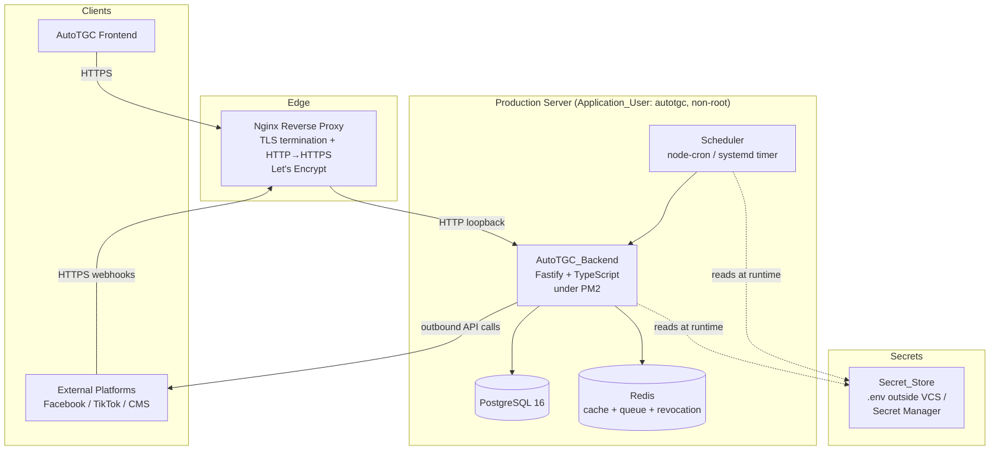

### Internal Component Architecture

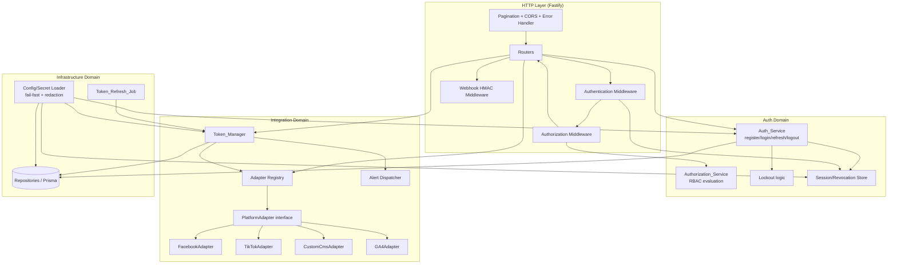

### Layering and Separation of Concerns

The backend is organized in three domains so transport, business logic, and integration evolve independently:

1. **HTTP layer** — Fastify routers + middleware (authentication, authorization, HMAC verification, pagination, CORS, central error handling). Stateless; translates HTTP to domain calls.
2. **Domain layer** — `Auth_Service`, `Authorization_Service`, `Token_Manager`, adapter registry. Pure logic where possible to maximize testability.
3. **Infrastructure layer** — Config/secret loader, Prisma repositories (PostgreSQL), Redis client, scheduler/jobs, outbound platform HTTP clients (inside adapters).

### Request Lifecycle (protected endpoint)

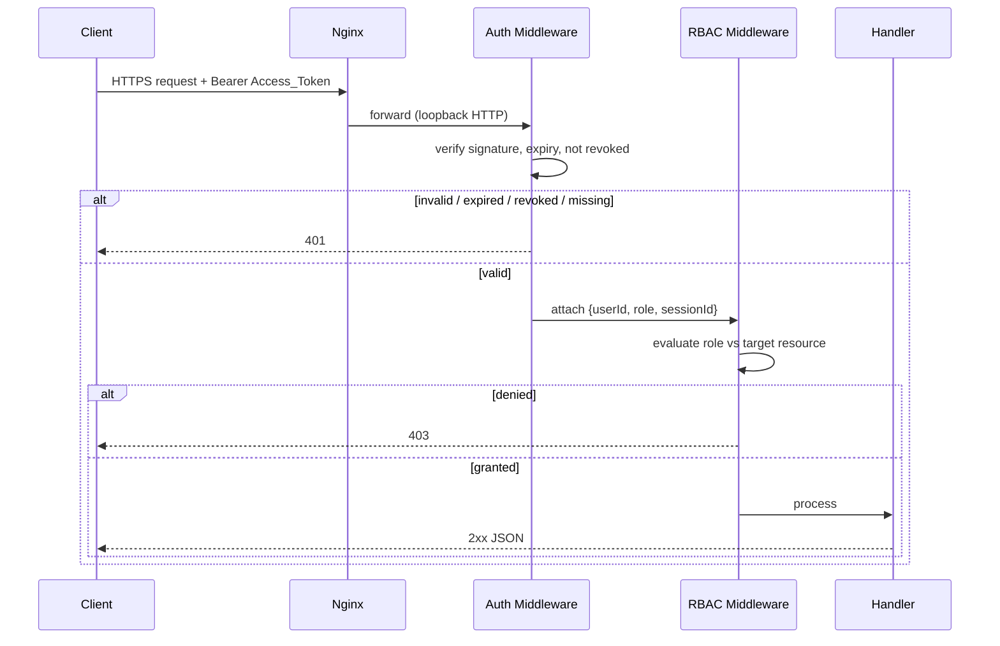

## Components and Interfaces

### Auth_Service (Req 1, 2, 3, 4, 5, 8)

Responsible for the JWT session lifecycle.

```typescript
interface RegisterInput {
  username: string;
  email: string;
  password: string;
  passwordConfirmation: string;
}

interface TokenPair {
  accessToken: string;   // JWT, exp = now + 24h
  refreshToken: string;  // JWT, exp = now + 30d
}

interface AuthService {
  register(input: RegisterInput): Promise<{ user: UserAccount; tokens: TokenPair }>; // Req 1
  login(username: string, password: string): Promise<TokenPair>;                     // Req 2, 3
  refresh(refreshToken: string): Promise<{ accessToken: string }>;                   // Req 4
  logout(accessToken: string): Promise<void>;                                        // Req 5
}
```

Key behaviors:
- **Validation order (register):** email → password length → password match → username validity → username uniqueness, each returning the specific status code from Req 1.2–1.6 before any persistence (Req 1.7). New accounts default to ADMIN (Req 1.8) and immediately receive a token pair (Req 1.9).
- **Login:** verifies the account is not locked *before* checking the password (Req 3.2); on wrong password for an existing account, increments the consecutive-failure counter (Req 2.4) and locks at 5 (Req 3.1, 3.3); unknown username returns 401 without touching any counter (Req 2.5); success resets the counter to zero (Req 2.7) and embeds `{userId, role}` claims (Req 2.8). Empty username/password → 400 (Req 2.6).
- **Refresh:** validates structure, expiry, and revocation (Req 4.1, 4.3–4.5); new Access_Token carries the same `{userId, role}` as the session (Req 4.2).
- **Logout:** invalidates the whole JWT_Session so both the Access and Refresh tokens stop working (Req 5).

### Password & Credential Hashing (Req 1.7, 8.6)

`argon2id` (preferred; `bcrypt` acceptable fallback) hashes user passwords and service-account secrets. Plaintext is never stored or logged. Hash parameters live in config; verification is constant-time via the library.

### Session / Revocation Store (Req 4, 5, 7)

JWTs are stateless, so revocation requires server-side state. Each issued session has a `sessionId` (`jti` family) embedded in both tokens. Revocation state is kept in **Redis** (fast path on every request) with a **PostgreSQL** `jwt_session` table as the durable record of truth.

```typescript
interface SessionStore {
  create(session: JwtSession): Promise<void>;
  isRevoked(sessionId: string): Promise<boolean>;
  revoke(sessionId: string): Promise<void>;
}
```

- On login/register, a session record is created (status ACTIVE).
- On logout (Req 5.1) or admin revocation, the session is marked REVOKED in Redis (TTL = remaining refresh lifetime) and PostgreSQL.
- Authentication middleware rejects any token whose `sessionId` is revoked (Req 5.2, 5.3, 7.5).

### Authorization_Service (Req 6)

Pure function evaluating a role against a target resource descriptor.

```typescript
type Role = 'ADMIN' | 'SALES';
type Action = 'read' | 'create' | 'update' | 'delete' | 'status_update';
type Module =
  | 'strategy' | 'generation' | 'publishing' | 'analytics'
  | 'feedback' | 'lead_management' | 'settings' | 'dashboard';

interface ResourceTarget {
  module: Module;
  action: Action;
  ownerUserId?: string; // for assignable resources (leads)
}

interface AuthorizationService {
  authorize(ctx: { userId: string; role: Role }, target: ResourceTarget): AuthzDecision;
}
type AuthzDecision = { allowed: true } | { allowed: false; status: 403 };
```

Policy table (Req 6.1–6.8):

| Role | strategy/generation/publishing/analytics/feedback/settings | lead_management | dashboard |
|------|------------------------------------------------------------|-----------------|-----------|
| ADMIN | read + write | read + write | read + write |
| SALES | **403** | read + status_update **only for assigned leads** (else 403) | **read-only** (write → 403) |

Evaluation always runs before the handler executes (Req 6.6); a denial leaves the resource unmodified (Req 6.5, 6.7, 6.8).

### Service Accounts (Req 8)

Non-interactive identities for the **AI System** and the **Background Worker**. Each has a credential stored in the Secret_Store (Req 8.6) and a fixed permission set.

```typescript
interface ServiceAccount {
  id: string;
  name: 'ai-system' | 'background-worker';
  permissions: ResourceTarget[]; // closed allow-list
  credentialHash: string;        // argon2id of the issued secret
}
```

- Interactive login targeting a service account → 403 (Req 8.2).
- Valid credential grants only its permission set (Req 8.3); out-of-set operation → 403 (Req 8.4).
- Invalid/expired credential → 401, no token issued (Req 8.5).

### PlatformAdapter Interface & Registry (Req 9)

The extensibility cornerstone. Every platform integration implements one interface; the registry maps a platform identifier to an adapter instance.

```typescript
type PlatformId = 'facebook' | 'tiktok' | 'custom_cms' | 'ga4'; // extensible: 'zalo' | 'instagram' | 'youtube'
type Capability = 'publish' | 'analytics';

interface PublishRequest { /* normalized content payload */ }
interface PublishResult { externalId: string; url?: string; raw: unknown; }
interface AnalyticsQuery { /* normalized metric/date selectors */ }
interface AnalyticsResult { metrics: Record<string, number>; raw: unknown; }

interface PlatformAdapter {
  readonly platform: PlatformId;
  readonly capabilities: ReadonlySet<Capability>;
  supports(cap: Capability): boolean;
  publish(req: PublishRequest): Promise<PublishResult>;     // throws UnsupportedOperationError if no 'publish'
  collectAnalytics(q: AnalyticsQuery): Promise<AnalyticsResult>; // throws if no 'analytics'
}

interface AdapterRegistry {
  register(adapter: PlatformAdapter): void;             // Req 9.3 — add without touching others
  get(platform: string): PlatformAdapter;               // throws UnsupportedPlatformError (→400) if absent (Req 9.4)
  has(platform: string): boolean;
  list(): PlatformId[];
}
```

Phase 1 capability matrix (Req 9.2, from API Catalog §5):

| Adapter | publish | analytics |
|---------|---------|-----------|
| FacebookAdapter | ✅ Graph API `/{page-id}/feed`,`/photos`,`/videos` | ✅ `/{post-id}/insights` |
| TikTokAdapter | ✅ `/post/publish/...` | ✅ `/video/query/` |
| CustomCmsAdapter | ✅ `/cms/posts` | ✅ `/cms/posts/{id}/analytics` |
| GA4Adapter | ❌ (→ 400 unsupported operation, Req 9.5) | ✅ `:runReport` |

Routing rules:
- Unknown platform → `UnsupportedPlatformError` → HTTP 400 with the offending identifier when expressible (Req 9.4).
- Known platform, unimplemented capability (e.g., GA4 publish) → `UnsupportedOperationError` → HTTP 400 (Req 9.5).
- New adapter registration is purely additive: the registry is a map keyed by `platform`, so adding `zalo` cannot alter `facebook` routing (Req 9.3).

### Token_Manager (Req 10, 11, 12)

Owns the lifecycle of `Platform_Token`s.

```typescript
type TokenType = 'access_token' | 'refresh_token' | 'api_key' | 'service_account';

interface PlatformTokenRecord {
  platform: PlatformId;
  type: TokenType;
  // secret VALUE is stored in Secret_Store, never in this metadata record
  expiresAt: string | null;   // ISO 8601, or null = non-expiring (Req 10.4)
  refreshWindowSeconds: number; // > job interval (Req 11.2)
  status: 'VALID' | 'INVALID' | 'EXPIRED';
  lastRefreshFailureReason?: string;
}

interface PlatformTokenPublicView { // Req 10.3 — no secret value
  platform: PlatformId;
  type: TokenType;
  expiresAt: string | null;
  valid: boolean;
}

interface TokenManager {
  register(platform: PlatformId, type: TokenType, value: string, expiresAt: string | null): Promise<void>; // Req 10.1, 10.2
  listPublic(): Promise<PlatformTokenPublicView[]>;     // Req 10.3 (GET /api/platform-tokens)
  isValid(platform: PlatformId): Promise<boolean>;       // Req 10.5
  refresh(platform: PlatformId): Promise<PlatformTokenPublicView>; // Req 11.5 (POST .../{platform}/refresh)
  runRefreshCycle(now: Date): Promise<RefreshCycleReport>;         // Req 11.1–11.4, 11.6, 11.7
}
```

Key behaviors:
- **Storage split:** metadata (platform, type, expiry, status) lives in PostgreSQL; the secret *value* lives only in the Secret_Store (Req 10.2). The public view never includes the value (Req 10.3).
- **Validity:** valid iff a value is present AND (non-expiring OR `expiresAt` in the future) (Req 10.5).
- **Refresh window selection:** the job selects tokens whose `expiresAt` falls within `refreshWindowSeconds`, where that window is strictly larger than the job interval (Req 11.2) so a token is always caught before expiry.
- **Per-platform refresh rules:** Facebook long-lived token exchange → new expiry = now + 60 days (Req 11.3); TikTok access token via refresh token → new expiry = now + 24 hours (Req 11.4).
- **Failure handling:** a failed refresh retains the old token and records the reason (Req 11.6); non-expiring tokens are skipped (Req 11.7).

### Alert Dispatcher (Req 12)

```typescript
type AlertKind = 'EXPIRY' | 'PRE_EXPIRY_WARNING' | 'REFRESH_FAILURE';
interface PlatformAlert { kind: AlertKind; platform: PlatformId; reason?: string; raisedAt: string; }

interface AlertDispatcher {
  raise(alert: PlatformAlert): Promise<void>; // delivers to ADMIN Dashboard notifications (Req 12.3)
}
```

- Token expiry raises an EXPIRY alert immediately, even if a later refresh succeeds (Req 12.1).
- Refresh failure raises a REFRESH_FAILURE alert with the reason (Req 12.2).
- A token entering its refresh window without a yet-successful refresh raises a PRE_EXPIRY_WARNING (Req 12.4).
- All alerts route to the Dashboard notifications channel for ADMIN (`/api/dashboard/notifications`, Req 12.3).

### Config / Secret Loader (Req 13)

```typescript
interface SecretLoader {
  require(name: string): string;       // throws MissingSecretError (logs name only) — fail-fast (Req 13.3)
  optional(name: string): string | undefined;
  redact(text: string): string;        // masks known secret values in any log line (Req 13.4)
}
```

- All secrets read from the Secret_Store at runtime (Req 13.1); none in source/VCS, including server host and root account (Req 13.2).
- Startup validates the full required-secret set; the first missing one aborts boot, logging only its name (Req 13.3).
- A logging serializer passes every message/field through `redact()` so secret values never reach log output (Req 13.4).

### Webhook HMAC Middleware (Req 20)

```typescript
interface WebhookVerifier {
  verify(source: string, rawBody: Buffer, signatureHeader: string): boolean; // constant-time HMAC compare
}
```

- For every webhook request, the raw body is HMAC-verified against the per-source shared secret from the Secret_Store (Req 20.1, 20.4) **before** body parsing.
- Failed verification → 401, body never processed (Req 20.2).
- Passed verification → process body, respond 2xx (Req 20.3).

### REST Conventions Layer (Req 19)

- Central response envelope and error handler restrict status codes to {200,201,202,400,401,403,404,409,423,500,502} (Req 19.1).
- Paginated collection routes accept `page` and `limit` and return `total` (Req 19.2).
- CORS plugin permits the configured frontend origin (Req 19.3).
- Unknown resource → 404 (Req 19.4).

## Data Models

### Entity-Relationship Overview

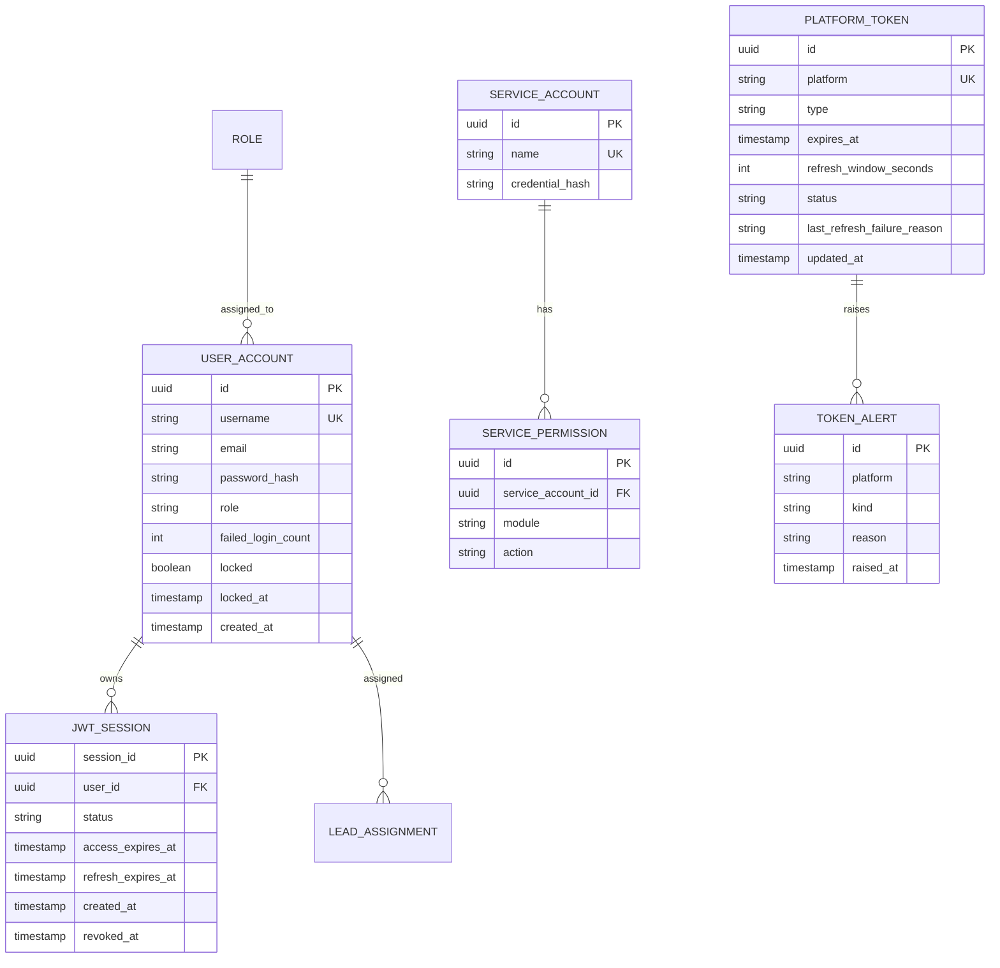

### User_Account (Req 1, 2, 3)

| Field | Type | Notes |
|-------|------|-------|
| id | UUID (PK) | |
| username | varchar(50), unique | Req 1.5 length cap, Req 1.6 uniqueness |
| email | varchar(254) | Req 1.2 format/length |
| password_hash | text | argon2id; plaintext never stored (Req 1.7) |
| role | enum('ADMIN','SALES') | default 'ADMIN' on registration (Req 1.8) |
| failed_login_count | int, default 0 | Req 2.4, 2.7, 3.1 |
| locked | boolean, default false | Req 3.1, 3.2 |
| locked_at | timestamptz, null | Req 3.3 |
| created_at | timestamptz | |

### Role / Permissions (Req 6)

Phase 1 roles are a fixed enum (ADMIN, SALES). The RBAC policy is encoded as a static policy table in `Authorization_Service` rather than persisted rows, since the role set is closed in Phase 1 (Req 6.1). Lead ownership uses a `LEAD_ASSIGNMENT(user_id, lead_id)` relation consulted for SALES access checks (Req 6.3, 6.7). (The leads table itself is owned by the Lead Management module; only the assignment lookup is referenced here.)

### JWT_Session / Revocation Store (Req 4, 5, 7)

| Field | Type | Notes |
|-------|------|-------|
| session_id | UUID (PK) | embedded in both tokens as `sid` claim |
| user_id | UUID (FK) | |
| status | enum('ACTIVE','REVOKED') | Req 5 |
| access_expires_at | timestamptz | now + 24h (Req 2.2) |
| refresh_expires_at | timestamptz | now + 30d (Req 2.3) |
| created_at | timestamptz | |
| revoked_at | timestamptz, null | set on logout/revocation |

Redis mirror: key `session:revoked:{session_id}` with TTL = remaining refresh lifetime, for O(1) revocation checks on every request.

**JWT claims:**
```json
{ "sub": "<userId>", "role": "ADMIN|SALES", "sid": "<sessionId>", "typ": "access|refresh", "iat": 0, "exp": 0 }
```

### Platform_Token (Req 10, 11, 12)

| Field | Type | Notes |
|-------|------|-------|
| id | UUID (PK) | |
| platform | varchar, unique | one current token record per platform |
| type | enum('access_token','refresh_token','api_key','service_account') | Req 10.1 |
| expires_at | timestamptz, null | null = non-expiring (Req 10.4) |
| refresh_window_seconds | int | > job interval (Req 11.2) |
| status | enum('VALID','INVALID','EXPIRED') | derived per Req 10.5 |
| last_refresh_failure_reason | text, null | Req 11.6 |
| updated_at | timestamptz | |

**Secret value** for each token is stored in the Secret_Store keyed by platform (e.g., `PLATFORM_TOKEN_FACEBOOK`), never in this table (Req 10.2).

### TokenAlert (Req 12)

| Field | Type | Notes |
|-------|------|-------|
| id | UUID (PK) | |
| platform | varchar | affected platform |
| kind | enum('EXPIRY','PRE_EXPIRY_WARNING','REFRESH_FAILURE') | Req 12.1, 12.2, 12.4 |
| reason | text, null | failure reason (Req 12.2) |
| raised_at | timestamptz | |

## Key Sequence Flows

### Login (Req 2, 3)

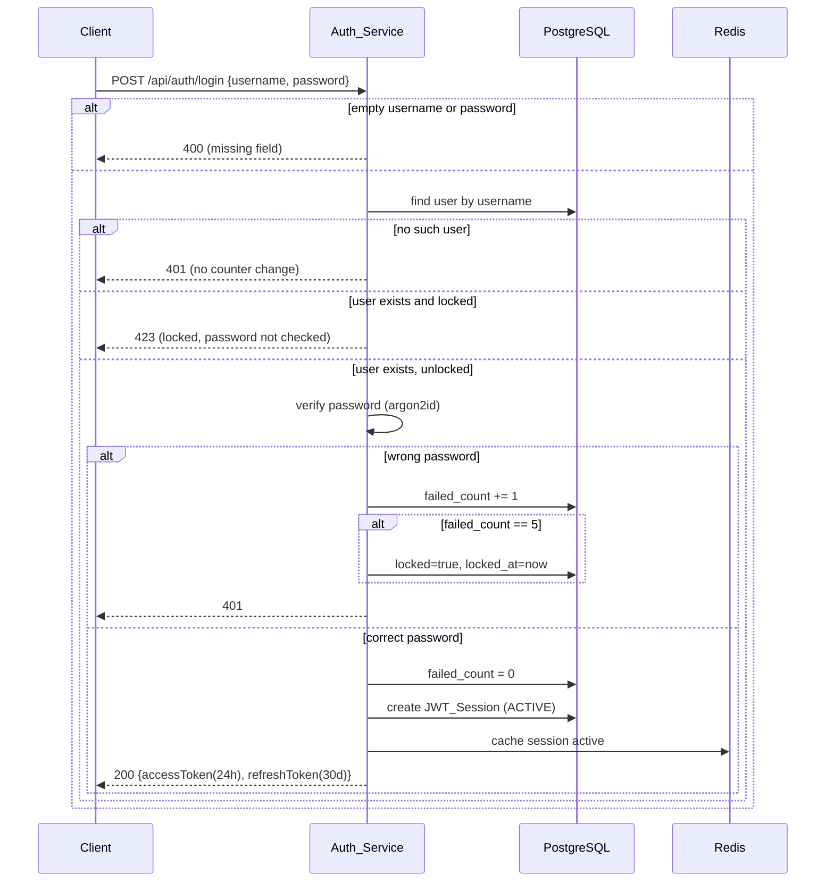

### Token Refresh (Req 4)

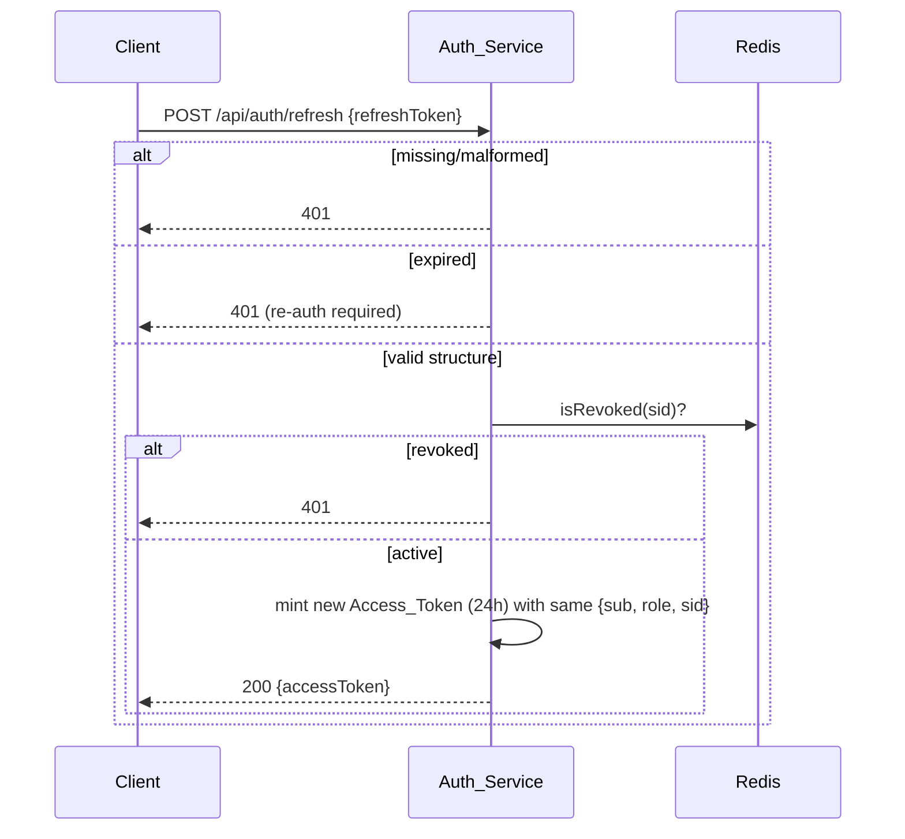

### Logout (Req 5)

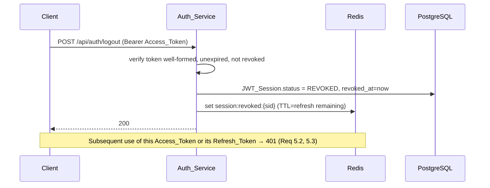

### Token Refresh Job (Req 11, 12)

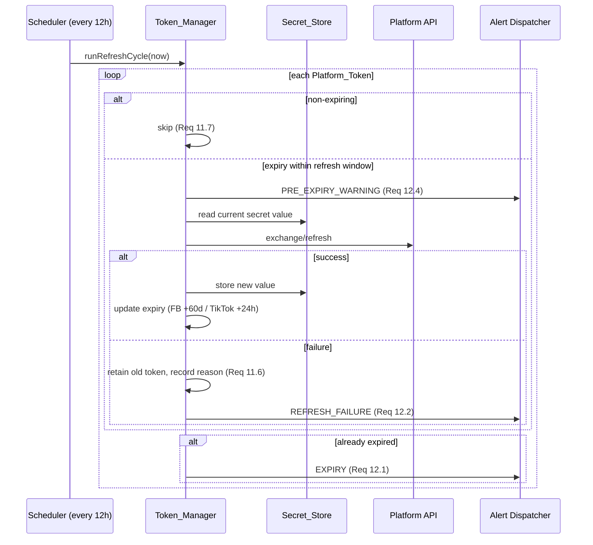

### Webhook Verification (Req 20)

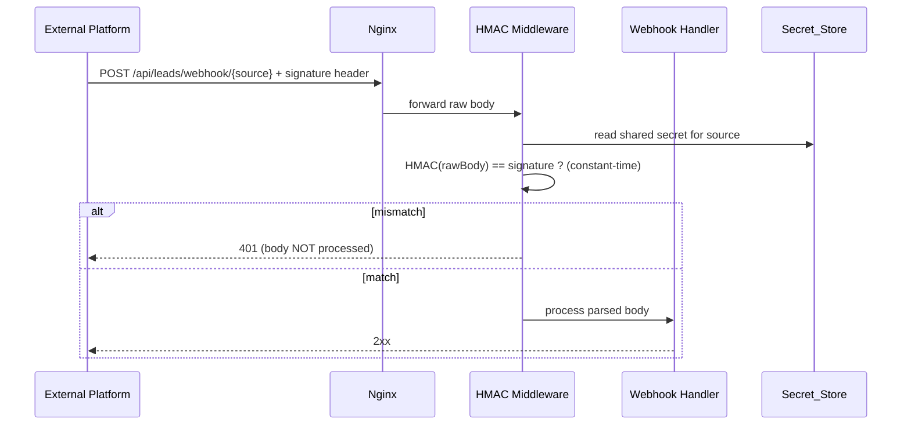

## Deployment Topology

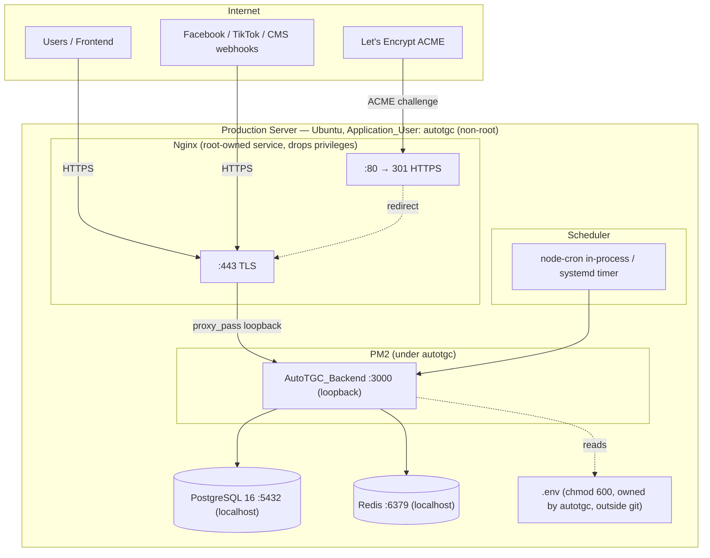

- **Nginx (Reverse_Proxy, Req 16):** terminates TLS with a Let's Encrypt certificate (16.1); `:80` issues a 301 to HTTPS and serves only the ACME challenge, otherwise the request is not served over HTTP (16.2); proxies HTTPS to the backend on loopback (16.3); returns 502 when the backend is unreachable (16.4). Certbot auto-renew timer renews before expiry (16.5).
- **AutoTGC_Backend:** binds to `127.0.0.1:3000` (not publicly exposed), runs as `autotgc`, refuses to start as root (Req 14.3).
- **PM2 (Process_Manager, Req 15.4–15.5):** restarts the app on unexpected exit; configured with restart backoff so a flapping restart mechanism does not itself kill a healthy process.
- **PostgreSQL 16 (Req 15.2)** and **Redis (Req 15.3)** bound to localhost only.
- **Scheduler (Req 17):** node-cron in-process (default) or a systemd timer; logs job name + failure timestamp on failure (17.3); Token_Refresh_Job interval defaults to 12h and honors any configured interval (17.2, 11.1).

### Secrets & Least-Privilege Approach (Req 13, 14)

- All secrets (DB creds, JWT signing key, platform token values, webhook shared secrets, `SERVER_HOST`) come from the Secret_Store — a `.env` file (chmod 600, owned by `autotgc`, outside VCS) or a secret manager (Google Secret Manager / HashiCorp Vault) (Req 13.1, 13.2).
- `.gitignore` excludes `.env*`; CI secret-scan step blocks commits containing secret patterns or the server host (Req 13.2).
- Fail-fast: a `bootstrap()` step calls `SecretLoader.require()` for every mandatory secret before opening the listener; the first missing one aborts startup logging only its name (Req 13.3).
- A pino log serializer runs every line through `redact()` so secret values never appear in logs (Req 13.4).
- The app process drops to `autotgc`; a startup guard checks `process.getuid() !== 0` and exits with an error if running as root (Req 14.1–14.3).

## CI/CD Deployment Pipeline (Req 18)

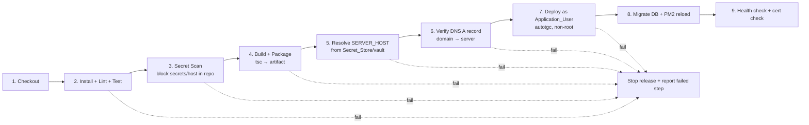

Stage mapping to requirements:
- **Build & package** the backend artifact (Req 18.1).
- **Resolve `SERVER_HOST`** from the Secret_Store/vault — never hard-coded (Req 18.2, 13.2).
- **Deploy under `autotgc`** (non-root) (Req 18.3, 14.2).
- **Require a DNS A record** mapping the configured domain to the server before deploy proceeds (Req 18.4).
- **Fail-fast:** any failed build or deploy step stops the release and reports the failing step (Req 18.5).
- Post-deploy: run Prisma migrations, `pm2 reload`, then a `/healthz` smoke check and a certificate-expiry check (supports Req 16.5).

## Correctness Properties

*A property is a characteristic or behavior that should hold true across all valid executions of a system — essentially, a formal statement about what the system should do. Properties serve as the bridge between human-readable specifications and machine-verifiable correctness guarantees.*

These properties cover the testable, input-varying logic of the module (auth, lockout, sessions, RBAC, adapters, tokens, secrets, webhooks). Infrastructure and deployment criteria (process supervision, Nginx/TLS, scheduler timing, CI/CD control flow) are validated by integration and smoke tests in the Testing Strategy rather than property-based tests. The set below has been de-duplicated via property reflection so each property carries unique validation value.

### Property 1: Registration input validation

*For any* registration input, the Auth_Service accepts it and creates exactly one account only if all of the following hold — email is non-empty, ≤254 chars, and matches `local@domain.tld`; password length is in [8, 128]; password equals its confirmation; username is non-empty, not all-whitespace, and ≤50 chars; and the username does not already exist — and otherwise rejects it with the corresponding status (400 for email/password/username format, 409 for duplicate) while creating no account.

**Validates: Requirements 1.2, 1.3, 1.4, 1.5, 1.6**

### Property 2: Passwords are stored only as verifiable salted hashes

*For any* valid password, after a successful registration the stored credential is not equal to the plaintext password, and verifying the plaintext against the stored hash succeeds (and a different password fails).

**Validates: Requirements 1.7**

### Property 3: Token issuance produces correct lifetimes and claims

*For any* successful issuance event (registration, login, or refresh), every issued Access_Token has `exp - iat == 24h`, every issued Refresh_Token has `exp - iat == 30d`, and the issued Access_Token's `{sub, role}` claims equal the owning account's identifier and role; on refresh the new Access_Token carries the same `{sub, role, sid}` as the originating session.

**Validates: Requirements 1.9, 2.2, 2.3, 2.8, 4.1, 4.2**

### Property 4: Failed-login counter and lockout state machine

*For any* account and *any* sequence of login attempts, the consecutive-failure count increases by one on each wrong password against an existing unlocked account, is unchanged when the username does not exist, resets to zero on a successful login, and the account becomes locked with a recorded lockout timestamp exactly when the count reaches 5.

**Validates: Requirements 2.4, 2.5, 2.7, 3.1, 3.3**

### Property 5: Locked accounts reject all logins

*For any* account in the locked state, every login attempt is rejected with HTTP 423, including attempts that present the correct password.

**Validates: Requirements 3.2**

### Property 6: Revoked sessions reject both tokens

*For any* JWT_Session, once it is invalidated (via logout or revocation) every subsequent request presenting that session's Access_Token is rejected with 401 and every token-refresh request presenting that session's Refresh_Token is rejected with 401.

**Validates: Requirements 4.4, 5.1, 5.2, 5.3, 7.5**

### Property 7: Authentication enforcement on endpoints

*For any* endpoint, the endpoint requires authentication if and only if it is not in the public allow-list; and *for any* request to a protected endpoint whose Access_Token is missing, malformed, expired, or belongs to a revoked session, the backend responds 401 and does not process the request.

**Validates: Requirements 7.1, 7.2, 7.3, 7.5**

### Property 8: RBAC decisions match the role/module/action/ownership policy

*For any* tuple of (role, module, action, lead-ownership), the Authorization_Service's decision is granted exactly when the policy permits it — ADMIN is granted read and write on all modules; SALES is granted read and status-update only on Lead Management resources assigned to that user, read-only on Dashboard, and is denied (403) every write on Dashboard, every action on unassigned leads, and every action on Strategy/Generation/Publishing/Analytics/Feedback/Settings — and a denied decision is produced before any handler runs and never modifies the target.

**Validates: Requirements 6.2, 6.3, 6.4, 6.5, 6.6, 6.7, 6.8**

### Property 9: Service-account permission enforcement

*For any* service account and *any* requested operation, an authenticated service account is granted the operation if and only if it lies within that account's closed permission set (otherwise 403, request not processed); and *any* interactive login attempt targeting a service account is rejected with 403.

**Validates: Requirements 8.2, 8.3, 8.4**

### Property 10: Adapter registry routing correctness

*For any* registry state and *any* additional adapter registered into it, lookups for previously registered platforms resolve to the same adapter instances as before (registration is purely additive), a lookup for a platform absent from the registry raises an unsupported-platform error mapped to HTTP 400 that identifies the platform, and a request for a capability an adapter does not implement raises an unsupported-operation error mapped to HTTP 400.

**Validates: Requirements 9.3, 9.4, 9.5**

### Property 11: Platform token storage round-trip without secret leakage

*For any* registered Platform_Token, reading it back yields the same platform identifier, token type, and expiry metadata (with API-key and service-account credentials recorded as non-expiring), and neither the stored metadata record nor the public `/api/platform-tokens` view contains the secret token value.

**Validates: Requirements 10.1, 10.2, 10.3, 10.4**

### Property 12: Token validity predicate

*For any* Platform_Token and *any* reference time, the token is reported valid if and only if a token value is present and the token is either marked non-expiring or has an expiry timestamp strictly in the future relative to that reference time.

**Validates: Requirements 10.5**

### Property 13: Refresh cycle selection and expiry update

*For any* set of Platform_Tokens and *any* reference time, the Token_Refresh_Job selects exactly those expiring tokens whose expiry falls within their configured refresh window (which is strictly greater than the job interval) and never selects a non-expiring token; a successful Facebook refresh sets the stored expiry to reference time + 60 days and a successful TikTok refresh sets it to reference time + 24 hours.

**Validates: Requirements 11.2, 11.3, 11.4, 11.7**

### Property 14: Failed refresh retains the prior token and records the reason

*For any* Platform_Token whose refresh attempt fails, the previously stored token value and expiry are retained unchanged and a failure reason is recorded.

**Validates: Requirements 11.6**

### Property 15: Token lifecycle alerting

*For any* Platform_Token lifecycle event, an EXPIRY alert identifying the platform is raised whenever the token's expiry passes (even if a later refresh succeeds), a PRE_EXPIRY_WARNING identifying the platform is raised when the token enters its refresh window before a refresh has succeeded, and a REFRESH_FAILURE alert identifying the platform and reason is raised whenever a refresh attempt fails.

**Validates: Requirements 12.1, 12.2, 12.4**

### Property 16: Secret values never appear in log output

*For any* log message that embeds one or more secret values, the redacted output emitted to the log sink contains none of those secret values.

**Validates: Requirements 13.4**

### Property 17: Fail-fast on missing required secret

*For any* required secret omitted from the Secret_Store, startup aborts and the emitted log identifies the missing secret by name while containing no secret value.

**Validates: Requirements 13.3**

### Property 18: Webhook HMAC verification gate

*For any* request body and per-source shared secret, a request whose signature equals the HMAC of the raw body under that secret passes verification and its body is processed with a 2xx response, and *for any* request whose signature does not match, verification fails with HTTP 401 and the body is not processed.

**Validates: Requirements 20.1, 20.2, 20.3**

### Property 19: Responses use only the allowed status codes

*For any* request handled by the backend, the response body is JSON and the HTTP status code is drawn from the set {200, 201, 202, 400, 401, 403, 404, 409, 423, 500, 502}.

**Validates: Requirements 19.1**

### Property 20: Pagination contract

*For any* `page` and `limit` query parameters on a paginated collection endpoint, the response includes the total record count and returns no more than `limit` records for the requested page.

**Validates: Requirements 19.2**

## Error Handling

The backend uses a single centralized error model so transport concerns and status codes stay consistent (Req 19.1).

### Error Taxonomy

| Error class | HTTP status | Trigger |
|-------------|-------------|---------|
| `ValidationError` | 400 | Invalid registration/login fields, unsupported platform/operation (Req 1.2–1.5, 2.6, 9.4, 9.5) |
| `UnauthorizedError` | 401 | Missing/expired/malformed/revoked token, bad credentials, failed HMAC (Req 2.4, 4.x, 5.2–5.3, 7.1–7.2, 7.5, 8.5, 20.2) |
| `ForbiddenError` | 403 | RBAC denial, service-account scope violation, interactive login on service account (Req 6.5, 6.7, 6.8, 8.2, 8.4) |
| `NotFoundError` | 404 | Unknown resource (Req 19.4) |
| `ConflictError` | 409 | Duplicate username (Req 1.6) |
| `LockedError` | 423 | Login against a locked account (Req 3.2) |
| `InternalError` | 500 | Unexpected server fault |
| (proxy) | 502 | Nginx cannot reach the backend (Req 16.4) |

### Handling Principles

- **Fail closed:** authentication and authorization failures deny by default; a denied request never reaches the handler (Req 6.5, 6.6, 6.7, 7.1).
- **No information leakage:** unknown-username and wrong-password both return 401 with a generic message (avoids user enumeration); the failed-login counter behavior differs internally per Req 2.4/2.5 but is not exposed in the response.
- **Secret redaction in errors:** the error serializer runs through `SecretLoader.redact()` so no secret value appears in any error payload or log (Req 13.4).
- **Startup faults:** missing required secret (Req 13.3) and root execution (Req 14.3) abort boot with a descriptive, secret-free log and a non-zero exit before the listener opens.
- **Refresh failures are non-destructive:** a platform token refresh failure retains the existing token and records the reason rather than discarding the credential (Req 11.6).
- **Idempotent revocation:** revoking an already-revoked session is a no-op that still results in 401 on token use.

## Testing Strategy

### Dual Approach

- **Property-based tests** verify the 20 universal properties above across many generated inputs (auth logic, lockout, sessions, RBAC, adapters, tokens, secrets, webhooks, REST conventions).
- **Unit / example tests** cover concrete edge cases and specific behaviors that are not universal.
- **Integration / smoke tests** cover infrastructure and external wiring that does not vary meaningfully with input and is not cost-effective to run 100+ times.

### Property-Based Testing

- **Library:** `fast-check` (TypeScript), integrated with the unit test runner (Vitest or Jest).
- **Iterations:** each property test runs a **minimum of 100 generated cases**.
- **Do not hand-roll PBT** — use `fast-check` generators/arbitraries.
- **Tagging:** each property test is tagged with a comment in the format
  `// Feature: foundation-and-deployment, Property {number}: {property_text}`
  and maps 1:1 to a property in the Correctness Properties section.
- **Determinism / cost control:** external platform calls (Facebook/TikTok/GA4/CMS) are **mocked**; time is controlled with injected clocks/fake timers so token-expiry and lockout properties are deterministic; PostgreSQL and Redis are exercised via an in-memory/repository fake for property tests and a real instance for integration tests.
- **Generators of note:** email strings (valid + adversarial), password lengths around the 8/128 boundaries, whitespace-only usernames, login-attempt sequences, role/module/action/ownership tuples, registry compositions with random extra adapters, (value-present?, expiry, now) triples for token validity, raw bodies + secrets for HMAC, and log messages embedding secret values for redaction.

### Example / Edge-Case Unit Tests

- Empty/whitespace username or password → 400 (Req 2.6).
- Missing/malformed refresh token → 401 (Req 4.5).
- Invalid/expired service-account credential → 401, no token (Req 8.5).
- Root execution guard: uid 0 aborts, non-zero proceeds (Req 14.3).
- Unknown resource id → 404 (Req 19.4).
- `/api/platform-tokens/{platform}/refresh` returns validity status (Req 11.5).
- Alert delivery to ADMIN Dashboard notifications channel (Req 12.3).
- CORS headers returned for the configured frontend origin (Req 19.3).
- Failed scheduled job logs job name + failure timestamp (Req 17.3).

### Integration Tests (1–3 representative cases each)

- Nginx redirects HTTP → HTTPS and drops otherwise (Req 16.2); forwards HTTPS to backend (Req 16.3); returns 502 when the backend is down (Req 16.4).
- PM2 restarts the backend on unexpected exit (Req 15.4) and does not kill a healthy process on restart-mechanism failure (Req 15.5).
- Scheduler fires the Token_Refresh_Job at the configured interval, including a non-12h interval (Req 11.1, 17.2).
- Deployment pipeline halts and reports the failing stage when a stage fails (Req 18.5).

### Smoke / Configuration Checks (single execution)

- Role enum is exactly {ADMIN, SALES} (Req 6.1); public allow-list is exactly login/register/refresh/health/verified-webhooks (Req 7.4).
- Service accounts for AI System and Background Worker exist (Req 8.1); their credentials load from the Secret_Store (Req 8.6).
- `PlatformAdapter` interface and the four Phase-1 adapters are registered with the correct capability matrix (Req 9.1, 9.2).
- Secrets resolve via the Secret_Store at runtime (Req 13.1); webhook shared secrets resolve via the Secret_Store (Req 20.4); CI secret-scan finds no secrets or server host in the repo (Req 13.2).
- Runtime is Node.js 20 LTS (Req 15.1); PostgreSQL 16 reachable (Req 15.2); Redis reachable (Req 15.3).
- Let's Encrypt TLS served (Req 16.1) and renewal timer configured (Req 16.5).
- Scheduler mechanism present (Req 17.1).
- Pipeline builds/packages (Req 18.1), resolves `SERVER_HOST` from vault (Req 18.2), deploys as non-root Application_User (Req 18.3, 14.1, 14.2), and gates on a DNS A record (Req 18.4).

### Requirements Coverage Summary

| Requirement | Primary validation |
|-------------|--------------------|
| R1 Registration | Properties 1–3; example (default ADMIN role) |
| R2 Login | Properties 3, 4; edge (empty fields) |
| R3 Lockout | Properties 4, 5 |
| R4 Token refresh | Properties 3, 6; edge (malformed) |
| R5 Logout | Property 6 |
| R6 RBAC | Property 8; smoke (role enum) |
| R7 Auth enforcement | Properties 6, 7; smoke (public allow-list) |
| R8 Service accounts | Property 9; edge (bad cred); smoke (existence, storage) |
| R9 Adapter pattern | Property 10; smoke (interface + matrix) |
| R10 Token storage | Properties 11, 12 |
| R11 Proactive refresh | Properties 13, 14; example (endpoint); integration (interval) |
| R12 Alerting | Property 15; example (delivery channel) |
| R13 Secrets handling | Properties 16, 17; smoke (runtime read, secret scan) |
| R14 Least privilege | Edge (root guard); smoke (non-root deploy) |
| R15 Runtime stack | Integration (PM2); smoke (versions) |
| R16 Reverse proxy/SSL | Integration (redirect/forward/502); smoke (cert + renewal) |
| R17 Scheduled jobs | Integration (interval); example (failure log); smoke (mechanism) |
| R18 Deployment pipeline | Example (halt-on-fail); smoke (build/host/user/DNS) |
| R19 REST conventions | Properties 19, 20; example (CORS); edge (404) |
| R20 Webhook HMAC | Property 18; smoke (secret source) |
