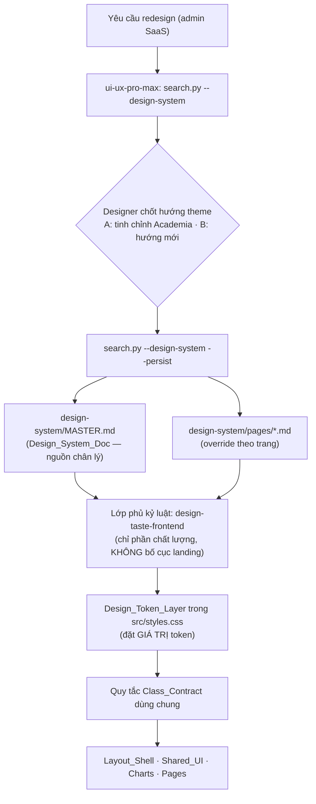
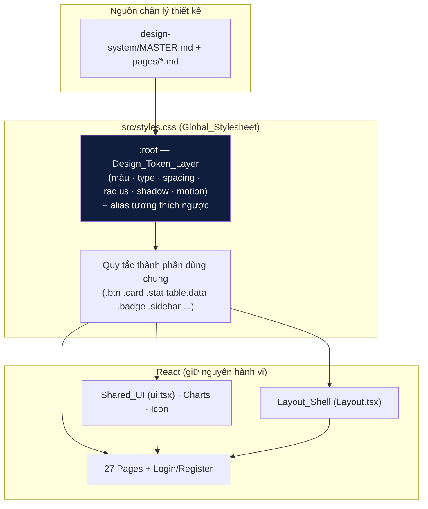
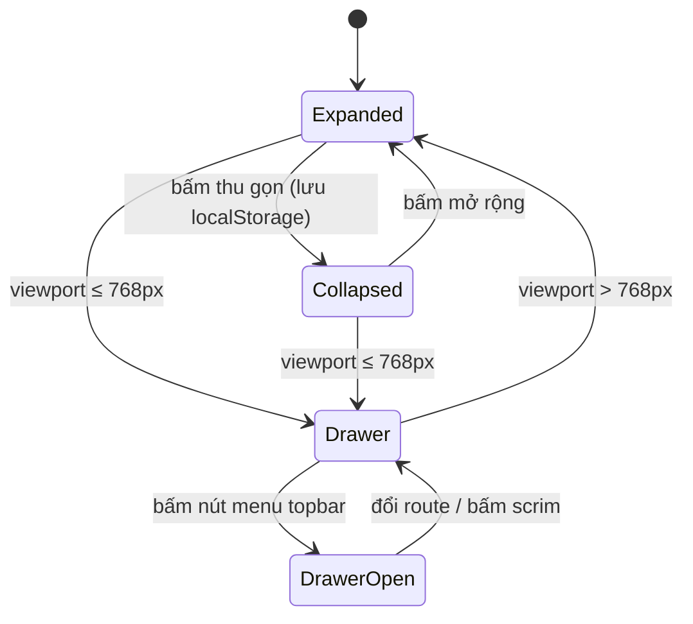
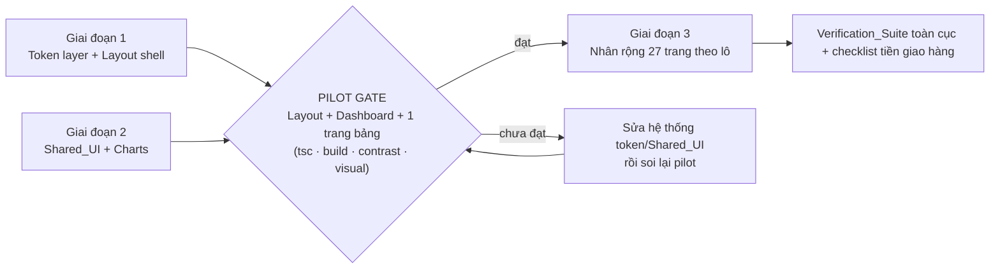
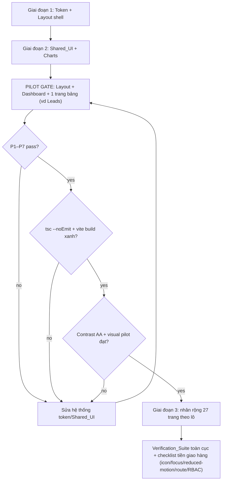

# Design Document — frontend-ui-redesign

## Overview

Tài liệu này mô tả thiết kế kỹ thuật cho đợt **thiết kế lại (restyle) toàn bộ giao diện** ứng dụng quản trị nội bộ `autotgc-frontend`. Đây là một đợt **redesign giữ nguyên hợp đồng** (restyle, không viết lại): nâng cấp chất lượng thị giác và trải nghiệm của lớp giao diện hiện có **mà không thay đổi định tuyến, phân quyền, gọi API, khóa cache TanStack Query, hay backend** (Yêu cầu 3, 11).

Cơ chế thay đổi diện mạo đặt trọng tâm ở **lớp design token** trong một stylesheet toàn cục duy nhất (`src/styles.css`) và lớp quy tắc trình bày dựng trên token đó. Vì các trang và thành phần dùng chung đã tham chiếu một tập **tên class ổn định** (`Class_Contract`), việc thay token + quy tắc class áp dụng đồng loạt cho mọi trang mà không phải sửa từng trang (Yêu cầu 2, 4).

Hai **skill thiết kế** đóng vai trò phương pháp dẫn đường, không phải bộ sinh code tự động:

- **`ui-ux-pro-max`** (`.kiro/steering/ui-ux-pro-max`) — phương pháp **chính**, vì nó được xây cho sản phẩm SaaS/dashboard/quản trị. Workflow `search.py --design-system --persist` sinh ra hệ thống thiết kế (pattern, style, bảng màu, typography, effects, anti-patterns) và lưu thành `design-system/MASTER.md` + các override theo trang.
- **`design-taste-frontend`** ("tasteskill", `.agents/skills/design-taste-frontend`) — chỉ dùng làm **lớp kỷ luật chất lượng / chống "AI-slop"** (typography, khóa nhất quán màu, khóa nhất quán bo góc, đủ trạng thái tương tác, kiểm tra tương phản, checklist tiền giao hàng). Skill này **tự khai báo KHÔNG dành cho dashboard/bảng dữ liệu/UI nhiều bước**, nên **không** áp dụng các quy tắc bố cục landing-page/hero/marquee của nó vào bất kỳ ngữ cảnh quản trị nào (Yêu cầu 1.4, 1.5).

### Bối cảnh kỹ thuật đã khảo sát

| Hạng mục | Hiện trạng |
|---|---|
| Stack | React 18.3 + Vite 5 + TypeScript 5.6 (strict), React Router 6.27, TanStack Query 5.59 |
| Styling | Một stylesheet toàn cục `src/styles.css` (~1961 dòng), điều khiển hoàn toàn bằng CSS custom property khai báo trong `:root` |
| Theme hiện tại | "Academia / editorial học thuật" — Academic Navy `#0F1E3D` / Oxford Crimson `#8C1D27` / Prestige Gold `#B08542` trên ivory ấm `#F7F4EF`; Crimson Pro (display) + Inter (body) + IBM Plex Mono (số liệu) |
| Trang | 29 file `src/pages`: 2 công khai (`Login`, `Register`) + 27 trong shell `RequireAuth + Layout` |
| Dùng chung | `Layout.tsx`, `components/charts.tsx`, `components/ui.tsx`, `components/Icon.tsx`, `StageBadge`, `AiGroundingBadge`, `AssetSpecView`, `NotificationsBell`, `RequireAuth` |
| Không có | Tailwind, thư viện UI ngoài, framework test ở frontend |

### Quyết định thiết kế (Design Decisions)

Các quyết định dưới đây được nêu rõ để rà soát; chúng định hình phần còn lại của tài liệu.

1. **`ui-ux-pro-max` là phương pháp chính, `design-taste-frontend` là lớp phủ kỷ luật.** Lý do: sản phẩm là admin SaaS/dashboard nhiều bảng dữ liệu — đúng miền của `ui-ux-pro-max`; tasteskill chỉ đóng góp phần kỷ luật chất lượng còn phần bố cục của nó không phù hợp (Yêu cầu 1).

2. **Hướng theme — giữ mở giữa hai lựa chọn, chốt ở bước chạy `--design-system`** (không cam kết cứng trước):
   - **Lựa chọn A — Tinh chỉnh theme "Academia" hiện có.** Giữ trục nhận diện hiện tại, dùng `--design-system` để soi/khoá lại nhất quán, vá các điểm tương phản/typography còn yếu. Rủi ro thấp nhất, hồi quy thị giác nhỏ nhất.
   - **Lựa chọn B — Sinh hướng mới qua `--design-system`.** Nếu output đề xuất một hệ màu/typography khác phù hợp hơn cho admin SaaS, thay **giá trị** token (không đổi tên token/class) để xoay chủ đề toàn cục.
   - **Cơ chế chốt:** chạy `search.py --design-system --persist` ở đầu giai đoạn triển khai; đối chiếu output `MASTER.md` với theme hiện tại; Designer chọn A hoặc B và ghi quyết định vào `MASTER.md`. Dù chọn A hay B, **lớp token và `Class_Contract` đều bất biến về cấu trúc** — chỉ thay giá trị. Điều này khiến quyết định này an toàn để hoãn tới lúc có dữ liệu từ skill.

3. **Trình tự theo mức độ dùng chung, có chốt pilot.** Token + Layout shell trước → Shared_UI + Charts → từng trang. Khóa hệ thống trên một **pilot nhỏ** (Layout shell + Dashboard + một trang bảng dữ liệu, ví dụ `Leads`) trước khi nhân rộng (Yêu cầu 6.5).

4. **Không thêm framework UI/CSS** (gồm Tailwind). Mọi kiểu trình bày tiếp tục nằm trong `styles.css` dùng chung (Yêu cầu 11.1, 11.4).

---

## Research & Method — Cách hai skill nối vào workflow

> Phần này thỏa Yêu cầu 1. Quá trình nghiên cứu được thực hiện ngay trong hội thoại thiết kế (đọc codebase + đọc hai SKILL.md), không tạo file nghiên cứu riêng.

### Bước 1 — Sinh hệ thống thiết kế bằng `ui-ux-pro-max`

`ui-ux-pro-max` cung cấp `scripts/search.py` đọc các bảng dữ liệu (`data/*.csv`: products, styles, colors, typography, landing, charts, ux, web, reasoning). Lệnh `--design-system` tìm song song trên 5 miền và áp luật từ `ui-reasoning.csv` để trả ra một hệ thống thiết kế hoàn chỉnh.

Lệnh dự kiến (chạy từ thư mục chứa skill, ví dụ workspace root nơi có `steering/ui-ux-pro-max/`):

```bash
# 1) Sinh hệ thống thiết kế cho admin SaaS/dashboard nội bộ
python3 steering/ui-ux-pro-max/scripts/search.py \
  "internal admin SaaS dashboard data-table recruitment marketing" \
  --design-system -p "AutoTGC Admin"

# 2) Khi đã chốt hướng → lưu Master + thư mục override theo trang
python3 steering/ui-ux-pro-max/scripts/search.py \
  "internal admin SaaS dashboard data-table recruitment marketing" \
  --design-system --persist -p "AutoTGC Admin"

# 3) (tùy nhu cầu) override cho trang đặc thù
python3 steering/ui-ux-pro-max/scripts/search.py \
  "analytics dashboard charts funnel donut" \
  --design-system --persist -p "AutoTGC Admin" --page "dashboard"
```

Kết quả của `--persist` (theo SKILL.md):

- `design-system/MASTER.md` — **nguồn chân lý toàn cục** (`Design_System_Doc`): pattern, style, palette, typography, effects, anti-patterns. Đây là tài liệu mà Yêu cầu 1.2 và 1.3 yêu cầu lưu lại và dùng làm căn cứ cho mọi quyết định màu/typography/spacing/bo góc/effects.
- `design-system/pages/` — thư mục override theo trang. Khi dựng một trang cụ thể, nếu `design-system/pages/<page>.md` tồn tại thì **override** MASTER; nếu không, dùng MASTER.

### Bước 2 — Lớp phủ kỷ luật `design-taste-frontend` (chọn lọc)

Chỉ rút các quy tắc **kỷ luật/chất lượng** áp dụng được cho UI quản trị (Yêu cầu 1.4):

| Áp dụng (overlay kỷ luật) | KHÔNG áp dụng (bố cục landing/hero) |
|---|---|
| Khóa **một** màu nhấn (COLOR CONSISTENCY LOCK) | Ràng buộc hero "vừa trong viewport", `pt-24` cap |
| Khóa **một** thang bo góc (SHAPE CONSISTENCY LOCK) | HERO STACK ≤ 4 phần tử, split-hero ban |
| Đủ vòng trạng thái tương tác (loading/empty/error/success) | EYEBROW ≤ 1 / 3 section, zigzag cap |
| Kiểm tra tương phản nút/biểu mẫu WCAG AA | Marquee, logo-wall, bố cục split-screen |
| Kỷ luật typography (cân nặng, tabular-nums cho số) | Quy tắc ảnh hero/`picsum`/stock photography |
| Checklist tiền giao hàng (icon nhất quán, focus ring, reduced-motion) | Dial VARIANCE/MOTION/DENSITY của landing |

> Lưu ý quan trọng (Yêu cầu 1.5): các quy tắc bố cục landing không được áp dụng kể cả cho **màn hình lai** vừa có thành phần dashboard vừa có nội dung tiếp thị (ví dụ trang `Trends`, `Insights`). Toàn bộ `Frontend_App` được xử lý như UI quản trị.

### Sơ đồ — Hai skill nối vào workflow



### Tóm tắt phát hiện nghiên cứu định hình thiết kế

- **Token layer đã trưởng thành.** `:root` hiện có ~150 biến phân nhóm rõ (brand, neutral ramp, surfaces, sidebar, text roles, status, spacing, radius, shadow, typography, motion, layout) cùng một khối **alias tương thích ngược** (`--color-cta`, `--gray-*`, `--bg`, `--primary`, `--radius`, `--shadow`...). Redesign phải **bảo toàn các alias này** (Yêu cầu 4.4).
- **`Class_Contract` rộng và đã có ghi chú "PRESERVED (restyled, never renamed)".** Đây là cột sống cho phép restyle toàn cục.
- **Đã có sẵn nền tảng a11y/motion:** khối `@media (prefers-reduced-motion: reduce)` tắt shimmer/transition; `:focus-visible` có ring; `useCountUp` đã reduced-motion-aware. Redesign mở rộng chứ không phá các cơ chế này (Yêu cầu 9.5).
- **Charts là SVG/CSS thuần, không thư viện** — màu hiện hardcode literal trong `charts.tsx` (`PALETTE`, `ACCENT`, ramp donut `#E3DCD0`). Đây là điểm cần đưa về token (Yêu cầu 6.4, 13.1).
- **Frontend chưa có framework test** — kéo theo quyết định ở Testing Strategy (thêm test-only devDependencies, không phải UI framework).

---

## Architecture

### Mô hình phân lớp

Redesign giữ nguyên kiến trúc lớp hiện tại và chỉ thay đổi từ lớp token trở xuống bề mặt trình bày:



Nguyên tắc dòng chảy: **token → quy tắc class → thành phần/trang**. Trang không được chứa màu/kích thước literal nằm ngoài token layer (Yêu cầu 6.4, 13.1); quy tắc class tham chiếu token qua `var(--token)` thay vì lặp literal (Yêu cầu 4.3).

### Chiến lược bảo toàn hợp đồng class-name (Yêu cầu 2)

`Class_Contract` = tập tên class mà các trang/thành phần dùng chung phụ thuộc. Khảo sát từ `styles.css` + `.tsx`, gồm (không giới hạn):

```
Khung:     .app-shell .sidebar .sidebar--collapsed .sidebar--open .sidebar-nav
           .sidebar__group .sidebar__label .sidebar-link .sidebar__footer
           .sidebar__toggle .sidebar-scrim .main .topbar .topbar__search
           .topbar__icon-btn .content .conn .conn-dot .bell .bell-btn
           .bell-panel .user-chip .role-pill
Khối:      .card .card--interactive .card-title .grid .grid-2 .grid-4 .grid-kpi
           .bento .bento__feature .bento__side .bento__half
           .page-header .page-title .section .divider .eyebrow
Dữ liệu:   table.data .data--dense .data--zebra .data__num .data__actions
           .table-wrap .pagination
Stat:      .stat .stat--featured .stat-label .stat__label .stat-value
           .stat__value .stat__delta (+ biến thể up/down/flat/invert)
Nút/form:  .btn .btn-primary .btn-secondary .btn--ghost .btn-blue .btn-danger
           .btn-sm .btn--lg .btn--icon .field .input label
Badge:     .badge .badge__dot .badge-green/red/blue/yellow/gray
           .badge--success/danger/info/warning/neutral
Trạng thái:.state .error-box .error-state .notice .success-box
           .empty-state .empty-state__title .skeleton .skeleton--row
           .skeleton-stack .spinner
Khác:      .toolbar .chip .muted .kv .tabs .tab .tab--active .modal*
           .step-row .step-index .bar-chart .bar-row .bar-track .bar-fill
           .bar-value .funnel* .donut* .auth-wrap .auth-card .auth-crest*
           .dnd-list .dnd-row .dnd-handle
```

Quy tắc thực thi:

1. **Giữ nguyên 100% tên class trong `Class_Contract`** — chỉ đổi *thuộc tính bên trong* quy tắc, không đổi *selector* (2.1).
2. **Bổ sung (additive) thay vì đổi tên** khi cần kiểu mới — thêm class/biến thể mới (ví dụ một `.stat--trend` mới) chứ không sửa tên class đang dùng (2.2). Skeleton state-shaped mới cũng là class additive (`.skeleton--kpi`, `.skeleton--table-row` chẳng hạn).
3. **Không xóa định nghĩa của class trong hợp đồng** kể cả khi tạm thời không dùng, để các trang phụ thuộc không vỡ (2.3).
4. **Chỉ sửa JSX/TSX khi cần về mặt cấu trúc trình bày** và không thay đổi hành vi dữ liệu của trang (2.4) — ví dụ thay khối loading bằng skeleton state-shaped, bọc bảng trong `.table-wrap`. Không đụng các lệnh gọi `useQuery`, khóa cache, hay handler ghi.

### Bảo toàn định tuyến, phân quyền, hành vi dữ liệu (Yêu cầu 3)

- **Định tuyến (3.1):** `App.tsx` giữ nguyên tập route path và ánh xạ route–trang, gồm cả `React.lazy`/`Suspense` cho từng chunk (11.2).
- **RBAC (3.2, 3.5):** quy tắc lọc theo vai trò trong `Layout.tsx` (`visibleGroups` lọc `item.roles`) và bọc `RequireAuth roles={['ADMIN']}` ở `App.tsx` không đổi. SALES tiếp tục chỉ thấy các mục được phép.
- **API & cache (3.3, 3.4):** không đổi endpoint, query param, hay khóa cache TanStack Query; không sửa `lib/apiClient.ts` ngoài việc giữ nguyên `ApiError`. Backend `autotgc-backend` hoàn toàn không thuộc phạm vi.

---

## Components and Interfaces

### 1. Design_Token_Layer (Yêu cầu 4, 5)

`:root` là **nguồn khai báo duy nhất** cho màu/typography/spacing/radius/shadow/motion (4.1). Cấu trúc nhóm token (giữ nguyên khung hiện tại, chỉ đặt lại *giá trị* nếu chọn hướng B):

| Nhóm token | Ví dụ biến | Vai trò |
|---|---|---|
| Brand | `--color-primary`, `--color-accent`, `--color-gold`, `--color-secondary` | Trục nhận diện; **một** họ màu nhấn (`--color-accent`) cho toàn app (4.5, 5.1) |
| Neutral ramp | `--stone-50..900` | Thang xám ấm nhất quán (5.x) |
| Surfaces/Borders | `--surface`, `--surface-sunken`, `--border`, `--border-strong` | Mặt phẳng & đường kẻ |
| Sidebar | `--sidebar-bg`, `--sidebar-fg`, `--sidebar-active-*` | Spine điều hướng |
| Text roles | `--text-strong/body/muted/faint/on-dark`, `--text-link` | Vai trò chữ |
| Status | `--success/-bg/-fg`, `--warning…`, `--danger…`, `--info…`, `--neutral…` | Bộ ba base/soft-bg/on-soft cho mỗi trạng thái (5.6) |
| Spacing | `--space-xs..3xl` | Thang khoảng cách (5.4) |
| Radius | `--radius-sm..xl`, `--radius-pill` | Thang bo góc (5.3) |
| Shadow | `--shadow-sm..xl`, `--shadow-focus`, `--shadow-focus-crimson` | Đổ bóng & focus ring |
| Typography | `--font-display/body/mono`, `--fs-*`, `--lh-*`, `--fw-*`, `--tracking-*` | Thang chữ (5.2, 5.5) |
| Motion | `--ease*`, `--dur-*` | Thời lượng/đường cong |
| Layout | `--sidebar-w`, `--topbar-h`, `--content-max`, `--content-pad` | Kích thước khung |
| **Alias tương thích ngược** | `--color-cta`→`--color-accent`, `--gray-*`→`--stone-*`, `--bg`, `--primary`, `--radius`, `--shadow` | Giữ nguyên cho quy tắc/trang cũ (4.4) |

Hành vi mục tiêu (4.2): đổi **một** giá trị token màu chủ đạo trong `:root` ⇒ mọi quy tắc/trang dùng token đó cập nhật mà không sửa từng trang. Đây là invariant kiến trúc cốt lõi của redesign.

### 2. Layout_Shell (Yêu cầu 7)

Giữ nguyên `components/Layout.tsx` về cấu trúc và hành vi, chỉ restyle qua class + token:

- **Nhóm điều hướng (7.1):** giữ nguyên 5 nhóm tiếng Việt — *Tổng quan, CRM tuyển dụng, Marketing AI, Nội dung, Hệ thống* — và toàn bộ nhãn.
- **Thu gọn (7.2):** sidebar 256px ↔ 64px (icon rail), trạng thái lưu ở `localStorage` (`autotgc.sidebar.collapsed`). Khi thu gọn, ẩn nhãn, canh giữa icon, giữ marker active.
- **Off-canvas ≤768px (7.3, 7.4):** sidebar thành drawer mở từ nút menu topbar; có scrim; **đóng drawer khi đổi route** (đã có `useEffect` theo `location.pathname`).
- **Topbar (7.5):** chỉ báo kết nối realtime (`ConnectionIndicator`), `NotificationsBell`, `user-chip` + `role-pill`, nút Logout.



### 3. Shared_UI (Yêu cầu 6, 8)

`components/ui.tsx` giữ nguyên API public (props) của mọi thành phần; chỉ nâng cấp class/markup trình bày. Bốn `Interactive_State` (8.6) được cung cấp đủ:

| Thành phần | Vai trò trạng thái | Ghi chú restyle |
|---|---|---|
| `Loading` / `Skeleton` | loading (8.1) | Ưu tiên skeleton **shaped theo nội dung cuối** thay cho spinner chung; thêm class skeleton additive (KPI/hàng bảng/biểu đồ) |
| `Empty` | empty (8.2) | Có mô tả + slot `action` gợi ý tạo dữ liệu |
| `ErrorMessage` | error (8.3, 8.4) | Nhận `ApiError`; 502 → khối `.notice` "dịch vụ chưa cấu hình"; còn lại → `.error-box` kèm `code` + `message` |
| `SuccessMessage` | success (8.5) | Xác nhận thao tác ghi thành công |
| `StatusBadge` | nhãn trạng thái | Map status → class badge ngữ nghĩa; luôn kèm text (9.6) |
| `StatCard`/`CountUp` | KPI | `font-variant-numeric: tabular-nums`, count-up reduced-motion-aware (5.5, 9.5) |
| `Pagination`, `Modal` | điều hướng/overlay | Modal giữ focus-trap nhẹ + Esc + khóa scroll đã có |

### 4. Chart_Components (Yêu cầu 6.3, 6.4)

`components/charts.tsx` (BarChart/FunnelChart/DonutChart) là SVG/CSS thuần. Restyle: **đưa màu literal về token**. Hiện `PALETTE`, `ACCENT`, ramp donut `#E3DCD0` là hex cứng — sẽ đọc từ biến CSS (qua `getComputedStyle` hoặc class tô màu trong `styles.css`) để màu chart theo cùng `Theme` (6.4). Bảo toàn các pure helper `seriesColor`, `pct` (chỉ chuyển nguồn màu, không đổi chữ ký).

### 5. Icon_System (Yêu cầu 12)

`components/Icon.tsx` là nguồn icon **duy nhất** (12.1), Lucide inline-SVG, `currentColor`, stroke 1.75, viewBox 24×24, **không emoji** (12.2, 12.3). Hợp đồng a11y (12.4): có `title` ⇒ `role="img"` + `aria-label`; không `title` ⇒ `aria-hidden`. Redesign chỉ **mở rộng** `IconName` khi cần glyph mới, không đổi cơ chế.

### 6. Chiến lược trạng thái tương tác (Yêu cầu 8)

- **Loading state-shaped:** mỗi trang dùng skeleton có hình dạng tương ứng (KPI dùng skeleton KPI, bảng dùng skeleton hàng) thay cho spinner chung (8.1).
- **Empty:** mô tả rõ + hành động gợi ý khi tập rỗng (8.2).
- **Error nội tuyến:** từ `ApiError` hiện `code` + `message` (8.3); 502 → thông báo "dịch vụ chưa cấu hình" mềm (8.4).
- **Success:** `SuccessMessage` sau thao tác ghi (8.5).

### 7. Khả năng truy cập (Yêu cầu 9)

- **Tương phản (9.1, 9.2):** mọi cặp (chữ/nền) và (nhãn nút/nền nút) trong token đạt AA: ≥ 4.5:1 chữ thường, ≥ 3:1 chữ lớn. Đây là invariant **kiểm được tự động** trên giá trị token (xem Correctness Properties).
- **Focus ring (9.3):** `:focus-visible` dùng `--shadow-focus` / `--shadow-focus-crimson`.
- **Nhãn (9.4):** mọi input có `label`/`aria-label`; nút chỉ-icon có `aria-label` (đã có ở Layout/Modal/Pagination, mở rộng cho mọi trang).
- **Reduced-motion (9.5):** khối `@media (prefers-reduced-motion: reduce)` tắt reveal/shimmer; count-up dừng nhảy số.
- **Không chỉ dùng màu (9.6):** trạng thái luôn kèm nhãn text hoặc icon (StatusBadge có text; delta có icon mũi tên).

### 8. Responsive (Yêu cầu 10)

`Breakpoint_Set`: mobile ≤768px, tablet 769–1024px, desktop >1024px (10.1). ≤1024px gập đa cột (gồm `.bento`) về một cột (10.2). Không cuộn ngang ngoài ý muốn tại 375/768/1024/1440px (10.3). Bảng tràn cuộn trong `.table-wrap` (10.4).

### 9. Hiệu năng & ràng buộc (Yêu cầu 11)

Không thêm UI/CSS framework (11.1); giữ `React.lazy`/`Suspense` (11.2); `font-display: swap` khi nạp web font (11.3); kiểu dùng chung trong `styles.css`, không nhân bản CSS theo trang (11.4); `Verification_Suite` (`tsc --noEmit` + `vite build`) phải xanh (11.5).

### 10. Rollout / Sequencing (Yêu cầu 6.5) — xem chi tiết ở Testing Strategy

Thứ tự: **(1)** Token layer + Layout shell → **(2)** Shared_UI + Charts → **(3)** từng Page. Chốt **pilot** (Layout + Dashboard + một trang bảng dữ liệu) trước khi nhân rộng.



---

## Data Models

Redesign không thêm/sửa mô hình dữ liệu nghiệp vụ. Các "mô hình" dưới đây là **mô hình thiết kế/cấu hình** (chủ yếu CSS + một số kiểu TS thuần) làm cơ sở cho thuộc tính đúng đắn và kiểm thử.

### 1. Token group (khái niệm)

```
DesignToken = {
  name: string            // ví dụ "--color-accent"
  group: 'brand'|'neutral'|'surface'|'sidebar'|'text'|'status'
       | 'spacing'|'radius'|'shadow'|'typography'|'motion'|'layout'|'alias'
  value: string           // hex | px | rem | cubic-bezier | var(--other)
  isAlias: boolean        // alias tương thích ngược → trỏ token khác
}
```

`Design_Token_Layer` = tập `DesignToken`. Bất biến: mọi alias `isAlias=true` phải phân giải về một token base hợp lệ (4.4).

### 2. Nav role model (đã có trong `Layout.tsx`)

```ts
type Role = 'ADMIN' | 'SALES';
interface NavItem  { to: string; label: string; icon: IconName; roles?: Role[] }
interface NavGroup { title: string; items: NavItem[] }
// Lọc: item hiển thị ⇔ !item.roles || (role && item.roles.includes(role))
// Nhóm hiển thị ⇔ có ≥ 1 item hiển thị
```

### 3. Interactive_State model

```
InteractiveState = 'loading' | 'empty' | 'error' | 'success'
ErrorView(error) =
  error là ApiError && status === 502 → { kind: 'notice',    contains: [code, message] }
  error là ApiError                    → { kind: 'error-box', contains: [code, message] }
  ngược lại                            → { kind: 'error-box', contains: [message] }
```

### 4. Status → badge class model (đã có trong `ui.tsx`)

```
STATUS_CLASS: Record<string, badgeClass>   // DRAFT→badge-gray, APPROVED→badge-green, …
StatusBadge(status) = 'badge ' + (STATUS_CLASS[status] ?? 'badge-gray')
// Mọi badgeClass ∈ { badge-gray, badge-green, badge-red, badge-blue, badge-yellow }
```

### 5. Contrast pair model (cho kiểm thử a11y)

```
ContrastPair = { fg: hexToken, bg: hexToken, large: boolean }
pass(pair) = contrastRatio(fg, bg) >= (pair.large ? 3.0 : 4.5)
// Tập AA_PAIRS liệt kê các cặp văn bản/nút/biểu mẫu thực tế của Theme
```

### 6. Class contract set

```
CLASS_CONTRACT: ReadonlySet<string>   // liệt kê ở mục Architecture
defined(cls) = styles.css có ít nhất một rule khớp selector cho cls
```


---

## Correctness Properties

> *Một property (thuộc tính) là một đặc trưng hoặc hành vi cần đúng trên mọi lần thực thi hợp lệ của hệ thống — về bản chất là một phát biểu hình thức về điều phần mềm phải làm. Properties là cầu nối giữa đặc tả cho người đọc và bảo đảm đúng đắn kiểm chứng được bằng máy.*

Phần lớn redesign này là CSS/diện mạo và được kiểm bằng snapshot/visual/contrast/manual (xem Testing Strategy). Tuy nhiên có một số **đảo logic thuần** kèm theo có thể (và nên) kiểm bằng property-based testing. Mỗi property dưới đây là một phát biểu **"với mọi…"** phổ quát, ánh xạ trực tiếp tới tiêu chí nghiệm thu qua mục Prework.

Mỗi property được hiện thực bằng **một** test PBT (≥ 100 iteration), gắn tag `Feature: frontend-ui-redesign, Property {n}: {tên}` (xem Testing Strategy).

### Property 1: Lọc điều hướng theo vai trò là đúng và an toàn

*Với mọi* cấu hình điều hướng (tập `NavGroup`/`NavItem` bất kỳ, mỗi item có thể có `roles?`) và *với mọi* vai trò `role ∈ {ADMIN, SALES}`, kết quả sau khi lọc chỉ chứa những item mà `!item.roles || item.roles.includes(role)`, và mọi nhóm rỗng sau lọc đều bị loại bỏ. Hệ quả: một item gắn `roles=['ADMIN']` **không bao giờ** xuất hiện với `SALES`.

**Validates: Requirements 3.2, 3.5, 13.5**

### Property 2: Icon tuân thủ hợp đồng a11y và nét vẽ

*Với mọi* `name ∈ IconName` và *với mọi* lựa chọn có/không truyền `title`: SVG render ra luôn có `stroke="currentColor"`, `fill="none"`, `viewBox="0 0 24 24"` và `strokeWidth` mặc định `1.75`; nếu có `title` thì có `role="img"`, `aria-label === title` và phần tử `<title>`; nếu không có `title` thì `aria-hidden === true` và không có `aria-label`. Không có nhánh nào ném lỗi.

**Validates: Requirements 12.3, 12.4**

### Property 3: StatusBadge là toàn phần và không chỉ dựa vào màu

*Với mọi* chuỗi `status` (kể cả chuỗi rỗng hoặc giá trị lạ), `StatusBadge` trả về một class có dạng `"badge " + c` với `c` thuộc tập class badge hợp lệ (`badge-gray|green|red|blue|yellow`), mặc định `badge-gray` khi không khớp; và nhãn văn bản `status` luôn được hiển thị (trạng thái không bao giờ chỉ truyền đạt bằng màu).

**Validates: Requirements 5.6, 9.6**

### Property 4: Ánh xạ hiển thị lỗi bảo toàn mã và mô tả

*Với mọi* `ApiError` có `{ status, code, message }`: nếu `status === 502` thì khung hiển thị là biến thể "notice" ("dịch vụ chưa cấu hình"); ngược lại là biến thể "error-box"; trong cả hai trường hợp nội dung hiển thị luôn chứa cả `code` lẫn `message`. *Với mọi* lỗi không phải `ApiError`, khung là "error-box" và chứa thông điệp lỗi.

**Validates: Requirements 8.3, 8.4**

### Property 5: Mọi cặp tương phản của Theme đạt WCAG AA

*Với mọi* cặp `(fg, bg, large)` trong tập `AA_PAIRS` (các cặp văn bản/nhãn-nút/biểu mẫu thực tế lấy từ giá trị token của `Theme`), tỷ lệ tương phản `contrastRatio(fg, bg)` ≥ `3.0` nếu `large` là chữ lớn (≥ 18px hoặc ≥ 14px in đậm), ngược lại ≥ `4.5`. Hàm `contrastRatio` được kiểm độc lập (đối xứng, nằm trong `[1, 21]`).

**Validates: Requirements 9.1, 9.2, 13.3**

### Property 6: Alias token luôn phân giải về một base hợp lệ

*Với mọi* token alias trong `Design_Token_Layer` (ví dụ `--color-cta`, `--gray-*`, `--bg`, `--primary`, `--radius`, `--shadow`), việc phân giải chuỗi tham chiếu `var(--…)` luôn kết thúc ở một token base có giá trị literal hợp lệ — không có tham chiếu treo (dangling) và không có vòng lặp (cyclic).

**Validates: Requirements 4.4**

### Property 7: Hợp đồng class-name được bảo toàn

*Với mọi* class `cls` trong `CLASS_CONTRACT`, `Global_Stylesheet` (`src/styles.css`) sau redesign vẫn định nghĩa ít nhất một quy tắc khớp `cls` (selector tồn tại). Hệ quả: không class nào trong hợp đồng bị đổi tên hoặc bị xóa định nghĩa, kể cả khi tạm thời không còn trang nào dùng.

**Validates: Requirements 2.1, 2.3**

---

## Error Handling

Redesign không tạo đường dẫn lỗi nghiệp vụ mới; nó **chuẩn hóa cách trình bày** lỗi sẵn có và giữ nguyên hợp đồng lỗi của backend.

| Tình huống | Xử lý trình bày | Tiêu chí |
|---|---|---|
| Query/mutation trả lỗi `ApiError` (4xx/5xx ≠ 502) | `.error-box` nội tuyến, hiện `code` + `message`, kèm icon `alert-triangle` | 8.3 |
| `ApiError` 502 (dịch vụ ngoài chưa cấu hình: AI/social) | `.notice` mềm "dịch vụ chưa cấu hình" thay vì lỗi nghiêm trọng, vẫn kèm `code: message` | 8.4 |
| Lỗi không phải `ApiError` (mạng/JS) | `.error-box` với thông điệp `Error.message` | 8.3 |
| Query trả tập rỗng | `Empty` có mô tả + `action` gợi ý tạo dữ liệu | 8.2 |
| Thao tác ghi thành công | `SuccessMessage` (`.success-box`) | 8.5 |
| `localStorage` không khả dụng (private mode) | bọc `try/catch` (đã có) — bỏ qua lỗi lưu, mặc định không thu gọn | 7.2 |
| Token alias treo/vòng (lỗi cấu hình CSS) | Bị bắt bởi Property 6 ở thời điểm test, không để lọt ra runtime | 4.4 |
| Class hợp đồng bị xóa/đổi tên do sơ suất | Bị bắt bởi Property 7 ở thời điểm test | 2.1, 2.3 |

Nguyên tắc:

- **Không dùng `window.alert`**; lỗi luôn nội tuyến/ngữ cảnh qua `Shared_UI` (kỷ luật tasteskill áp dụng được cho admin).
- **Không nuốt lỗi API** — giữ nguyên `ApiError.code/message` để người dùng và log đối chiếu được.
- **Không đổi mã trạng thái/envelope của backend**; frontend chỉ ánh xạ trạng thái sang trình bày (3.4).
- **Suy biến nhẹ nhàng (graceful degradation):** lỗi `localStorage`, `prefers-reduced-motion`, hay thiếu web font (dùng `font-display: swap`) không được làm hỏng bố cục.

---

## Testing Strategy

### Cách tiếp cận kép

- **Unit/example tests** — ví dụ cụ thể, render component, ánh xạ route, hiện diện CSS.
- **Property tests** — bảy property phổ quát ở trên, cho các đảo logic thuần.
- **Static-scan / visual / a11y checks** — cho phần CSS/diện mạo không hợp với PBT.
- **Verification_Suite** — `tsc --noEmit` + `vite build` là cổng chặn bắt buộc (11.5, 13.4).

### PBT có áp dụng không? — Có, nhưng chỉ cho các đảo logic thuần

Redesign **chủ yếu là CSS/visual** ⇒ phần lớn không hợp PBT (dùng snapshot/visual/contrast/manual). Nhưng các hàm thuần sau đây **có** "với mọi input" có ý nghĩa và được kiểm bằng PBT: lọc nav RBAC, hợp đồng `Icon`, `StatusBadge`, ánh xạ `ErrorMessage`, phân giải alias token, tính tương phản, và bảo toàn `CLASS_CONTRACT`.

### Thư viện & cấu hình PBT

- **Không** dùng UI/CSS framework mới (11.1). Test runner và PBT là **devDependencies chỉ phục vụ test**, không phải phụ thuộc runtime/UI:
  - **Vitest** (đồng bộ hệ sinh thái Vite hiện có) + **@testing-library/react** + **jsdom** để render component.
  - **fast-check** cho property-based testing (đồng bộ với backend đã dùng `fast-check`).
- Mỗi property test chạy **tối thiểu 100 iteration** (`fc.assert(fc.property(...), { numRuns: 100 })`).
- Mỗi property test gắn tag tham chiếu design:
  - Định dạng: `// Feature: frontend-ui-redesign, Property {n}: {property_text}`
- Mỗi correctness property ⇒ **đúng một** property test.

> Ghi chú: việc thêm Vitest/RTL/jsdom/fast-check là **devDependencies test-only**; chúng không vi phạm 11.1 (cấm framework UI/CSS như Tailwind) và không vào bundle runtime. Nếu chủ dự án muốn tránh mọi devDependency mới, các Property 1–4 và 6–7 vẫn kiểm được bằng script Node thuần (logic đã tách thành hàm thuần), riêng Property 2 cần một renderer.

### Ánh xạ Property → test

| Property | Hàm thuần cần tách (nếu chưa) | Generators chính |
|---|---|---|
| P1 Nav RBAC | trích `filterNavGroups(groups, role)` từ `Layout.tsx` | `NavGroup[]` ngẫu nhiên, `roles?` ngẫu nhiên, `role` |
| P2 Icon a11y | render `<Icon>` (RTL) | `fc.constantFrom(...IconName)`, `title?` |
| P3 StatusBadge | `StatusBadge` (đã thuần) | `fc.string()` + các status hợp lệ |
| P4 ErrorMessage | trích `classifyError(error)` thuần | `ApiError{status,code,message}`, lỗi thường |
| P5 Contrast | `contrastRatio(fg,bg)` (mới, thuần) | duyệt tập `AA_PAIRS` cố định + fuzz hex |
| P6 Alias resolve | `resolveToken(name, tokenMap)` (mới, thuần) | bản đồ token parse từ `:root` |
| P7 Class contract | `definedClasses(css)` (mới, thuần) | duyệt `CLASS_CONTRACT` + fuzz |

### Unit / example tests (chọn lọc, tránh thừa)

- **Route map (3.1):** so khớp đúng tập path/element từ `App.tsx`, gồm các route bọc `RequireAuth roles={['ADMIN']}`.
- **Nav cấu trúc (7.1):** đúng 5 nhóm + nhãn tiếng Việt.
- **Collapse persist (7.2):** ghi/đọc `autotgc.sidebar.collapsed`.
- **Drawer reset (7.4):** đổi `location.pathname` ⇒ `mobileOpen=false`.
- **Topbar (7.5):** render đủ conn/bell/user-chip/role-pill/logout.
- **Shared_UI states (8.1, 8.2, 8.5, 8.6):** render đủ loading/empty/success.
- **Icon nguồn duy nhất & không emoji (12.1, 12.2):** static-scan source tìm emoji/svg lạ.

### Static-scan / regression checks (cho phần CSS/diện mạo)

- **Per-page no-literal (6.4, 13.1):** quét file trang tìm hex/px literal nằm ngoài token; chạy như cổng regression khi đánh dấu trang "hoàn tất".
- **var() không lặp literal (4.3):** quét quy tắc thành phần.
- **Một accent / một thang radius (5.1, 5.3):** quét token đảm bảo COLOR/SHAPE LOCK.
- **font-display: swap (11.3), focus-visible (9.3), reduced-motion (9.5):** kiểm hiện diện trong `styles.css`.
- **Dependency scan (11.1, 11.2):** `package.json` không có Tailwind/UI framework; `App.tsx` còn `React.lazy`.

### Visual / a11y thủ công (theo checklist tasteskill, phần áp dụng được)

- Tương phản AA (bổ trợ P5 ở mức thị giác thực): chữ/nút/biểu mẫu (9.1, 9.2, 13.3).
- Không cuộn ngang tại 375/768/1024/1440px (10.3); bảng cuộn trong `.table-wrap` (10.4).
- Nhãn cho input và nút chỉ-icon (9.4); trạng thái không chỉ dùng màu (9.6).

### Cổng nghiệm thu & trình tự rollout (Yêu cầu 6.5, 13.x)



Mỗi trang được tuyên bố "hoàn tất" phải qua: (1) dùng Theme qua `Class_Contract`, không literal ngoài token (13.1); (2) các `Interactive_State` áp dụng được hiển thị đúng (13.2); (3) kiểm tương phản AA (13.3). Khi toàn bộ redesign hoàn tất: chạy `Verification_Suite` không lỗi (13.4) và đối chiếu route/RBAC với `App.tsx` (13.5).
