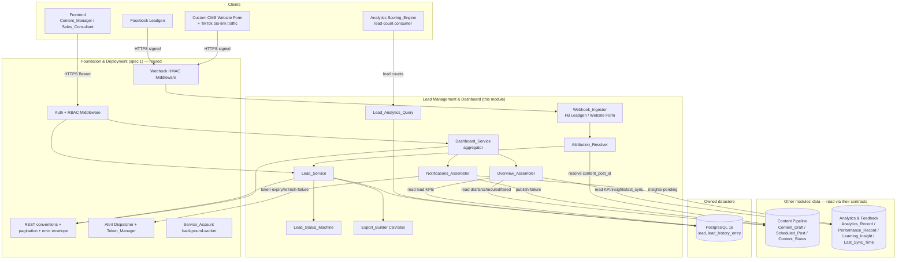
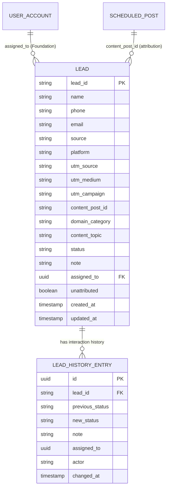
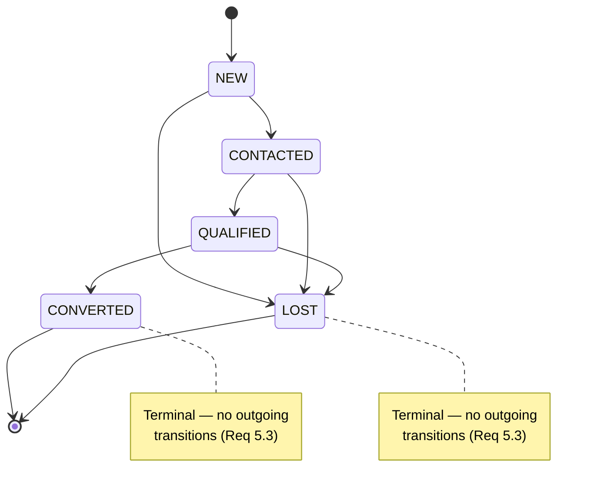
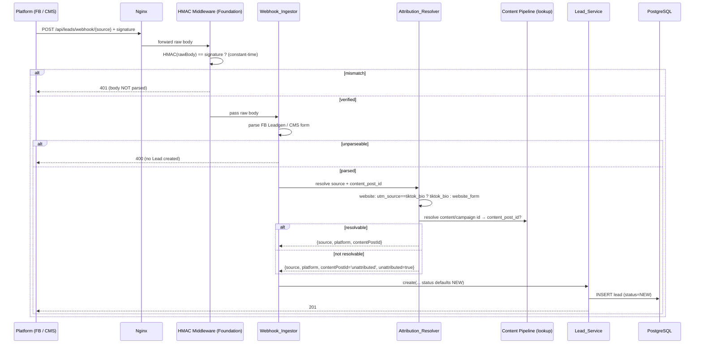
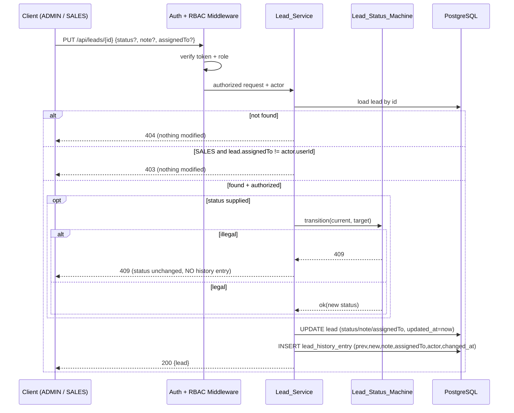
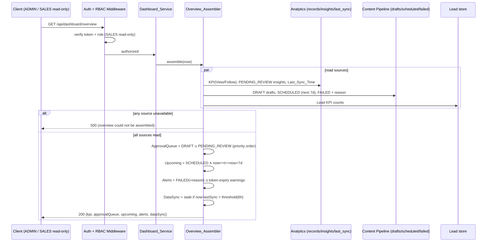

# Design Document: Lead Management & Operational Dashboard

## Overview

The Lead Management & Operational Dashboard module is the **fourth and final Phase 1 spec** of AutoTGC. It delivers two cooperating concern areas on top of the three earlier modules:

1. **Lead Management (`Lead_Service`)** — a self-built lead-tracking system (no external CRM) that ingests leads from the Facebook Leadgen webhook, the Custom CMS website-form webhook (including TikTok bio-link traffic attributed via UTM), and direct API creation; then stores, filters, views, updates (with an append-only interaction history), deletes, aggregates, and exports leads under a guarded status lifecycle; and links every lead to its originating content post so the Analytics & Feedback Loop module can compute conversion.
2. **Operational Dashboard (`Dashboard_Service`)** — an aggregated, read-only overview that surfaces KPI charts (View / Lead / Follow), an approval queue (DRAFT drafts + PENDING_REVIEW insights), upcoming scheduled posts (7-day window), a failed-post and token-expiry alert section, a data-synchronization freshness indicator, and a notifications channel for administrators.

This module **builds on** the foundation laid by the three earlier specs and **references rather than redefines** their capabilities. Critically, the Dashboard is an *aggregator*: it composes its read models by **querying the other modules' data through their existing read contracts**, never by duplicating or re-persisting their data. The only data this module *owns* is the `Lead` and its `Lead_History_Entry`.

### Relationship to Foundation & Deployment (spec 1)

| Foundation capability | How this module uses it |
|-----------------------|--------------------------|
| Authentication + RBAC middleware | Guards all `/api/leads/*` (except the signature-verified webhooks) and `/api/dashboard/*` routes; the `Authorization_Service` policy already encodes ADMIN full / SALES assigned-only on `lead_management` and SALES read-only on `dashboard` (Req 13, 20). |
| Webhook HMAC middleware | Verifies every `Lead_Webhook` body **before** parsing; failed verification → 401, body never processed (Req 9.1, 10.1, 11.2). |
| `Service_Account` (`background-worker`) | Identity for any background/scheduled lead processing and for the Analytics module's pull of lead counts. |
| `Alert Dispatcher` + Dashboard notifications channel | Source of the token-expiry / refresh-failure alerts the Dashboard surfaces in its Alert_Section and Notifications_Channel (Req 17.3, 19.2). |
| `Token_Manager` | Raises the platform token-expiry warnings the Dashboard reads (Req 17.3, 19.2). |
| REST conventions layer | Status-code set {200,201,400,401,403,404,409,500}, the `page`/`limit`/`total` pagination contract, and the central error envelope (Req 2.1, 14.4). |
| `LEAD_ASSIGNMENT(user_id, lead_id)` relation | The Foundation RBAC layer already references this for SALES assigned-lead checks; this module is the owner of the assignable `Lead` it points at. |

### Relationship to Content Pipeline (spec 2)

The Dashboard reads Content Pipeline state through that module's existing query surface; it never writes content entities.

| Content Pipeline entity | How this module touches it |
|-------------------------|----------------------------|
| `Content_Draft` + `Content_Status` (DRAFT) | Read model for the Approval_Queue (DRAFT drafts awaiting approval, Req 15.1). |
| `Scheduled_Post` + `Content_Status` (SCHEDULED) with `scheduled_publish_time` | Read model for Upcoming_Posts (7-day window, Req 16). |
| `Scheduled_Post` + `Content_Status` (FAILED) with failure reason (incl. `TOKEN_EXPIRED`) | Read model for the Alert_Section and publish-failure notifications (Req 17.1, 17.2, 19.3). |
| `content_post_id` ↔ `Scheduled_Post`/published post | The resolution target when attributing a webhook lead to its originating content (Req 9.5, 11.1). |

### Relationship to Analytics & Feedback Loop (spec 3)

This module is both a **consumer** (Dashboard reads analytics) and a **producer** (Lead_Service supplies lead counts back to analytics, closing the conversion loop).

| Analytics entity | How this module touches it |
|------------------|----------------------------|
| `Analytics_Record` / `Performance_Record` | Read source for the KPI_Overview (View / Lead / Follow summary charts, Req 14.1, 14.3). |
| `Learning_Insight` + `Insight_Status` (PENDING_REVIEW) | Read model for the Approval_Queue and insights-pending notifications (Req 15.1, 19.4). |
| `Collection_Cycle` / `Last_Sync_Time` | The 6-hour cadence whose freshness the Data_Sync_Status reports (Req 18). |
| Lead count consumer (conversion_rate) | The Analytics `Scoring_Engine` calls `Lead_Service` for lead count by `content_post_id` (→ `Conversion_Rate = leads/views*100`) and lead counts grouped by `domain_category` + `content_topic` (→ feedback loop input). This module **provides** those query endpoints (Req 12.2, 12.3). |

The shared stack is unchanged from Foundation: **Node.js 20 LTS + TypeScript, Fastify, Prisma/PostgreSQL 16, ioredis/Redis, BullMQ, node-cron, PM2, jose, fast-check.** New infrastructure introduced by this module is minimal: two webhook routes behind the existing HMAC middleware, an export-file serializer (CSV/`xlsx`), and the Dashboard aggregation read layer. No new scheduled job is required — the Dashboard reads the `Last_Sync_Time` the Analytics Collection_Cycle already records.

### Scope

In scope (Phase 1): the full `Lead` CRUD + lifecycle + stats + export; Facebook Leadgen and Website Form webhook ingestion with HMAC verification (reused), source attribution (incl. `tiktok_bio` via UTM and the `unattributed` fallback), and content attribution; the lead-count query surface for Analytics; lead RBAC (ADMIN full / SALES assigned-only, no delete); and the Dashboard overview aggregation, approval queue, upcoming posts, alert section, data-sync status, and notifications channel with read-only SALES access.

Out of scope: the HMAC verification mechanism itself, the JWT/RBAC mechanism, the Alert Dispatcher/Token_Manager internals, the content lifecycle and publishing, the analytics collection/scoring/insight generation — all owned by earlier modules and only consumed here. Phase 2+ platforms (Zalo OA, Instagram, YouTube) are out of scope; the `Lead_Platform` enum stays closed at `facebook | tiktok | website`.

## Architecture

### Module Context — plugging into Foundation, Content Pipeline, and Analytics



The diagram shows the central design rule: **`Lead_Service` owns and persists leads in PostgreSQL, while `Dashboard_Service` owns nothing — it assembles read models by querying Content Pipeline, Analytics, and the lead store through their query surfaces.** The conversion loop is closed by `Lead_Analytics_Query`, which serves lead counts back to the Analytics `Scoring_Engine`.

### Layering

Consistent with the Foundation three-domain split:

1. **HTTP layer (Fastify routers)** — the `/api/leads/*` and `/api/dashboard/*` routes plus the two webhook routes. Protected routes sit behind Foundation auth/RBAC; webhook routes sit behind Foundation HMAC verification. JSON-schema request validation; stateless.
2. **Domain layer** — `Lead_Service`, `Webhook_Ingestor`, `Attribution_Resolver`, `Lead_Status_Machine`, `Export_Builder`, `Lead_Analytics_Query`, `Dashboard_Service`, `Overview_Assembler`, `Notifications_Assembler`. Pure logic (validation, transition guard, filter/grouping math, window/staleness predicates, attribution rules) is isolated from I/O so it is property-testable.
3. **Infrastructure layer** — Prisma repositories for `lead` and `lead_history_entry`; read adapters/queries into Content Pipeline and Analytics tables; the CSV/`xlsx` serializer; outbound notification reads from the Alert Dispatcher.

### Endpoint map (from API_Catalog.md §3.2 + Req 13, 20)

| Endpoint | Method | Caller | Component | Auth | Requirements |
|----------|--------|--------|-----------|------|--------------|
| `/api/leads` | POST | Content_Manager | Lead_Service | ADMIN | 1 |
| `/api/leads` | GET | Content_Manager / Sales_Consultant | Lead_Service | ADMIN full / SALES assigned | 2, 13.6 |
| `/api/leads/{id}` | GET | Content_Manager / Sales_Consultant | Lead_Service | ADMIN / SALES assigned | 3, 13.3, 13.4 |
| `/api/leads/{id}` | PUT | Content_Manager / Sales_Consultant | Lead_Service → Lead_Status_Machine | ADMIN / SALES assigned | 4, 5, 13.3, 13.4 |
| `/api/leads/{id}` | DELETE | Content_Manager | Lead_Service | ADMIN only (SALES → 403) | 6, 13.5 |
| `/api/leads/stats` | GET | Content_Manager / Sales_Consultant | Lead_Service | ADMIN / SALES assigned | 7, 13.6 |
| `/api/leads/export` | GET | Content_Manager / Sales_Consultant | Export_Builder | ADMIN / SALES assigned | 8, 13.6 |
| `/api/leads/webhook/facebook` | POST | Facebook | Webhook_Ingestor | HMAC (no JWT) | 9, 11 |
| `/api/leads/webhook/website` | POST | Custom CMS | Webhook_Ingestor | HMAC (no JWT) | 10, 11 |
| `/api/dashboard/overview` | GET | Content_Manager / Sales_Consultant | Dashboard_Service | ADMIN full / SALES read-only | 14–18, 20 |
| `/api/dashboard/notifications` | GET | Content_Manager | Dashboard_Service | ADMIN full / SALES read-only | 19, 20 |

The lead-count query surface consumed by Analytics (`Lead_Analytics_Query`) is an internal, in-process contract called by the `background-worker`-authenticated Scoring_Engine rather than a public route (Req 12.2, 12.3).

## Components and Interfaces

### Shared domain types

```typescript
type LeadSource = 'facebook_leadgen' | 'website_form' | 'tiktok_bio' | 'direct_message';
type LeadPlatform = 'facebook' | 'tiktok' | 'website';
type LeadStatus = 'NEW' | 'CONTACTED' | 'QUALIFIED' | 'CONVERTED' | 'LOST';

const ACTIVE_STATUSES = ['NEW', 'CONTACTED', 'QUALIFIED'] as const;   // Active_Lead_Status
const TERMINAL_STATUSES = ['CONVERTED', 'LOST'] as const;            // Terminal_Lead_Status

const UNATTRIBUTED = 'unattributed' as const;                         // Req 11.2 marker

interface Lead {
  leadId: string;                 // unique Lead_Id (Req 1.1)
  name: string | null;
  phone: string | null;           // at least one of phone/email required (Req 1.4)
  email: string | null;
  source: LeadSource;             // validated enum (Req 1.6)
  platform: LeadPlatform;         // validated enum (Req 1.7)
  utmSource: string | null;
  utmMedium: string | null;
  utmCampaign: string | null;
  contentPostId: string;          // resolved id or UNATTRIBUTED (Req 1.5, 11)
  domainCategory: string | null;  // Req 12.4
  contentTopic: string | null;    // Req 12.4
  status: LeadStatus;             // NEW on create (Req 1.2)
  note: string | null;
  assignedTo: string | null;      // user_id for SALES scoping (Req 13)
  unattributed: boolean;          // true when contentPostId === UNATTRIBUTED (Req 11.2)
  createdAt: string;              // ISO 8601 (Req 1.3)
  updatedAt: string;              // == createdAt on create (Req 1.3)
}

type ActorIdentity =
  | { kind: 'user'; userId: string; role: 'ADMIN' | 'SALES' }
  | { kind: 'service'; name: 'background-worker' }
  | { kind: 'webhook'; source: 'facebook' | 'website' };
```

### Lead_Service — create (Req 1)

```typescript
interface CreateLeadInput {
  name?: string;
  phone?: string;
  email?: string;
  source: string;                 // validated against LeadSource
  platform: string;               // validated against LeadPlatform
  utmSource?: string; utmMedium?: string; utmCampaign?: string;
  contentPostId?: string;
  domainCategory?: string; contentTopic?: string;
}

type CreateResult =
  | { ok: true; lead: Lead }
  | { ok: false; status: 400; error: string };   // Req 1.4–1.7

interface LeadCreator {
  create(input: CreateLeadInput, actor: ActorIdentity): Promise<CreateResult>;
}
```

Key behaviors:
- **Contact requirement (Req 1.4):** reject with 400 if **both** `phone` and `email` are absent/blank; no Lead is created.
- **Content_Post_Id requirement (Req 1.5):** direct `/api/leads` creation requires a `contentPostId`; if omitted → 400, no Lead. (Webhook creation relaxes this via the `unattributed` fallback — see `Attribution_Resolver`.)
- **Enum validation (Req 1.6, 1.7):** `source` must be one of the four `LeadSource` values and `platform` one of the three `LeadPlatform` values; otherwise 400 identifying the invalid value, no Lead created. Validation runs before any persistence.
- **Defaults (Req 1.2, 1.3):** on success set `status = NEW`, `createdAt = now`, and `updatedAt = createdAt`.
- **UTM storage (Req 1.8, 1.9):** store any provided `utm_source`/`utm_medium`/`utm_campaign`. UTM storage is **best-effort and non-blocking** — if it fails after the Lead row is persisted, the Lead creation still completes and the UTM-storage failure is recorded rather than rolling back the Lead (Req 1.9).

### Lead_Service — view & filter (Req 2)

```typescript
interface LeadFilter {
  source?: LeadSource;
  platform?: LeadPlatform;
  status?: LeadStatus;
  from?: string;                  // inclusive lower bound on createdAt
  to?: string;                    // inclusive upper bound on createdAt
}

interface Page<T> { items: T[]; total: number; page: number; limit: number; }

type ListResult =
  | { ok: true; page: Page<Lead> }
  | { ok: false; status: 400; error: string };   // Req 2.7 invalid range

interface LeadLister {
  list(filter: LeadFilter, page: number, limit: number, actor: ActorIdentity): Promise<ListResult>;
}
```

Key behaviors:
- **Pagination (Req 2.1):** returns the Foundation `page`/`limit`/`total` contract.
- **Single + composed filters (Req 2.2–2.6):** each present filter narrows the result by equality (`source`, `platform`, `status`) or by inclusive date-range membership on `createdAt` (`from`/`to`). When several filters are present, a Lead is returned only if it satisfies **every** one (logical AND / intersection).
- **Date-range validation (Req 2.7):** if `from > to`, reject with 400 ("date range is invalid") before querying.
- **SALES scoping (Req 13.6):** when `actor` is SALES, the result is restricted to leads where `assignedTo === actor.userId` — applied as an implicit, non-removable predicate composed with the user filter.

### Lead_Service — detail + interaction history (Req 3)

```typescript
interface LeadDetail { lead: Lead; interactionHistory: LeadHistoryEntry[]; } // newest→oldest (Req 3.2)

type DetailResult =
  | { ok: true; detail: LeadDetail }
  | { ok: false; status: 404 }                    // Req 3.3
  | { ok: false; status: 403 };                   // SALES not-assigned (Req 13.4)

interface LeadViewer {
  get(id: string, actor: ActorIdentity): Promise<DetailResult>;
}
```

- Returns the Lead plus its `Interaction_History` ordered **most-recent-first** by change timestamp (Req 3.1, 3.2).
- Unknown `id` → 404, no Lead information returned (Req 3.3).
- SALES targeting a non-assigned lead → 403 before any data is returned (Req 13.4).

### Lead_Service — update + append-only history (Req 4)

```typescript
interface UpdateLeadInput {
  status?: LeadStatus;            // must be a permitted transition (Req 4.1 / 5)
  note?: string;
  assignedTo?: string;
}

type UpdateResult =
  | { ok: true; lead: Lead }
  | { ok: false; status: 404 }                    // unknown id (Req 4.5)
  | { ok: false; status: 409; error: string }     // illegal transition (Req 4.6 / 5.4)
  | { ok: false; status: 403 };                   // SALES not-assigned (Req 13.4)

interface LeadUpdater {
  update(id: string, input: UpdateLeadInput, actor: ActorIdentity): Promise<UpdateResult>;
}
```

Key behaviors:
- **Status update (Req 4.1):** when a new `status` is supplied, it must be a permitted transition from the current status under the `Lead_Status_Machine`; on success the status is set and `updatedAt` is bumped.
- **Note / assignment (Req 4.2, 4.3):** a supplied `note` or `assignedTo` is stored. (SALES may set status and note on assigned leads per Req 13.3; assignment changes are an ADMIN capability.)
- **Append-only history (Req 4.4):** every applied update appends exactly one `Lead_History_Entry` capturing previous status, new status, note, assignedTo, acting identity, and change timestamp. History is never updated or deleted in place.
- **Unknown id (Req 4.5):** 404, no Lead modified.
- **Illegal transition (Req 4.6, 5.4):** 409 identifying the invalid transition; status unchanged and **no history entry appended**.
- **SALES scope (Req 13.4):** SALES updating a non-assigned lead → 403, nothing modified.

### Lead_Status_Machine (Req 5)

The single guarded transition function for `Lead_Status`; the only place a lead's status changes.

```typescript
const ALLOWED_TRANSITIONS: ReadonlyArray<readonly [LeadStatus, LeadStatus]> = [
  ['NEW', 'CONTACTED'],     // Req 5.1
  ['CONTACTED', 'QUALIFIED'],
  ['QUALIFIED', 'CONVERTED'],
  ['NEW', 'LOST'],          // Req 5.2 — LOST from any active status
  ['CONTACTED', 'LOST'],
  ['QUALIFIED', 'LOST'],
];

type TransitionResult =
  | { ok: true; status: LeadStatus }
  | { ok: false; status: 409 };   // Req 5.4

function transition(current: LeadStatus, target: LeadStatus): TransitionResult;
```

- The happy path is `NEW → CONTACTED → QUALIFIED → CONVERTED`, with `→ LOST` reachable from each Active_Lead_Status (Req 5.1, 5.2).
- `CONVERTED` and `LOST` are **terminal** — they appear only as targets, never as sources, so a lead in a terminal status can never transition again (Req 5.3).
- Any `(current, target)` pair not in the set (including same-state, backward, skip, and any move out of a terminal status) → 409, status unchanged (Req 5.4). This set is the single source of truth for the lifecycle diagram below.

### Lead_Service — delete (Req 6)

```typescript
type DeleteResult =
  | { ok: true }
  | { ok: false; status: 404 }    // Req 6.2
  | { ok: false; status: 403 };   // SALES (Req 13.5)

interface LeadDeleter { delete(id: string, actor: ActorIdentity): Promise<DeleteResult>; }
```

- ADMIN deleting an existing lead → deleted (Req 6.1). Unknown id → 404, nothing deleted (Req 6.2). SALES → 403 regardless of assignment, nothing deleted (Req 13.5).

### Lead_Service — statistics (Req 7)

```typescript
type GroupDimension = 'source' | 'platform' | 'date';

interface StatsQuery { groupBy: string; from?: string; to?: string; }

type StatsResult =
  | { ok: true; groups: { key: string; count: number }[] }
  | { ok: false; status: 400; error: string };   // Req 7.3, 7.4

interface LeadStats {
  stats(query: StatsQuery, actor: ActorIdentity): Promise<StatsResult>;
}
```

- **Grouping (Req 7.1, 7.2):** returns lead counts grouped by the requested `GroupDimension` over the date range. Each input lead contributes to exactly one group; group counts sum to the number of leads in range (in the SALES case, the assigned subset).
- **Dimension validation (Req 7.3):** `groupBy` not in `{source, platform, date}` → 400 identifying the invalid dimension.
- **Date-range validation (Req 7.4):** `from > to` → 400 ("date range is invalid").
- **SALES scope (Req 13.6):** SALES stats count only assigned leads.

### Export_Builder (Req 8)

```typescript
type ExportFormat = 'csv' | 'xlsx';

interface ExportQuery { format: string; from?: string; to?: string; }

type ExportResult =
  | { ok: true; file: { filename: string; mime: string; bytes: Buffer } }
  | { ok: false; status: 400; error: string };   // Req 8.2, 8.4

interface ExportBuilder {
  export(query: ExportQuery, actor: ActorIdentity): Promise<ExportResult>;
}
```

- **Format (Req 8.1, 8.2):** produces a CSV or `xlsx` Export_File of the leads matching the date range; an unsupported `format` → 400, no file produced.
- **SALES scope (Req 8.3, 13.6):** when authenticated as SALES, the file contains only leads assigned to that Sales_Consultant.
- **Date-range validation (Req 8.4):** `from > to` → 400.

### Webhook_Ingestor + Attribution_Resolver (Req 9, 10, 11)

Both webhook routes sit behind Foundation's HMAC middleware; the body is parsed only after verification passes.

```typescript
interface FacebookLeadgenPayload { /* FB Leadgen field_data + content/campaign id */ }
interface WebsiteFormPayload { /* CMS form fields + utm_* + content_post_id */ }

type WebhookResult =
  | { ok: true; lead: Lead }
  | { ok: false; status: 400; error: string };   // unparseable body (Req 9.4, 10.6)

interface WebhookIngestor {
  ingestFacebook(raw: unknown): Promise<WebhookResult>;   // Req 9
  ingestWebsite(raw: unknown): Promise<WebhookResult>;    // Req 10
}

interface AttributionResolver {
  // resolves source per platform rules, content_post_id, and the unattributed fallback
  resolveFacebook(p: FacebookLeadgenPayload): { source: LeadSource; platform: 'facebook'; contentPostId: string; unattributed: boolean };
  resolveWebsite(p: WebsiteFormPayload): { source: LeadSource; platform: 'website'; contentPostId: string; unattributed: boolean };
}
```

Key behaviors:
- **Facebook parse + fixed attribution (Req 9.1–9.3, 9.5):** on a verified request, parse as the Facebook Leadgen format and create a Lead with `source = facebook_leadgen`, `platform = facebook`, `status = NEW`, applying the Req 1 creation rules. A carried content/campaign identifier maps to `contentPostId`. An unparseable body → 400, no Lead (Req 9.4).
- **Website parse + UTM-driven source (Req 10):** parse as a CMS form submission and create a Lead with `platform = website`, applying Req 1 rules. If `utm_source === 'tiktok_bio'` → `source = tiktok_bio`; otherwise (any other or missing utm_source) → `source = website_form` (Req 10.3, 10.4). Provided `utm_*` values are stored (Req 10.5). Unparseable body → 400, no Lead (Req 10.6).
- **Content attribution + unattributed fallback (Req 11):** if the verified webhook carries a resolvable `content_post_id`, store it (Req 11.1). If it passes verification but carries no resolvable `content_post_id`, create the Lead with `contentPostId = 'unattributed'`, set `unattributed = true`, and still set `status = NEW` so the lead stays workable (Req 11.2, 11.3). Webhook creation therefore never fails the Req 1.5 content-id check — the marker satisfies it.

### Lead_Analytics_Query (Req 12)

The in-process contract the Analytics `Scoring_Engine` / `Feedback_Engine` call to close the conversion loop.

```typescript
interface LeadAnalyticsQuery {
  // Req 12.2 — conversion_rate numerator for a post
  countByContentPost(contentPostId: string): Promise<number>;
  // Req 12.3 — feedback-loop input
  countByCategoryAndTopic(from: string, to: string): Promise<{ domainCategory: string; contentTopic: string; count: number }[]>;
}
```

- Every lead with a resolvable `contentPostId` is associated with that post so analytics can attribute it; `unattributed` leads are excluded from per-post counts (Req 12.1, 12.2).
- `countByContentPost` returns the number of leads associated with the post — the lead count the `Scoring_Engine` divides into views for `Conversion_Rate` (Req 12.2).
- `countByCategoryAndTopic` returns counts grouped by `domain_category` × `content_topic` over the range, feeding the Feedback_Engine (Req 12.3). The `domain_category` and `content_topic` are stored on the lead at association time (Req 12.4).

### Lead Access Control (Req 13)

Reuses Foundation's auth + RBAC middleware and the `lead_management` policy; the route-to-policy binding:

| Operation | ADMIN | SALES |
|-----------|-------|-------|
| create | ✅ | (not granted) |
| list / stats / export | ✅ all leads | ✅ **restricted to assigned leads** (Req 13.6) |
| view / update | ✅ any lead | ✅ assigned only; non-assigned → 403 (Req 13.3, 13.4) |
| delete | ✅ | **403** (Req 13.5) |

The `/api/leads/*` routes (except the signature-verified webhooks) are protected endpoints requiring a valid Access_Token (Req 13.1). A denied request is rejected before handler logic runs and mutates nothing (Req 13.4, 13.5). SALES scope on collection operations is enforced as a server-side predicate, not a client-supplied filter, so it cannot be widened by the caller.

### Dashboard_Service — overview aggregation (Req 14, 15, 16, 17, 18)

The aggregator. It owns no data; it composes the `Dashboard_Overview` by querying Content Pipeline, Analytics, and the lead store.

```typescript
interface KpiOverview {                       // Req 14.3
  view: KpiSeries; lead: KpiSeries; follow: KpiSeries;
}
interface KpiSeries { total: number; points: { label: string; value: number }[]; }

interface ApprovalQueueItem {                 // Req 15
  kind: 'DRAFT' | 'INSIGHT';
  id: string;
  createdAt: string;
  deadlineAt: string | null;
  title: string;
}

interface UpcomingPost {                       // Req 16
  scheduledPostId: string; platform: LeadPlatform; scheduledPublishTime: string; title: string;
}

interface AlertItem {                          // Req 17
  kind: 'FAILED_POST' | 'TOKEN_EXPIRY';
  ref: string;
  reason: string;                              // failure reason incl. TOKEN_EXPIRED (Req 17.2)
}

interface DataSyncStatus {                      // Req 18
  lastSyncTime: string | null;
  current: boolean;
  warning: string | null;                      // 'data not updated' + manual-sync suggestion when stale
}

interface DashboardOverview {
  kpiOverview: KpiOverview;
  approvalQueue: ApprovalQueueItem[];
  upcomingPosts: UpcomingPost[];
  alertSection: AlertItem[];
  dataSyncStatus: DataSyncStatus;
}

type OverviewResult =
  | { ok: true; overview: DashboardOverview }
  | { ok: false; status: 500; error: string };  // a source data set unavailable (Req 14.4)

interface DashboardService {
  overview(now: Date, actor: ActorIdentity): Promise<OverviewResult>;
}
```

Key behaviors:
- **Assembly + composition (Req 14.1, 14.2):** assembles the overview from `Analytics_Record`s, Content_Draft/Scheduled_Post statuses, and lead data, including all five sections (KPI_Overview, Approval_Queue, Upcoming_Posts, Alert_Section, Data_Sync_Status).
- **KPI_Overview (Req 14.3):** summary charts for View, Lead, and Follow — View/Follow sourced from Analytics/Performance records, Lead sourced from the lead store.
- **Source-unavailable handling (Req 14.4):** if one or more source data sets cannot be read, respond 500 with an "overview could not be assembled" message rather than a partial/misleading overview.
- **Approval_Queue (Req 15):** the union of Content_Drafts at `Content_Status = DRAFT` and Learning_Insights at `Insight_Status = PENDING_REVIEW`, ordered to prioritize most-recently-created or nearest-deadline items (Req 15.2).
- **Upcoming_Posts (Req 16):** exactly the Scheduled_Posts with `Content_Status = SCHEDULED` **and** `now <= scheduledPublishTime <= now + 7 days`. Posts beyond 7 days are excluded (Req 16.2) and any post not in SCHEDULED is excluded (Req 16.3).
- **Alert_Section (Req 17):** each Scheduled_Post at `Content_Status = FAILED` with its failure reason (showing `TOKEN_EXPIRED` where applicable, Req 17.2), plus the platform token-expiry warnings raised by the Foundation Token_Manager (Req 17.3).
- **Data_Sync_Status (Req 18):** reports `Last_Sync_Time` from the Analytics Collection_Cycle; if `now - lastSyncTime > Sync_Staleness_Threshold` (config, default 6h) report a 'data not updated' warning and suggest a manual sync (Req 18.2); while the age is at or within the threshold report current (Req 18.3). The threshold is read from configuration (Req 18.4).

### Dashboard_Service — notifications channel (Req 19)

```typescript
type NotificationKind = 'TOKEN_EXPIRY' | 'PUBLISH_FAILURE' | 'INSIGHTS_PENDING';

interface Notification {
  kind: NotificationKind;
  ref: string;
  message: string;
  raisedAt: string;
}

interface NotificationsResult {
  ok: true; notifications: Notification[];
}

interface NotificationsChannel {
  notifications(actor: ActorIdentity): Promise<NotificationsResult>;
}
```

- Returns the ADMIN alert feed comprising platform token-expiry warnings, publish-failure alerts, and insights-pending-review notifications (Req 19.1).
- Token-expiry / refresh-failure alerts originate from the Foundation Token_Manager / Alert Dispatcher and are delivered through this channel for ADMIN (Req 19.2).
- A Scheduled_Post entering `Content_Status = FAILED` yields a publish-failure notification (Req 19.3); a Learning_Insight entering `Insight_Status = PENDING_REVIEW` yields an insights-pending notification (Req 19.4).

### Dashboard Access Control (Req 20)

| Route group | Auth | Authorization |
|-------------|------|---------------|
| `/api/dashboard/overview`, `/api/dashboard/notifications` | valid Access_Token (Req 20.1) | ADMIN → full overview + notifications (Req 20.2); SALES → read-only (Req 20.3); SALES write attempt → 403, nothing modified (Req 20.4) |

The Dashboard endpoints are read-oriented; since SALES has read-only access, any write attempt (e.g., a non-GET method on a dashboard resource) is denied with 403 before handler logic and mutates nothing (Req 20.4).

## Data Models

This module **owns** two tables — `lead` and `lead_history_entry` — and reads (never writes) the Content Pipeline and Analytics tables. The schema is sourced from the **Lead Data Model** and **Lead Status Flow** in `API_Catalog.md` §3.2.

### Entity-Relationship Overview



`SCHEDULED_POST` and `USER_ACCOUNT` are owned by Content Pipeline and Foundation respectively; they appear here only to show the reference edges (`content_post_id`, `assigned_to`). The Dashboard read models below are **derived, non-persisted projections** assembled at request time.

### Lead (Req 1, 5, 11, 12)

| Field | Type | Notes |
|-------|------|-------|
| lead_id | varchar (PK) | unique Lead_Id, e.g. `LEAD-20260529-001` (Req 1.1) |
| name | varchar, null | |
| phone | varchar, null | at least one of phone/email non-null (Req 1.4) |
| email | varchar, null | |
| source | enum(`facebook_leadgen`,`website_form`,`tiktok_bio`,`direct_message`) | Req 1.6 |
| platform | enum(`facebook`,`tiktok`,`website`) | Req 1.7 |
| utm_source | varchar, null | Req 1.8, 10.5 |
| utm_medium | varchar, null | |
| utm_campaign | varchar, null | |
| content_post_id | varchar | resolved id or `'unattributed'` (Req 1.5, 11.1, 11.2) |
| domain_category | varchar, null | Req 12.4 |
| content_topic | varchar, null | Req 12.4 |
| status | enum(`NEW`,`CONTACTED`,`QUALIFIED`,`CONVERTED`,`LOST`) | NEW on create (Req 1.2) |
| note | text, null | Req 4.2 |
| assigned_to | uuid (FK → user_account), null | SALES scoping (Req 13) |
| unattributed | boolean, default false | true ⇔ content_post_id = `'unattributed'` (Req 11.2) |
| created_at | timestamptz | Req 1.3 |
| updated_at | timestamptz | == created_at on create; bumped on update (Req 1.3, 4.1) |

Indexes: `(source)`, `(platform)`, `(status)`, `(created_at)` to back the filters (Req 2); `(content_post_id)` to back the analytics per-post count (Req 12.2); `(domain_category, content_topic)` to back the grouped analytics count (Req 12.3); `(assigned_to)` to back SALES scoping (Req 13.6). A CHECK constraint enforces `phone IS NOT NULL OR email IS NOT NULL` (Req 1.4) at the DB layer.

### Lead_History_Entry (Req 4) — append-only

| Field | Type | Notes |
|-------|------|-------|
| id | uuid (PK) | |
| lead_id | varchar (FK → lead) | |
| previous_status | enum LeadStatus | status before the change (Req 4.4) |
| new_status | enum LeadStatus | status after the change (Req 4.4) |
| note | text, null | note at the time of change |
| assigned_to | uuid, null | assignment at the time of change |
| actor | varchar | acting identity (user id / `'SALES'` / `'background-worker'`) |
| changed_at | timestamptz | change timestamp; ordering key (Req 3.2) |

The repository exposes **only** `append` and reads — there is no update or delete path, and the table carries no `UPDATE`/`DELETE` grants, enforcing the append-only Interaction_History at both the API and DB layers (Req 4.4). Detail reads order entries by `changed_at` descending (Req 3.2).

### Dashboard read models (Req 14–19) — derived, not persisted

`KpiOverview`, `ApprovalQueueItem[]`, `UpcomingPost[]`, `AlertItem[]`, `DataSyncStatus`, and `Notification[]` are projections assembled per request from other modules' queries (see the Components section). The Dashboard persists none of them — it caches at most a short-TTL read-through in Redis, never a source of truth. This is the concrete realization of the "aggregates via read models, does not duplicate data" rule.

### Lead Status Lifecycle

The state machine encoded by `ALLOWED_TRANSITIONS`, matching the API Catalog Lead Status Flow (`NEW → CONTACTED → QUALIFIED → CONVERTED`, with `→ LOST` from any active state):



Any transition not drawn above (same-state, backward, skip-ahead, or any move out of CONVERTED/LOST) is rejected with 409 and leaves the status unchanged (Req 5.4).

## Key Sequence Flows

### Webhook ingestion (HMAC verify → parse → attribute → create) (Req 9, 10, 11)



### Lead update with append-only history (Req 4, 5, 13)



### Dashboard overview assembly (Req 14–18)



## Correctness Properties

*A property is a characteristic or behavior that should hold true across all valid executions of a system — essentially, a formal statement about what the system should do. Properties serve as the bridge between human-readable specifications and machine-verifiable correctness guarantees.*

The properties below are derived from the prework analysis. Redundant criteria were consolidated: the per-field filter rules collapse into one filter-composition property; the four lifecycle criteria collapse into one transition-closure property; the eleven webhook/attribution criteria collapse into attribution + parse-rejection properties; the RBAC criteria collapse per surface; and the three date-range checks share one property. Pure wiring (route protection, config defaults), Foundation alert integration, and event-delivery examples are covered by smoke/integration/example tests in the Testing Strategy rather than as properties.

### Property 1: Lead creation invariants

*For any* valid lead-creation input (at least one of phone/email, a valid `LeadSource`, a valid `LeadPlatform`, and a `content_post_id`), the created Lead is assigned a unique `lead_id`, has `status = NEW`, and has `updated_at` equal to `created_at`.

**Validates: Requirements 1.1, 1.2, 1.3**

### Property 2: Contact-required validation

*For any* creation input in which **both** phone and email are absent or blank, the Lead_Service rejects with HTTP 400 and creates no Lead.

**Validates: Requirements 1.4**

### Property 3: Required content_post_id on direct creation

*For any* direct `/api/leads` creation input that omits `content_post_id`, the Lead_Service rejects with HTTP 400 and creates no Lead.

**Validates: Requirements 1.5**

### Property 4: Enum validation for source and platform

*For any* creation input whose `source` is not one of the four `LeadSource` values or whose `platform` is not one of the three `LeadPlatform` values, the Lead_Service rejects with HTTP 400 identifying the invalid value and creates no Lead.

**Validates: Requirements 1.6, 1.7**

### Property 5: Attribute storage round-trip

*For any* provided `utm_source`/`utm_medium`/`utm_campaign`, `domain_category`, and `content_topic` values on a created or associated Lead, reading that Lead back returns exactly those stored values.

**Validates: Requirements 1.8, 10.5, 12.4**

### Property 6: Pagination invariant

*For any* set of stored Leads and any `page`/`limit`, the listing returns `total` equal to the count of matching Leads, returns at most `limit` items per page, and partitions the matching set across pages with no duplicates and no omissions.

**Validates: Requirements 2.1**

### Property 7: Filter correctness and composition

*For any* set of Leads and any combination of `source`, `platform`, `status`, and date-range (`from`/`to`) filters, the returned set equals exactly the Leads satisfying **every** present filter, where the date-range predicate is inclusive of both boundaries.

**Validates: Requirements 2.2, 2.3, 2.4, 2.5, 2.6**

### Property 8: Date-range validation

*For any* list, stats, or export request whose `from` date is later than its `to` date, the Lead_Service rejects with HTTP 400 ("date range is invalid") before querying.

**Validates: Requirements 2.7, 7.4, 8.4**

### Property 9: Interaction-history presence and ordering

*For any* Lead and any sequence of applied updates, the detail view returns the Lead together with its complete Interaction_History ordered most-recent-first by change timestamp.

**Validates: Requirements 3.1, 3.2**

### Property 10: Not-found leaves store unchanged

*For any* `lead_id` not present in the store, a detail, update, or delete request returns HTTP 404 and modifies no Lead.

**Validates: Requirements 3.3, 4.5, 6.2**

### Property 11: Update applies fields and appends exactly one history entry

*For any* Lead and any update that is accepted (a permitted transition and/or note/assignment change), the Lead_Service applies the changes, advances `updated_at`, and appends exactly one `Lead_History_Entry` capturing the previous status, new status, note, assigned_to, acting identity, and change timestamp, leaving all prior history entries unchanged.

**Validates: Requirements 4.1, 4.2, 4.3, 4.4**

### Property 12: Lead status transition closure

*For any* current `LeadStatus` `S` and target `LeadStatus` `T`, the transition succeeds if and only if `(S, T)` is one of the six allowed edges (`NEW→CONTACTED`, `CONTACTED→QUALIFIED`, `QUALIFIED→CONVERTED`, and `NEW|CONTACTED|QUALIFIED → LOST`); every terminal source (`CONVERTED`, `LOST`) and every other pair is rejected with HTTP 409, and a rejected transition changes neither the status nor the Interaction_History.

**Validates: Requirements 4.6, 5.1, 5.2, 5.3, 5.4**

### Property 13: Delete round-trip

*For any* existing Lead, an ADMIN delete removes it so that a subsequent read returns 404.

**Validates: Requirements 6.1**

### Property 14: Stats grouping correctness

*For any* set of Leads, a valid `Group_Dimension` (`source`, `platform`, or `date`), and a date range, the returned per-group counts equal the counts produced by naively grouping the in-range Leads by that dimension, and the group counts sum to the number of in-range Leads.

**Validates: Requirements 7.1, 7.2**

### Property 15: Invalid stats dimension rejected

*For any* `group_by` value not in `{source, platform, date}`, the Lead_Service rejects with HTTP 400 identifying the invalid dimension.

**Validates: Requirements 7.3**

### Property 16: Export round-trip and format validation

*For any* set of Leads, a date range, and a `format` of `csv` or `xlsx`, parsing the produced Export_File yields exactly the Leads matching the range; *for any* `format` outside `{csv, xlsx}`, the request is rejected with HTTP 400 and no file is produced.

**Validates: Requirements 8.1, 8.2**

### Property 17: SALES scope restriction on collection operations

*For any* set of Leads with mixed assignment and a SALES actor, the leads listed, counted in stats, or included in an export contain only Leads assigned to that Sales_Consultant.

**Validates: Requirements 8.3, 13.6**

### Property 18: Webhook source and content attribution

*For any* verified, parseable webhook submission: a Facebook submission yields `source = facebook_leadgen`, `platform = facebook`; a website submission yields `platform = website` with `source = tiktok_bio` if and only if `utm_source = 'tiktok_bio'` (otherwise `website_form`, including when `utm_source` is absent); a resolvable content/campaign identifier is stored as `content_post_id`; when no resolvable identifier is present the Lead is created with `content_post_id = 'unattributed'` and `unattributed = true`; and in all cases the created Lead has `status = NEW`.

**Validates: Requirements 9.1, 9.2, 9.3, 9.5, 10.1, 10.2, 10.3, 10.4, 11.1, 11.2, 11.3, 12.1**

### Property 19: Webhook parse rejection

*For any* verified webhook request whose body cannot be parsed as the expected format (Facebook Leadgen or CMS form), the Lead_Service rejects with HTTP 400 and creates no Lead.

**Validates: Requirements 9.4, 10.6**

### Property 20: Per-post lead-count correctness

*For any* set of Leads and any `content_post_id`, `countByContentPost` returns the number of Leads associated with that `content_post_id`, excluding `unattributed` Leads.

**Validates: Requirements 12.2**

### Property 21: Category-and-topic lead-count correctness

*For any* set of Leads and a date range, `countByCategoryAndTopic` returns counts matching a naive grouping of the in-range Leads by (`domain_category`, `content_topic`).

**Validates: Requirements 12.3**

### Property 22: Lead RBAC enforcement

*For any* Lead and operation: an ADMIN actor is granted access to create, list, view, update, delete, aggregate, and export; a SALES actor is granted view and status/note update only on Leads assigned to it; a SALES actor targeting a non-assigned Lead for view or update is denied with HTTP 403; and a SALES actor attempting any delete is denied with HTTP 403 — every denial leaves the Lead unmodified.

**Validates: Requirements 13.2, 13.3, 13.4, 13.5**

### Property 23: Overview completeness

*For any* successfully assembled `Dashboard_Overview`, the result includes all five sections: KPI_Overview, Approval_Queue, Upcoming_Posts, Alert_Section, and Data_Sync_Status.

**Validates: Requirements 14.2**

### Property 24: Approval-queue composition

*For any* set of Content_Drafts and Learning_Insights of mixed statuses, the Approval_Queue contains exactly the Content_Drafts whose `Content_Status` is DRAFT and the Learning_Insights whose `Insight_Status` is PENDING_REVIEW, and nothing else.

**Validates: Requirements 15.1**

### Property 25: Approval-queue ordering

*For any* set of Approval_Queue items, the returned order prioritizes the most-recently-created or nearest-deadline items consistently with the ordering predicate.

**Validates: Requirements 15.2**

### Property 26: Upcoming-posts 7-day window predicate

*For any* set of Scheduled_Posts, the current time `now`, the Upcoming_Posts contains a post if and only if its `Content_Status` is SCHEDULED and its scheduled publish time `t` satisfies `now <= t <= now + 7 days`.

**Validates: Requirements 16.1, 16.2, 16.3**

### Property 27: Alert-section composition

*For any* set of Scheduled_Posts, the Alert_Section contains exactly the posts whose `Content_Status` is FAILED, each accompanied by its failure reason (including `TOKEN_EXPIRED` where applicable).

**Validates: Requirements 17.1, 17.2**

### Property 28: Data-sync staleness predicate

*For any* `Last_Sync_Time`, current time `now`, and `Sync_Staleness_Threshold`, the Data_Sync_Status reports a 'data not updated' warning if and only if `now - Last_Sync_Time > threshold`, and reports current when the age is at or within the threshold (the boundary at exactly the threshold is current).

**Validates: Requirements 18.1, 18.2, 18.3**

### Property 29: Notifications composition

*For any* set of source events, the Notifications_Channel for ADMIN returns exactly the union of platform token-expiry warnings, publish-failure alerts, and insights-pending-review notifications.

**Validates: Requirements 19.1**

### Property 30: Dashboard RBAC enforcement

*For any* dashboard request: an ADMIN actor is granted the full overview and notifications; a SALES actor is granted read-only access; and any SALES write attempt is denied with HTTP 403, leaving every resource unmodified.

**Validates: Requirements 20.2, 20.3, 20.4**

## Error Handling

Error handling reuses the Foundation central error envelope and the restricted status-code set {200, 201, 400, 401, 403, 404, 409, 500}.

| Condition | Status | Behavior |
|-----------|--------|----------|
| Missing both phone and email (Req 1.4) | 400 | No Lead created; message states a contact value is required. |
| Missing `content_post_id` on direct create (Req 1.5) | 400 | No Lead created. |
| Invalid `source` / `platform` enum (Req 1.6, 1.7) | 400 | No Lead created; message identifies the invalid value. |
| UTM storage failure after Lead persisted (Req 1.9) | 201 | Lead creation completes; the UTM-storage failure is logged/recorded, never rolled back. |
| Invalid date range `from > to` (Req 2.7, 7.4, 8.4) | 400 | No query executed; message states the range is invalid. |
| Lead not found on detail/update/delete (Req 3.3, 4.5, 6.2) | 404 | No data returned, no mutation. |
| Illegal status transition (Req 4.6, 5.4) | 409 | Status unchanged; no history entry appended; message identifies the invalid transition. |
| Invalid `group_by` (Req 7.3) | 400 | Message identifies the invalid dimension. |
| Invalid export `format` (Req 8.2) | 400 | No Export_File produced. |
| Unverified webhook signature (Foundation HMAC, Req 9.1, 10.1) | 401 | Body never parsed; no Lead created. |
| Unparseable webhook body (Req 9.4, 10.6) | 400 | No Lead created. |
| Unresolvable content id on verified webhook (Req 11.2) | 201 | Lead created with `unattributed` marker — not an error. |
| SALES view/update of non-assigned Lead (Req 13.4) | 403 | Not processed; no mutation. |
| SALES delete (Req 13.5) | 403 | No deletion. |
| Dashboard source data set unavailable (Req 14.4) | 500 | No partial overview returned; message states the overview could not be assembled. |
| SALES write attempt on dashboard (Req 20.4) | 403 | No resource modified. |
| Unauthenticated request to protected route (Req 13.1, 20.1) | 401 | Rejected before handler. |

Webhook ingestion isolates failures per request: a malformed or unattributed submission never blocks subsequent submissions, and the verified-but-unattributed path is deliberately a success (201) so no lead is lost (Req 11.2, 11.3).

## Testing Strategy

This module mixes pure, input-varying logic (validation, the status machine, filter/grouping math, attribution rules, window/staleness predicates, RBAC evaluation) that is well-suited to property-based testing, with wiring and integration concerns (route protection, Foundation alert reads, event delivery) that are better served by smoke, integration, and example tests.

### Property-Based Testing

PBT **is** appropriate for this feature's domain logic and is the primary verification approach for the 30 properties above.

- **Library:** `fast-check` (already adopted across the AutoTGC specs), run under Vitest.
- **Iterations:** each property test runs a **minimum of 100 generated cases**.
- **Tagging:** each property test is tagged with a comment in the format `// Feature: lead-management-dashboard, Property {number}: {property_text}` and maps 1:1 to a property above.
- **Isolation:** the Lead repository is backed by an in-memory fake (or a transaction-rolled-back Prisma test DB) so creation, filtering, stats, and history properties run fast and deterministically; the **clock is injected** so the upcoming-posts window (Property 26) and data-sync staleness (Property 28) predicates are deterministic, including exact-boundary cases.
- **Model-based checks:** filter composition (Property 7), stats grouping (Property 14), per-post and category/topic counts (Properties 20, 21), and export round-trip (Property 16) are validated against a naive in-memory reference implementation.
- **Generators:** custom arbitraries produce valid and invalid `CreateLeadInput`, mixed-assignment lead sets, arbitrary `(source, platform, status, from, to)` filter combinations, all 25 `(LeadStatus, LeadStatus)` transition pairs, Facebook Leadgen and CMS form payloads (with/without `utm_source = tiktok_bio` and with/without resolvable content ids, plus malformed bodies), and Scheduled_Post/Draft/Insight sets with random timestamps and statuses.

### Unit Tests (examples and edge cases)

- **Edge cases:** UTM-storage failure after lead creation does not roll back the lead (Req 1.9); a Dashboard source data set being unavailable yields 500 with no partial overview (Req 14.4); date-range and history-ordering boundary cases.
- **Examples:** the overview pulls from all three sources (Req 14.1); the KPI_Overview contains View/Lead/Follow series (Req 14.3); a Scheduled_Post entering FAILED produces a publish-failure notification (Req 19.3); an insight entering PENDING_REVIEW produces an insights-pending notification (Req 19.4).

### Integration Tests

- Token-expiry / refresh-failure alerts raised by the Foundation Token_Manager / Alert Dispatcher surface in the Alert_Section and Notifications_Channel (Req 17.3, 19.2) — 1–3 representative cases.
- Webhook routes sit behind the real Foundation HMAC middleware: a correctly signed request is processed and a tampered/ unsigned one returns 401 without parsing the body (Req 9.1, 10.1).
- The Analytics `Scoring_Engine`'s `background-worker`-authenticated pull of `countByContentPost` / `countByCategoryAndTopic` returns the expected counts end-to-end (Req 12.2, 12.3).

### Smoke Tests

- Every `/api/leads/*` (non-webhook) and `/api/dashboard/*` route rejects an unauthenticated request with 401 (Req 13.1, 20.1).
- `Sync_Staleness_Threshold` defaults to 6 hours when no configuration value is provided (Req 18.4).

### Iteration and Review

After updating this design document, the next phase produces `tasks.md`. If gaps in the requirements surface during design or task breakdown, the workflow offers to return to requirements clarification before proceeding.
