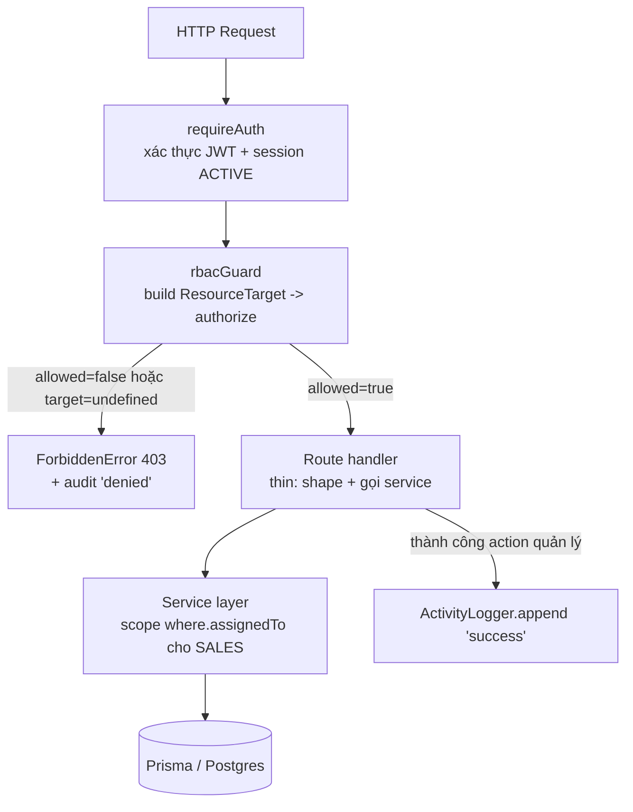

# Design Document

## Overview

Tài liệu thiết kế này mô tả cách hiện thực việc điều chỉnh quyền SALES đã được đặc tả trong `requirements.md`. Đây là một **bản sửa đổi chính sách RBAC** trên nền hợp đồng tích hợp hiện hành, **không phải thiết kế lại**:

- Phân quyền vẫn là **policy thuần** trong `src/auth/rbac.ts` (hàm `authorize`, helper `isAssignedOwner`) — deterministic, framework-free, property-testable.
- Thực thi vẫn theo **từng route** qua `rbacGuard` trong `src/http/authMiddleware.ts`.
- Tầng route vẫn **mỏng**: chỉ định hình request/response, gắn `auth` + `rbacGuard`, gọi service.
- Lỗi vẫn dùng envelope `{ error: { code, message } }` với `AppError`/`ForbiddenError` và tập status-code hạn chế.

Thiết kế gồm bốn nhóm thay đổi tách biệt, ánh xạ tới 7 requirement:

1. **Mở quyền (Req 1):** SALES được quản lý Platform Tokens, Document Catalog và Knowledge Base.
2. **Siết phạm vi (Req 2, 3):** SALES chỉ thấy job-order / candidate / nurturing 1-1 thuộc sở hữu của mình (assigned-only), thực thi ở **cả** RBAC guard (per-`:id`) **và** service layer (`where` trên collection).
3. **Đóng lỗ hổng collection (Req 4):** chiến lược thực thi nhiều lớp + fail-closed.
4. **Gỡ quyền (Req 5):** SALES mất quyền xem recruitment analytics (403), ADMIN giữ nguyên.

Cộng với hai requirement xuyên suốt: **deny-by-default / no-privilege-escalation (Req 6)** và **giám sát/nhật ký (Req 7)**.

### Hai phát hiện then chốt từ codebase (định hình thiết kế)

Khi đọc code hiện trạng, có hai sự thật bắt buộc phải xử lý ở thiết kế, nếu bỏ qua sẽ gây leo thang đặc quyền hoặc không thể thực thi được yêu cầu:

**Phát hiện A — Module `settings` đang dùng chung cho ba bề mặt nhạy cảm.** Ngoài Platform Tokens (`platforms/routes.ts`), module `settings` còn gác:
- `partners/routes.ts` — ghi đối tác (`settings/update`).
- `privacy/routes.ts` — sổ đồng ý (consent ledger) **và quyền-được-xóa (right-to-erasure / GDPR)** dùng `settings/read` + `settings/update`.

Vì vậy, nếu **lật phẳng** `settings/read`+`settings/update` cho SALES (như cách đọc trực tiếp AC 1.1–1.2), SALES sẽ **đồng thời** chạm được ghi đối tác và **xóa dữ liệu cá nhân theo GDPR** — vi phạm trực tiếp Req 6 (no-privilege-escalation). Thiết kế **không** làm thế. Thay vào đó, các bề mặt SALES được cấp sẽ tách thành **module riêng, hạt mịn**, để `settings` vẫn ADMIN-only. (Xem Open Question Req 1 — quyết định này chính là lời giải.)

**Phát hiện B — `JobOrder` không có trường chủ sở hữu.** Model `JobOrder` (`prisma/schema.prisma`) chỉ có `branchId` và back-relation `candidates`, **không** có `assignedTo`/`createdBy`. Hiện job-order routes dùng `collectionGuard` (không kèm `ownerUserId`), nên SALES hiện đọc/sửa **mọi** job-order. Để hiện thực Req 2 (assigned-only cho job-order) ta **bắt buộc** bổ sung trường sở hữu `assignedTo` cho `JobOrder` (mirror `CandidateProfile`) — đây là thay đổi data-model duy nhất của spec này.

### Hiện trạng nhanh các bề mặt liên quan

| Bề mặt | Route | Guard hiện tại | SALES hiện tại |
|---|---|---|---|
| Platform tokens (list/refresh) | `/api/platform-tokens*` | `settings` read/update | Bị từ chối |
| Document catalog (GET/PUT) | `/api/v1/document-catalog/:market` | GET `lead_management/read`, PUT `settings/update` | GET cho phép, PUT từ chối |
| Document checklist (per-candidate) | `/api/v1/candidates/:id/documents*` | `lead_management`, owner theo `candidate.assignedTo` | Assigned-only ✔ (đã đúng) |
| Knowledge base (GET/POST/PUT) | `/api/v1/knowledge*` | `generation` read/create/update | Bị từ chối |
| Job orders (list/stats/:id) | `/api/v1/job-orders*` | `collectionGuard` (không owner) | Đọc/sửa **mọi** đơn (lỗ hổng) |
| Candidates (list/search/stats) | `/api/v1/candidates*` | `collectionGuard` + service scope | Assigned-only ở service ✔ |
| Candidate `:id` | `/api/v1/candidates/:id*` | `candidateTargetById` | Assigned-only ✔ |
| Recruitment analytics (×4) | `/api/v1/candidates/analytics/*` | `collectionGuard('read')` → `lead_management/read` | **Cho phép** (lỗ hổng Req 5) |
| Follow-up / nurturing 1-1 | `/api/v1/follow-ups*` | `lead_management` read/update (không scope) | Thấy **mọi** task (lỗ hổng Req 3) |

## Architecture

### Mô hình thực thi hai lớp (giữ nguyên, làm rõ hợp đồng)



Hai lớp phòng thủ cho dữ liệu assigned-only:

- **Lớp 1 — RBAC guard (per-resource):** với route có `:id`, builder phân giải `ownerUserId` (từ `candidate.assignedTo`, `jobOrder.assignedTo`, hoặc `item.candidate.assignedTo`) rồi gọi `authorize()`. Quyết định allow/deny là **thuần** theo `(role, module, action, ownerUserId)`.
- **Lớp 2 — Service scoping (per-collection):** với list/search/stats (không có `:id` cụ thể), guard chỉ gác `(module, action)`; việc loại bỏ hàng của người khác do service thực hiện bằng `where.assignedTo = actor.userId` khi `role === 'SALES'`. Đây là tuyến phòng thủ chính cho collection, đồng thời là tuyến vá cho tài nguyên `assignedTo = null` mà guard per-`:id` không bắt được (vì `ownerUserId` khi đó là `undefined`).

Nguyên tắc **fail-closed**: `rbacGuard` đã từ chối 403 khi builder trả `undefined` hoặc throw; service ném `ForbiddenError` khi SALES truy cập tài nguyên không thuộc sở hữu. `isAssignedOwner(caller, undefined) === false` đảm bảo chủ sở hữu không xác định **không bao giờ** khớp SALES.

### Chiến lược biểu diễn quyền trong Module/Action (quyết định cốt lõi)

Thay vì lật phẳng module dùng chung (`settings`, `generation`) cho SALES — vốn kéo theo leo thang đặc quyền (Phát hiện A) — ta **mở rộng taxonomy Module** bằng các module hạt mịn cho đúng từng bề mặt SALES được cấp, và **re-target** route tương ứng. Việc này giữ `settings`/`generation` ADMIN-only, bảo toàn deny-by-default.

Bổ sung vào union `Module` trong `auth/rbac.ts`:

- `platform_tokens` — gác `/api/platform-tokens*` (thay cho `settings`).
- `document_catalog` — gác `/api/v1/document-catalog/:market` GET+PUT (thay cho `lead_management/read` + `settings/update`).
- `knowledge_base` — gác `/api/v1/knowledge*` (thay cho `generation`).

Recruitment analytics **không** cần module mới: re-target 4 route từ `lead_management/read` sang **`analytics/read`** (module `analytics` đã tồn tại, SALES vốn đã bị từ chối, ADMIN được phép) — vừa đủ để 403 SALES (Req 5) mà không ảnh hưởng ADMIN.

> Lý do chọn module mới thay vì lật `settings`: AC 1.1–1.3 mô tả **quyền logic** “đọc/làm mới platform token”. Mô hình hóa quyền đó bằng module riêng `platform_tokens` thỏa mãn hành vi AC 1.1–1.3 **đồng thời** không cấp kèm partner-write và GDPR-erasure cho SALES (giữ Req 6). Đây là cách “sạch” trong Module/Action mà đề bài yêu cầu.

### Bảng quyết định `authorize()` cho SALES — Trước/Sau

`ADMIN` luôn `{ allowed: true }` ở mọi `(module, action, ownerUserId)` — **không đổi** (Req 1.10, 5.4).

| Module | Action | SALES — TRƯỚC | SALES — SAU | Ghi chú |
|---|---|---|---|---|
| `platform_tokens` *(mới)* | `read` | (n/a → `settings` = 403) | **allow** | Req 1.1 |
| `platform_tokens` *(mới)* | `update` | (n/a → `settings` = 403) | **allow** | Req 1.2 |
| `platform_tokens` *(mới)* | khác | — | 403 | deny-by-default |
| `document_catalog` *(mới)* | `read` | (qua `lead_management/read` = allow) | **allow** | Req 1.4 |
| `document_catalog` *(mới)* | `update` | (qua `settings/update` = 403) | **allow** | Req 1.5 |
| `document_catalog` *(mới)* | khác | — | 403 | deny-by-default |
| `knowledge_base` *(mới)* | `read` | (qua `generation/read` = 403) | **allow** | Req 1.9 |
| `knowledge_base` *(mới)* | `create` | (qua `generation/create` = 403) | **allow** | Req 1.6 |
| `knowledge_base` *(mới)* | `update` | (qua `generation/update` = 403) | **allow** | Req 1.7, 1.8 (deactivate = update `active:false`) |
| `knowledge_base` *(mới)* | `delete` | — | 403 | KB không có hard-delete; ADMIN-only nếu sau này thêm |
| `lead_management` | `read`/`update`/`status_update` | allow nếu owner khớp | allow nếu owner khớp | **không đổi** (Req 2.3, 3.4, 3.7) |
| `lead_management` | `create` | 403 | 403 | không đổi |
| `lead_management` | `delete` | 403 | 403 | Req 2.5 |
| `dashboard` | `read` (≠ company_stats) | allow | allow | Req 6.6 |
| `dashboard` | `company_stats` | 403 | 403 | Req 6.4 |
| `dashboard` | `create`/`update`/`delete` | 403 | 403 | Req 6.3 |
| `analytics` | mọi action | 403 | 403 | Req 5 (recruitment analytics re-target về đây) |
| `settings` | mọi action | 403 | 403 | **giữ ADMIN-only** (partners-write, privacy/GDPR) |
| `generation`/`strategy`/`publishing`/`feedback` | mọi action | 403 | 403 | Req 6.5 |
| `user_management` | mọi action | 403 | 403 | Req 6.2 |

Chỉ các ô in đậm **lật từ deny → allow** cho SALES; toàn bộ phần còn lại giữ nguyên deny-by-default.

## Components and Interfaces

### 1. `auth/rbac.ts` — Authorization_Service (thay đổi trung tâm)

Mở rộng union `Module` và bổ sung nhánh allow-list cho SALES. Chữ ký `authorize`/`isAssignedOwner` và kiểu `AuthzDecision`, `ResourceTarget`, `AuthContext` **không đổi**.

```ts
export type Module =
  | 'strategy' | 'generation' | 'publishing' | 'analytics'
  | 'feedback' | 'lead_management' | 'settings' | 'dashboard'
  | 'user_management'
  // NEW — bề mặt SALES được cấp, tách khỏi module dùng chung để tránh leo thang đặc quyền:
  | 'platform_tokens' | 'document_catalog' | 'knowledge_base';

// Tập (module, action) cho phép SALES, ngoài lead_management/dashboard.
const SALES_CONFIG_GRANTS: Readonly<Record<string, ReadonlySet<Action>>> = {
  platform_tokens: new Set(['read', 'update']),       // Req 1.1, 1.2
  document_catalog: new Set(['read', 'update']),      // Req 1.4, 1.5
  knowledge_base:  new Set(['read', 'create', 'update']), // Req 1.6–1.9 (deactivate = update)
};

export function authorize(ctx: AuthContext, target: ResourceTarget): AuthzDecision {
  if (ctx.role === 'ADMIN') return { allowed: true };          // Req 1.10, 5.4

  if (ctx.role === 'SALES') {
    // (1) Bề mặt cấu hình/tham chiếu mới — allow-list tường minh.
    const granted = SALES_CONFIG_GRANTS[target.module];
    if (granted) return granted.has(target.action) ? { allowed: true } : { allowed: false, status: 403 };

    // (2) lead_management — assigned-only (GIỮ NGUYÊN).
    if (target.module === 'lead_management') {
      if (target.action === 'delete') return { allowed: false, status: 403 };           // Req 2.5
      if (target.ownerUserId !== undefined && !isAssignedOwner(ctx.userId, target.ownerUserId))
        return { allowed: false, status: 403 };                                          // Req 2.3, 3.4
      if (target.action === 'read' || target.action === 'status_update' || target.action === 'update')
        return { allowed: true };                                                        // Req 3.7
      return { allowed: false, status: 403 };                                            // create → 403
    }

    // (3) dashboard — read cá nhân; company_stats & writes bị từ chối (GIỮ NGUYÊN).
    if (target.module === 'dashboard') {
      if (target.action === 'company_stats') return { allowed: false, status: 403 };     // Req 6.4
      if (WRITE_ACTIONS.has(target.action)) return { allowed: false, status: 403 };      // Req 6.3
      return { allowed: true };                                                          // Req 6.6
    }

    // (4) Mọi thứ còn lại (settings, generation, analytics, user_management, ...) → 403.
    return { allowed: false, status: 403 };   // Req 5.1, 5.3, 6.1, 6.2, 6.5
  }

  return { allowed: false, status: 403 };      // vai trò không xác định → fail-closed
}
```

Tính chất giữ nguyên: hàm **thuần & deterministic** (Req 4.3), chỉ phụ thuộc `(role, module, action, ownerUserId)`, không state ẩn → no-privilege-escalation (Req 6.7).

### 2. `http/authMiddleware.ts` — `rbacGuard` + hook audit từ chối

`rbacGuard` giữ nguyên hành vi (target `undefined` → 403; `authorize` deny → 403). Bổ sung **hook audit best-effort** cho nhánh từ chối (Req 7.2, 7.3) mà **không** đưa logic audit vào `rbac.ts` (giữ policy thuần):

```ts
export interface RbacAuditor {
  recordDenied(input: {
    actorUserId: string; module: Module; action: Action; targetId?: string;
  }): void; // fire-and-forget, tự nuốt lỗi, không chặn response
}

export function rbacGuard(build: TargetBuilder, auditor?: RbacAuditor): preHandlerHookHandler {
  return async (request, reply) => {
    const auth = getAuth(request);
    const target = await build(request, reply);
    if (!target) { auditor?.recordDenied({ actorUserId: auth.userId, module: 'lead_management', action: 'read' }); throw new ForbiddenError(); }
    const decision = authorize({ userId: auth.userId, role: auth.role }, target);
    if (!decision.allowed) {
      auditor?.recordDenied({ actorUserId: auth.userId, module: target.module, action: target.action, targetId: (target as any).ownerUserId });
      throw new ForbiddenError();
    }
  };
}
```

`auditor` là tùy chọn để không phá vỡ các lời gọi `rbacGuard` hiện có; được tiêm tại `app.ts` từ một `AuthorizationAuditor` bọc `ActivityLogger`. Khi không tiêm, hành vi y hệt hôm nay.

### 3. `platforms/routes.ts` — re-target sang `platform_tokens`

Đổi hai guard `settings` → `platform_tokens`; thêm audit success cho refresh. Service `tokenManager.listPublic()`/`refresh()` **không đổi** — đã trả `PublicTokenView` không chứa secret (thỏa AC 1.1, 1.2 về “không lộ giá trị bí mật”).

```ts
rbacGuard(() => ({ module: 'platform_tokens', action: 'read' }))    // GET list
rbacGuard(() => ({ module: 'platform_tokens', action: 'update' }))  // POST :platform/refresh
// sau refresh thành công: activityLogger.append({ action: 'PLATFORM_TOKEN_REFRESHED', targetType: 'platform_token', targetId: platform, detail: { status: view.valid } })
```

### 4. `recruitment/documents/routes.ts` — re-target catalog sang `document_catalog`

Checklist per-candidate (`candidateTargetById`, `itemTargetById`) **giữ nguyên** — đã assigned-only đúng (Req 3.7, 3.8). Chỉ đổi guard catalog:

```ts
const catalogReadGuard   = rbacGuard(() => ({ module: 'document_catalog', action: 'read' }));   // GET
const catalogUpdateGuard = rbacGuard(() => ({ module: 'document_catalog', action: 'update' })); // PUT
// sau PUT thành công: append 'DOCUMENT_CATALOG_UPDATED', targetId = market
```

### 5. `recruitment/agent/routes.ts` — re-target knowledge sang `knowledge_base`

Các route consult/draft/suggest (`/api/v1/ai/*`) **giữ** module `generation` (ADMIN-only) và assistant **giữ** `dashboard/read`. Chỉ ba route knowledge đổi guard:

```ts
const kbRead   = rbacGuard(() => ({ module: 'knowledge_base', action: 'read'   })); // GET /knowledge
const kbCreate = rbacGuard(() => ({ module: 'knowledge_base', action: 'create' })); // POST /knowledge
const kbUpdate = rbacGuard(() => ({ module: 'knowledge_base', action: 'update' })); // PUT /knowledge/:id (gồm deactivate active:false)
// sau mỗi thao tác ghi thành công: append 'KNOWLEDGE_CREATED' | 'KNOWLEDGE_UPDATED' | 'KNOWLEDGE_DEACTIVATED'
```

### 6. `recruitment/routes.ts` — job-order owner + analytics deny

**Job orders (Req 2):** thêm builder `jobOrderTargetById` (mirror `candidateTargetById`) phân giải `ownerUserId` từ `jobOrder.assignedTo`, áp cho các route `:id`:

```ts
const jobOrderTargetById = (action: Action) =>
  rbacGuard(async (request) => {
    const { id } = request.params as IdParams;
    const order = await prisma.jobOrder.findUnique({ where: { id }, select: { assignedTo: true } });
    return { module: 'lead_management' as const, action, ownerUserId: order?.assignedTo ?? undefined };
  }, auditor);

// GET/PUT/POST :id/close  -> jobOrderTargetById('read' | 'update' | 'update')
// GET list, GET-less stats -> collectionGuard('read') (giữ guard module; scope ở service)
// POST create, DELETE      -> giữ collectionGuard('create'|'delete') => SALES vẫn 403 (job-order do ADMIN quản lý/giao)
```

`list`/`stats` truyền thêm `actor` xuống service để scope (mục Data/Service bên dưới).

**Recruitment analytics (Req 5):** đổi guard 4 route từ `collectionGuard('read')` (→ `lead_management`) sang `analytics/read`:

```ts
const analyticsGuard = rbacGuard(() => ({ module: 'analytics', action: 'read' }));
// /candidates/analytics/funnel | /by-market | /by-source | /conversion-by-job-order  -> [auth, analyticsGuard]
```

SALES → 403 (Req 5.1, 5.3) ngay tại preHandler, **trước** mọi truy vấn analytics (Req 5.2). ADMIN → 200 đầy đủ (Req 5.4). Nhánh scope-theo-SALES trong `candidateAnalytics.ts` trở thành **đường chết** cho SALES (không còn lối tới), nhưng giữ lại vô hại và đường ADMIN không đổi.

### 7. `intake/followUpRoutes.ts` + `followUpService.ts` — nurturing 1-1 assigned-only (Req 3.5, 3.6)

`followUpRoutes` truyền `actor = getAuth(request)` vào `service.list(...)`. `FollowUpService.list` nhận `actor` và scope theo quyền sở hữu candidate:

```ts
async list(status, page, limit, actor: AuthInfo) {
  const where: Prisma.FollowUpTaskWhereInput = status ? { status } : {};
  if (actor.role === 'SALES') {
    // chỉ task gắn candidate mà SALES sở hữu; task không có candidate -> loại (fail-closed, Req 4.4)
    const owned = await this.prisma.candidateProfile.findMany({
      where: { assignedTo: actor.userId }, select: { id: true },
    });
    where.candidateId = { in: owned.map(c => c.id) };
  }
  // ... findMany + count như cũ
}
```

Route nurturing theo từng candidate (nếu có/khi bổ sung) dùng `candidateTargetById('read'|'update')` để 403 khi không sở hữu (Req 3.5). `scan`/`send-due`/`cancel` là thao tác nền/ADMIN-style ghi (`lead_management/update`) — giữ nguyên guard.

## Data Models

### Thay đổi schema duy nhất: `JobOrder.assignedTo`

`JobOrder` hiện không có trường sở hữu (Phát hiện B). Bổ sung trường `assignedTo` (mirror `CandidateProfile.assignedTo`) để hiện thực assigned-only:

```prisma
model JobOrder {
  // ... các trường hiện có ...
  assignedTo     String?            // consultant userId được giao đơn hàng này
  // ...
  @@index([assignedTo])
}
```

- **Migration:** thêm cột nullable + index; không phá dữ liệu cũ (đơn cũ `assignedTo = null`). Chạy `prisma:generate` + tạo migration.
- **Ngữ nghĩa sở hữu:** đơn `assignedTo = null` (chưa giao) → đối với SALES coi như **không thuộc sở hữu** (Req 4.4) và bị loại khỏi mọi kết quả của SALES; ADMIN thấy tất cả.
- **Gán chủ:** việc gán đơn cho SALES do ADMIN thực hiện (job-order create/delete vẫn ADMIN-only như hiện trạng); nếu sau này cho SALES tạo đơn, set `assignedTo = actor.userId` lúc tạo.

### Scoping ở service layer (where-clause)

| Service / method | Thay đổi | Requirement |
|---|---|---|
| `JobOrderService.list` / `search` / `stats` *(stats: bổ sung)* | thêm tham số `actor`; khi `SALES` → `where.assignedTo = actor.userId` | 2.1, 2.2, 2.4 |
| `JobOrderService.get` | thêm `actor`; khi `SALES` và `order.assignedTo !== actor.userId` → `ForbiddenError` | 2.3 |
| `CandidateService.list` / `search` / `stats` | **đã có** `where.assignedTo = actor.userId` cho SALES — giữ nguyên | 3.1, 3.2, 3.3 |
| `CandidateService.get` / `update` / `matchToJobOrder` | **đã có** chốt `assignedTo !== userId → Forbidden` — giữ nguyên | 3.4 |
| `FollowUpService.list` | thêm `actor`; SALES → `where.candidateId in {owned}` | 3.6 |
| `DocumentChecklistService.*` | **đã** assigned-only qua route `candidateTargetById`/`itemTargetById` — giữ nguyên | 3.7, 3.8 |
| `TokenManager.listPublic` / `refresh` | **không đổi** — đã trả `PublicTokenView` không secret | 1.1, 1.2 |

> Mẫu “service-scoping cho SALES” đã được dùng nhất quán trong `CandidateService.buildListWhere` và `CandidateAnalyticsService.buildWhere`. Thiết kế chỉ **nhân rộng** mẫu này sang `JobOrderService` và `FollowUpService`, không phát minh cơ chế mới.

### Audit / ActivityLog (Req 7)

Tái dùng `ActivityLog` (append-only) + `ActivityLogger.append`. Mở rộng union `ActivityAction` trong `oversight/types.ts`:

```ts
export type ActivityAction =
  | 'DOCUMENT_VERIFIED' | 'CANDIDATE_STAGE_CHANGED' | 'LEAD_STATUS_CHANGED'
  // NEW — thao tác quản lý của SALES + từ chối phân quyền:
  | 'PLATFORM_TOKEN_REFRESHED' | 'DOCUMENT_CATALOG_UPDATED'
  | 'KNOWLEDGE_CREATED' | 'KNOWLEDGE_UPDATED' | 'KNOWLEDGE_DEACTIVATED'
  | 'AUTHZ_DENIED';
```

Bản ghi audit gồm: `actorUserId`, `action` (module/loại hành động), `targetType`, `targetId`, `detail` (verbatim, **không secret**), `createdAt` (server-stamp, ms). Đọc qua `ActivityLogger.listRecent` (ADMIN-only, đã có) cho Req 7.5.

- **Success path (Req 7.1):** route gọi `activityLogger.append(...)` sau khi action commit; best-effort, không chặn response, hoàn tất tức thì (≪ 5s).
- **Denied path (Req 7.2, 7.3):** `rbacGuard` gọi `auditor.recordDenied(...)` → `append({ action: 'AUTHZ_DENIED', targetType: 'authorization', ... })` trước khi ném 403.
- **No secrets (Req 7.4):** `detail` chỉ chứa metadata (platform name, market, entry id, module/action). Token value không bao giờ vào `detail`; thông điệp lỗi vẫn đi qua `redact` ở global handler.

## Correctness Properties

*Một property là một đặc tính hoặc hành vi phải luôn đúng trên mọi lần thực thi hợp lệ của hệ thống — về bản chất là một phát biểu hình thức về việc hệ thống PHẢI làm gì. Property là cầu nối giữa đặc tả cho người đọc và bảo đảm đúng đắn mà máy kiểm chứng được.*

PBT **áp dụng** cho spec này vì phần lõi — `authorize()` và `isAssignedOwner()` trong `auth/rbac.ts` — là **hàm thuần, deterministic** với không gian đầu vào lớn `(role × module × action × ownerUserId)`, và phần lọc collection có thể mô hình hóa thuần (model-based). Các hành vi I/O (refresh token, ghi audit, thứ tự preHandler, envelope lỗi) **không** phù hợp PBT và được phủ bằng unit/integration example (xem Testing Strategy).

Sau bước prework + reflection (hợp nhất ~35 acceptance criteria), còn lại **5 property cốt lõi + 1 bổ đề helper**, mỗi property mang giá trị kiểm chứng riêng biệt.

### Property 1: Bảng quyết định SALES — allow đúng bằng allow-set

*For all* `module`, `action`, và `ownerUserId` tùy ý, `authorize({ role: 'SALES' }, target)` trả `allowed === true` **khi và chỉ khi** `target` khớp allow-set của SALES, nơi allow-set gồm: `platform_tokens ∈ {read, update}`, `document_catalog ∈ {read, update}`, `knowledge_base ∈ {read, create, update}`, `dashboard ∈ {read, create, update, delete, status_update} \ {company_stats, create, update, delete}` (tức chỉ các read khác `company_stats`), và `lead_management ∈ {read, update, status_update}` với điều kiện owner khớp; mọi cặp khác (gồm `settings`, `generation`, `strategy`, `publishing`, `analytics`, `feedback`, `user_management`, và `lead_management/delete`) trả `allowed === false` với `status === 403`. Quyết định chỉ phụ thuộc `target` hiện tại, không phụ thuộc bất kỳ quyền nào trên module khác.

**Validates: Requirements 1.1, 1.2, 1.3, 1.4, 1.5, 1.6, 1.7, 1.8, 1.9, 2.5, 5.1, 5.3, 6.1, 6.2, 6.3, 6.4, 6.5, 6.6, 6.7**

### Property 2: ADMIN luôn được phép

*For all* `module`, `action`, và `ownerUserId` tùy ý, `authorize({ role: 'ADMIN' }, target)` trả `allowed === true`, không có ngoại lệ theo cấu hình hay trạng thái chính sách.

**Validates: Requirements 1.10, 5.4**

### Property 3: Owner-match cho lead_management (read/update/status_update)

*For all* `callerUserId` và `ownerUserId` tùy ý và mọi `action ∈ {read, update, status_update}`, `authorize({ role: 'SALES' }, { module: 'lead_management', action, ownerUserId })` trả `allowed === true` **khi và chỉ khi** `isAssignedOwner(callerUserId, ownerUserId)` là `true` (tức `ownerUserId` xác định và bằng `callerUserId`); ngược lại trả `allowed === false, status 403`.

**Validates: Requirements 2.3, 3.4, 3.5, 3.7, 3.8**

### Property 4: Collection scoping — kết quả của SALES là tập con của tập sở hữu

*For all* tập tài nguyên ngẫu nhiên (candidate / job-order / follow-up-task, mỗi phần tử có trường sở hữu `assignedTo` hoặc `candidateId` liên kết) và mọi `salesId`, kết quả truy xuất collection (list / search / stats) ở tầng service cho `actor = { role: 'SALES', userId: salesId }` **chỉ** chứa các tài nguyên mà `salesId` là Assigned_Owner, và chứa **0** tài nguyên có chủ sở hữu khác hoặc chủ sở hữu không xác định; khi không có tài nguyên nào thuộc sở hữu, kết quả là tập rỗng.

**Validates: Requirements 2.1, 2.2, 2.4, 3.1, 3.2, 3.3, 3.6, 4.1, 4.2**

### Property 5: `authorize` là deterministic

*For all* `(ctx, target)` tùy ý, hai lần gọi `authorize(ctx, target)` liên tiếp trả về cùng một `AuthzDecision` (cùng `allowed`, và cùng `status` khi bị từ chối), độc lập với thời điểm và thứ tự gọi.

**Validates: Requirements 4.3**

### Property 6: Chủ sở hữu không xác định không bao giờ khớp (bổ đề helper)

*For all* `callerUserId` tùy ý, `isAssignedOwner(callerUserId, undefined) === false`; và với mọi `ownerUserId` xác định, `isAssignedOwner(callerUserId, ownerUserId) === (ownerUserId === callerUserId)`. Hệ quả: tài nguyên `assignedTo = null` luôn bị loại khỏi tập kết quả của SALES (fail-closed).

**Validates: Requirements 4.4**

## Error Handling

Toàn bộ lỗi đi qua envelope chuẩn `{ error: { code, message } }` và tập status-code hạn chế (`infra/errors.ts`), không thêm mã mới:

| Tình huống | Cơ chế | Status | Code |
|---|---|---|---|
| SALES truy cập (module, action) ngoài allow-set | `authorize` deny → `rbacGuard` ném `ForbiddenError` | 403 | `FORBIDDEN` |
| SALES truy cập job-order/candidate `:id` không sở hữu | `authorize` deny (owner-mismatch) hoặc service ném `ForbiddenError` | 403 | `FORBIDDEN` |
| SALES gọi recruitment analytics | `analytics/read` deny tại preHandler (trước truy vấn) | 403 | `FORBIDDEN` |
| Builder của guard lỗi / thiếu AuthContext | `rbacGuard` ném `ForbiddenError` (fail-closed) | 403 | `FORBIDDEN` |
| Đầu vào không hợp lệ (market/stage/date…) | service ném `ValidationError` (giữ nguyên) | 400 | `VALIDATION_ERROR`/cụ thể |
| Tài nguyên không tồn tại sau khi qua guard | service ném `NotFoundError` | 404 | `NOT_FOUND` |

Nguyên tắc:

- **Fail-closed:** mọi đường không quyết định được đều dẫn tới 403, không bao giờ trả tập dữ liệu chưa lọc (Req 4.5).
- **State-preservation:** vì `rbacGuard` là preHandler chạy **trước** handler, một yêu cầu bị từ chối không bao giờ chạm tầng service → không đổi dữ liệu (Req 6.7, 7.2). Service-level check (owner-mismatch) ném trước mọi lệnh ghi.
- **Redaction:** thông điệp lỗi đi qua `redact` ở global error handler (`app.ts`); audit `detail` chỉ chứa metadata (Req 7.4).
- **Best-effort audit:** ghi audit (success/denied) không bao giờ chặn hay làm hỏng response chính; lỗi audit bị nuốt (mẫu của `OversightService`).

## Testing Strategy

### Phân tầng

- **Property-based (fast-check) trên hàm thuần** — kiểm 6 property ở trên đối với `authorize()`/`isAssignedOwner()` và hàm lọc collection. Đây là trọng tâm vì không gian đầu vào lớn.
- **Unit (Vitest, example)** — service & shape: `TokenManager` view không secret, `KnowledgeService` create-active/deactivate-soft-delete, `FollowUpService.list` scoping với dữ liệu cố định.
- **Integration / route-level (Vitest)** — thứ tự thực thi guard, envelope lỗi, audit success/denied, và "service không bị gọi khi 403".

### Cấu hình property tests

- Thư viện: **fast-check** (đã dùng trong repo, ví dụ `foundation.properties.test.ts`). KHÔNG tự viết PBT từ đầu.
- Tối thiểu **100 iteration** mỗi property (`fc.assert(fc.property(...), { numRuns: 100 })` trở lên).
- Generator: `fc.constantFrom(...)` cho `Module`/`Action`/`Role`; `fc.option(fc.string())` cho `ownerUserId`; `fc.array(fc.record({ assignedTo: fc.option(userIdArb) }))` cho tập tài nguyên collection.
- Mỗi test gắn tag tham chiếu property của design, theo định dạng:
  - `// Feature: sales-access-restrictions, Property {n}: {nội dung property}`
- Mỗi correctness property hiện thực bằng **một** property-based test.
- File đề xuất: `test/sales-access-restrictions.properties.test.ts` (cạnh `foundation.properties.test.ts`).

### Ánh xạ property → test (PBT)

| Property | Hàm dưới test | Sinh dữ liệu |
|---|---|---|
| 1 — decision-table SALES | `authorize` | mọi `(module, action, ownerUserId?)`; so với allow-set tham chiếu |
| 2 — ADMIN allow | `authorize` | mọi `(module, action, ownerUserId?)` |
| 3 — owner-match | `authorize` + `isAssignedOwner` | `(caller, owner?)` × action ∈ {read,update,status_update} |
| 4 — collection scoping | hàm lọc service (candidate/job-order/follow-up) | mảng tài nguyên + `salesId` |
| 5 — determinism | `authorize` | mọi `(ctx, target)`; gọi 2 lần so deepEqual |
| 6 — helper undefined | `isAssignedOwner` | `(caller, owner?)` |

> Cho Property 4, tách phần thuần: trích logic lọc thành predicate kiểm thử được (hoặc test `buildListWhere`/where-builder qua một adapter in-memory) để chạy 100+ iteration không cần Postgres. Nếu cần chạm Prisma, dùng integration test 1–3 ví dụ thay vì PBT.

### Unit / Integration (example) — KHÔNG dùng PBT

| Hạng mục | Loại | Requirement |
|---|---|---|
| `PublicTokenView` không có trường secret; refresh trả metadata | unit | 1.1, 1.2 |
| `KnowledgeService.create` → `active=true`; `deactivate` → `active=false`, row còn nguyên | unit | 1.6, 1.8 |
| Recruitment analytics: SALES → 403 và service analytics KHÔNG được gọi | integration (spy) | 5.2 |
| ADMIN analytics → 200 + dữ liệu | integration | 5.4 |
| Guard builder lỗi → 403, không body dữ liệu (fail-closed) | route | 4.5 |
| Bị 403 thì handler/service không chạy, dữ liệu không đổi | route | 6.7, 7.2 |
| Audit success: 1 bản ghi đủ trường sau action quản lý | integration | 7.1 |
| Audit denied: `AUTHZ_DENIED` đủ trường khi bị 403 | integration | 7.3 |
| Audit không chứa secret (detail chỉ metadata) | unit | 7.4 |
| `ActivityLogger.listRecent` trả đủ trường cho ADMIN | integration | 7.5 |
| Regression: `settings` vẫn 403 cho SALES (partners-write, privacy/GDPR còn ADMIN-only) | route | 6.5 (no-escalation) |

### Regression cần giữ xanh

- `dashboard-rbac.regression.test.ts` và `foundation.properties.test.ts` phải tiếp tục pass — việc mở rộng union `Module` và thêm nhánh allow-list không được đổi hành vi ADMIN hay các deny hiện có.

## Security Note — cấp SALES quyền Platform Tokens

Cấp SALES `platform_tokens/read` + `platform_tokens/update` mở rộng bề mặt tấn công vào một tài nguyên cấu hình nhạy cảm. Các biện pháp giảm thiểu đã có và bắt buộc giữ:

- **Không bao giờ lộ giá trị secret.** Giá trị token nằm trong Secret_Store, không trong DB; API chỉ trả `PublicTokenView` (platform, type, expiresAt, valid). SALES `read` chỉ thấy metadata (Req 1.1) — refresh chỉ trả metadata (Req 1.2).
- **`update` = refresh, không phải set giá trị.** Route SALES chạm được là `POST /:platform/refresh` (token-exchange phía server). Không có route cho phép **ghi giá trị token thô**; việc đăng ký token (`register`) không expose cho SALES.
- **Giữ `settings` ADMIN-only.** Vì lựa chọn dùng module riêng `platform_tokens`, SALES **không** kế thừa các bề mặt `settings` khác — đặc biệt **privacy/GDPR right-to-erasure** và **partners-write** — tránh leo thang đặc quyền (Req 6).
- **Kiểm toán mọi refresh của SALES.** `PLATFORM_TOKEN_REFRESHED` ghi `userId/platform/timestamp/result` (không secret) để ADMIN truy vết (Req 7.1, 7.4).
- **Open Question còn mở.** Nếu review quyết định SALES **không** nên chạm platform tokens, chỉ cần **bỏ entry `platform_tokens` khỏi `SALES_CONFIG_GRANTS`** — `authorize` lập tức 403 SALES trên module này mà không ảnh hưởng document_catalog/knowledge_base. Thiết kế cô lập đúng một dòng để đảo quyết định này.
