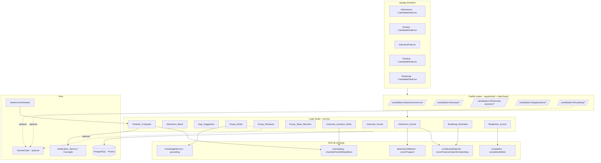
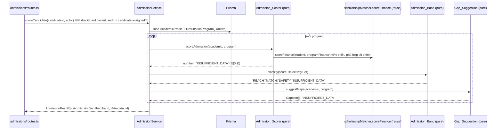
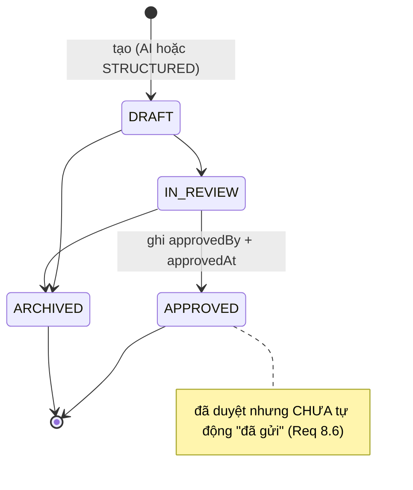
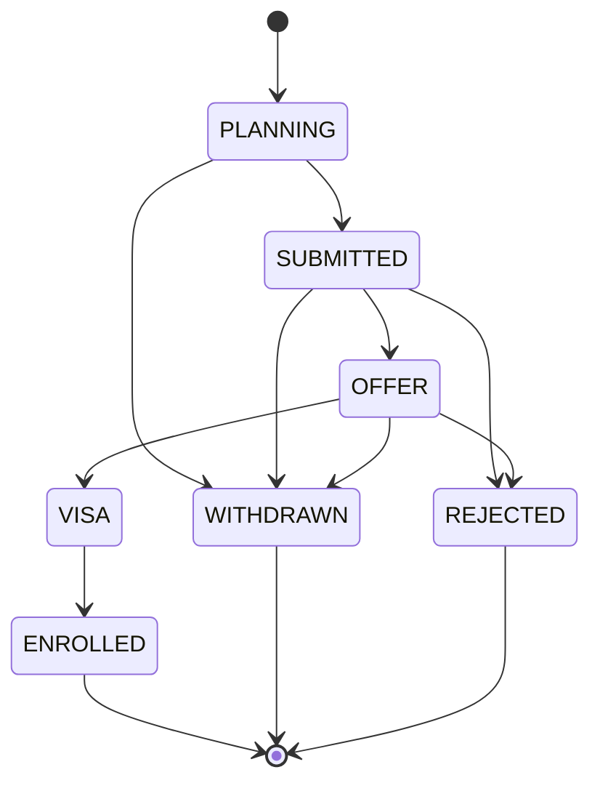

# Design Document — study-abroad-ai-advisor-suite

## Overview

Gói tính năng **study-abroad-ai-advisor-suite** bổ sung năm nhóm năng lực tư vấn du học bằng AI vào nền tảng AutoTGC (khách hàng: Thanh Giang Conincon — du học / XKLĐ), xây dựng **additive** trên kiến trúc hiện có (Fastify 4 + Prisma 5/PostgreSQL 16, Redis/ioredis, JWT `jose` + RBAC `ADMIN`/`SALES`, Google Gemini ngoại vi qua gateway OpenAI-compatible, Vitest + fast-check, PM2 + Nginx). Thiết kế tuân thủ nghiêm các quy tắc steering: phân lớp (domain thuần ↔ route mỏng), `AppError` có kiểu với tập mã trạng thái giới hạn, an toàn chia 0 (`INSUFFICIENT_DATA`), RBAC thuần ở `auth/rbac.ts`, fail-fast secrets, không endpoint không xác thực.

Nguyên tắc cốt lõi xuyên suốt gói: **tái sử dụng tối đa các khối thuần đã có, không nhân bản logic.** `Admission_Scorer` và `Roadmap_Estimator` dùng lại `scholarshipMatcher` (chi phí ròng + % học bổng); chấm điểm trúng tuyển bổ trợ (KHÔNG thay thế) `destinationMatcher` (eligibility/blockers); `Timeline_Computer` + `ApplicationCase` dùng lại `visaCatalog.checklistFor`/`withDeadlines` và tri thức quốc gia cho ngân hàng câu hỏi phỏng vấn; `Readiness_Scorer` dùng lại `completionMetric`; mọi đường AI theo mẫu `RecruitmentConsultantAgent`/`KnowledgeService` (Gemini-optional, fallback xác định, cờ `aiGenerated`, không bao giờ ném 502); mọi service gắn ứng viên mô phỏng `visaService` (SALES assigned-only qua `candidate.assignedTo`) và guard route theo `candidateTargetById` trong `recruitment/routes.ts`.

Năm nhóm năng lực:

1. **Chấm xác suất trúng tuyển + phân loại Reach/Match/Safety** — `Admission_Scorer` (thuần, [0,1], an toàn chia GPA, `INSUFFICIENT_DATA`), `Admission_Band` (thuần, phân band REACH/MATCH/SAFETY nhận biết độ chọn lọc, đơn điệu theo điểm), `Gap_Suggestion` (thuần, chỉ dùng ngưỡng chương trình), `AcademicProfile` (1–1 với `CandidateProfile`), các cột ngưỡng bổ sung trên `DestinationProgram`.
2. **Trợ lý viết & chấm SOP/Essay/Thư động lực/CV** — `Essay_Writer` (Gemini-optional + chọn rõ chế độ AI|STRUCTURED), `Essay_Reviewer` (rubric thuần [0,1], tổng trọng số 0 → điểm mặc định 0.0), `Essay_State_Machine` (DRAFT→IN_REVIEW→APPROVED, →ARCHIVED, 409), model `EssayDraft`.
3. **Luyện phỏng vấn visa** — `Interview_Question_Bank` (thuần, theo quốc gia/visa, grounding `visaCatalog`), `Interview_Agent` (Gemini-optional; quốc gia lạ → ngân hàng định sẵn, `aiGenerated=false`), `Interview_Scorer` (thuần [0,1], tổng trọng số 0 → trả ĐỒNG THỜI cờ `INSUFFICIENT_DATA` và điểm), model `InterviewSession` (snapshot phân công lúc tạo).
4. **Agent dòng thời gian hồ sơ chủ động** — `Timeline_Computer` (thuần, gộp `Due_Item` mọi `ApplicationCase`+`VisaCase`, bảo toàn tập, sắp hạn tăng dần ổn định), `ApplicationCase` + `ApplicationDueItem`, `Timeline_Agent` (nhắc lũy đẳng qua `Notification_Service`, cô lập lỗi), model `ReminderLog` (dedup `@@unique`), quét nhắc định kỳ qua `infra/jobs.ts`.
5. **Lộ trình Du học → Nghề nghiệp → Định cư (ROI) + điểm Sẵn sàng hồ sơ** — `Roadmap_Estimator` (thuần, chi phí ròng tái dùng `scholarshipMatcher`, `INSUFFICIENT_DATA` khi thiếu dữ liệu tài chính), `Readiness_Scorer` (thuần [0,1], tái dùng `completionMetric`), `Roadmap_Narrative` (Gemini-optional, REVIEW MODE cho mọi bản tường thuật), model `RoadmapNarrative`.

### Nguyên tắc thiết kế chủ đạo

- **Tách logic thuần khỏi I/O.** Mọi quyết định cốt lõi (chấm trúng tuyển, phân band, gợi ý gap, chấm rubric, chấm phỏng vấn, gộp/sắp dòng thời gian, ước lượng ROI, điểm sẵn sàng, chuyển trạng thái) là hàm thuần, export được để property-test trực tiếp — đúng mẫu `scholarshipMatcher`, `destinationMatcher`, `completion.ts`, `reportStateMachine`.
- **Gemini là tùy chọn.** Mọi đường AI có nhánh fallback xác định không ném lỗi (giống `RecruitmentConsultantAgent.consult`), đánh dấu `aiGenerated:false`; khi quốc gia/loại visa không xác định thì KHÔNG sinh AI mà dùng ngân hàng định sẵn (Req 10.4).
- **Review Mode mặc định.** Mọi `EssayDraft` và `RoadmapNarrative` luôn khởi tạo `DRAFT`; chuyển trạng thái cần con người. Mô phỏng `ReportStatus`/`reportStateMachine`.
- **Tái dùng khối đã có, không nhân bản.** `Admission_Scorer`/`Roadmap_Estimator` gọi `scoreFinance`/`matchScholarships`; `Timeline`/`ApplicationCase` gọi `checklistFor`/`withDeadlines`; `Readiness_Scorer` gọi `completionMetric`.
- **An toàn số học.** Chốt chặn mẫu số 0 → `INSUFFICIENT_DATA`; mọi điểm số luôn nằm trong `[0,1]`, không bao giờ `NaN`/`Infinity`.
- **Không tạo file/endpoint không xác thực.** Mọi route mới đứng sau `requireAuth` + `rbacGuard`; SALES assigned-only qua `candidate.assignedTo`.

## Architecture

### Bản đồ module (theo `src/<module>/` convention)

| Năng lực | Thư mục | Thành phần mới |
|---|---|---|
| Chấm trúng tuyển | `src/admissions/` (mới) | `admissionScorer.ts` (thuần), `admissionBand.ts` (thuần — banding nhận biết độ chọn lọc, đơn điệu, passthrough `INSUFFICIENT_DATA`), `gapSuggestion.ts` (thuần), `admissionService.ts` (I/O, SALES assigned-only, ADMIN mọi ứng viên), `routes.ts`, `types.ts` |
| SOP/Essay/CV | `src/essays/` (mới) | `essayWriter.ts` (Gemini-optional + chọn chế độ AI\|STRUCTURED), `essayReviewer.ts` (rubric thuần, trọng số 0 → 0.0, biên [0,1]), `essayStateMachine.ts` (thuần, 409), `essayService.ts` (I/O), `routes.ts`, `types.ts` |
| Luyện phỏng vấn | `src/interviewprep/` (mới) | `interviewQuestionBank.ts` (thuần, ngân hàng theo quốc gia/visa grounding `visaCatalog`), `interviewAgent.ts` (Gemini-optional; quốc gia lạ → ngân hàng định sẵn `aiGenerated=false`), `interviewScorer.ts` (thuần [0,1], trọng số 0 → dual return), `interviewService.ts` (lưu phiên, SALES scope tại thời điểm tạo), `routes.ts`, `types.ts` |
| Dòng thời gian | `src/applications/` (mới) | `timelineComputer.ts` (thuần — gộp `Due_Item`, bảo toàn tập, sắp hạn-asc ổn định, hạn-undefined xếp cuối, all-undefined hợp lệ), `applicationService.ts` (tạo `ApplicationCase`, init due-items qua `withDeadlines`), `timelineAgent.ts` (nhắc lũy đẳng qua `Notification_Service`; cô lập lỗi), `routes.ts`, `types.ts`; quét nhắc định kỳ tái dùng `infra/jobs.ts` |
| Lộ trình & ROI | `src/roadmap/` (mới) | `roadmapEstimator.ts` (thuần — chi phí ròng qua `scholarshipMatcher`, ghi chú nghề/định cư grounding KB, `INSUFFICIENT_DATA` khi thiếu tài chính), `readinessScorer.ts` (thuần [0,1], tái dùng `completionMetric` + tín hiệu học thuật + ngôn ngữ-vs-mục tiêu, an toàn chia 0), `roadmapNarrative.ts` (Gemini-optional, review-mode), `roadmapService.ts`, `routes.ts`, `types.ts` |

Tất cả registrar route mới được wire thêm trong `app.ts` (giống các `registerXxxRoutes` hiện có); job quét nhắc của `Timeline_Agent` được đăng ký trong `startScheduledJobs` của `infra/jobs.ts` (mẫu `registerReportJobs`).

### Sơ đồ ngữ cảnh



### Luồng chấm trúng tuyển (tái dùng scholarshipMatcher + destinationMatcher)



### Luồng nhắc dòng thời gian lũy đẳng (fail-isolated)

```mermaid
sequenceDiagram
  participant Cron as NodeCronScheduler (sweep)
  participant Agent as Timeline_Agent
  participant Comp as Timeline_Computer (pure)
  participant DB as Prisma
  participant NS as Notification_Service

  Cron->>Agent: sweepDueReminders(now)
  Agent->>DB: load ApplicationDueItem + VisaTask (chưa hoàn tất) theo ứng viên
  Agent->>Comp: computeTimeline(dueItems, now)  %% bảo toàn tập, sắp hạn-asc
  Comp-->>Agent: Due_Item[] đã sắp + cờ "trong cửa sổ nhắc"
  loop mỗi Due_Item trong cửa sổ nhắc & chưa hoàn tất
    Agent->>DB: tìm ReminderLog pending theo (dueItemId, windowKey)
    alt chưa có Reminder pending
      Agent->>DB: create ReminderLog (@@unique(dueItemId,windowKey))
      Agent->>NS: createReminder(notification) cho người phụ trách
    else đã có Reminder pending
      Note over Agent: bỏ qua — lũy đẳng (Req 15.2, 15.4)
    end
  end
  Note over Cron,Agent: lỗi tạo Reminder/realtime được nuốt (best-effort); KHÔNG hoàn tác tính dòng thời gian (Req 15.5)
```

## Components and Interfaces

### 1. Admissions (`src/admissions/`)

#### `types.ts` — kiểu dùng chung

```ts
export type AdmissionBandValue = 'REACH' | 'MATCH' | 'SAFETY';
export type SelectivityTier = 'HIGH' | 'MEDIUM' | 'LOW';

/** Tín hiệu học thuật đã chiếu (không phụ thuộc Prisma). */
export interface AcademicSignals {
  gpa?: number | null;
  gpaScale?: number | null;   // điều kiện tiên quyết chuẩn hóa: > 0
  ielts?: number | null;      // 0..9
  toefl?: number | null;      // 0..120
  jlpt?: string | null;       // N5..N1
  educationLevel?: string | null;
}

/** Ngưỡng chương trình đã chiếu (mở rộng từ DestinationProgram). */
export interface ProgramThresholds {
  id: string;
  name: string;
  country: string;
  minGpa?: number | null;     // thang 10 (đã có)
  minIelts?: number | null;   // (đã có)
  minToefl?: number | null;   // (bổ sung nullable)
  minJlpt?: string | null;    // (bổ sung nullable)
  selectivityTier?: SelectivityTier | null; // (bổ sung nullable)
}

export interface GapItem {
  dimension: 'GPA' | 'IELTS' | 'TOEFL' | 'JLPT';
  target: number | string;    // ngưỡng lấy TỪ chương trình, không bịa
  current: number | string | null;
}

export interface AdmissionResult {
  programId: string;
  name: string;
  country: string;
  score: number | 'INSUFFICIENT_DATA';   // ∈ [0,1] khi numeric
  band: AdmissionBandValue | 'INSUFFICIENT_DATA';
  gaps: GapItem[] | 'INSUFFICIENT_DATA';
}
```

#### `admissionScorer.ts` — logic thuần (export để test)

```ts
import type { StudentFinance, ProgramFinance } from '../partners/scholarshipMatcher';
import { scoreFinance } from '../partners/scholarshipMatcher';
import type { AcademicSignals, ProgramThresholds } from './types';

/**
 * Chuẩn hóa GPA về [0,1] CHỈ khi gpaScale > 0 (điều kiện tiên quyết — Req 2.4, 2.6).
 * Trả undefined (thiếu dữ liệu chiều GPA) khi gpaScale không hợp lệ hoặc gpa thiếu.
 */
export function normalizeGpa(gpa: number | null | undefined, gpaScale: number | null | undefined): number | undefined;

/**
 * Chấm xác suất trúng tuyển một cặp (tín hiệu học thuật, ngưỡng chương trình).
 * - Tổng hợp các chiều học thuật (GPA chuẩn hóa, IELTS/TOEFL/JLPT, học vấn) + chiều
 *   phù hợp tài chính lấy từ scoreFinance (tái dùng, KHÔNG tự tính lại chi phí). (Req 2.1, 2.3)
 * - Chiều đạt ngưỡng đóng góp điểm không âm tỉ lệ mức vượt ngưỡng; chiều không đạt
 *   đóng góp 0 và KHÔNG được nâng nhờ chiều khác vượt ngưỡng. (Req 2.7, 2.8)
 * - Xác định + thuần; luôn ∈ [0,1]. (Req 2.1, 2.2)
 * - Nếu MỌI tín hiệu học thuật bắt buộc để chấm các chiều ngưỡng của chương trình
 *   đều thiếu → 'INSUFFICIENT_DATA'. (Req 2.5)
 */
export function scoreAdmission(
  academic: AcademicSignals,
  thresholds: ProgramThresholds,
  finance: { student: StudentFinance; program: ProgramFinance },
): number | 'INSUFFICIENT_DATA';
```

#### `admissionBand.ts` — phân band nhận biết độ chọn lọc (thuần)

```ts
import type { AdmissionBandValue, SelectivityTier } from './types';

/**
 * Ngưỡng band phụ thuộc độ chọn lọc: chương trình HIGH cần điểm cao hơn để đạt
 * cùng một band so với LOW (phân band nhận biết độ chọn lọc — Req 3.6).
 * Thiếu selectivityTier → coi như MEDIUM.
 */
export const BAND_CUTOFFS: Readonly<Record<SelectivityTier, { safety: number; match: number }>>;

/**
 * Phân một điểm thành đúng một band. (Req 3.1)
 * - Xác định: cùng điểm + cùng độ chọn lọc → cùng band. (Req 3.2)
 * - Đơn điệu theo điểm: ở CÙNG độ chọn lọc, điểm cao hơn không bao giờ cho band
 *   kém thuận lợi hơn (SAFETY ≻ MATCH ≻ REACH). (Req 3.5)
 * - 'INSUFFICIENT_DATA' (điểm thiếu/không đáng tin) → passthrough, không gán band. (Req 3.4, 3.7)
 */
export function classifyBand(
  score: number | 'INSUFFICIENT_DATA',
  selectivity: SelectivityTier | null | undefined,
): AdmissionBandValue | 'INSUFFICIENT_DATA';

/** Hạng band cho so sánh đơn điệu (SAFETY=2 ≻ MATCH=1 ≻ REACH=0). */
export function bandRank(band: AdmissionBandValue): number;
```

#### `gapSuggestion.ts` — gợi ý lấp khoảng cách (thuần)

```ts
import type { AcademicSignals, ProgramThresholds, GapItem } from './types';

/**
 * Liệt kê các chiều ứng viên chưa đạt kèm NGƯỠNG MỤC TIÊU lấy TỪ chương trình.
 * - Chỉ dùng số liệu ngưỡng do chương trình công bố, KHÔNG bịa số mới. (Req 4.1, 4.2)
 * - Ứng viên đã đạt mọi ngưỡng (và verify được) → []. (Req 4.3)
 * - Không có ngưỡng nào công bố / ngưỡng sai định dạng / không verify được dữ liệu
 *   → 'INSUFFICIENT_DATA' (phân biệt "rỗng đã xác minh" với "không thể xác minh"). (Req 4.4, 4.6, 4.7)
 * - Thuần + xác định: cùng đầu vào → cùng danh sách theo cùng thứ tự. (Req 4.5)
 */
export function suggestGaps(
  academic: AcademicSignals,
  thresholds: ProgramThresholds,
): GapItem[] | 'INSUFFICIENT_DATA';
```

#### `admissionService.ts` — I/O + RBAC

```ts
class AdmissionService {
  /** Upsert AcademicProfile (validate: gpa ∈ [0,gpaScale] Req 1.4; ielts ∈ [0,9] Req 1.5). */
  upsertAcademic(candidateId: string, input: AcademicInput, actor: AuthInfo): Promise<AcademicProfileView>;
  getAcademic(candidateId: string, actor: AuthInfo): Promise<AcademicProfileView>;
  /** Chấm toàn danh mục chương trình active cho 1 ứng viên → AdmissionResult[]. (Req 5.1) */
  scoreCandidate(candidateId: string, actor: AuthInfo): Promise<AdmissionResult[]>;
}
```

Mọi method resolve `ownerUserId` từ `candidate.assignedTo` qua `rbacGuard` (mẫu `candidateTargetById`); SALES assigned-only (403 ngoài phạm vi — Req 1.6, 5.3, 5.4), ADMIN mọi ứng viên (Req 5.6), ứng viên không tồn tại → 404 (Req 5.5). `scoreCandidate` sắp xếp ổn định: band thuận lợi trước, rồi điểm giảm dần, rồi tên, rồi id (Req 3.3); cặp `INSUFFICIENT_DATA` xếp cuối.

### 2. Essays (`src/essays/`)

#### `essayStateMachine.ts` — chuyển trạng thái có kiểm soát (mẫu `reportStateMachine.ts`)

```ts
export type EssayStatus = 'DRAFT' | 'IN_REVIEW' | 'APPROVED' | 'ARCHIVED';

export const ESSAY_TRANSITIONS: ReadonlyArray<readonly [EssayStatus, EssayStatus]> = [
  ['DRAFT', 'IN_REVIEW'],
  ['IN_REVIEW', 'APPROVED'],
  ['DRAFT', 'ARCHIVED'],
  ['IN_REVIEW', 'ARCHIVED'],
];

export type EssayTransitionResult = { ok: true; status: EssayStatus } | { ok: false; status: 409 };
/** Thuần + xác định; bước ngoài tập hợp lệ → { ok:false, status:409 }. (Req 8.1, 8.2, 8.5) */
export function essayTransition(current: EssayStatus, target: EssayStatus): EssayTransitionResult;
```

#### `essayReviewer.ts` — chấm rubric thuần (export để test)

```ts
export type EssayDocType = 'SOP' | 'MOTIVATION' | 'CV';

export interface RubricCriterion {
  key: 'structure' | 'relevance' | 'lengthCompliance' | 'requiredSections';
  weight: number;       // có thể 0; tổng có thể 0
  score: number;        // [0,1] cho từng tiêu chí
}

export interface EssayReview {
  score: number;        // LUÔN ∈ [0,1] (Req 7.1, 7.6)
  feedback: string[];   // danh sách phản hồi hành động
}

/**
 * Chấm bài theo trung bình CÓ TRỌNG SỐ các tiêu chí rubric (cấu trúc, độ liên quan,
 * giới hạn độ dài, sự hiện diện các phần bắt buộc — Req 7.3).
 * - Thuần + xác định. (Req 7.2)
 * - Tổng trọng số = 0 → trả điểm mặc định 0.0 (∈[0,1]) và TIẾP TỤC chấm, KHÔNG chia,
 *   KHÔNG hard-fail. (Req 7.4)
 * - Không bao giờ trả điểm ngoài [0,1]. (Req 7.6)
 */
export function reviewEssay(content: string, docType: EssayDocType, rubric: readonly RubricCriterion[]): EssayReview;
```

#### `essayWriter.ts` — Gemini-optional + chọn rõ chế độ

```ts
import type { ContentGenerator } from '../strategy/personaService';

export type EssayGenMode = 'AI' | 'STRUCTURED';
export interface EssayWriteResult { content: string; aiGenerated: boolean; }

/** Bản nháp có cấu trúc xác định từ hồ sơ + chương trình (thuần, không secret). (Req 6.3, 6.4) */
export function buildStructuredDraft(ctx: EssayContext, docType: EssayDocType): string;

class EssayWriter {
  constructor(private readonly gemini?: ContentGenerator) {}
  /**
   * - mode='STRUCTURED' → luôn buildStructuredDraft, aiGenerated=false (bất kể Gemini). (Req 6.7)
   * - mode='AI' → dùng Gemini khi cấu hình hợp lệ (aiGenerated=true); không key/lỗi →
   *   fallback buildStructuredDraft (aiGenerated=false), KHÔNG ném 502. (Req 6.2, 6.3)
   * - Không nhúng secret vào prompt/bản nháp. (Req 6.4)
   */
  write(ctx: EssayContext, docType: EssayDocType, mode: EssayGenMode): Promise<EssayWriteResult>;
}
```

#### `essayService.ts` — I/O + lifecycle

```ts
class EssayService {
  /** docType ∉ {SOP,MOTIVATION,CV} → 400 (Req 6.6); lưu DRAFT (Req 6.5). */
  create(candidateId: string, input: { docType: string; programId?: string; mode?: EssayGenMode }, actor: AuthInfo): Promise<EssayView>;
  /** content rỗng sau trim → 400 (Req 7.5); trả EssayReview. */
  review(essayId: string, actor: AuthInfo): Promise<EssayReview>;
  /** essayTransition; ok:false → ConflictError 409 (Req 8.2); APPROVED → ghi approvedBy/approvedAt (Req 8.4). */
  transition(essayId: string, target: EssayStatus, actor: AuthInfo): Promise<EssayView>;
  list(candidateId: string, actor: AuthInfo): Promise<EssayView[]>;
}
```

SALES full CRUD trên ứng viên được phân công (Req 9.2, 22.5), ngoài phạm vi → 403 (Req 9.3), ADMIN mọi bản nháp (Req 9.4); `ownerUserId` từ `candidate.assignedTo`.

### 3. Interview prep (`src/interviewprep/`)

#### `interviewQuestionBank.ts` — ngân hàng câu hỏi thuần (grounding `visaCatalog`)

```ts
import { normalizeCountry, hasCountryTemplate } from '../visa/visaCatalog';

export interface InterviewQuestion { code: string; prompt: string; category: string; }

/**
 * Bộ câu hỏi xác định theo quốc gia/loại visa, grounding theo tri thức quốc gia của
 * visaCatalog (ví dụ USA→I-20/DS-160/SEVIS; UK→CAS/IHS...). Quốc gia không có template
 * → bộ câu hỏi chung an toàn. Thuần + xác định. (Req 10.1, 10.3, 10.4)
 */
export function questionBankFor(country: string | null | undefined, visaType?: string | null): InterviewQuestion[];
```

#### `interviewScorer.ts` — chấm câu trả lời thuần (export để test)

```ts
export interface AnswerCriterion { key: string; weight: number; score: number; } // score ∈ [0,1]
export interface InterviewScore {
  score: number;                 // LUÔN ∈ [0,1] (Req 11.2, 11.6)
  insufficientData: boolean;     // true khi tổng trọng số = 0 (Req 11.5)
}

/**
 * Chấm một câu trả lời theo rubric xác định, thuần. (Req 11.3)
 * - Luôn ∈ [0,1]. (Req 11.2, 11.6)
 * - Tổng trọng số = 0 → trả ĐỒNG THỜI insufficientData=true VÀ một giá trị điểm
 *   (mặc định 0.0), KHÔNG chia. (Req 11.5)
 */
export function scoreAnswer(criteria: readonly AnswerCriterion[]): InterviewScore;
```

#### `interviewAgent.ts` + `interviewService.ts`

```ts
class InterviewAgent {
  constructor(private readonly knowledge: KnowledgeService, private readonly gemini?: ContentGenerator) {}
  /**
   * Sinh bộ câu hỏi cho quốc gia/visa. Gemini cấu hình & quốc gia CÓ trong visaCatalog →
   * dùng Gemini, aiGenerated=true (Req 10.2). Không key/lỗi HOẶC quốc gia KHÔNG có
   * template → questionBankFor, aiGenerated=false (KHÔNG sinh AI cho quốc gia lạ — Req 10.3, 10.4).
   * Không nhúng secret; nếu phát hiện secret trong prompt → fail request (Req 10.5, 10.6).
   */
  generateQuestions(country: string, visaType: string): Promise<{ questions: InterviewQuestion[]; aiGenerated: boolean }>;
  /** Phản hồi grounding theo Knowledge_Base + Visa_Catalog; không bịa chính sách lãnh sự (Req 11.1, 11.4). */
  reviewAnswers(session: InterviewSessionView, answers: Record<string, string>): Promise<{ feedback: Record<string, string>; aiGenerated: boolean }>;
}

class InterviewService {
  /** Tạo phiên; SNAPSHOT candidate.assignedTo vào assignedAtCreation cho RBAC tại thời điểm tạo (Req 12.3). */
  create(candidateId: string, input: { country: string; visaType: string }, actor: AuthInfo): Promise<InterviewSessionView>;
  /** Lưu câu trả lời + phản hồi + điểm (Req 12.1). */
  answer(sessionId: string, answers: Record<string, string>, actor: AuthInfo): Promise<InterviewSessionView>;
  score(sessionId: string, actor: AuthInfo): Promise<InterviewScore>;
  list(candidateId: string, actor: AuthInfo): Promise<InterviewSessionView[]>;
}
```

> **RBAC snapshot:** Phiên phỏng vấn dùng `assignedAtCreation` (chụp `candidate.assignedTo` LÚC TẠO) làm `ownerUserId` cho SALES, KHÔNG dùng phân công hiện tại (Req 12.3); guard route resolve `ownerUserId` từ chính phiên (qua `assignedAtCreation`) thay vì candidate hiện tại.

### 4. Applications & timeline (`src/applications/`)

#### `timelineComputer.ts` — gộp + sắp dòng thời gian (thuần, export để test)

```ts
export interface DueItem {
  id: string;
  caseId: string;
  caseType: 'APPLICATION' | 'VISA';
  code: string;
  label: string;
  dueAt: Date | null;     // null = hạn chưa xác định
  done: boolean;
}

/**
 * Gộp Due_Item từ TẤT CẢ ApplicationCase + VisaCase của một ứng viên rồi sắp xếp. (Req 14.1)
 * - Thuần + xác định cho cùng tập + cùng thời điểm tham chiếu. (Req 14.2)
 * - BẢO TOÀN TẬP HỢP: mỗi Due_Item đầu vào hợp lệ xuất hiện đúng một lần (Req 14.3).
 * - Sắp theo dueAt tăng dần; tie-break ổn định (dueAt, rồi code, rồi id). (Req 14.4)
 * - dueAt null xếp SAU mọi việc có hạn, sắp theo tiêu chí phụ xác định (code, id). (Req 14.5)
 * - TẤT CẢ dueAt null là trường hợp hợp lệ, vẫn sắp ổn định theo (code, id). (Req 14.6)
 */
export function computeTimeline(items: readonly DueItem[], now: Date): DueItem[];

/** Việc "đến hạn tiếp theo": chỉ xét Due_Item chưa hoàn tất. (Req 14.7) */
export function nextDue(items: readonly DueItem[], now: Date): DueItem | undefined;

/** Cờ "trong cửa sổ nhắc" theo leadDays trước hạn (chưa hoàn tất, có hạn xác định). */
export function inReminderWindow(item: DueItem, now: Date, windowDays: number): boolean;
```

#### `applicationService.ts` + `timelineAgent.ts`

```ts
class ApplicationService {
  /**
   * Tạo ApplicationCase (candidateId + programId + intakeLabel + targetIntakeDate?). (Req 13.1)
   * Quốc gia CÓ trong visaCatalog → init ApplicationDueItem qua checklistFor + withDeadlines. (Req 13.3)
   * Chưa có targetIntakeDate → dueAt = null (hạn chưa xác định, KHÔNG bịa). (Req 13.4)
   */
  createCase(candidateId: string, input: CreateApplicationInput, actor: AuthInfo): Promise<ApplicationCaseView>;
  /** Dòng thời gian gộp mọi ApplicationCase + VisaCase của ứng viên (gọi computeTimeline). (Req 14.1) */
  timeline(candidateId: string, actor: AuthInfo): Promise<DueItem[]>;
}

class TimelineAgent {
  constructor(private readonly prisma: PrismaClient, private readonly notifications: NotificationService) {}
  /**
   * Quét Due_Item chưa hoàn tất trong cửa sổ nhắc; tạo Reminder lũy đẳng:
   * - dedup theo ReminderLog @@unique(dueItemId, windowKey); chỉ tính cho Reminder
   *   CÒN pending của cùng Due_Item (Req 15.2). Reminder pending đã giải quyết/hủy →
   *   được phép tạo mới (Req 15.3). Chạy lại cùng trạng thái → không trùng (Req 15.4).
   * - Due_Item đã hoàn tất → không nhắc (Req 15.6).
   * - Lỗi tạo Reminder/realtime được nuốt best-effort, KHÔNG hoàn tác tính dòng thời gian (Req 15.5).
   */
  sweepDueReminders(now: Date): Promise<{ created: number }>;
}
```

`windowKey` là khóa cửa sổ nhắc xác định (ví dụ chuỗi ngày `YYYY-MM-DD` của mốc cửa sổ) để `@@unique(dueItemId, windowKey)` biến tính lũy đẳng thành ràng buộc DB. Job `study-timeline-sweep` được đăng ký trong `startScheduledJobs` (cron `CRON_TIMELINE_SWEEP`, mặc định `*/30 * * * *`); lỗi job được `NodeCronScheduler` bắt + log (Req 15.5). Nhắc qua `Notification_Service`/`OversightService` (mẫu best-effort hiện có).

### 5. Roadmap & readiness (`src/roadmap/`)

#### `roadmapEstimator.ts` — ước lượng ROI thuần (tái dùng scholarshipMatcher)

```ts
import { scoreFinance } from '../partners/scholarshipMatcher';
import type { StudentFinance, ProgramFinance } from '../partners/scholarshipMatcher';

export interface RoadmapEstimate {
  netCostPerYearVndM: number | 'INSUFFICIENT_DATA';   // chi phí ròng TÁI DÙNG scoreFinance (Req 16.1)
  totalCostVndM: number | 'INSUFFICIENT_DATA';
  roi: number | 'INSUFFICIENT_DATA';                  // chia 0 / thiếu tài chính → INSUFFICIENT_DATA (Req 16.4, 16.5)
  careerNotes: string[];                              // grounding KB, KHÔNG cam kết (Req 16.3)
  prPathwayNotes: string[];                           // grounding KB, KHÔNG cam kết định cư (Req 16.3)
}

/**
 * Ước lượng ROI cho (hồ sơ, chương trình). Thuần + xác định. (Req 16.2)
 * - Chi phí du học = chi phí ròng từ scoreFinance (tái dùng, không tự tính). (Req 16.1)
 * - Bất kỳ dữ liệu chi phí/tài chính bắt buộc nào thiếu, HOẶC mẫu số ROI = 0 →
 *   'INSUFFICIENT_DATA' cho chỉ số đó (không bịa số ROI). (Req 16.4, 16.5)
 * - Ghi chú nghề/định cư grounding theo Knowledge_Base, không cam kết. (Req 16.3)
 */
export function estimateRoadmap(
  student: StudentFinance,
  program: ProgramFinance,
  knowledge: readonly KnowledgeNote[],
  expectedAnnualIncomeVndM?: number | null,
): RoadmapEstimate;
```

#### `readinessScorer.ts` — điểm sẵn sàng thuần (tái dùng completionMetric)

```ts
import { completionMetric, type ChecklistItemLike } from '../recruitment/documents/completion';
import type { GapItem } from '../admissions/types';

export interface ReadinessResult {
  score: number | 'INSUFFICIENT_DATA';   // ∈ [0,1] khi numeric (Req 18.1, 18.6)
  gaps: GapItem[];                        // gợi ý có căn cứ cho thành phần thiếu (Req 18.5)
}

/**
 * Điểm sẵn sàng = trung bình các thành phần hiện diện: tỷ lệ giấy tờ (completionMetric,
 * tái dùng), sự hiện diện tín hiệu học thuật, trình độ ngôn ngữ so với mục tiêu. (Req 18.3)
 * - Thuần + xác định; luôn ∈ [0,1]. (Req 18.2, 18.6)
 * - Tổng số thành phần đầu vào = 0 → 'INSUFFICIENT_DATA' (không chia). (Req 18.4)
 */
export function scoreReadiness(input: {
  documents: readonly ChecklistItemLike[];
  academic: AcademicSignals;
  thresholds?: ProgramThresholds;
}): ReadinessResult;
```

#### `roadmapNarrative.ts` + `roadmapService.ts`

```ts
class RoadmapNarrative {
  constructor(private readonly gemini?: ContentGenerator) {}
  /** Gemini cấu hình → diễn giải, aiGenerated=true (Req 17.1); không key/lỗi → bản tường
   *  thuật xác định từ RoadmapEstimate, aiGenerated=false, KHÔNG ném 502 (Req 17.2);
   *  không nhúng secret, không cam kết định cư bịa đặt (Req 17.4, 17.5). */
  narrate(estimate: RoadmapEstimate, knowledge: readonly KnowledgeNote[]): Promise<{ text: string; aiGenerated: boolean }>;
}

class RoadmapService {
  estimate(candidateId: string, programId: string, actor: AuthInfo): Promise<RoadmapEstimate>;
  readiness(candidateId: string, actor: AuthInfo): Promise<ReadinessResult>;
  /** Lưu RoadmapNarrative ở DRAFT (REVIEW MODE); chuyển trạng thái qua essay-style machine (Req 17.3). */
  createNarrative(candidateId: string, programId: string, mode: EssayGenMode, actor: AuthInfo): Promise<RoadmapNarrativeView>;
  transitionNarrative(id: string, target: EssayStatus, actor: AuthInfo): Promise<RoadmapNarrativeView>;
}
```

`RoadmapNarrative` lifecycle tái dùng `essayTransition` (cùng tập DRAFT→IN_REVIEW→APPROVED, →ARCHIVED; 409) để không nhân bản state machine; mọi bản tường thuật (kể cả xác định) phải được duyệt trước khi coi là chính thức (Req 17.3). SALES assigned-only, ADMIN mọi ứng viên.

## Data Models

Tất cả thay đổi là **additive** trong `prisma/schema.prisma`, kèm migration bổ sung (tạo bảng/cột mới, KHÔNG sửa đổi destructive bảng hiện có — Req 21.1).

### Enums mới

```prisma
enum EssayDocType {
  SOP
  MOTIVATION
  CV
}

enum EssayStatus {
  DRAFT
  IN_REVIEW
  APPROVED
  ARCHIVED
}

enum ApplicationStatus {
  PLANNING        // đang chuẩn bị hồ sơ
  SUBMITTED       // đã nộp hồ sơ trường
  OFFER           // nhận offer
  VISA            // chuyển sang giai đoạn visa
  ENROLLED        // đã nhập học
  WITHDRAWN
  REJECTED
}
```

> `RoadmapNarrative.status` tái dùng `EssayStatus` (cùng vòng đời REVIEW MODE) để không nhân bản enum.

### `AcademicProfile` (Req 1) — 1–1 với `CandidateProfile`

```prisma
model AcademicProfile {
  id             String           @id @default(uuid())
  candidateId    String           @unique  // 1–1 (Req 1.1)
  candidate      CandidateProfile @relation(fields: [candidateId], references: [id], onDelete: Cascade)
  gpa            Float?           // thang gpaScale
  gpaScale       Float?           // ví dụ 10 hoặc 4.0 (điều kiện tiên quyết chuẩn hóa > 0)
  ielts          Float?           // 0..9
  toefl          Int?             // 0..120
  jlpt           String?          // N5..N1
  educationLevel String?
  createdAt      DateTime         @default(now())
  updatedAt      DateTime         @updatedAt

  @@index([candidateId])
}
```

Quan hệ ngược trên `CandidateProfile` (additive, không sửa cột hiện có):

```prisma
model CandidateProfile {
  // ... các trường hiện có ...
  academic        AcademicProfile?
  essays          EssayDraft[]
  interviews      InterviewSession[]
  applications    ApplicationCase[]
  roadmaps        RoadmapNarrative[]
}
```

### Cột ngưỡng bổ sung trên `DestinationProgram` (Req 2, OQ-2)

```prisma
model DestinationProgram {
  // ... các cột hiện có (minGpa, minIelts, tuition/living/scholarship đã có) ...
  minToefl        Int?      // bổ sung nullable; thiếu → không ràng buộc chiều TOEFL
  minJlpt         String?   // bổ sung nullable; N5..N1
  selectivityTier String?   // HIGH | MEDIUM | LOW; thiếu → coi như MEDIUM khi phân band
}
```

> `minGpa`, `minIelts`, `tuitionPerYearVndM`, `livingCostPerYearVndM`, `scholarshipMaxPct` đã tồn tại → tái dùng trực tiếp cho `Admission_Scorer` + `scholarshipMatcher`, không thêm cột.

### `EssayDraft` (Req 6, 8, 9)

```prisma
model EssayDraft {
  id          String           @id @default(uuid())
  candidateId String
  candidate   CandidateProfile @relation(fields: [candidateId], references: [id], onDelete: Cascade) // Req 9.1, cascade
  docType     EssayDocType                                                // Req 6.1, 6.6
  programId   String?                                                     // chương trình mục tiêu (tùy chọn)
  content     String                                                      // nội dung bản nháp
  aiGenerated Boolean          @default(false)                            // Req 20.1
  status      EssayStatus      @default(DRAFT)                            // Req 6.5
  approvedBy  String?                                                     // Req 8.4
  approvedAt  DateTime?                                                   // Req 8.4
  createdAt   DateTime         @default(now())
  updatedAt   DateTime         @updatedAt

  @@index([candidateId])
  @@index([status])
}
```

### `InterviewSession` (Req 11, 12)

```prisma
model InterviewSession {
  id                 String           @id @default(uuid())
  candidateId        String
  candidate          CandidateProfile @relation(fields: [candidateId], references: [id], onDelete: Cascade) // Req 12.2
  country            String
  visaType           String           @default("")
  questions          Json             @default("[]")   // InterviewQuestion[]
  answers            Json             @default("{}")    // { questionCode: answer }
  feedback           Json             @default("{}")    // { questionCode: feedback }
  score              Float?                              // ∈ [0,1] khi có
  assignedAtCreation String?                             // snapshot candidate.assignedTo lúc TẠO (Req 12.3)
  aiGenerated        Boolean          @default(false)    // Req 20.1
  createdAt          DateTime         @default(now())
  updatedAt          DateTime         @updatedAt

  @@index([candidateId])
}
```

### `ApplicationCase` + `ApplicationDueItem` (Req 13, 14)

`ApplicationDueItem` được chọn (thay vì nạp chồng `VisaTask`) để giữ `VisaTask` ổn định và biểu diễn rõ mốc ứng tuyển chương trình; `Timeline_Computer` gộp cả hai nguồn.

```prisma
model ApplicationCase {
  id               String            @id @default(uuid())
  candidateId      String
  candidate        CandidateProfile  @relation(fields: [candidateId], references: [id], onDelete: Cascade) // Req 13.2
  programId        String?                                          // gắn DestinationProgram (Req 13.1)
  intakeLabel      String                                           // ví dụ "Fall 2025"
  targetIntakeDate DateTime?                                        // null → due-item hạn chưa xác định (Req 13.4)
  status           ApplicationStatus @default(PLANNING)
  visaCaseId       String?                                          // soft link tới VisaCase (Req 13.2)
  createdBy        String?
  createdAt        DateTime          @default(now())
  updatedAt        DateTime          @updatedAt
  dueItems         ApplicationDueItem[]

  @@index([candidateId])
  @@index([status])
}

model ApplicationDueItem {
  id         String           @id @default(uuid())
  caseId     String
  case       ApplicationCase  @relation(fields: [caseId], references: [id], onDelete: Cascade)
  code       String                                       // mã việc (từ visaCatalog hoặc CUSTOM)
  label      String
  category   String           @default("DOCUMENT")        // VisaTaskCategory-compatible
  required   Boolean          @default(true)
  dueAt      DateTime?                                    // null = hạn chưa xác định (Req 13.4)
  status     String           @default("PENDING")         // PENDING|IN_PROGRESS|DONE|BLOCKED
  done       Boolean          @default(false)
  createdAt  DateTime         @default(now())
  updatedAt  DateTime         @updatedAt

  @@index([caseId])
  @@index([dueAt])
}
```

### `ReminderLog` (Req 15) — idempotency bằng `@@unique`

Chọn `ReminderLog` với `@@unique(dueItemId, windowKey)` để tính lũy đẳng trở thành ràng buộc DB tường minh (sạch hơn cờ trên `Notification`): mỗi `Due_Item` chỉ có đúng một `Reminder` cho một cửa sổ nhắc khi còn `pending`.

```prisma
model ReminderLog {
  id         String   @id @default(uuid())
  dueItemId  String                              // id ApplicationDueItem | VisaTask
  dueItemType String  @default("APPLICATION")    // APPLICATION | VISA
  windowKey  String                              // khóa cửa sổ nhắc xác định (ví dụ "2025-08-01")
  status     String   @default("PENDING")        // PENDING | RESOLVED | CANCELLED (Req 15.2, 15.3)
  notificationId String?                         // Notification đã tạo (nếu có)
  createdAt  DateTime @default(now())

  @@unique([dueItemId, windowKey])               // ràng buộc lũy đẳng (Req 15.2, 15.4)
  @@index([status])
}
```

> Tái dùng model `Notification` hiện có cho nội dung nhắc tới người phụ trách (`refType='due_item'`, `refId=dueItemId`); `ReminderLog` chỉ là sổ dedup. Khi `Reminder` cũ chuyển RESOLVED/CANCELLED, một `windowKey` mới (hoặc cập nhật trạng thái) cho phép nhắc lại (Req 15.3).

### `RoadmapNarrative` (Req 16, 17) — REVIEW MODE

```prisma
model RoadmapNarrative {
  id          String           @id @default(uuid())
  candidateId String
  candidate   CandidateProfile @relation(fields: [candidateId], references: [id], onDelete: Cascade)
  programId   String?
  estimate    Json                                              // RoadmapEstimate đã serialize
  narrative   String                                            // bản tường thuật
  aiGenerated Boolean          @default(false)                  // Req 20.1
  status      EssayStatus      @default(DRAFT)                  // REVIEW MODE (Req 17.3)
  approvedBy  String?
  approvedAt  DateTime?
  createdAt   DateTime         @default(now())
  updatedAt   DateTime         @updatedAt

  @@index([candidateId])
  @@index([status])
}
```

### Ghi chú migration

Migration bổ sung (ví dụ `0003_study_abroad_advisor`): thêm enums (`EssayDocType`, `EssayStatus`, `ApplicationStatus`), models (`AcademicProfile`, `EssayDraft`, `InterviewSession`, `ApplicationCase`, `ApplicationDueItem`, `ReminderLog`, `RoadmapNarrative`), các cột nullable `minToefl`/`minJlpt`/`selectivityTier` trên `DestinationProgram`, và các quan hệ ngược trên `CandidateProfile`. Toàn bộ là `CREATE TABLE`/`ADD COLUMN`/`CREATE TYPE` — không `DROP`/`ALTER ... DROP`, không đổi kiểu cột hiện có (Req 21.1).

## API Endpoints

Tất cả đứng sau `requireAuth` + `rbacGuard`; mã trạng thái thuộc tập cho phép (200, 201, 202, 400, 401, 403, 404, 409, 423, 500, 502 — Req 21.7). Prefix `/api/v1` (đồng nhất recruitment). Mọi route gắn ứng viên dùng builder RBAC resolve `ownerUserId` từ `candidate.assignedTo` (mẫu `candidateTargetById`); phiên phỏng vấn resolve từ `assignedAtCreation`.

### Ánh xạ RBAC module/action (giữ `rbac.ts` không đổi)

| Nhóm tài nguyên | Module RBAC | Lý do |
|---|---|---|
| Tài nguyên gắn ứng viên (admissions score, academic profile, essays, interview-sessions, applications, timeline, roadmap, readiness) | `lead_management` | SALES assigned-only đã có sẵn (read/create/update/status_update; delete chỉ ADMIN) mà KHÔNG cần sửa `rbac.ts`; `ownerUserId` từ `candidate.assignedTo` |
| Cấu hình catalog/ngưỡng chỉ-ADMIN (cập nhật `selectivityTier`/ngưỡng chương trình, cấu hình rubric mặc định) | `settings` (write) / `generation` (nội dung) | `settings`/`generation` deny SALES → chỉ ADMIN cấu hình; mọi role ADMIN full |

> Vì `authorize` cho `lead_management` đã chặn `delete` với SALES nhưng Req 22.5 yêu cầu SALES full CRUD (gồm delete) trên tài nguyên ứng viên được phân công, các route DELETE tài nguyên con (essay/interview/application/roadmap) map sang action `update` (không phải `delete`) ở tầng RBAC — thao tác xóa một tài nguyên CON của ứng viên được coi là một cập nhật trên phạm vi ứng viên được phân công. Việc xóa chính `CandidateProfile` vẫn giữ `delete` (ADMIN-only). Điều này thỏa Req 22.5 mà không mở rộng `rbac.ts`.

### Admissions

| Method | Path | RBAC (module/action) | Status | Mô tả |
|---|---|---|---|---|
| PUT | `/api/v1/candidates/:id/academic-profile` | `lead_management`/`update`, assigned-only | 200, 400, 403, 404 | Upsert `AcademicProfile`; gpa∉[0,gpaScale]→400 (Req 1.4), ielts∉[0,9]→400 (Req 1.5) |
| GET | `/api/v1/candidates/:id/academic-profile` | `lead_management`/`read`, assigned-only | 200, 403, 404 | Đọc `AcademicProfile` |
| POST | `/api/v1/candidates/:id/admissions/score` | `lead_management`/`update`, assigned-only | 200, 403, 404 | Chấm toàn danh mục → `AdmissionResult[]` (điểm + band + gaps) (Req 5.1) |

### Essays

| Method | Path | RBAC | Status | Mô tả |
|---|---|---|---|---|
| POST | `/api/v1/candidates/:id/essays` | `lead_management`/`update`, assigned-only | 201, 400, 403, 404 | Tạo `EssayDraft` (`docType`, `mode?`); docType lạ→400 (Req 6.6); lưu DRAFT (Req 6.5) |
| GET | `/api/v1/candidates/:id/essays` | `lead_management`/`read`, assigned-only | 200, 403, 404 | Liệt kê bản nháp của ứng viên |
| POST | `/api/v1/candidates/:id/essays/:essayId/review` | `lead_management`/`update`, assigned-only | 200, 400, 403, 404 | Chấm rubric → `EssayReview`; nội dung rỗng→400 (Req 7.5) |
| POST | `/api/v1/candidates/:id/essays/:essayId/transition` | `lead_management`/`status_update`, assigned-only | 200, 403, 404, 409 | `{ target }` qua `Essay_State_Machine`; bước sai→409 (Req 8.2) |
| DELETE | `/api/v1/candidates/:id/essays/:essayId` | `lead_management`/`update`, assigned-only | 200, 403, 404 | Xóa bản nháp (SALES full CRUD trên ứng viên được phân công — Req 22.5) |

### Interview prep

| Method | Path | RBAC | Status | Mô tả |
|---|---|---|---|---|
| POST | `/api/v1/candidates/:id/interview-sessions` | `lead_management`/`update`, assigned-only | 201, 400, 403, 404 | Tạo phiên + sinh bộ câu hỏi; snapshot `assignedAtCreation` (Req 12.3) |
| GET | `/api/v1/candidates/:id/interview-sessions` | `lead_management`/`read`, assigned-only | 200, 403, 404 | Liệt kê phiên |
| POST | `/api/v1/candidates/:id/interview-sessions/:sessionId/answer` | `lead_management`/`update`, assigned-only | 200, 400, 403, 404 | Gửi câu trả lời → phản hồi grounding (Req 11.1) |
| POST | `/api/v1/candidates/:id/interview-sessions/:sessionId/score` | `lead_management`/`update`, assigned-only | 200, 403, 404 | Chấm điểm → `InterviewScore` (Req 11.2) |

### Applications & timeline

| Method | Path | RBAC | Status | Mô tả |
|---|---|---|---|---|
| POST | `/api/v1/candidates/:id/applications` | `lead_management`/`update`, assigned-only | 201, 400, 403, 404 | Tạo `ApplicationCase`; init due-items qua `withDeadlines` (Req 13.1, 13.3) |
| GET | `/api/v1/candidates/:id/applications` | `lead_management`/`read`, assigned-only | 200, 403, 404 | Liệt kê đơn ứng tuyển |
| GET | `/api/v1/candidates/:id/applications/timeline` | `lead_management`/`read`, assigned-only | 200, 403, 404 | Dòng thời gian gộp mọi case (gọi `computeTimeline`) (Req 14.1) |

### Roadmap & readiness

| Method | Path | RBAC | Status | Mô tả |
|---|---|---|---|---|
| POST | `/api/v1/candidates/:id/roadmap` | `lead_management`/`update`, assigned-only | 200, 400, 403, 404 | Ước lượng ROI (`estimateRoadmap`); thiếu tài chính → `INSUFFICIENT_DATA` (Req 16.5) |
| GET | `/api/v1/candidates/:id/roadmap/readiness` | `lead_management`/`read`, assigned-only | 200, 403, 404 | Điểm sẵn sàng + gaps (Req 18.1, 18.5) |
| POST | `/api/v1/candidates/:id/roadmap/narrative` | `lead_management`/`update`, assigned-only | 201, 400, 403, 404 | Tạo `RoadmapNarrative` (DRAFT, REVIEW MODE) (Req 17.3) |
| POST | `/api/v1/candidates/:id/roadmap/narrative/:nid/transition` | `lead_management`/`status_update`, assigned-only | 200, 403, 404, 409 | `{ target }` qua state machine; bước sai→409 |

## State Machines

### Essay_State_Machine (và Roadmap narrative review-mode dùng chung)

`RoadmapNarrative` tái dùng đúng tập chuyển này (cùng `EssayStatus`).



Mọi bước ngoài tập `{DRAFT→IN_REVIEW, IN_REVIEW→APPROVED, DRAFT→ARCHIVED, IN_REVIEW→ARCHIVED}` → `409` và giữ nguyên trạng thái (Req 8.2). `APPROVED`/`ARCHIVED` là trạng thái không có cạnh ra hợp lệ (terminal cho mục đích chuyển tiếp).

### ApplicationCase status



Chuyển trạng thái `ApplicationCase` đi qua một hàm guard thuần (mẫu `essayTransition`); bước ngoài tập hợp lệ → `409`. (Vòng đời này hỗ trợ theo dõi nhưng không phải tâm điểm property của gói; xem Testing Strategy.)

### Interview answer status

Câu trả lời/điểm phỏng vấn không phải state machine có guard chuyển tiếp: điểm là giá trị `[0,1]` (kèm cờ `insufficientData`), lưu cùng phiên; không ràng buộc thứ tự chuyển.

## Correctness Properties

*Một property là một đặc tính hoặc hành vi phải luôn đúng trên mọi lần thực thi hợp lệ của hệ thống — về bản chất là một phát biểu hình thức về điều phần mềm phải làm. Property là cầu nối giữa đặc tả con-người-đọc-được và bảo đảm đúng đắn máy-kiểm-chứng-được.*

Các property dưới đây được rút ra từ phần prework, đã qua bước phản tỉnh để loại trùng lặp (10 property duy nhất, ánh xạ trực tiếp tới các tiểu mục của Requirement 19). Mỗi property là một phát biểu lượng từ phổ quát ("với mọi") và được hiện thực bằng **đúng một** property-based test (fast-check, ≥100 lần chạy). Các phần seam AI, RBAC-wiring, CRUD, cron và migration dùng unit/integration/smoke test (xem Testing Strategy).

### Property 1: Điểm trúng tuyển trong [0,1], xác định, an toàn chuẩn hóa GPA, và INSUFFICIENT_DATA khi thiếu tín hiệu

*Với mọi* cặp `(AcademicSignals, ProgramThresholds)` và dữ liệu tài chính kèm theo, `scoreAdmission` hoặc trả về một số thuộc đoạn đóng `[0, 1]`, hoặc trả về `'INSUFFICIENT_DATA'`; kết quả không bao giờ là `NaN`/`Infinity`; chuẩn hóa GPA chỉ được thực hiện khi `gpaScale > 0` (ngược lại chiều GPA bị coi là thiếu dữ liệu, không thực hiện phép chia); khi MỌI tín hiệu học thuật bắt buộc để chấm các chiều ngưỡng của chương trình đều thiếu thì kết quả là `'INSUFFICIENT_DATA'`; một chiều đạt ngưỡng đóng góp điểm không âm còn một chiều không đạt đóng góp 0 và không được nâng nhờ chiều khác vượt ngưỡng; và hai lần gọi với cùng đầu vào luôn cho cùng kết quả.

**Validates: Requirements 2.1, 2.2, 2.3, 2.4, 2.5, 2.6, 2.7, 2.8, 19.1**

### Property 2: Phân band xác định, nhận biết độ chọn lọc, đơn điệu theo điểm, và passthrough INSUFFICIENT_DATA

*Với mọi* điểm số và độ chọn lọc, `classifyBand` gán đúng một band trong `{REACH, MATCH, SAFETY}` khi điểm là số thuộc `[0,1]`, và trả về `'INSUFFICIENT_DATA'` khi điểm là `'INSUFFICIENT_DATA'`; phân band là xác định (cùng điểm và cùng độ chọn lọc luôn cho cùng band); và *với mọi* hai điểm `s1 ≤ s2` ở CÙNG độ chọn lọc, `bandRank(classifyBand(s2)) ≥ bandRank(classifyBand(s1))` (điểm cao hơn không bao giờ cho band kém thuận lợi hơn — tính đơn điệu theo điểm ở cùng độ chọn lọc).

**Validates: Requirements 3.1, 3.2, 3.4, 3.5, 3.6, 3.7, 19.2**

### Property 3: Gợi ý gap chỉ dùng ngưỡng chương trình, xác định, và phân biệt rỗng-đã-xác minh với INSUFFICIENT_DATA

*Với mọi* cặp `(AcademicSignals, ProgramThresholds)`, `suggestGaps` hoặc trả về một danh sách `GapItem[]` mà mọi `target` đều bằng một ngưỡng do chương trình công bố (không bịa số liệu ngoài ngưỡng), hoặc trả về `'INSUFFICIENT_DATA'`; khi không có ngưỡng nào được công bố (hoặc ngưỡng không thể so sánh có ý nghĩa) thì kết quả là `'INSUFFICIENT_DATA'`; khi ứng viên đáp ứng mọi ngưỡng đã công bố và xác minh được thì danh sách là rỗng `[]`; và cùng đầu vào luôn cho cùng danh sách theo cùng thứ tự.

**Validates: Requirements 4.1, 4.2, 4.3, 4.4, 4.5, 4.6, 4.7**

### Property 4: Điểm chấm essay trong [0,1], xác định, và an toàn khi tổng trọng số bằng 0

*Với mọi* nội dung bài viết và mọi tập tiêu chí rubric, `reviewEssay` trả về `score` thuộc đoạn đóng `[0, 1]` (không bao giờ `NaN`/`Infinity` hay nằm ngoài khoảng); nếu tổng trọng số các tiêu chí bằng 0 thì `score` là giá trị mặc định `0.0` (vẫn trong `[0,1]`) và hàm tiếp tục chấm thay vì thực hiện phép chia hay hard-fail; và cùng bài viết với cùng rubric luôn cho cùng `score` và cùng danh sách phản hồi.

**Validates: Requirements 7.1, 7.2, 7.4, 7.6, 19.3**

### Property 5: Điểm chấm phỏng vấn trong [0,1] và dual-return khi tổng trọng số bằng 0

*Với mọi* tập tiêu chí chấm câu trả lời, `scoreAnswer` trả về `score` thuộc đoạn đóng `[0, 1]` (không bao giờ `NaN`/`Infinity`); nếu tổng trọng số tiêu chí bằng 0 thì kết quả trả về ĐỒNG THỜI cờ `insufficientData = true` VÀ một giá trị `score` hữu hạn thuộc `[0,1]` (mặc định `0.0`) thay vì thực hiện phép chia; và hàm là thuần, xác định cho cùng đầu vào.

**Validates: Requirements 11.2, 11.3, 11.5, 11.6, 19.4**

### Property 6: Dòng thời gian bảo toàn tập, xác định, sắp hạn tăng dần với hạn-undefined xếp cuối

*Với mọi* tập `Due_Item` đầu vào và mọi thời điểm tham chiếu, `computeTimeline` trả về một danh sách có **cùng multiset id** với đầu vào (mỗi `Due_Item` xuất hiện đúng một lần — không thêm, không mất, không trùng); các phần tử có `dueAt` xác định được sắp theo thứ tự không giảm (`out[i].dueAt ≤ out[j].dueAt` với mọi `i < j` có hạn), mọi phần tử có `dueAt = null` đứng sau tất cả phần tử có hạn xác định và được sắp theo tiêu chí phụ xác định (theo `code` rồi `id`), kể cả trường hợp tất cả đều `null`; kết quả là xác định cho cùng đầu vào; và `nextDue` không bao giờ trả về một `Due_Item` đã hoàn tất (`done === true`).

**Validates: Requirements 14.1, 14.2, 14.3, 14.4, 14.5, 14.6, 14.7, 19.5**

### Property 7: Tạo Reminder là lũy đẳng theo Due_Item

*Với mọi* tập `Due_Item` đang trong cửa sổ nhắc và chưa hoàn tất, chạy `Timeline_Agent.sweepDueReminders` hai lần liên tiếp trên cùng một trạng thái dữ liệu tạo thêm 0 `Reminder` ở lần chạy thứ hai, và với mỗi `Due_Item` luôn tồn tại không quá một `Reminder` ở trạng thái chưa xử lý (pending) cho cùng một cửa sổ nhắc (ràng buộc `@@unique(dueItemId, windowKey)`).

**Validates: Requirements 15.2, 15.4, 19.6**

### Property 8: Điểm sẵn sàng hồ sơ trong [0,1], xác định, và an toàn chia 0

*Với mọi* đầu vào gồm danh sách giấy tờ, tín hiệu học thuật và ngưỡng mục tiêu, `scoreReadiness` hoặc trả về `score` thuộc đoạn đóng `[0, 1]` (không bao giờ `NaN`/`Infinity` hay nằm ngoài khoảng), hoặc trả về `'INSUFFICIENT_DATA'` khi tổng số thành phần đầu vào dùng để tính điểm bằng 0 (không thực hiện phép chia); và hàm là thuần, xác định cho cùng đầu vào.

**Validates: Requirements 18.1, 18.2, 18.4, 18.6, 19.7**

### Property 9: Ước lượng lộ trình xác định, tái dùng chi phí ròng, và INSUFFICIENT_DATA khi thiếu dữ liệu tài chính

*Với mọi* cặp `(StudentFinance, ProgramFinance)`, `estimateRoadmap` là xác định (cùng đầu vào cho cùng kết quả); `netCostPerYearVndM` bằng đúng `scoreFinance(student, program).netCostPerYearVndM` (tái dùng `Scholarship_Matcher`, không tự tính lại); và khi bất kỳ dữ liệu chi phí/tài chính bắt buộc nào để tính ROI bị thiếu hoặc mẫu số của một chỉ số ROI bằng 0 thì chỉ số ROI là `'INSUFFICIENT_DATA'` thay vì một con số gây hiểu nhầm.

**Validates: Requirements 16.1, 16.2, 16.4, 16.5, 19.8**

### Property 10: Essay_State_Machine chỉ chấp nhận bước hợp lệ

*Với mọi* cặp `(current, target)` thuộc `EssayStatus`, `essayTransition` trả về `{ ok: true, status: target }` khi và chỉ khi cặp đó thuộc tập `{DRAFT→IN_REVIEW, IN_REVIEW→APPROVED, DRAFT→ARCHIVED, IN_REVIEW→ARCHIVED}`; mọi cặp khác trả về `{ ok: false, status: 409 }`; và hàm là thuần, xác định. (Vòng đời REVIEW MODE của `RoadmapNarrative` tái dùng đúng máy trạng thái này nên không cần property riêng.)

**Validates: Requirements 8.1, 8.2, 8.5, 17.3, 19.9**

## Error Handling

Tuân thủ steering: ném các lớp `AppError` có kiểu từ `infra/errors.ts`; response theo envelope `{ error: { code, message } }`; chỉ dùng tập mã trạng thái cho phép (200, 201, 202, 400, 401, 403, 404, 409, 423, 500, 502 — Req 21.7). Global error handler trong `app.ts` đã xử lý chuyển `AppError → status` và `redact` thông điệp.

| Tình huống | Lớp lỗi | Mã | Ghi chú |
|---|---|---|---|
| `gpa` ngoài `[0, gpaScale]` | `ValidationError` | 400 | Req 1.4 |
| `ielts` ngoài `[0, 9]` | `ValidationError` | 400 | Req 1.5 |
| `docType` ngoài {SOP, MOTIVATION, CV} | `ValidationError` | 400 | Req 6.6 |
| Nội dung essay rỗng sau trim khi chấm | `ValidationError` | 400 | Req 7.5 |
| Phát hiện secret trong prompt phỏng vấn | `ValidationError` | 400 | Req 10.6 (fail request, không âm thầm loại bỏ) |
| Chưa xác thực / phiên không `ACTIVE` | `UnauthorizedError` | 401 | `requireAuth` chạy trước `rbacGuard` (Req 22.6, 22.7) |
| Không thể xác minh trạng thái xác thực | `UnauthorizedError` | 401 | fail-safe, không bao giờ mặc định cho qua (Req 22.7) |
| SALES thao tác trên ứng viên không được phân công | `ForbiddenError` | 403 | Req 1.6, 5.3, 5.4, 9.3, 12.4, 22.5 |
| Không tìm thấy candidate/essay/session/case/narrative | `NotFoundError` | 404 | Req 5.5 |
| Bước chuyển trạng thái essay/roadmap-narrative sai | `ConflictError` | 409 | Req 8.2, 17.3 |
| Bước chuyển trạng thái `ApplicationCase` sai | `ConflictError` | 409 | state machine guard |
| Gemini không cấu hình / lỗi | **không nổi lên** | — | `Essay_Writer`/`Interview_Agent`/`Roadmap_Narrative` fallback xác định, `aiGenerated=false` (Req 6.3, 10.3, 17.2, 20.2) |

**Numeric safety:** `scoreAdmission`, `reviewEssay`, `scoreAnswer`, `scoreReadiness`, `estimateRoadmap` đều chốt chặn mẫu số 0 → `INSUFFICIENT_DATA` (hoặc điểm mặc định `0.0` cho rubric/scorer) và luôn nằm trong `[0,1]` khi numeric — không bao giờ phát ra `NaN`/`Infinity` (mô phỏng `completion.ts`/`scholarshipMatcher`). Chuẩn hóa GPA chỉ thực hiện khi `gpaScale > 0`.

**Fail-isolated reminder:** `Timeline_Agent.sweepDueReminders` bọc phần tạo `Reminder`/phát realtime trong try/catch nuốt lỗi (best-effort, mẫu `OversightService.record`) — lỗi nhắc không bao giờ làm thất bại hoặc hoàn tác việc tính dòng thời gian đã thành công (Req 15.5). Job `study-timeline-sweep` lỗi được `NodeCronScheduler` bắt + log theo tên job + timestamp, không crash tiến trình.

**Bảo mật:** prompt grounding chỉ chứa thông tin công khai (mẫu `buildSystemPrompt` + `COMPANY_IDENTITY`); không nhúng `GEMINI_API_KEY` hay credential vào prompt/answer (Req 6.4, 10.5, 17.4, 20.4). Khóa Gemini đọc qua `SecretLoader`, không bao giờ log giá trị (chỉ log tên biến khi thiếu).

## Testing Strategy

### Cách tiếp cận kép

- **Property tests (fast-check):** kiểm chứng 10 property phổ quát ở trên cho logic thuần. Thư viện: **fast-check** (đã có trong `devDependencies`), chạy với **Vitest**. KHÔNG tự cài đặt property testing từ đầu.
- **Unit tests:** kiểm tra ví dụ cụ thể, tích hợp giữa các thành phần, seam Gemini (stub), và edge/error case.

### Đánh giá PBT phù hợp

Gói có nhiều logic thuần với property phổ quát rõ ràng (chấm điểm bounded, phân band đơn điệu, gợi ý gap xác định, gộp/sắp dòng thời gian bảo toàn tập, state machine, lũy đẳng) → **PBT phù hợp**. Các phần seam AI (Gemini-optional), RBAC-wiring, CRUD/persist, cron sweep, cascade delete, và migration/ops **không** phù hợp PBT → dùng unit, integration và smoke test (stub Gemini, in-memory fake Prisma, clock được inject để xác định).

### Cấu hình property test

- Tối thiểu **100 lần chạy** mỗi property (`fc.assert(..., { numRuns: 100 })` trở lên) — Req 19.10.
- Mỗi correctness property hiện thực bằng **một** property test, gắn comment tham chiếu property thiết kế theo định dạng:
  `// Feature: study-abroad-ai-advisor-suite, Property {number}: {property_text}`
- File property test mới đặt theo module (mẫu `test/analytics-feedback.properties.test.ts`), dùng in-memory fake cho store (đặc biệt cho Property 7 với ràng buộc `@@unique(dueItemId, windowKey)`).

### Ánh xạ property → đối tượng test (Req 19)

| Property | Hàm thuần kiểm thử | File test đề xuất | Yêu cầu test |
|---|---|---|---|
| 1 | `scoreAdmission`, `normalizeGpa` | `test/admissions.properties.test.ts` | 19.1 |
| 2 | `classifyBand`, `bandRank` | `test/admissions.properties.test.ts` | 19.2 |
| 3 | `suggestGaps` | `test/admissions.properties.test.ts` | (Nhóm 1, hỗ trợ 19.1/19.2) |
| 4 | `reviewEssay` | `test/essays.properties.test.ts` | 19.3 |
| 5 | `scoreAnswer` | `test/interviewprep.properties.test.ts` | 19.4 |
| 6 | `computeTimeline`, `nextDue` | `test/applications.properties.test.ts` | 19.5 |
| 7 | `TimelineAgent.sweepDueReminders` (fake store) | `test/applications-reminder.properties.test.ts` | 19.6 |
| 8 | `scoreReadiness` | `test/roadmap.properties.test.ts` | 19.7 |
| 9 | `estimateRoadmap` | `test/roadmap.properties.test.ts` | 19.8 |
| 10 | `essayTransition` | `test/essays-statemachine.properties.test.ts` | 19.9 |

> Property 7 tách file riêng để tránh va chạm ghi khi viết song song và để cô lập fake store (mẫu tách `ai-reporting-statemachine.properties.test.ts`).

### Unit & edge/integration tests (bổ trợ)

- **Examples (seam AI / aiGenerated — Req 20):** `Essay_Writer` mode `STRUCTURED` → `aiGenerated=false` bất kể Gemini (6.7); Gemini stub OK → `aiGenerated=true` (6.2); Gemini lỗi → `aiGenerated=false`, không 502 (6.3); `Interview_Agent` quốc gia lạ + Gemini OK → dùng `Interview_Question_Bank`, `aiGenerated=false` (10.4); `Roadmap_Narrative` lỗi Gemini → fallback xác định DRAFT (17.2); `APPROVED` ghi `approvedBy`/`approvedAt` (8.4).
- **Edge cases:** `gpa`/`ielts` ngoài khoảng → 400 (1.4, 1.5); `docType` lạ → 400 (6.6); nội dung essay rỗng → 400 (7.5); secret trong prompt → 400 (10.6); bước state machine sai → 409 (8.2, 17.3); `ApplicationCase` không `targetIntakeDate` → due-item `dueAt=null` (13.4); reminder lỗi không hoàn tác timeline (15.5); `Due_Item` đã hoàn tất → không nhắc (15.6).
- **Integration/Smoke:** init due-items từ `withDeadlines` khi country có template (13.3); snapshot `assignedAtCreation` lúc tạo phiên (12.3); cascade delete `EssayDraft`/`InterviewSession`/`ApplicationCase`/`AcademicProfile` theo candidate (9.1, 12.2, 13.2); mọi route mới có `requireAuth`+`rbacGuard` (5.2, 9.5, 12.5, 21.6); SALES assigned→cho qua / non-assigned→403 / ADMIN→full (22.4, 22.5); không token → 401 trước `rbacGuard` (22.6, 22.7); RBAC `authorize` xác định cho cùng ngữ cảnh (22.3 — đã có ở module rbac, không lặp property); fallback trả lời tiếng Việt; prompt không chứa secret (20.4); job `study-timeline-sweep` đăng ký + lỗi không crash; migration additive + `npm run build` pass (21.1, 21.2).

## Deployment

Theo quy trình hiện có trong `deploy/` (Req 21).

1. **Migration Prisma (Req 21.1):** thêm enums (`EssayDocType`, `EssayStatus`, `ApplicationStatus`), models (`AcademicProfile`, `EssayDraft`, `InterviewSession`, `ApplicationCase`, `ApplicationDueItem`, `ReminderLog`, `RoadmapNarrative`), cột nullable (`minToefl`, `minJlpt`, `selectivityTier` trên `DestinationProgram`), và các quan hệ ngược trên `CandidateProfile`. Tạo migration: `npm run prisma:generate` rồi `prisma migrate dev --name study_abroad_advisor` (local) / `npm run prisma:migrate` (`prisma migrate deploy`) khi triển khai. Migration chỉ gồm `CREATE TABLE`/`ADD COLUMN`/`CREATE TYPE` — không destructive. `deploy/app-deploy.sh` đã chạy `prisma generate` + `prisma migrate deploy` (fallback `db push`).
2. **Build (Req 21.2):** `npm run build` (tsc → `dist/`) phải thành công trước khi triển khai (đã nằm trong `app-deploy.sh`).
3. **PM2 + Nginx non-root (Req 21.3):** chạy dưới user `autotgc` qua `deploy/pm2.config.js`, sau Nginx reverse proxy (`deploy/nginx-autotgc.conf`). `assertNotRoot` chặn chạy bằng root.
4. **Fail-fast secret (Req 21.4, 21.5):** biến mới `CRON_TIMELINE_SWEEP` là **optional** (`secrets.optional`, có mặc định `*/30 * * * *`) nên không thêm secret bắt buộc; `GEMINI_API_KEY` vẫn optional. Nếu thêm secret bắt buộc về sau, đưa vào `REQUIRED_SECRETS` của `config.ts` để fail-fast chỉ log tên biến (`firstMissingSecret`) và dừng toàn bộ tiến trình, không chạy một phần.
5. **Endpoint có auth (Req 21.6):** mọi route mới đăng ký sau `requireAuth` + `rbacGuard`; không tạo endpoint không xác thực. Job `study-timeline-sweep` được gọi từ `startScheduledJobs` (`infra/jobs.ts`); các registrar route mới (`registerAdmissionsRoutes`, `registerEssayRoutes`, `registerInterviewPrepRoutes`, `registerApplicationRoutes`, `registerRoadmapRoutes`) được wire trong `app.ts` (mẫu `registerRecruitmentRoutes`).

Biến môi trường mới (thêm vào `.env.example`, optional):

```
CRON_TIMELINE_SWEEP=*/30 * * * *
```

## Requirements Traceability

| Req | Tiêu chí | Phần tử thiết kế |
|---|---|---|
| 1.1, 1.2 | AcademicProfile 1–1 additive | `AcademicProfile` model · schema |
| 1.3 | gpa kèm gpaScale | `AcademicProfile.gpa/gpaScale` · schema |
| 1.4, 1.5 | gpa/ielts ngoài khoảng → 400 | `AdmissionService.upsertAcademic` · edge |
| 1.6 | SALES assigned-only academic | `candidateTargetById` guard · integration |
| 2.1–2.8 | Điểm trúng tuyển bounds/xác định/chia-0/INSUFFICIENT_DATA | `admissionScorer.scoreAdmission` · Property 1 |
| 3.1–3.7 | Phân band xác định/đơn điệu/độ chọn lọc/passthrough | `admissionBand.classifyBand` · Property 2 |
| 4.1–4.7 | Gap chỉ dùng ngưỡng/xác định/INSUFFICIENT_DATA | `gapSuggestion.suggestGaps` · Property 3 |
| 5.1 | Trả điểm+band+gaps | `AdmissionService.scoreCandidate` · unit |
| 5.2 | Endpoint sau auth+RBAC | `admissions/routes.ts` · smoke |
| 5.3, 5.4 | SALES assigned-only / 403 | guard `lead_management` · integration |
| 5.5 | Ứng viên không tồn tại → 404 | `AdmissionService` · edge |
| 5.6 | ADMIN mọi ứng viên | `rbac.authorize` · unit |
| 6.1, 6.5 | Sinh grounding + lưu DRAFT | `EssayService.create` · unit |
| 6.2, 6.3 | Gemini→true / fallback→false không 502 | `EssayWriter.write` · unit |
| 6.4 | Không nhúng secret | `buildStructuredDraft`/prompt · unit |
| 6.6 | docType lạ → 400 | `EssayService.create` · edge |
| 6.7 | Chọn rõ AI\|STRUCTURED | `EssayWriter.write(mode)` · unit |
| 7.1, 7.2, 7.4, 7.6 | Reviewer bounds/xác định/trọng số 0 | `essayReviewer.reviewEssay` · Property 4 |
| 7.3 | Tiêu chí rubric | `RubricCriterion` · unit |
| 7.5 | Nội dung rỗng → 400 | `EssayService.review` · edge |
| 8.1, 8.2, 8.5 | State machine hợp lệ/409/thuần | `essayStateMachine.essayTransition` · Property 10 |
| 8.3, 8.6 | Chưa APPROVED không chính thức; APPROVED ≠ đã gửi | `EssayService` + lifecycle · unit |
| 8.4 | Ghi approvedBy/approvedAt | `EssayService.transition` · unit |
| 9.1 | Essay ↔ 1 candidate, cascade | `EssayDraft.candidateId` · schema |
| 9.2–9.5 | SALES full CRUD assigned / 403 / ADMIN / sau auth | guard + routes · integration |
| 9.6 | Mặc định ưu tiên ADMIN | `rbac.authorize` (ADMIN allow) · unit |
| 10.1, 10.3, 10.4 | Bộ câu hỏi grounding + quốc gia lạ → bank | `interviewQuestionBank.questionBankFor`, `InterviewAgent` · unit |
| 10.2 | Gemini → aiGenerated=true | `InterviewAgent.generateQuestions` · unit |
| 10.5, 10.6 | Không nhúng secret / phát hiện → fail | `InterviewAgent` · edge |
| 11.1 | Phản hồi grounding | `InterviewAgent.reviewAnswers` · unit |
| 11.2, 11.3, 11.5, 11.6 | Scorer bounds/xác định/dual-return | `interviewScorer.scoreAnswer` · Property 5 |
| 11.4 | Không bịa chính sách lãnh sự | `InterviewAgent` grounding · unit |
| 12.1, 12.2 | Lưu phiên + ↔ 1 candidate | `InterviewSession` · schema/unit |
| 12.3 | RBAC snapshot lúc tạo | `InterviewSession.assignedAtCreation` · integration |
| 12.4, 12.5 | SALES 403 / sau auth | guard + routes · integration |
| 13.1, 13.2 | ApplicationCase nhiều/đợt + additive | `ApplicationCase` model · schema |
| 13.3 | Init due-items qua withDeadlines | `ApplicationService.createCase` · unit |
| 13.4 | Chưa nhập học → hạn chưa xác định | `ApplicationDueItem.dueAt=null` · unit |
| 14.1–14.7 | Timeline gộp/xác định/bảo toàn tập/sắp hạn/undefined cuối/nextDue | `timelineComputer.computeTimeline`/`nextDue` · Property 6 |
| 15.1 | Tạo Reminder qua Notification_Service | `TimelineAgent.sweepDueReminders` · integration |
| 15.2, 15.4 | Lũy đẳng theo Due_Item | `ReminderLog @@unique` + sweep · Property 7 |
| 15.3 | Reminder đã xử lý → cho phép nhắc mới | `ReminderLog.status` · unit |
| 15.5 | Lỗi nhắc không hoàn tác timeline | `TimelineAgent` try/catch · edge |
| 15.6 | Đã hoàn tất → không nhắc | `inReminderWindow`/`done` · edge |
| 16.1, 16.2, 16.4, 16.5 | Estimator tái dùng netCost/xác định/INSUFFICIENT_DATA | `roadmapEstimator.estimateRoadmap` · Property 9 |
| 16.3 | Ghi chú nghề/định cư grounding không cam kết | `estimateRoadmap` careerNotes/prPathwayNotes · unit |
| 17.1, 17.2 | Gemini→true / fallback→false không 502 | `RoadmapNarrative.narrate` · unit |
| 17.3 | REVIEW MODE bản tường thuật | `RoadmapNarrative` status + `essayTransition` · Property 10 |
| 17.4, 17.5 | Không secret / không cam kết định cư | `RoadmapNarrative` · unit |
| 18.1, 18.2, 18.4, 18.6 | Readiness bounds/xác định/chia-0 | `readinessScorer.scoreReadiness` · Property 8 |
| 18.3 | Tổng hợp giấy tờ+học thuật+ngôn ngữ | `scoreReadiness` (tái dùng `completionMetric`) · unit |
| 18.5 | Kèm Gap_Suggestion thành phần thiếu | `ReadinessResult.gaps` · unit |
| 19.1–19.9 | Property tests | Properties 1–10 |
| 19.10 | ≥100 runs | Testing Strategy · smoke/lint |
| 20.1 | aiGenerated phản ánh nguồn | mọi model `aiGenerated` · unit |
| 20.2, 20.3 | Fallback không 502 / không tuyên bố sai | seam Gemini · unit |
| 20.4 | Không nhúng secret | prompt builders · unit |
| 20.5 | Review Mode | `Essay`/`RoadmapNarrative` lifecycle · Property 10 |
| 21.1 | Migration additive | Deployment §1 |
| 21.2 | Build | Deployment §2 |
| 21.3 | PM2 non-root + Nginx | Deployment §3 |
| 21.4, 21.5 | Fail-fast secret | Deployment §4 + `config.ts` |
| 21.6 | Endpoint có auth | Deployment §5 + tất cả route |
| 21.7 | Tập HTTP_Status | API Endpoints · tất cả route |
| 22.1, 22.2 | Assigned-only nhất quán qua RBAC_Service | `candidateTargetById` guard mọi route · integration |
| 22.3 | RBAC xác định | `rbac.authorize` · unit (đã có property ở module rbac) |
| 22.4, 22.5 | ADMIN full / SALES full CRUD assigned | guard + DELETE map `update` · integration |
| 22.6, 22.7 | Auth fail-safe 401 trước rbacGuard | `requireAuth` · smoke |
